普段は「ブログなんて数字を気にしないぜ〜俺は書きたいからやっているだけだぜ〜〜」的な「数値を見ない俺はカッコいい」アピールをしているのですが、本当は数字が大好きなので年末の振り返りの瞬間は数字みてニヤニヤニヤニヤニヤしていこうと思います。やっぱり自分でドメインを取った以上は、自分の数字は見たくなるものなのです。えっ、「いまは年末じゃないだろ」だって？うるせ〜まだアドベントカレンダー書き終わっていない人もいるのだからこれくらい許してほしいです。

てな訳で今年も振り返っていきます。去年の振り返りは [https://blog.ojisan.io/blog-hurikaeri-2021/](https://blog.ojisan.io/blog-hurikaeri-2021/) です。

## Update

去年は自作 SSG への移行、それの破壊からの退避環境という一年でしたが、今年は新しく作り直すということをしています。結構しっかり作り込んだのでみてほしいです。

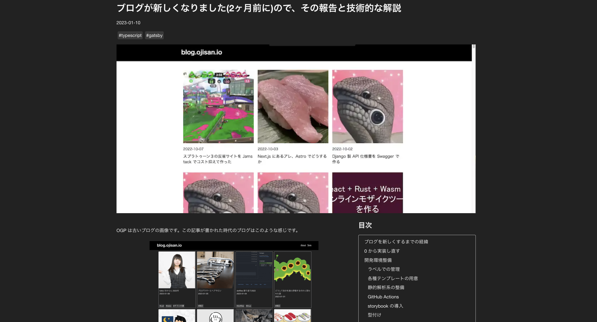

<https://blog.ojisan.io/renew-blog-2022/>

## 計測値

2022-01-01 ~ 2022-12-31 までのさまざまな数値です。

### 本数

今年は 80 本を書いています。去年は就職したこともあって 55 本ほどでしたが、今年は就職してから１年経っているので時間の使い方が慣れてきています。なので少し伸びています。ただ無職期間は半年で 80 本以上書いているので驚きですね。はやく無職になりたい。

### PV

316,409 でした。広告を貼った場合、1000PV で 100 円と言われているので 30,000 円くらいにはなっていたのですね。ソシャゲで好きなキャラを天井まで引けるくらいの収益は出ていたわけですね。

広告入れようかな・・・

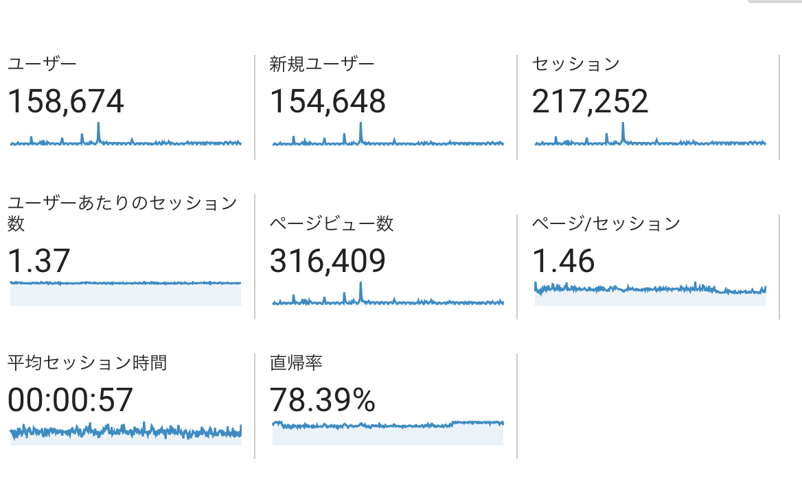

ちなみに去年は 232,878 PV でした。

### 流入経路

検索流入がほとんどです。これは自分の KPI でもあるので嬉しいです。

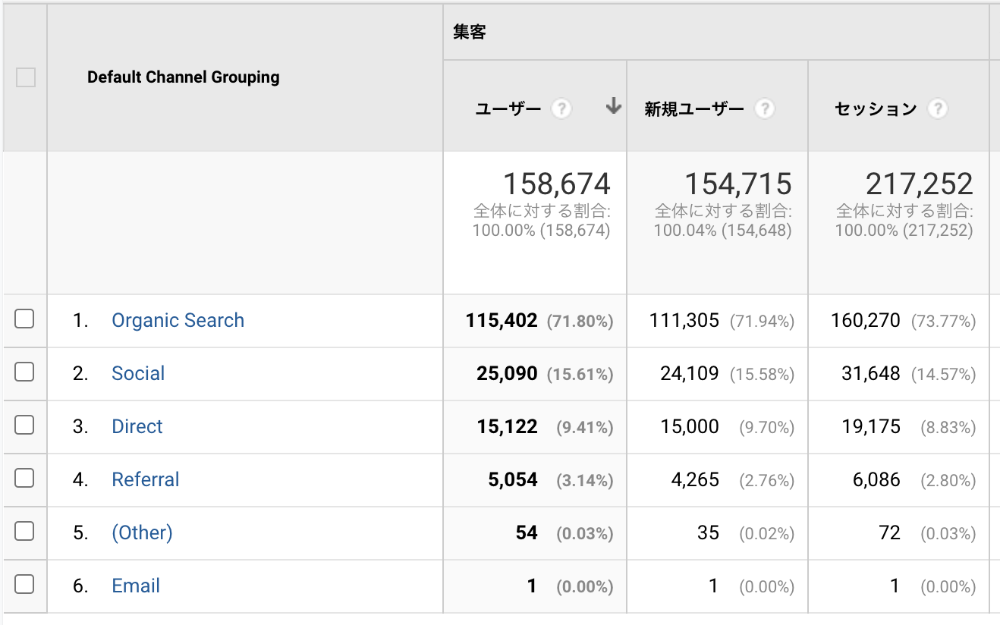

### SEO

最近は Analytics より Search Console をみています。

検索結果をみると社会の関心と自分の交差点を見つけられるので面白いです。

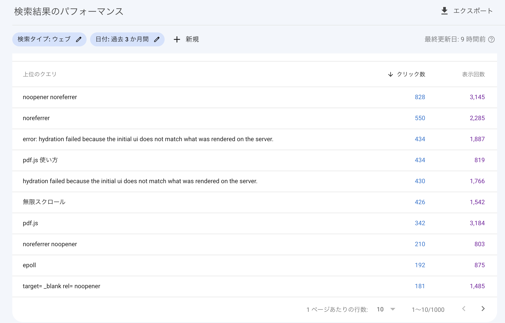

ブログを書く上で一番大事にしているのは、記事が人の調べ物の役に立ったかであり、オーガニック流入と検索順位が自分にとっての KPI です。ビッグワードで流入を稼ぐというよりはスモールワードで順位を上げたいのですが、それを見る指標がないので仕方なく検索流入のグラフで CTR と検索順位を定期的に追っています。ブログ開始時とあまり変わっていなくて悲しい。もっと人の悩みを解決できるような記事を書かなきゃですね。

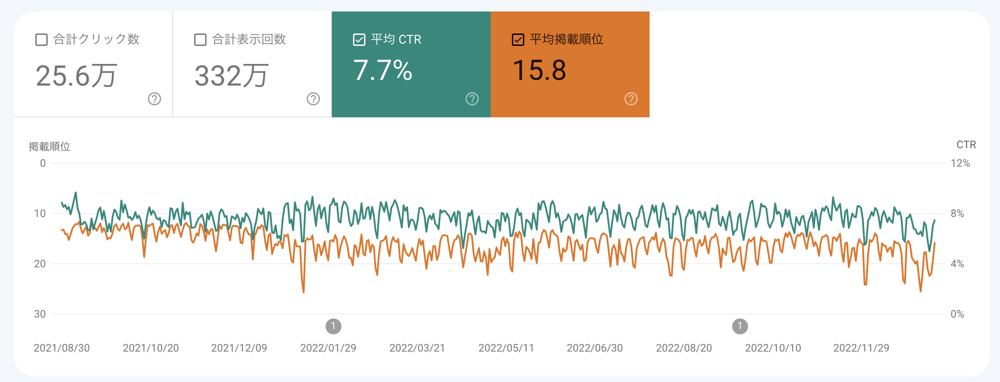

ただ需要を分析して記事を書いている訳でないのに順序が保ているのは定期的に順位の高い記事を制作できているのだと思っており、前向きに捉えています。最近 [blog.ojisan.io](http://blog.ojisan.io) ドメインが強くなったのか、いろいろなキーワードで SEO トップになっています。読んでくださっている皆様のおかげです、ありがとうございます。

ただドメインが強くなりすぎたのか、僕のドメイン自体を DNS でブロックしている傾向も見つかりました。悲しい。

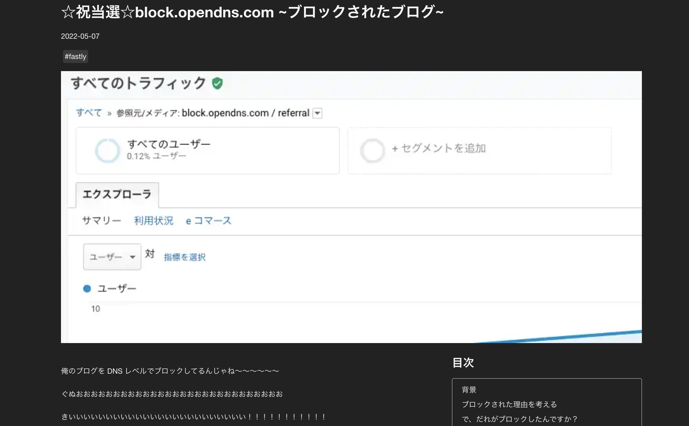

<https://blog.ojisan.io/why-block-my-blog/>

ちなみに SEO はいわゆるハックはしていないのですが、アンチパターンを踏まないような努力はしていますし、何か実装を変えた時に SEO に影響したかみたいなことを見たりはして対策はしています。

## 読まれた記事

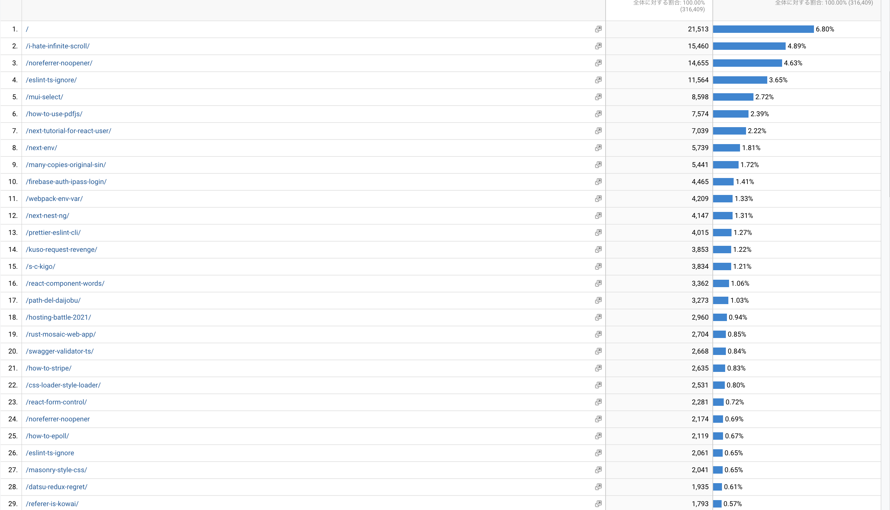

上位の記事はあまり変わっていませんが、今年書いたものを上からピックアップします。

### 無限スクロールは考慮することが多い

これまでの全期間で一番読まれてる記事でした。

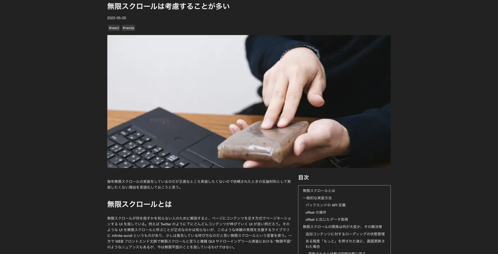

<https://blog.ojisan.io/i-hate-infinite-scroll/>

はてぶや Twitter をエゴサしていましたが、とても共感が多かったので皆思っていることなのだと思いました。だから伸びたのだと思いました。

<https://b.hatena.ne.jp/entry/s/blog.ojisan.io/i-hate-infinite-scroll/>

### React ユーザー向けの NextJS ガイド

会社ではじめて Next 書く人向けのチュートリアルを担当したので、そのとき話したことを文書化しました。

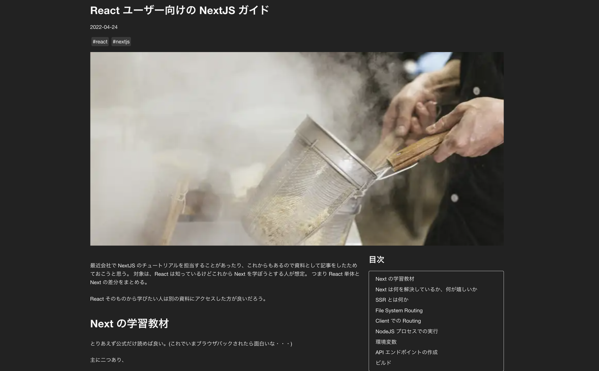

<https://blog.ojisan.io/next-tutorial-for-react-user/>

これもはてブで盛り上がっていて、Next は需要があるんだなと感じました。

<https://b.hatena.ne.jp/entry/s/blog.ojisan.io/next-tutorial-for-react-user/>

### 多コピーの原罪

タイトルがふざけすぎていて、SEO が絶対に弱いはずのブログです。
なのにだいぶ読まれていました。
内容も今ならもっと上手くまとめられる気がします。

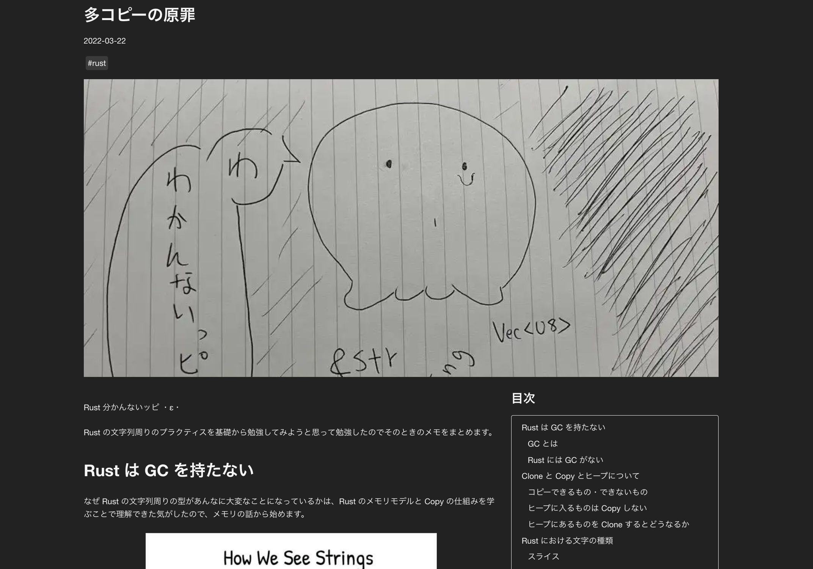

<https://blog.ojisan.io/many-copies-original-sin/>

### Rust でモザイク加工を実装し、それを WebAssembly として Web アプリから利用する

これも妙に読まれていて、wasm ってやっぱり気になるよねっていう共感をしました。

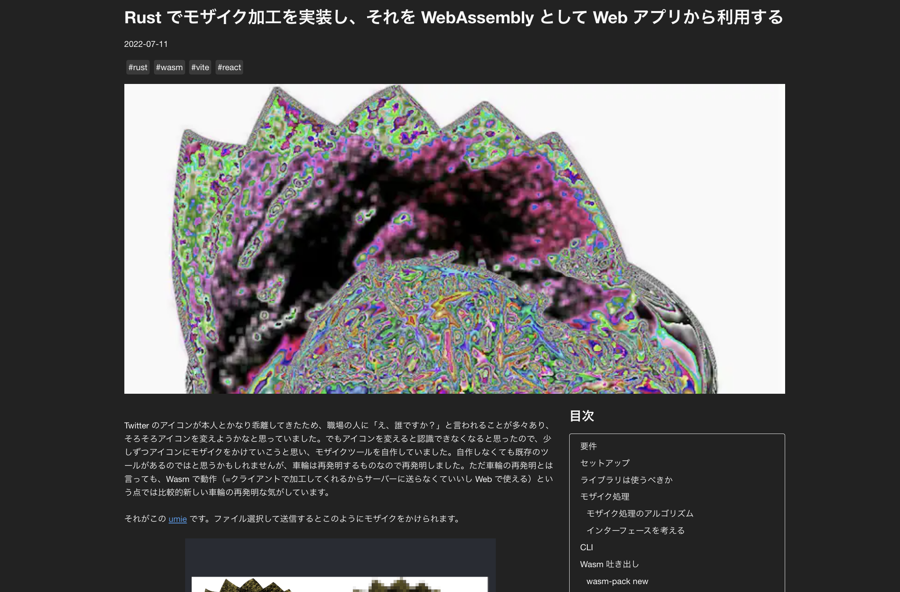

<https://blog.ojisan.io/rust-mosaic-web-app/>

### API 仕様書をバリデーターと型と同期させて作る

フロントエンドエンジニアとして嬉しい API をどう作るかを解説した記事です。
無責任な API に対する苦しみに対するイライラは皆も持っているのか読まれていました。

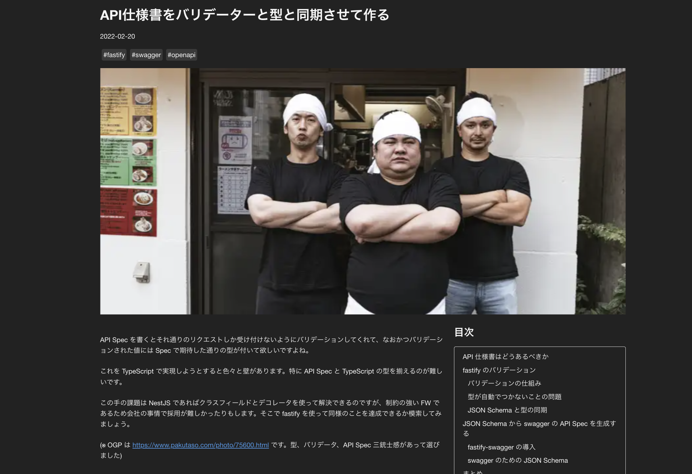

<https://blog.ojisan.io/swagger-validator-ts/>

### ご報告ブログの裏側をお見せします

ご結婚報告と見せかけた、マッチングアプリ失敗談に見せかけた、ただの Rust と Edge Computing の話です。

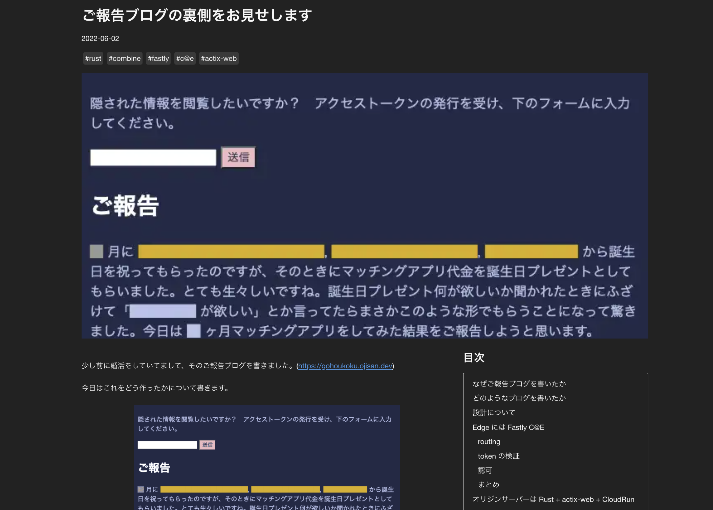

<https://blog.ojisan.io/gohoukoku-backyard-tour/>

ちなみにその後に街コンに行った回というのがあって、こっちも面白い。ついにブログに恋愛タグが爆誕しました。

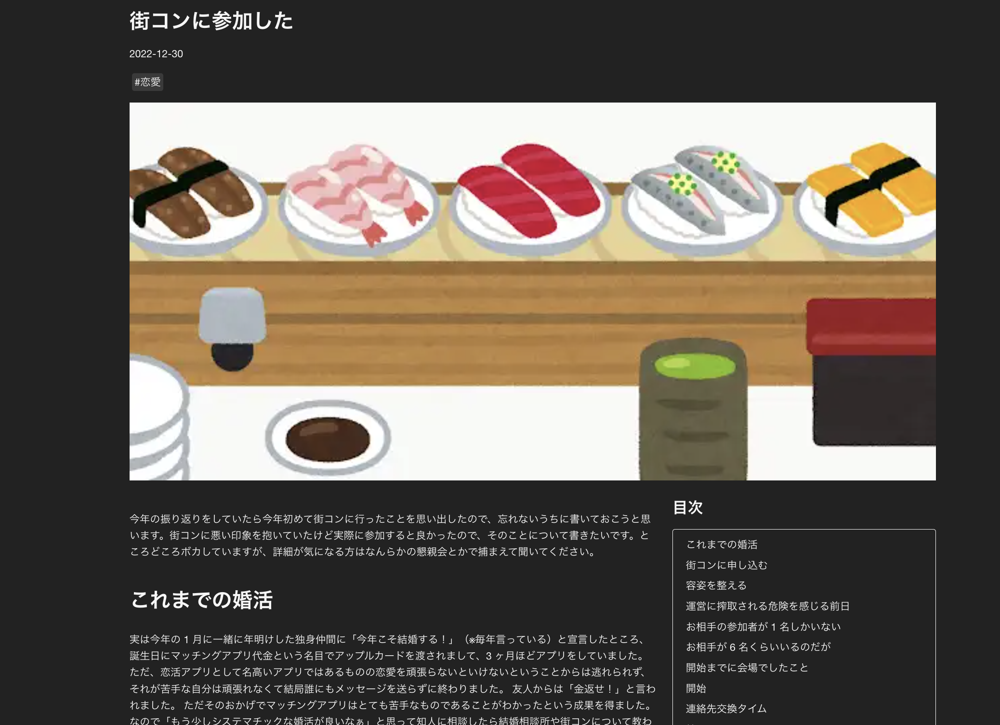

<https://blog.ojisan.io/machikon-ittekita/>

冷静に考えて街コンに行ったことをブログに書く人が彼氏になるの、嫌すぎるな。

### はじめての胃カメラ、感想

最近は健康を意識してます。皆も健康を意識しているのか読まれていました。

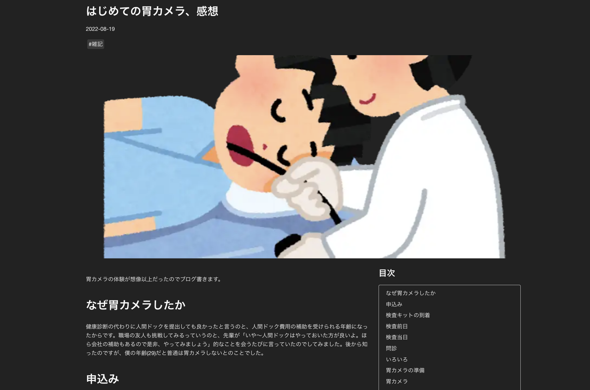

<https://blog.ojisan.io/ikamera2022/>

## 来年はどういうの書いていきたいか

去年は、

> 今年と同じく、自分が困ったちょっとしたことの解決策をまとめていこうと思います。 あとは混同して定義を調べたときのメモなども積極的に公開していこうと思います。 自分が書けるものかつ書きたいものはそういうものな気がします。

と書いているようです。今年も同じですね。あくまでも等身大のブログを好き放題書き殴って、それが誰かの検索にひっかかればいいかな万々歳です。

あとこれは先週に初めて試みたのですが、自分の理解していないことを書き殴る用途でも使おうと思っています。

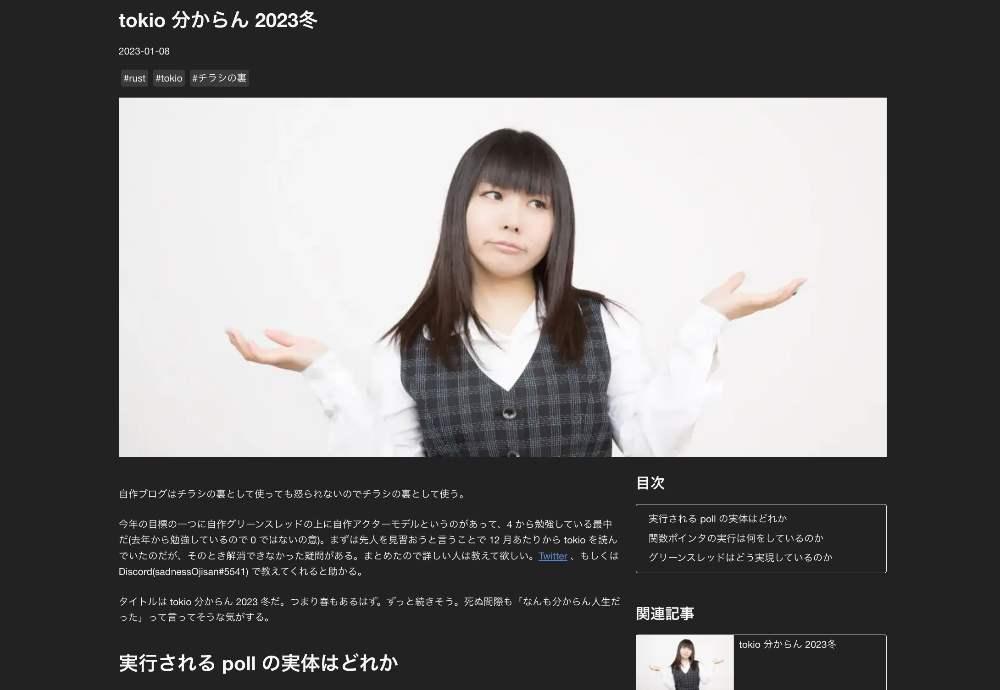

<https://blog.ojisan.io/tokio-wakaran-2023-winter/>

書いておけばツイッターでいろんな人がエアリプしてくれて回答が見つかったりしてよかったです。エゴサは常にしてるぞーーーーーーーーーー！！！！！！

## ブログに対する考え方を見直した

ブログはブランディングのためにも使えると思うのですが、自分はあえてそういうことはせずにふざけた記事とか自分のわからないところを書いていきたいなと思っています。それはエンジニアリングの専門家やプロフェッショナルとして活躍するつもりがなく、もう趣味と生活費のためにしかプログラミングをするつもりがないからです。プログラミングで自己実現を成し遂げようとはもう思っていません。

そういうことは年始に変にバズった[これ](https://blog.ojisan.io/i-am-dekinai-engineer/) にも書きましたし、これはまさしく自分ができる人ではないことの表明の記事です。

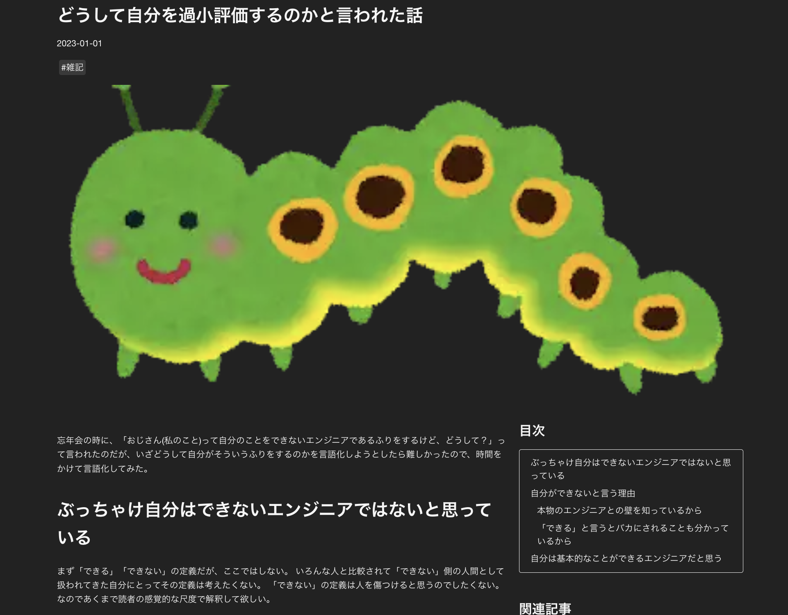

ブログ書く駆動で調べ物をしていると課題を分解できたり理解のごまかしを防げるという点で役に立つので、ブログは何も考えずただ書くことだけで自分のためになります。わからないことの表明はいろんな人に教えてもらえるのでそっちの方が自分にはあっているかなという感じです。

なので 2023 年はもっと好き放題なブログにしていこうと思っています。
