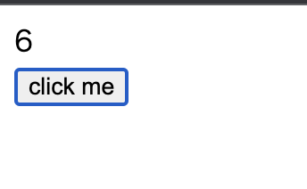

最近 React のコードリーディングに付き合ってくださる方がいらっしゃいましてコードを読んでいるのですが、読むにあたってはそもそもユーザーが書いた React がどう実行されるかエントリポイントをはっきりさせたくなりました。

たとえば

```jsx
const App = () => {
  const [state, setState] = React.useState(0);
  return (
    <div>
      <p>state: {state}</p>
      <button
        onClick={() => {
          setState(state + 1);
        }}
      >click me</buttn>
    </div>
  );
};
```

のようなコードを実行したときのエントリポイントは分からないわけです。
なので JSX で書いたコードを変換かけて読む環境を作りました。

## babel での変換

まず一般的に JSX は React の世界ではただのシンタックスシュガーです。

なので React でアプリケーションを書くのであれば本来であれば

```js
"use strict";

const e = React.createElement;

class LikeButton extends React.Component {
  constructor(props) {
    super(props);
    this.state = { liked: false };
  }

  render() {
    if (this.state.liked) {
      return "You liked this.";
    }

    return e(
      "button",
      { onClick: () => this.setState({ liked: true }) },
      "Like"
    );
  }
}
```

のようなコンポーネントを作ります。

FYI: <https://ja.reactjs.org/docs/add-react-to-a-website.html#step-3-create-a-react-component>

しかしそのような書き方をしているとまあ書きにくいので HTML っぽい文法として JSX があります。

```jsx
<button onClick={() => this.setState({ liked: true })}>Like</button>
```

しかしこのような文法はユーザーのブラウザでは動きません。なのでブラウザで動くように先のコードに変換する必要があります。それは babel で行え、その[@babel/preset-react](https://babeljs.io/docs/en/babel-preset-react)としてがあります。

さっそくコンパイルしてみましょう。

```js
// babel.config.js
module.exports = {
  presets: ["@babel/preset-react"],
};
```

```
npx babel src --out-dir dist
```

```js
// src/index.js
const ViewArea = ({ count }) => {
  return <div>{count}</div>;
};

const Button = ({ onClick }) => {
  return <button onClick={onClick}>click me</button>;
};

const App = () => {
  const [state, setState] = React.useState(0);

  return (
    <div>
      <ViewArea count={state} />
      <Button
        onClick={() => {
          setState(state + 1);
        }}
      />
    </div>
  );
};

const domContainer = document.getElementById("body");
const root = ReactDOM.createRoot(domContainer);
root.render(React.createElement(App));
```

この変換結果は、

```js
const ViewArea = ({ count }) => {
  return /*#__PURE__*/ React.createElement("div", null, count);
};
const Button = ({ onClick }) => {
  return /*#__PURE__*/ React.createElement(
    "button",
    {
      onClick: onClick,
    },
    "click me"
  );
};
const App = () => {
  const [state, setState] = React.useState(0);
  return /*#__PURE__*/ React.createElement(
    "div",
    null,
    /*#__PURE__*/ React.createElement(ViewArea, {
      count: state,
    }),
    /*#__PURE__*/ React.createElement(Button, {
      onClick: () => {
        setState(state + 1);
      },
    })
  );
};
const domContainer = document.getElementById("body");
const root = ReactDOM.createRoot(domContainer);
root.render(React.createElement(App));
```

となります。

## バンドルできないので無理やり読み込む

ではこのファイルを実行するとブラウザで表示できるはずです。

しかし実はさっきのコンパイル結果は React を読み込んでいないので実行できません。

というわけで、

```js
import React from "react";
import ReactDOM from "react-dom";
```

をすれば良いです。

が、これはブラウザでは動きません。いまブラウザからは node_modules が見えないしそこそも react package を入れてないですし、そもそも import はそのままだとブラウザでは動かせないためです。
そこでこれを解決していたのがバンドラーでした。
しかしいまファイルを単体でありのままの変換結果を眺めたいのでバンドラーは入れたくないです。
そのためにバンドらを使わずにライブラリやファイルを読み込ませるために、React や createElement が呼ばれる前にそれを script タグで読み込みましょう。
それをするためのライブラリの URL は公式が CDN から配信してくれています。

```html
<script
  src="https://unpkg.com/react@18/umd/react.development.js"
  crossorigin
></script>
<script
  src="https://unpkg.com/react-dom@18/umd/react-dom.development.js"
  crossorigin
></script>
```

そして自分が書いた先ほどのコードの変換結果は dist/index.js にあるので

```html
<!-- public/index.html -->
<!DOCTYPE html>
<html lang="ja">
  <head>
    <title>babel + react</title>
  </head>
  <body>
    <div id="body"></div>
    <script
      src="https://unpkg.com/react@18/umd/react.development.js"
      crossorigin
    ></script>
    <script
      src="https://unpkg.com/react-dom@18/umd/react-dom.development.js"
      crossorigin
    ></script>
    <script src="http://localhost:8080/index.js"></script>
  </body>
</html>
```

と書けば良いです。

ただ注意点が 2 つあり、

- DOM 要素がないと`document.getElementById("body");` が動かないので script tag は body の末尾に書くなどの工夫をすること
- React 変数を index.js で使うので、その前に React ライブラリを読み込まないといけない

です。bundler がないとこういう注意を自分でしないといけないわけですね。

この public/index.html と dist/index.js をサーブして動かしたいので npm scripts に

```json
{
  ...
  "scripts": {
    "build": "npx babel src --out-dir dist && cp public/index.html dist",
    "serve": "http-server dist"
  }
}
```

のようにして動かせば良いでしょう。



## ソースコード

全体を見ないと分かりにくいと思うので詳しくはレポジトリを直接見てください。

FYI: <https://github.com/ojisan-toybox/jsx-transpile-result>
