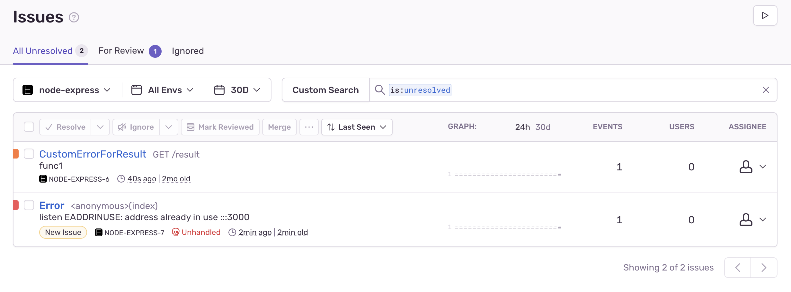

ドタバタしてたら 1 ヶ月以上期間が空いてしまった。仕事の都合で Sentry を完全理解する必要があったので SDK 読んでみた。

知りたいことは

- エラーの収集方法
- どこにエラーを送っているのか
- エラーの情報として何を送っているのか

だ。そこで SDK を呼び出した時にどういうコードが実行されるか一つずつ見ていく。Repository は https://github.com/getsentry/sentry-javascript だ。

ブラウザ版と Node.js 版があるが、Node.js の方を読んでいく。Node.js では一般的には

```ts
import * as Sentry from "@sentry/node";

// Importing @sentry/tracing patches the global hub for tracing to work.
import "@sentry/tracing";

// If you want to use `@sentry/tracing` in your project directly, use a named import instead:
// import * as SentryTracing from "@sentry/tracing"
// Unused named imports are not guaranteed to patch the global hub.

Sentry.init({
  dsn: "https://examplePublicKey@o0.ingest.sentry.io/0",

  // We recommend adjusting this value in production, or using tracesSampler
  // for finer control
  tracesSampleRate: 1.0,
});
```

と設定してから

```ts
captureExcetion(err);
```

として利用する。こうすることで Sentry の dashboard でエラーを眺めることができる。



コードリーディングは以下の Commit Hash で行う。

FYI: https://github.com/getsentry/sentry-javascript/tree/7399b9980132b604dfe55cd16cf3a646676ebef9

あとなんだかんだめちゃくちゃ長くなったので結論を見たい人は一番下を見ましょう。

## 初期化を行うと何が起きるか

Sentry.init をするとどのような設定がされるのか追ってみてみよう。

### init

まず <https://docs.sentry.io/platforms/node/> を読むと、

```js
import * as Sentry from "@sentry/node";

// Importing @sentry/tracing patches the global hub for tracing to work.
import "@sentry/tracing";

// If you want to use `@sentry/tracing` in your project directly, use a named import instead:
// import * as SentryTracing from "@sentry/tracing"
// Unused named imports are not guaranteed to patch the global hub.

Sentry.init({
  dsn: "https://examplePublicKey@o0.ingest.sentry.io/0",

  // We recommend adjusting this value in production, or using tracesSampler
  // for finer control
  tracesSampleRate: 1.0,
});
```

で初期化する。 init がエントリだ。

これは ./sdk にあり、

```ts
export function init(options: NodeOptions = {}): void {
  const carrier = getMainCarrier();
  const autoloadedIntegrations = carrier.__SENTRY__?.integrations || [];

  options.defaultIntegrations =
    options.defaultIntegrations === false
      ? []
      : [
          ...(Array.isArray(options.defaultIntegrations)
            ? options.defaultIntegrations
            : defaultIntegrations),
          ...autoloadedIntegrations,
        ];

  if (options.dsn === undefined && process.env.SENTRY_DSN) {
    options.dsn = process.env.SENTRY_DSN;
  }

  if (
    options.tracesSampleRate === undefined &&
    process.env.SENTRY_TRACES_SAMPLE_RATE
  ) {
    const tracesSampleRate = parseFloat(process.env.SENTRY_TRACES_SAMPLE_RATE);
    if (isFinite(tracesSampleRate)) {
      options.tracesSampleRate = tracesSampleRate;
    }
  }

  if (options.release === undefined) {
    const detectedRelease = getSentryRelease();
    if (detectedRelease !== undefined) {
      options.release = detectedRelease;
    } else {
      // If release is not provided, then we should disable autoSessionTracking
      options.autoSessionTracking = false;
    }
  }

  if (options.environment === undefined && process.env.SENTRY_ENVIRONMENT) {
    options.environment = process.env.SENTRY_ENVIRONMENT;
  }

  if (options.autoSessionTracking === undefined && options.dsn !== undefined) {
    options.autoSessionTracking = true;
  }

  if (options.instrumenter === undefined) {
    options.instrumenter = "sentry";
  }

  // eslint-disable-next-line @typescript-eslint/no-unsafe-member-access, @typescript-eslint/no-explicit-any
  if ((domain as any).active) {
    setHubOnCarrier(carrier, getCurrentHub());
  }

  // TODO(v7): Refactor this to reduce the logic above
  const clientOptions: NodeClientOptions = {
    ...options,
    stackParser: stackParserFromStackParserOptions(
      options.stackParser || defaultStackParser
    ),
    integrations: getIntegrationsToSetup(options),
    transport: options.transport || makeNodeTransport,
  };

  initAndBind(NodeClient, clientOptions);

  if (options.autoSessionTracking) {
    startSessionTracking();
  }
}
```

といった実装だ。

FYI: <https://github.com/getsentry/sentry-javascript/blob/7399b9980132b604dfe55cd16cf3a646676ebef9/packages/node/src/sdk.ts>

どうも initAndBind で本丸な処理をしていそうだ。

#### carrier とは

initAndBind を読む前に用語を確認したい。変数に carrier というものが登場するが、これは

```js
const carrier = getMainCarrier();
```

で作られる。頻出なので見ていこう。

```js
export function getMainCarrier(): Carrier {
  GLOBAL_OBJ.__SENTRY__ = GLOBAL_OBJ.__SENTRY__ || {
    extensions: {},
    hub: undefined,
  };
  return GLOBAL_OBJ;
}
```

この GLOBAL_OBJ を追ってみると、

```js
/** Get's the global object for the current JavaScript runtime */
export const GLOBAL_OBJ: InternalGlobal =
  (typeof globalThis == "object" && isGlobalObj(globalThis)) ||
  (typeof window == "object" && isGlobalObj(window)) ||
  (typeof self == "object" && isGlobalObj(self)) ||
  (typeof global == "object" && isGlobalObj(global)) ||
  (function (this: any) {
    return this;
  })() ||
  {};
```

util/src/worldwide.ts から設定を見つけられる。

FYI: <https://github.com/getsentry/sentry-javascript/blob/7399b9980132b604dfe55cd16cf3a646676ebef9/packages/utils/src/worldwide.ts>

これは util にあるが、どうしてかというと色々なところから呼び出すシングルトンとして使われることが想定されているからだ。現に getGlobalSingleton という関数があり、のちに登場する。

とりあえず今はアプリケーションで共有するグローバルなオブジェクトを生成してそれを carrier と読んでいると思っておこう。

ちなみにこの Carrier の型定義は

```ts
/**
 * An object that contains a hub and maintains a scope stack.
 * @hidden
 */
export interface Carrier {
  __SENTRY__?: {
    hub?: Hub;
    /**
     * Extra Hub properties injected by various SDKs
     */
    integrations?: Integration[];
    extensions?: {
      /** Hack to prevent bundlers from breaking our usage of the domain package in the cross-platform Hub package */
      // eslint-disable-next-line @typescript-eslint/no-explicit-any
      domain?: { [key: string]: any };
    } & {
      /** Extension methods for the hub, which are bound to the current Hub instance */
      // eslint-disable-next-line @typescript-eslint/ban-types
      [key: string]: Function;
    };
  };
}
```

となっている。なので最初は空オブジェクトで良い。きっとどこかで `__SENTRY__` が生やされるのだろう。ちなみにこの hub というのが Sentry では中心的なオブジェクトになる。

#### option の設定

init の続きの処理をみると、

```ts
options.defaultIntegrations =
  options.defaultIntegrations === false
    ? []
    : [
        ...(Array.isArray(options.defaultIntegrations)
          ? options.defaultIntegrations
          : defaultIntegrations),
        ...autoloadedIntegrations,
      ];

if (options.dsn === undefined && process.env.SENTRY_DSN) {
  options.dsn = process.env.SENTRY_DSN;
}

if (
  options.tracesSampleRate === undefined &&
  process.env.SENTRY_TRACES_SAMPLE_RATE
) {
  const tracesSampleRate = parseFloat(process.env.SENTRY_TRACES_SAMPLE_RATE);
  if (isFinite(tracesSampleRate)) {
    options.tracesSampleRate = tracesSampleRate;
  }
}
```

のようにして option に色々値を詰め込んでいる。設定した環境変数をこうして関数の引数に詰め込むために移し替えている。
DSN など見覚えのある環境変数もあるだろう。

#### defaultIntegrations をセットする

integration は今はセットしていないのでスルーしたいが、デフォルトで設定される integration があるので見よう。大事なものがある。

FYI: <https://docs.sentry.io/platforms/node/configuration/integrations/default-integrations/>

```ts
export const defaultIntegrations = [
  // Common
  new CoreIntegrations.InboundFilters(),
  new CoreIntegrations.FunctionToString(),
  // Native Wrappers
  new Console(),
  new Http(),
  // Global Handlers
  new OnUncaughtException(),
  new OnUnhandledRejection(),
  // Event Info
  new ContextLines(),
  new Context(),
  new Modules(),
  new RequestData(),
  // Misc
  new LinkedErrors(),
];
```

これらが integration として利用されるわけだが、`new OnUncaughtException(),` が重要だ。
これがあるおかげで captureException しなくてもエラーの補足ができるようになる。

```ts
export class OnUncaughtException implements Integration {
  public setupOnce(): void {
    global.process.on('uncaughtException', this.handler);
  }

  public readonly handler: (error: Error) => void = this._makeErrorHandler();

  private _makeErrorHandler(): (error: Error) => void {
    ...

    return (error: Error): void => {
      let onFatalError: OnFatalErrorHandler = logAndExitProcess;
      const client = getCurrentHub().getClient<NodeClient>();
      ...

      if (!caughtFirstError) {
        const hub = getCurrentHub();
        firstError = error;
        caughtFirstError = true;

        if (hub.getIntegration(OnUncaughtException)) {
          hub.withScope((scope: Scope) => {
            scope.setLevel('fatal');
            hub.captureException(error, {
              originalException: error,
              data: { mechanism: { handled: false, type: 'onuncaughtexception' } },
            });
            if (!calledFatalError && shouldApplyFatalHandlingLogic) {
              calledFatalError = true;
              onFatalError(error);
            }
          });
        } else {
          if (!calledFatalError && shouldApplyFatalHandlingLogic) {
            calledFatalError = true;
            onFatalError(error);
          }
        }
      } else {
        ...
      }
    };
  }
}
```

これから見ていくエラーハンドリング系の設定がされるようだ。

ちなみに Integration は Plugin のようなものだ。

FYI: <https://docs.sentry.io/platforms/node/configuration/integrations/pluggable-integrations/>

#### initAndBind が init の本丸

さらに init を追っていくと initAndBind という本丸の処理にたどり着く。

```ts
initAndBind(NodeClient, clientOptions);
```

早速読んでいこう、処理の実体は core にある。

### initAndBind

initAndBind は core パッケージの sdk.ts にある。Sentry は Node.js 向け、ブラウザ向け、さらに Next.js などの各種 FW 向けに存在しているが、それらの共通処理が core にまとめられる。つまり以下はどのプラットフォーム共通の処理だ。

```js
/**
 * Internal function to create a new SDK client instance. The client is
 * installed and then bound to the current scope.
 *
 * @param clientClass The client class to instantiate.
 * @param options Options to pass to the client.
 */
export function initAndBind<F extends Client, O extends ClientOptions>(
  clientClass: ClientClass<F, O>,
  options: O,
): void {
  if (options.debug === true) {
    if (__DEBUG_BUILD__) {
      logger.enable();
    } else {
      // use `console.warn` rather than `logger.warn` since by non-debug bundles have all `logger.x` statements stripped
      // eslint-disable-next-line no-console
      console.warn('[Sentry] Cannot initialize SDK with `debug` option using a non-debug bundle.');
    }
  }
  const hub = getCurrentHub();
  const scope = hub.getScope();
  if (scope) {
    scope.update(options.initialScope);
  }

  const client = new clientClass(options);
  hub.bindClient(client);
}
```

FYI: <https://github.com/getsentry/sentry-javascript/blob/7399b9980132b604dfe55cd16cf3a646676ebef9/packages/core/src/sdk.ts#L16>

#### hub 概念と scope 概念

さて、hub や scope というものが登場するがこれらは何だろうか。一応 scope は今は読み飛ばして問題ないが確認しておこう。

これらはありがたいことに公式が解説してくれている。

https://docs.sentry.io/platforms/javascript/enriching-events/scopes/

> You can think of the hub as the central point that our SDKs use to route an event to Sentry. When you call init() a hub is created and a client and a blank scope are created on it. That hub is then associated with the current thread and will internally hold a stack of scopes.

> The scope will hold useful information that should be sent along with the event. For instance contexts or breadcrumbs are stored on the scope. When a scope is pushed, it inherits all data from the parent scope and when it pops all modifications are reverted.

とあるので、hub は ユーザーが呼び出す Sentry SDK のメソッド群をもつクラスで、scope は レイヤーで階層ごとに管理された Sentry に送るイベントに付随させる情報と言える。

#### コードで Hub を確認する

getCurrentHub を見てみると Carrier から Hub を取り出す、もしくはなければ生成して返すようだ。

```ts
/**
 * Returns the default hub instance.
 *
 * If a hub is already registered in the global carrier but this module
 * contains a more recent version, it replaces the registered version.
 * Otherwise, the currently registered hub will be returned.
 */
export function getCurrentHub(): Hub {
  // Get main carrier (global for every environment)
  const registry = getMainCarrier();

  // If there's no hub, or its an old API, assign a new one
  if (
    !hasHubOnCarrier(registry) ||
    getHubFromCarrier(registry).isOlderThan(API_VERSION)
  ) {
    setHubOnCarrier(registry, new Hub());
  }

  // Prefer domains over global if they are there (applicable only to Node environment)
  if (isNodeEnv()) {
    return getHubFromActiveDomain(registry);
  }
  // Return hub that lives on a global object
  return getHubFromCarrier(registry);
}
```

この作られる Hub はどのような情報を保持するのかコードから確認してみる。

```ts
import { Hub as HubInterface } from "@sentry/types";

/**
 * @inheritDoc
 */
export class Hub implements HubInterface {
  /** Is a {@link Layer}[] containing the client and scope */
  private readonly _stack: Layer[] = [{}];

  /** Contains the last event id of a captured event.  */
  private _lastEventId?: string;
}
```

```ts
export interface Hub {
  isOlderThan(version: number): boolean;
  bindClient(client?: Client): void;
  pushScope(): Scope;
  popScope(): boolean;
  withScope(callback: (scope: Scope) => void): void;
  getClient(): Client | undefined;
  captureException(exception: any, hint?: EventHint): string;
  captureMessage(
    message: string,
    // eslint-disable-next-line deprecation/deprecation
    level?: Severity | SeverityLevel,
    hint?: EventHint
  ): string;
  captureEvent(event: Event, hint?: EventHint): string;
  lastEventId(): string | undefined;
  addBreadcrumb(breadcrumb: Breadcrumb, hint?: BreadcrumbHint): void;
  setUser(user: User | null): void;
  setTags(tags: { [key: string]: Primitive }): void;
  setTag(key: string, value: Primitive): void;
  setExtra(key: string, extra: Extra): void;
  setExtras(extras: Extras): void;
  setContext(name: string, context: { [key: string]: any } | null): void;
  configureScope(callback: (scope: Scope) => void): void;
  run(callback: (hub: Hub) => void): void;
  getIntegration<T extends Integration>(
    integration: IntegrationClass<T>
  ): T | null;
  traceHeaders(): { [key: string]: string };
  startTransaction(
    context: TransactionContext,
    customSamplingContext?: CustomSamplingContext
  ): Transaction;
  startSession(context?: Session): Session;
  endSession(): void;
  captureSession(endSession?: boolean): void;
}
```

captureException や captureMessage といった普段見覚えのあるメソッドが出てくる。

#### コードで Scope を確認する

scope は hub の下に生えており `hub.getScope();` で取り出せる。

```ts
 /** Returns the scope of the top stack. */
  public getScope(): Scope | undefined {
    return this.getStackTop().scope;
  }
```

FYI: https://github.com/getsentry/sentry-javascript/blob/7399b9980132b604dfe55cd16cf3a646676ebef9/packages/core/src/hub.ts#L169

その getScope の処理を追っていくと、

```ts
/** Returns the topmost scope layer in the order domain > local > process. */
  public getStackTop(): Layer {
    return this._stack[this._stack.length - 1];
  }
```

となり、this.\_stack の先頭(stack は上に積み上がるので末尾が先頭と言える)から Layer というものを取り出している。
Layser が Scope を保持しており、その Layer は

```ts
/**
 * A layer in the process stack.
 * @hidden
 */
export interface Layer {
  client?: Client;
  scope?: Scope;
}
```

という定義だ。

ではそんな Scope はどのようなものを保持しているのか見てみよう。

User や Tag のセットをする口を用意してくれる。どういうデータが含まれるかはクラスのフィールドからある程度わかる。

```ts
import { Scope as ScopeInterface } from "@sentry/types";

/**
 * Holds additional event information. {@link Scope.applyToEvent} will be
 * called by the client before an event will be sent.
 */
export class Scope implements ScopeInterface {
  protected _notifyingListeners: boolean;
  protected _scopeListeners: Array<(scope: Scope) => void>;
  protected _eventProcessors: EventProcessor[];
  protected _breadcrumbs: Breadcrumb[];
  protected _user: User;
  protected _tags: { [key: string]: Primitive };
  protected _extra: Extras;
  protected _contexts: Contexts;
  protected _attachments: Attachment[];
  protected _sdkProcessingMetadata: { [key: string]: unknown };
  protected _fingerprint?: string[];
  protected _level?: Severity | SeverityLevel;
  protected _transactionName?: string;
  protected _span?: Span;
  protected _session?: Session;
  protected _requestSession?: RequestSession;
```

FYI: <https://github.com/getsentry/sentry-javascript/blob/7399b9980132b604dfe55cd16cf3a646676ebef9/packages/core/src/scope.ts#L45>

送るイベントに対するメタ情報と見れる。

そしてどういうメソッドを持つかは、実装元の interface を見てみよう。（クラス定義の方をみるととてつもなく長いので）

```ts
export interface Scope {
  addEventProcessor(callback: EventProcessor): this;
  setUser(user: User | null): this;
  getUser(): User | undefined;
  setTags(tags: { [key: string]: Primitive }): this;
  setTag(key: string, value: Primitive): this;
  setExtras(extras: Extras): this;
  setExtra(key: string, extra: Extra): this;
  setFingerprint(fingerprint: string[]): this;
  setLevel(level: Severity | SeverityLevel): this;
  setTransactionName(name?: string): this;
  setContext(name: string, context: Context | null): this;
  setSpan(span?: Span): this;
  getSpan(): Span | undefined;
  getTransaction(): Transaction | undefined;
  getSession(): Session | undefined;
  setSession(session?: Session): this;
  getRequestSession(): RequestSession | undefined;
  setRequestSession(requestSession?: RequestSession): this;
  update(captureContext?: CaptureContext): this;
  clear(): this;
  addBreadcrumb(breadcrumb: Breadcrumb, maxBreadcrumbs?: number): this;
  getLastBreadcrumb(): Breadcrumb | undefined;
  clearBreadcrumbs(): this;
  addAttachment(attachment: Attachment): this;
  getAttachments(): Attachment[];
  clearAttachments(): this;
  setSDKProcessingMetadata(newData: { [key: string]: unknown }): this;
}
```

FYI: <https://github.com/getsentry/sentry-javascript/blob/7399b9980132b604dfe55cd16cf3a646676ebef9/packages/types/src/scope.ts>

定義した private field 取得、セットが主な役目だ。

#### new clientClass で bind 対象の client を作る

hub と scope の設定が終わると、今度は hub に Client を bind する。その client を見ていこう。

```ts
const client = new clientClass(options);
```

FYI: https://github.com/getsentry/sentry-javascript/blob/7399b9980132b604dfe55cd16cf3a646676ebef9/packages/core/src/sdk.ts#L35

この clientClass は initAndBind の引数で渡されたものだ。

```ts
initAndBind(NodeClient, clientOptions);
```

FYI: https://github.com/getsentry/sentry-javascript/blob/7399b9980132b604dfe55cd16cf3a646676ebef9/packages/node/src/sdk.ts#L170

#### bind 対象の client の実体は initAndBind で渡された NodeClient

では initAndBind をみる前に、initAndBind に渡された NodeClient が何かを見ていこう。

といってもまんま言葉の通り、Node における Client である。

```ts
/**
 * The Sentry Node SDK Client.
 *
 * @see NodeClientOptions for documentation on configuration options.
 * @see SentryClient for usage documentation.
 */
export class NodeClient extends BaseClient<NodeClientOptions> {
  /**
   * Creates a new Node SDK instance.
   * @param options Configuration options for this SDK.
   */
  public constructor(options: NodeClientOptions) {
    options._metadata = options._metadata || {};
    options._metadata.sdk = options._metadata.sdk || {
      name: 'sentry.javascript.node',
      packages: [
        {
          name: 'npm:@sentry/node',
          version: SDK_VERSION,
        },
      ],
      version: SDK_VERSION,
    };

    // Until node supports global TextEncoder in all versions we support, we are forced to pass it from util
    options.transportOptions = {
      textEncoder: new TextEncoder(),
      ...options.transportOptions,
    };

    super(options);
  }
  ...

  /**
   * @inheritDoc
   */
  // eslint-disable-next-line @typescript-eslint/no-explicit-any, @typescript-eslint/explicit-module-boundary-types
  public captureException(
    exception: any,
    hint?: EventHint,
    scope?: Scope
  ): string | undefined {
    // Check if the flag `autoSessionTracking` is enabled, and if `_sessionFlusher` exists because it is initialised only
    // when the `requestHandler` middleware is used, and hence the expectation is to have SessionAggregates payload
    // sent to the Server only when the `requestHandler` middleware is used
    if (this._options.autoSessionTracking && this._sessionFlusher && scope) {
      const requestSession = scope.getRequestSession();

      // Necessary checks to ensure this is code block is executed only within a request
      // Should override the status only if `requestSession.status` is `Ok`, which is its initial stage
      if (requestSession && requestSession.status === "ok") {
        requestSession.status = "errored";
      }
    }

    return super.captureException(exception, hint, scope);
  }

  /**
   * @inheritDoc
   */
  public captureEvent(
    event: Event,
    hint?: EventHint,
    scope?: Scope
  ): string | undefined {
    // Check if the flag `autoSessionTracking` is enabled, and if `_sessionFlusher` exists because it is initialised only
    // when the `requestHandler` middleware is used, and hence the expectation is to have SessionAggregates payload
    // sent to the Server only when the `requestHandler` middleware is used
    if (this._options.autoSessionTracking && this._sessionFlusher && scope) {
      const eventType = event.type || "exception";
      const isException =
        eventType === "exception" &&
        event.exception &&
        event.exception.values &&
        event.exception.values.length > 0;

      // If the event is of type Exception, then a request session should be captured
      if (isException) {
        const requestSession = scope.getRequestSession();

        // Ensure that this is happening within the bounds of a request, and make sure not to override
        // Session Status if Errored / Crashed
        if (requestSession && requestSession.status === "ok") {
          requestSession.status = "errored";
        }
      }
    }

    return super.captureEvent(event, hint, scope);
  }

  ...
    } else {
      this._sessionFlusher.incrementSessionStatusCount();
    }
}
```

FYI: <https://github.com/getsentry/sentry-javascript/blob/7399b9980132b604dfe55cd16cf3a646676ebef9/packages/node/src/client.ts#L17>

僕たちが普段呼んでいる captureEvent、captureException などが生えている。きっとこれが使われるのだろう。それは後で確かめるとしていまは init の処理を追い続ける。また BaseClient を継承していることから、このようなクライアントは各種プラットフォームごとに存在し、それぞれのプラットフォームでの共通処理は BaseClient にされていると予想できる。

#### bindClient で hub の stack に client がセットされる

さきほどみた NodeClient が bindClient される。

bindClient は、

```ts
/**
   * @inheritDoc
   */
  public bindClient(client?: Client): void {
    const top = this.getStackTop();
    top.client = client;
    if (client && client.setupIntegrations) {
      client.setupIntegrations();
    }
  }
```

となっており、`this.getStackTop()` で得たオブジェクトにクライアントを設定している。

FYI: <https://github.com/getsentry/sentry-javascript/blob/7399b9980132b604dfe55cd16cf3a646676ebef9/packages/core/src/hub.ts#L120>

この this は Hub だ。
そのとき Hub の \_stack にあるあつ末尾から取り出している。

```ts
/** Returns the topmost scope layer in the order domain > local > process. */
  public getStackTop(): Layer {
    return this._stack[this._stack.length - 1];
  }
```

ここで注意してほしいのは、決して stack の pop ではないことだ。あくまでも 参照を返しているだけだ。つまり `top.client = client` は stack の末尾の layer の client に client を代入している。

つまりこういうことをした訳だ。

```
❯ node
Welcome to Node.js v18.14.0.
Type ".help" for more information.
> const a=[[],[]]
undefined
> a[1].push(1)
1
> a
[ [], [ 1 ] ]
```

そしてどうして this.\_stack の中に何かが積まれているのかと思うかもしれないが、それはそもそもクラスの初期化で空のオブジェクトが追加されているため問題がない。

```ts
export class Hub implements HubInterface {
  /** Is a {@link Layer}[] containing the client and scope */
  private readonly _stack: Layer[] = [{}];
```

FYI: <https://github.com/getsentry/sentry-javascript/blob/7399b9980132b604dfe55cd16cf3a646676ebef9/packages/core/src/hub.ts#L90>

#### 結局 initAndBind によって何が起きたか

さて、ここまでで初期化が終わるわけだが、このコードがしたことを端的にまとめるなら、Carrier.Hub.Stack にあるオブジェクトに NodeClient がセットされた。Hub は Sentry SDK のコアな関数をまとめたものであり、それのセットアップがされたことになる。

## captureException

ここまでで init の処理を見れたので、次はユーザーがー実際に呼び出す caputreException を見ていく。

sentry node には

```ts
export {
  addGlobalEventProcessor,
  addBreadcrumb,
  captureException,
  captureEvent,
  captureMessage,
  configureScope,
  createTransport,
  getHubFromCarrier,
  getCurrentHub,
  Hub,
  makeMain,
  Scope,
  startTransaction,
  SDK_VERSION,
  setContext,
  setExtra,
  setExtras,
  setTag,
  setTags,
  setUser,
  withScope,
} from "@sentry/core";
```

FYI: <https://github.com/getsentry/sentry-javascript/blob/7399b9980132b604dfe55cd16cf3a646676ebef9/packages/node/src/index.ts#L28>

とあるので core を見にいくと、

```ts
export {
  addBreadcrumb,
  captureException,
  captureEvent,
  captureMessage,
  configureScope,
  startTransaction,
  setContext,
  setExtra,
  setExtras,
  setTag,
  setTags,
  setUser,
  withScope,
} from "./exports";
```

があるので exports を見ていくと、

```ts
/**
 * Captures an exception event and sends it to Sentry.
 *
 * @param exception An exception-like object.
 * @param captureContext Additional scope data to apply to exception event.
 * @returns The generated eventId.
 */
// eslint-disable-next-line @typescript-eslint/no-explicit-any, @typescript-eslint/explicit-module-boundary-types
export function captureException(
  exception: any,
  captureContext?: CaptureContext
): ReturnType<Hub["captureException"]> {
  return getCurrentHub().captureException(exception, { captureContext });
}
```

がある。

FYI: <https://github.com/getsentry/sentry-javascript/blob/7399b9980132b604dfe55cd16cf3a646676ebef9/packages/core/src/exports.ts#L35>

ここで最初に init が必要だった種明かしになるわけで、init した後だと Hub が設定されているので getCurrentHub NodeClient の captureException が呼ばれるようになる。

再掲になるが getCurrentHub は

```ts
export function getCurrentHub(): Hub {
  // Get main carrier (global for every environment)
  const registry = getMainCarrier();

  // If there's no hub, or its an old API, assign a new one
  if (
    !hasHubOnCarrier(registry) ||
    getHubFromCarrier(registry).isOlderThan(API_VERSION)
  ) {
    setHubOnCarrier(registry, new Hub());
  }

  // Prefer domains over global if they are there (applicable only to Node environment)
  if (isNodeEnv()) {
    return getHubFromActiveDomain(registry);
  }
  // Return hub that lives on a global object
  return getHubFromCarrier(registry);
}
```

という定義で今回は isNodeEnv の分岐に入り、getHubFromActiveDomain が呼ばれ、getHubFromActiveDomain は

```ts
/**
 * Try to read the hub from an active domain, and fallback to the registry if one doesn't exist
 * @returns discovered hub
 */
function getHubFromActiveDomain(registry: Carrier): Hub {
  try {
    const sentry = getMainCarrier().__SENTRY__;
    const activeDomain =
      sentry &&
      sentry.extensions &&
      sentry.extensions.domain &&
      sentry.extensions.domain.active;

    // If there's no active domain, just return global hub
    if (!activeDomain) {
      return getHubFromCarrier(registry);
    }

    // If there's no hub on current domain, or it's an old API, assign a new one
    if (
      !hasHubOnCarrier(activeDomain) ||
      getHubFromCarrier(activeDomain).isOlderThan(API_VERSION)
    ) {
      const registryHubTopStack = getHubFromCarrier(registry).getStackTop();
      setHubOnCarrier(
        activeDomain,
        new Hub(
          registryHubTopStack.client,
          Scope.clone(registryHubTopStack.scope)
        )
      );
    }

    // Return hub that lives on a domain
    return getHubFromCarrier(activeDomain);
  } catch (_Oo) {
    // Return hub that lives on a global object
    return getHubFromCarrier(registry);
  }
}
```

となっていることから、getHubFromCarrier が呼ばれて設定済みの hub が手に入る。（深入りはしないが、冒頭で見た GLOBAL_OBJ を介してシングルトンとして手に入る、これまでそのシングルトンの Carrier.sentry に設定をしていたので設定済みのオブジェクトが手に入る）

このようにして手に入った Hub の captureException がユーザーから呼ばれることとなる。

captureException は

```ts
public captureException(exception: any, hint?: EventHint): string {
    const eventId = (this._lastEventId = hint && hint.event_id ? hint.event_id : uuid4());
    const syntheticException = new Error('Sentry syntheticException');
    this._withClient((client, scope) => {
      client.captureException(
        exception,
        {
          originalException: exception,
          syntheticException,
          ...hint,
          event_id: eventId,
        },
        scope,
      );
    });
    return eventId;
  }
```

FYI: <https://github.com/getsentry/sentry-javascript/blob/7399b9980132b604dfe55cd16cf3a646676ebef9/packages/core/src/hub.ts#L186>

とあるので client.captureException を見ていこう。

### 呼ばれる captureExcetion は NodeClient が持っているもの

さて、今回は Node.js のセットアップをしたのでここでいう client は NodeClient だ。
NodeClient の captureException は

```ts
/**
 * The Sentry Node SDK Client.
 *
 * @see NodeClientOptions for documentation on configuration options.
 * @see SentryClient for usage documentation.
 */
export class NodeClient extends BaseClient<NodeClientOptions> {
  /**
   * @inheritDoc
   */
  // eslint-disable-next-line @typescript-eslint/no-explicit-any, @typescript-eslint/explicit-module-boundary-types
  public captureException(
    exception: any,
    hint?: EventHint,
    scope?: Scope
  ): string | undefined {
    // Check if the flag `autoSessionTracking` is enabled, and if `_sessionFlusher` exists because it is initialised only
    // when the `requestHandler` middleware is used, and hence the expectation is to have SessionAggregates payload
    // sent to the Server only when the `requestHandler` middleware is used
    if (this._options.autoSessionTracking && this._sessionFlusher && scope) {
      const requestSession = scope.getRequestSession();

      // Necessary checks to ensure this is code block is executed only within a request
      // Should override the status only if `requestSession.status` is `Ok`, which is its initial stage
      if (requestSession && requestSession.status === "ok") {
        requestSession.status = "errored";
      }
    }

    return super.captureException(exception, hint, scope);
  }
}
```

となっている。

FYI: <https://github.com/getsentry/sentry-javascript/blob/7399b9980132b604dfe55cd16cf3a646676ebef9/packages/node/src/client.ts#L50>

ただし `super.captureException` を呼んでいることからどうやら処理の本体は スーパークラスである`BaseClient<NodeClientOptions>` にあるようだ。

###　 NodeClient はスーパークラスの BaseClient の captureException を呼んでいる

BaseClient の captureException は

```ts
  public captureException(exception: any, hint?: EventHint, scope?: Scope): string | undefined {
    // ensure we haven't captured this very object before
    if (checkOrSetAlreadyCaught(exception)) {
      __DEBUG_BUILD__ && logger.log(ALREADY_SEEN_ERROR);
      return;
    }

    let eventId: string | undefined = hint && hint.event_id;

    this._process(
      this.eventFromException(exception, hint)
        .then(event => this._captureEvent(event, hint, scope))
        .then(result => {
          eventId = result;
        }),
    );

    return eventId;
  }

```

FYI: <https://github.com/getsentry/sentry-javascript/blob/7399b9980132b604dfe55cd16cf3a646676ebef9/packages/core/src/baseclient.ts#L128>

が、captureException の実体だ。

### エラーなどの captureException の引数 を Event という概念に変換する

eventFromException は abstract method で、BaseClient を継承した NodeClient 側に

```ts
public eventFromException(exception: any, hint?: EventHint): PromiseLike<Event> {
    return resolvedSyncPromise(eventFromUnknownInput(this._options.stackParser, exception, hint));
  }
```

という定義がある。 eventFromUnknownInput は送信エラー内容の準備だ。

```ts
/**
 * Builds and Event from a Exception
 * @hidden
 */
export function eventFromUnknownInput(
  stackParser: StackParser,
  exception: unknown,
  hint?: EventHint
): Event {
  // eslint-disable-next-line @typescript-eslint/no-explicit-any
  let ex: unknown = exception;
  const providedMechanism: Mechanism | undefined =
    hint && hint.data && (hint.data as { mechanism: Mechanism }).mechanism;
  const mechanism: Mechanism = providedMechanism || {
    handled: true,
    type: "generic",
  };

  if (!isError(exception)) {
    if (isPlainObject(exception)) {
      // This will allow us to group events based on top-level keys
      // which is much better than creating new group when any key/value change
      const message = `Non-Error exception captured with keys: ${extractExceptionKeysForMessage(
        exception
      )}`;

      const hub = getCurrentHub();
      const client = hub.getClient();
      const normalizeDepth = client && client.getOptions().normalizeDepth;
      hub.configureScope((scope) => {
        scope.setExtra(
          "__serialized__",
          normalizeToSize(exception, normalizeDepth)
        );
      });

      ex = (hint && hint.syntheticException) || new Error(message);
      (ex as Error).message = message;
    } else {
      // This handles when someone does: `throw "something awesome";`
      // We use synthesized Error here so we can extract a (rough) stack trace.
      ex = (hint && hint.syntheticException) || new Error(exception as string);
      (ex as Error).message = exception as string;
    }
    mechanism.synthetic = true;
  }

  const event = {
    exception: {
      values: [exceptionFromError(stackParser, ex as Error)],
    },
  };

  addExceptionTypeValue(event, undefined, undefined);
  addExceptionMechanism(event, mechanism);

  return {
    ...event,
    event_id: hint && hint.event_id,
  };
}
```

FYI: <https://github.com/getsentry/sentry-javascript/blob/7399b9980132b604dfe55cd16cf3a646676ebef9/packages/node/src/eventbuilder.ts#L49>

#### Event とは何か

ここで変換された Event は何を持つか確認しておこう。

```ts
export interface Event {
  event_id?: string;
  message?: string;
  timestamp?: number;
  start_timestamp?: number;
  // eslint-disable-next-line deprecation/deprecation
  level?: Severity | SeverityLevel;
  platform?: string;
  logger?: string;
  server_name?: string;
  release?: string;
  dist?: string;
  environment?: string;
  sdk?: SdkInfo;
  request?: Request;
  transaction?: string;
  modules?: { [key: string]: string };
  fingerprint?: string[];
  exception?: {
    values?: Exception[];
  };
  breadcrumbs?: Breadcrumb[];
  contexts?: Contexts;
  tags?: { [key: string]: Primitive };
  extra?: Extras;
  user?: User;
  type?: EventType;
  spans?: Span[];
  measurements?: Measurements;
  debug_meta?: DebugMeta;
  // A place to stash data which is needed at some point in the SDK's event processing pipeline but which shouldn't get sent to Sentry
  sdkProcessingMetadata?: { [key: string]: any };
  transaction_info?: {
    source: TransactionSource;
  };
  threads?: {
    values: Thread[];
  };
}
```

FYI: <https://github.com/getsentry/sentry-javascript/blob/7399b9980132b604dfe55cd16cf3a646676ebef9/packages/types/src/event.ts>

#### my new error... に書いた戦略を実行するために、eventFromUnknownInput は message や name をどう変換するか

さて、少し脱線するが https://blog.ojisan.io/my-new-error/ を書いた時に 「Sentry を見やすくするためには name と message を Error につけろ」と書いた。そうするとどのようにデータ構造に反映されるか見てみよう。

Event は exception をフィールドに持つ。

そのため JS のエラーを Exception という概念に変換する。

```ts
/**
 * This function creates an exception from a JavaScript Error
 */
export function exceptionFromError(
  stackParser: StackParser,
  ex: Error
): Exception {
  // Get the frames first since Opera can lose the stack if we touch anything else first
  const frames = parseStackFrames(stackParser, ex);

  const exception: Exception = {
    type: ex && ex.name,
    value: extractMessage(ex),
  };

  if (frames.length) {
    exception.stacktrace = { frames };
  }

  if (exception.type === undefined && exception.value === "") {
    exception.value = "Unrecoverable error caught";
  }

  return exception;
}
```

```ts
/** JSDoc */
export interface Exception {
  type?: string;
  value?: string;
  mechanism?: Mechanism;
  module?: string;
  thread_id?: number;
  stacktrace?: Stacktrace;
}
```

FYI: <https://github.com/getsentry/sentry-javascript/blob/7399b9980132b604dfe55cd16cf3a646676ebef9/packages/types/src/exception.ts>

さて、

```ts
const exception: Exception = {
  type: ex && ex.name,
  value: extractMessage(ex),
};
```

とあるのでこのタイミングで Error.prototype.name を type として抽出し、Error.prototype.message を value として抽出している。

### イベント概念の操作

そして Event を作ったら\_captureEvent でイベント概念を操作する。これは Event 送信の前の諸々の準備と言える。

```ts
/**
   * Processes the event and logs an error in case of rejection
   * @param event
   * @param hint
   * @param scope
   */
  protected _captureEvent(event: Event, hint: EventHint = {}, scope?: Scope): PromiseLike<string | undefined> {
    return this._processEvent(event, hint, scope).then(
      finalEvent => {
        return finalEvent.event_id;
      },
      reason => {
        if (__DEBUG_BUILD__) {
          // If something's gone wrong, log the error as a warning. If it's just us having used a `SentryError` for
          // control flow, log just the message (no stack) as a log-level log.
          const sentryError = reason as SentryError;
          if (sentryError.logLevel === 'log') {
            logger.log(sentryError.message);
          } else {
            logger.warn(sentryError);
          }
        }
        return undefined;
      },
    );
  }
```

```ts
 /**
   * Processes an event (either error or message) and sends it to Sentry.
   *
   * This also adds breadcrumbs and context information to the event. However,
   * platform specific meta data (such as the User's IP address) must be added
   * by the SDK implementor.
   *
   *
   * @param event The event to send to Sentry.
   * @param hint May contain additional information about the original exception.
   * @param scope A scope containing event metadata.
   * @returns A SyncPromise that resolves with the event or rejects in case event was/will not be send.
   */
  protected _processEvent(event: Event, hint: EventHint, scope?: Scope): PromiseLike<Event> {
    const options = this.getOptions();
    const { sampleRate } = options;

    if (!this._isEnabled()) {
      return rejectedSyncPromise(new SentryError('SDK not enabled, will not capture event.', 'log'));
    }

    const isTransaction = isTransactionEvent(event);
    const isError = isErrorEvent(event);
    const eventType = event.type || 'error';
    const beforeSendLabel = `before send for type \`${eventType}\``;

    // 1.0 === 100% events are sent
    // 0.0 === 0% events are sent
    // Sampling for transaction happens somewhere else
    if (isError && typeof sampleRate === 'number' && Math.random() > sampleRate) {
      this.recordDroppedEvent('sample_rate', 'error', event);
      return rejectedSyncPromise(
        new SentryError(
          `Discarding event because it's not included in the random sample (sampling rate = ${sampleRate})`,
          'log',
        ),
      );
    }

    return this._prepareEvent(event, hint, scope)
      .then(prepared => {
        if (prepared === null) {
          this.recordDroppedEvent('event_processor', eventType, event);
          throw new SentryError('An event processor returned `null`, will not send event.', 'log');
        }

        const isInternalException = hint.data && (hint.data as { __sentry__: boolean }).__sentry__ === true;
        if (isInternalException) {
          return prepared;
        }

        const result = processBeforeSend(options, prepared, hint);
        return _validateBeforeSendResult(result, beforeSendLabel);
      })
      .then(processedEvent => {
        if (processedEvent === null) {
          this.recordDroppedEvent('before_send', event.type || 'error', event);
          throw new SentryError(`${beforeSendLabel} returned \`null\`, will not send event.`, 'log');
        }

        const session = scope && scope.getSession();
        if (!isTransaction && session) {
          this._updateSessionFromEvent(session, processedEvent);
        }

        // None of the Sentry built event processor will update transaction name,
        // so if the transaction name has been changed by an event processor, we know
        // it has to come from custom event processor added by a user
        const transactionInfo = processedEvent.transaction_info;
        if (isTransaction && transactionInfo && processedEvent.transaction !== event.transaction) {
          const source = 'custom';
          processedEvent.transaction_info = {
            ...transactionInfo,
            source,
            changes: [
              ...transactionInfo.changes,
              {
                source,
                // use the same timestamp as the processed event.
                timestamp: processedEvent.timestamp as number,
                propagations: transactionInfo.propagations,
              },
            ],
          };
        }

        this.sendEvent(processedEvent, hint);
        return processedEvent;
      })
      .then(null, reason => {
        if (reason instanceof SentryError) {
          throw reason;
        }

        this.captureException(reason, {
          data: {
            __sentry__: true,
          },
          originalException: reason as Error,
        });
        throw new SentryError(
          `Event processing pipeline threw an error, original event will not be sent. Details have been sent as a new event.\nReason: ${reason}`,
        );
      });
  }
```

\_prepareEvent からの一連の流れが大事だ。

イベントに対し \_prepareEvent を実行し、prepared に processBeforeSend と \_validateBeforeSendResult を施し、その結果を sendEvent する。

#### \_prepareEvent で common information を追加する

まんまコメントに書いてある通りの処理をする。
ただこの処理はとても大切だ。

> The information includes release and environment

とある通り、SENTRY_ENV などで渡した値のセットをここで行える。
Sentry が環境ごとに集計できるのはこの機能のおかげだ。

```ts
/**
   * Adds common information to events.
   *
   * The information includes release and environment from `options`,
   * breadcrumbs and context (extra, tags and user) from the scope.
   *
   * Information that is already present in the event is never overwritten. For
   * nested objects, such as the context, keys are merged.
   *
   * @param event The original event.
   * @param hint May contain additional information about the original exception.
   * @param scope A scope containing event metadata.
   * @returns A new event with more information.
   */
  protected _prepareEvent(event: Event, hint: EventHint, scope?: Scope): PromiseLike<Event | null> {
    const options = this.getOptions();
    const integrations = Object.keys(this._integrations);
    if (!hint.integrations && integrations.length > 0) {
      hint.integrations = integrations;
    }
    return prepareEvent(options, event, hint, scope);
  }
```

FYI: <https://github.com/getsentry/sentry-javascript/blob/7399b9980132b604dfe55cd16cf3a646676ebef9/packages/core/src/baseclient.ts#L472>

```ts
/**
 * Adds common information to events.
 *
 * The information includes release and environment from `options`,
 * breadcrumbs and context (extra, tags and user) from the scope.
 *
 * Information that is already present in the event is never overwritten. For
 * nested objects, such as the context, keys are merged.
 *
 * Note: This also triggers callbacks for `addGlobalEventProcessor`, but not `beforeSend`.
 *
 * @param event The original event.
 * @param hint May contain additional information about the original exception.
 * @param scope A scope containing event metadata.
 * @returns A new event with more information.
 * @hidden
 */
export function prepareEvent(
  options: ClientOptions,
  event: Event,
  hint: EventHint,
  scope?: Scope
): PromiseLike<Event | null> {
  const { normalizeDepth = 3, normalizeMaxBreadth = 1_000 } = options;
  const prepared: Event = {
    ...event,
    event_id: event.event_id || hint.event_id || uuid4(),
    timestamp: event.timestamp || dateTimestampInSeconds(),
  };
  const integrations =
    hint.integrations || options.integrations.map((i) => i.name);

  applyClientOptions(prepared, options);
  applyIntegrationsMetadata(prepared, integrations);
  applyDebugMetadata(prepared, options.stackParser);

  // If we have scope given to us, use it as the base for further modifications.
  // This allows us to prevent unnecessary copying of data if `captureContext` is not provided.
  let finalScope = scope;
  if (hint.captureContext) {
    finalScope = Scope.clone(finalScope).update(hint.captureContext);
  }

  // We prepare the result here with a resolved Event.
  let result = resolvedSyncPromise<Event | null>(prepared);

  // This should be the last thing called, since we want that
  // {@link Hub.addEventProcessor} gets the finished prepared event.
  //
  // We need to check for the existence of `finalScope.getAttachments`
  // because `getAttachments` can be undefined if users are using an older version
  // of `@sentry/core` that does not have the `getAttachments` method.
  // See: https://github.com/getsentry/sentry-javascript/issues/5229
  if (finalScope) {
    // Collect attachments from the hint and scope
    if (finalScope.getAttachments) {
      const attachments = [
        ...(hint.attachments || []),
        ...finalScope.getAttachments(),
      ];

      if (attachments.length) {
        hint.attachments = attachments;
      }
    }

    // In case we have a hub we reassign it.
    result = finalScope.applyToEvent(prepared, hint);
  }

  return result.then((evt) => {
    if (typeof normalizeDepth === "number" && normalizeDepth > 0) {
      return normalizeEvent(evt, normalizeDepth, normalizeMaxBreadth);
    }
    return evt;
  });
}
```

FYI: <https://github.com/getsentry/sentry-javascript/blob/7399b9980132b604dfe55cd16cf3a646676ebef9/packages/core/src/utils/prepareEvent.ts#L24>

もろもろ設定しているが、applyClientOptions が重要でここで環境の割り振りなどをしているのが見てとれる。

```ts
/**
 *  Enhances event using the client configuration.
 *  It takes care of all "static" values like environment, release and `dist`,
 *  as well as truncating overly long values.
 * @param event event instance to be enhanced
 */
function applyClientOptions(event: Event, options: ClientOptions): void {
  const { environment, release, dist, maxValueLength = 250 } = options;

  if (!("environment" in event)) {
    event.environment =
      "environment" in options ? environment : DEFAULT_ENVIRONMENT;
  }

  if (event.release === undefined && release !== undefined) {
    event.release = release;
  }

  if (event.dist === undefined && dist !== undefined) {
    event.dist = dist;
  }

  if (event.message) {
    event.message = truncate(event.message, maxValueLength);
  }

  const exception =
    event.exception && event.exception.values && event.exception.values[0];
  if (exception && exception.value) {
    exception.value = truncate(exception.value, maxValueLength);
  }

  const request = event.request;
  if (request && request.url) {
    request.url = truncate(request.url, maxValueLength);
  }
}
```

FYI: <https://github.com/getsentry/sentry-javascript/blob/7399b9980132b604dfe55cd16cf3a646676ebef9/packages/core/src/utils/prepareEvent.ts#L87>

#### processBeforeSend で before hook を実行する

これは beforeSend の hook を実行する仕組みだ。

```ts
/**
 * Process the matching `beforeSendXXX` callback.
 */
function processBeforeSend(
  options: ClientOptions,
  event: Event,
  hint: EventHint
): PromiseLike<Event | null> | Event | null {
  const { beforeSend, beforeSendTransaction } = options;

  if (isErrorEvent(event) && beforeSend) {
    return beforeSend(event, hint);
  }

  if (isTransactionEvent(event) && beforeSendTransaction) {
    return beforeSendTransaction(event, hint);
  }

  return event;
}
```

beforeSend はあまり有名でない気がするが、そういったオプションがある。

FYI: <https://docs.sentry.io/platforms/javascript/configuration/filtering/#using-platformidentifier-namebefore-send->

#### \_validateBeforeSendResult で before hook の結果を検証する

これは関数名の通り、先の BeforeSendResult の結果を validate するものだ。

```ts
/**
 * Verifies that return value of configured `beforeSend` or `beforeSendTransaction` is of expected type, and returns the value if so.
 */
function _validateBeforeSendResult(
  beforeSendResult: PromiseLike<Event | null> | Event | null,
  beforeSendLabel: string
): PromiseLike<Event | null> | Event | null {
  const invalidValueError = `${beforeSendLabel} must return \`null\` or a valid event.`;
  if (isThenable(beforeSendResult)) {
    return beforeSendResult.then(
      (event) => {
        if (!isPlainObject(event) && event !== null) {
          throw new SentryError(invalidValueError);
        }
        return event;
      },
      (e) => {
        throw new SentryError(`${beforeSendLabel} rejected with ${e}`);
      }
    );
  } else if (!isPlainObject(beforeSendResult) && beforeSendResult !== null) {
    throw new SentryError(invalidValueError);
  }
  return beforeSendResult;
}
```

validate とあるから Event すべて validation されそうな雰囲気だが、isThenable という then を持っているか判定する関数に通った場合の話だ。

```ts
/**
 * Checks whether given value has a then function.
 * @param wat A value to be checked.
 */
export function isThenable(wat: any): wat is PromiseLike<any> {
  // eslint-disable-next-line @typescript-eslint/no-unsafe-member-access
  return Boolean(wat && wat.then && typeof wat.then === "function");
}
```

FYI: <https://github.com/getsentry/sentry-javascript/blob/7399b9980132b604dfe55cd16cf3a646676ebef9/packages/utils/src/is.ts#L140>

そのため processBeforeSend をしていないのであればこの処理は通るので気にしなくていい。

### sendEvent で Event を Sentry に送る

そしてここまできたらやっと send する処理を見れる。

```ts
/**
 * @inheritDoc
 */
public sendEvent(event: Event, hint: EventHint = {}): void {
  if (this._dsn) {
    let env = createEventEnvelope(event, this._dsn, this._options._metadata, this._options.tunnel);
    for (const attachment of hint.attachments || []) {
      env = addItemToEnvelope(
        env,
        createAttachmentEnvelopeItem(
          attachment,
          this._options.transportOptions && this._options.transportOptions.textEncoder,
        ),
      );
    }
    this._sendEnvelope(env);
  }
}
```

FYI: <https://github.com/getsentry/sentry-javascript/blob/7399b9980132b604dfe55cd16cf3a646676ebef9/packages/core/src/baseclient.ts#L587>

#### Sentry エンドポイントの共通規格として Envelope を作る

sendEvent は createEventEnvelope で event から envelope というのを作る。これは さまざまな言語・SDK から使われる DSN に対するプロトコルとも言える。

```ts
/**
 * Create an Envelope from an event.
 */
export function createEventEnvelope(
  event: Event,
  dsn: DsnComponents,
  metadata?: SdkMetadata,
  tunnel?: string
): EventEnvelope {
  const sdkInfo = getSdkMetadataForEnvelopeHeader(metadata);
  const eventType = event.type || "event";

  enhanceEventWithSdkInfo(event, metadata && metadata.sdk);

  const envelopeHeaders = createEventEnvelopeHeaders(
    event,
    sdkInfo,
    tunnel,
    dsn
  );

  // Prevent this data (which, if it exists, was used in earlier steps in the processing pipeline) from being sent to
  // sentry. (Note: Our use of this property comes and goes with whatever we might be debugging, whatever hacks we may
  // have temporarily added, etc. Even if we don't happen to be using it at some point in the future, let's not get rid
  // of this `delete`, lest we miss putting it back in the next time the property is in use.)
  delete event.sdkProcessingMetadata;

  const eventItem: EventItem = [{ type: eventType }, event];
  return createEnvelope<EventEnvelope>(envelopeHeaders, [eventItem]);
}
```

FYI: <https://github.com/getsentry/sentry-javascript/blob/7399b9980132b604dfe55cd16cf3a646676ebef9/packages/core/src/envelope.ts#L59>

event, exception を作ったばかりなのに、また新しく envelope というと新しい概念がでてきて嫌な気持ちになるかもだが、構造は簡単でこういうものだ。

```ts
/**
 * Create an Envelope from an event.
 */
export function createEventEnvelope(
  event: Event,
  dsn: DsnComponents,
  metadata?: SdkMetadata,
  tunnel?: string
): EventEnvelope {
  const sdkInfo = getSdkMetadataForEnvelopeHeader(metadata);

  /*
    Note: Due to TS, event.type may be `replay_event`, theoretically.
    In practice, we never call `createEventEnvelope` with `replay_event` type,
    and we'd have to adjut a looot of types to make this work properly.
    We want to avoid casting this around, as that could lead to bugs (e.g. when we add another type)
    So the safe choice is to really guard against the replay_event type here.
  */
  const eventType =
    event.type && event.type !== "replay_event" ? event.type : "event";

  enhanceEventWithSdkInfo(event, metadata && metadata.sdk);

  const envelopeHeaders = createEventEnvelopeHeaders(
    event,
    sdkInfo,
    tunnel,
    dsn
  );

  // Prevent this data (which, if it exists, was used in earlier steps in the processing pipeline) from being sent to
  // sentry. (Note: Our use of this property comes and goes with whatever we might be debugging, whatever hacks we may
  // have temporarily added, etc. Even if we don't happen to be using it at some point in the future, let's not get rid
  // of this `delete`, lest we miss putting it back in the next time the property is in use.)
  delete event.sdkProcessingMetadata;

  const eventItem: EventItem = [{ type: eventType }, event];
  return createEnvelope<EventEnvelope>(envelopeHeaders, [eventItem]);
}
```

FYI: <https://github.com/getsentry/sentry-javascript/blob/7399b9980132b604dfe55cd16cf3a646676ebef9/packages/core/src/envelope.ts#L59>

```ts
/**
 * Creates an envelope.
 * Make sure to always explicitly provide the generic to this function
 * so that the envelope types resolve correctly.
 */
export function createEnvelope<E extends Envelope>(
  headers: E[0],
  items: E[1] = []
): E {
  return [headers, items] as E;
}
```

FYI: <https://github.com/getsentry/sentry-javascript/blob/7399b9980132b604dfe55cd16cf3a646676ebef9/packages/utils/src/envelope.ts#L26>

このようにして作られた envelope が `this._sendEnvelope(env);` で送信される。

その処理は

```ts
 /**
 * @inheritdoc
 */
protected _sendEnvelope(envelope: Envelope): void {
  if (this._transport && this._dsn) {
    this._transport.send(envelope).then(null, reason => {
      __DEBUG_BUILD__ && logger.error('Error while sending event:', reason);
    });
  } else {
    __DEBUG_BUILD__ && logger.error('Transport disabled');
  }
}
```

となっている。`this._transport.send` が実体のようだ。

FYI: <https://github.com/getsentry/sentry-javascript/blob/7399b9980132b604dfe55cd16cf3a646676ebef9/packages/core/src/baseclient.ts#L627>

ここでいう Envelope とは

```ts
export type BaseEnvelopeHeaders = {
  [key: string]: unknown;
  dsn?: string;
  sdk?: SdkInfo;
};

export type BaseEnvelopeItemHeaders = {
  [key: string]: unknown;
  type: EnvelopeItemType;
  length?: number;
};

type BaseEnvelopeItem<ItemHeader, P extends unknown> = [
  ItemHeader & BaseEnvelopeItemHeaders,
  P
]; // P is for payload

type BaseEnvelope<EnvelopeHeader, Item> = [
  EnvelopeHeader & BaseEnvelopeHeaders,
  Array<Item & BaseEnvelopeItem<BaseEnvelopeItemHeaders, unknown>>
];

export type EventEnvelopeHeaders = {
  event_id: string;
  sent_at: string;
  trace?: DynamicSamplingContext;
};

type EventItemHeaders = {
  type: "event" | "transaction" | "profile";
};

export type EventItem = BaseEnvelopeItem<EventItemHeaders, Event>;

export type EventEnvelope = BaseEnvelope<
  EventEnvelopeHeaders,
  EventItem | AttachmentItem | UserFeedbackItem
>;

export type Envelope = EventEnvelope | SessionEnvelope | ClientReportEnvelope;
export type EnvelopeItem = Envelope[1][number];
```

だ。

FYI: <https://github.com/getsentry/sentry-javascript/blob/7399b9980132b604dfe55cd16cf3a646676ebef9/packages/types/src/envelope.ts>

中で登場する Event はこれまでに登場したものと同じく

```ts
/** JSDoc */
export interface Event {
  event_id?: string;
  message?: string;
  timestamp?: number;
  start_timestamp?: number;
  // eslint-disable-next-line deprecation/deprecation
  level?: Severity | SeverityLevel;
  platform?: string;
  logger?: string;
  server_name?: string;
  release?: string;
  dist?: string;
  environment?: string;
  sdk?: SdkInfo;
  request?: Request;
  transaction?: string;
  modules?: { [key: string]: string };
  fingerprint?: string[];
  exception?: {
    values?: Exception[];
  };
  breadcrumbs?: Breadcrumb[];
  contexts?: Contexts;
  tags?: { [key: string]: Primitive };
  extra?: Extras;
  user?: User;
  type?: EventType;
  spans?: Span[];
  measurements?: Measurements;
  debug_meta?: DebugMeta;
  // A place to stash data which is needed at some point in the SDK's event processing pipeline but which shouldn't get sent to Sentry
  sdkProcessingMetadata?: { [key: string]: any };
  transaction_info?: {
    source: TransactionSource;
    changes: TransactionNameChange[];
    propagations: number;
  };
  threads?: {
    values: Thread[];
  };
}
```

だ。

#### NodeClient の transport を使って Envelope を送信する

this.\_transport を追うと、NodeClient で設定した

```ts
const clientOptions: NodeClientOptions = {
  ...options,
  stackParser: stackParserFromStackParserOptions(
    options.stackParser || defaultStackParser
  ),
  integrations: getIntegrationsToSetup(options),
  transport: options.transport || makeNodeTransport,
};
```

の transport がそれに該当することに気づく。

FYI: <https://github.com/getsentry/sentry-javascript/blob/7399b9980132b604dfe55cd16cf3a646676ebef9/packages/node/src/sdk.ts>

makeNodeTransport は

```ts
export function makeNodeTransport(options: NodeTransportOptions): Transport {
  let urlSegments: URL;

  try {
    urlSegments = new URL(options.url);
  } catch (e) {
    // eslint-disable-next-line no-console
    console.warn(
      "[@sentry/node]: Invalid dsn or tunnel option, will not send any events. The tunnel option must be a full URL when used."
    );
    return createTransport(options, () => Promise.resolve({}));
  }

  const isHttps = urlSegments.protocol === "https:";

  // Proxy prioritization: http => `options.proxy` | `process.env.http_proxy`
  // Proxy prioritization: https => `options.proxy` | `process.env.https_proxy` | `process.env.http_proxy`
  const proxy = applyNoProxyOption(
    urlSegments,
    options.proxy ||
      (isHttps ? process.env.https_proxy : undefined) ||
      process.env.http_proxy
  );

  const nativeHttpModule = isHttps ? https : http;
  const keepAlive = options.keepAlive === undefined ? false : options.keepAlive;

  // TODO(v7): Evaluate if we can set keepAlive to true. This would involve testing for memory leaks in older node
  // versions(>= 8) as they had memory leaks when using it: #2555
  const agent = proxy
    ? (new HttpsProxyAgent(proxy) as http.Agent)
    : new nativeHttpModule.Agent({ keepAlive, maxSockets: 30, timeout: 2000 });

  const requestExecutor = createRequestExecutor(
    options,
    options.httpModule ?? nativeHttpModule,
    agent
  );
  return createTransport(options, requestExecutor);
}
```

だ。これの戻り値が transport として NodeClient に埋め込まれるのでその createTransport で作られる値と createTransport に必要な requestExecutor + createRequestExecutor をみよう。

FYI: <https://github.com/getsentry/sentry-javascript/blob/7399b9980132b604dfe55cd16cf3a646676ebef9/packages/node/src/transports/http.ts#L50>

まず createRequestExecutor は

```ts
/**
 * Creates a RequestExecutor to be used with `createTransport`.
 */
function createRequestExecutor(
  options: NodeTransportOptions,
  httpModule: HTTPModule,
  agent: http.Agent
): TransportRequestExecutor {
  const { hostname, pathname, port, protocol, search } = new URL(options.url);
  return function makeRequest(
    request: TransportRequest
  ): Promise<TransportMakeRequestResponse> {
    return new Promise((resolve, reject) => {
      let body = streamFromBody(request.body);

      const headers: Record<string, string> = { ...options.headers };

      if (request.body.length > GZIP_THRESHOLD) {
        headers["content-encoding"] = "gzip";
        body = body.pipe(createGzip());
      }

      const req = httpModule.request(
        {
          method: "POST",
          agent,
          headers,
          hostname,
          path: `${pathname}${search}`,
          port,
          protocol,
          ca: options.caCerts,
        },
        (res) => {
          res.on("data", () => {
            // Drain socket
          });

          res.on("end", () => {
            // Drain socket
          });

          res.setEncoding("utf8");

          // "Key-value pairs of header names and values. Header names are lower-cased."
          // https://nodejs.org/api/http.html#http_message_headers
          const retryAfterHeader = res.headers["retry-after"] ?? null;
          const rateLimitsHeader = res.headers["x-sentry-rate-limits"] ?? null;

          resolve({
            statusCode: res.statusCode,
            headers: {
              "retry-after": retryAfterHeader,
              "x-sentry-rate-limits": Array.isArray(rateLimitsHeader)
                ? rateLimitsHeader[0]
                : rateLimitsHeader,
            },
          });
        }
      );

      req.on("error", reject);
      body.pipe(req);
    });
  };
}
```

となっており、

FYI: <https://github.com/getsentry/sentry-javascript/blob/7399b9980132b604dfe55cd16cf3a646676ebef9/packages/node/src/transports/http.ts#L113>

僕たちが探しているどこにデータを送るかの答えがようやくここで見つかる。pathname だ。

#### 送り先は transport の option から知れる

この pathname`const { hostname, pathname, port, protocol, search } = new URL(options.url);` から作られるため、 transport 関数の引数の option の url に現れる。それを確認するためには transport がどう呼ばれるかをみる必要があり、BaseClient の設定まで戻る必要がある。

```ts
const url = getEnvelopeEndpointWithUrlEncodedAuth(this._dsn, options);
this._transport = options.transport({
  recordDroppedEvent: this.recordDroppedEvent.bind(this),
  ...options.transportOptions,
  url,
});
```

FYI: <https://github.com/getsentry/sentry-javascript/blob/7399b9980132b604dfe55cd16cf3a646676ebef9/packages/core/src/baseclient.ts#L113>

つまり送信先としては dsn が使われることがわかる。きっとみんな知ってたとは思うが。

さきの createRequestExecutor は戻り値の型が

```ts
export type TransportRequestExecutor = (
  request: TransportRequest
) => PromiseLike<TransportMakeRequestResponse>;
```

とある通り、関数を返す。つまりリクエストする関数を返す。それを実行するのが後続の createTransport だ。

#### 送るデータは createTransport に createRequestExecutor の実行として現れる

```ts
/**
 * Creates an instance of a Sentry `Transport`
 *
 * @param options
 * @param makeRequest
 */
export function createTransport(
  options: InternalBaseTransportOptions,
  makeRequest: TransportRequestExecutor,
  buffer: PromiseBuffer<void> = makePromiseBuffer(
    options.bufferSize || DEFAULT_TRANSPORT_BUFFER_SIZE
  )
): Transport {
  let rateLimits: RateLimits = {};

  const flush = (timeout?: number): PromiseLike<boolean> =>
    buffer.drain(timeout);

  function send(envelope: Envelope): PromiseLike<void> {
    const filteredEnvelopeItems: EnvelopeItem[] = [];

    // Drop rate limited items from envelope
    forEachEnvelopeItem(envelope, (item, type) => {
      const envelopeItemDataCategory = envelopeItemTypeToDataCategory(type);
      if (isRateLimited(rateLimits, envelopeItemDataCategory)) {
        const event: Event | undefined = getEventForEnvelopeItem(item, type);
        options.recordDroppedEvent(
          "ratelimit_backoff",
          envelopeItemDataCategory,
          event
        );
      } else {
        filteredEnvelopeItems.push(item);
      }
    });

    // Skip sending if envelope is empty after filtering out rate limited events
    if (filteredEnvelopeItems.length === 0) {
      return resolvedSyncPromise();
    }

    // eslint-disable-next-line @typescript-eslint/no-explicit-any
    const filteredEnvelope: Envelope = createEnvelope(
      envelope[0],
      filteredEnvelopeItems as any
    );

    // Creates client report for each item in an envelope
    const recordEnvelopeLoss = (reason: EventDropReason): void => {
      forEachEnvelopeItem(filteredEnvelope, (item, type) => {
        const event: Event | undefined = getEventForEnvelopeItem(item, type);
        options.recordDroppedEvent(
          reason,
          envelopeItemTypeToDataCategory(type),
          event
        );
      });
    };

    const requestTask = (): PromiseLike<void> =>
      makeRequest({
        body: serializeEnvelope(filteredEnvelope, options.textEncoder),
      }).then(
        (response) => {
          // We don't want to throw on NOK responses, but we want to at least log them
          if (
            response.statusCode !== undefined &&
            (response.statusCode < 200 || response.statusCode >= 300)
          ) {
            __DEBUG_BUILD__ &&
              logger.warn(
                `Sentry responded with status code ${response.statusCode} to sent event.`
              );
          }

          rateLimits = updateRateLimits(rateLimits, response);
        },
        (error) => {
          __DEBUG_BUILD__ && logger.error("Failed while sending event:", error);
          recordEnvelopeLoss("network_error");
        }
      );

    return buffer.add(requestTask).then(
      (result) => result,
      (error) => {
        if (error instanceof SentryError) {
          __DEBUG_BUILD__ &&
            logger.error("Skipped sending event because buffer is full.");
          recordEnvelopeLoss("queue_overflow");
          return resolvedSyncPromise();
        } else {
          throw error;
        }
      }
    );
  }

  return {
    send,
    flush,
  };
}
```

FYI: <https://github.com/getsentry/sentry-javascript/blob/7399b9980132b604dfe55cd16cf3a646676ebef9/packages/core/src/transports/base.ts#L37>

渡した関数は makeRequest でそれが

```ts
makeRequest({ body: serializeEnvelope(filteredEnvelope, options.textEncoder) });
```

として実行される。つまり DSN に送る request body として `serializeEnvelope(filteredEnvelope, options.textEncoder)`を詰めている。

serializeEnvelope は serialize 処理なので filteredEnvelope が送られたと見ていいだろう。

FYI: https://github.com/getsentry/sentry-javascript/blob/7399b9980132b604dfe55cd16cf3a646676ebef9/packages/utils/src/envelope.ts#L82

filteredEnvelope は何が filtered なのかということだが rate limit などのチェックをしている。

FYI: <https://github.com/getsentry/sentry-javascript/blob/7399b9980132b604dfe55cd16cf3a646676ebef9/packages/core/src/transports/base.ts#L57>

ただデータ構造に変わりはないので、Exception が Event に変換され、Envelope になったと見ると良いだろう。

## まとめ

まとめとして最初の問いに答えていこう。

### エラーの収集方法

普通は captureException などで送る。ただ default integration の機能として OnUncaughtException を設定してグローバルまで上がってきた例外は自動で Sentry に送ってくれる。

### どこにエラーを送っているのか

BaseClient にて dsn に対して送っていることが読み取れる。dsn は Data Source Name の略で、イベントの送り先だ。

### エラーの情報として何を送っているのか

captureException は JS のエラー を送ることを想定されているが、それがまず Exception という概念に変換され、name と message が抽象化される。そして Exception を含め Event という概念になり、これが全言語共通の DSN 共通の IF として envelope という概念に変換される。
