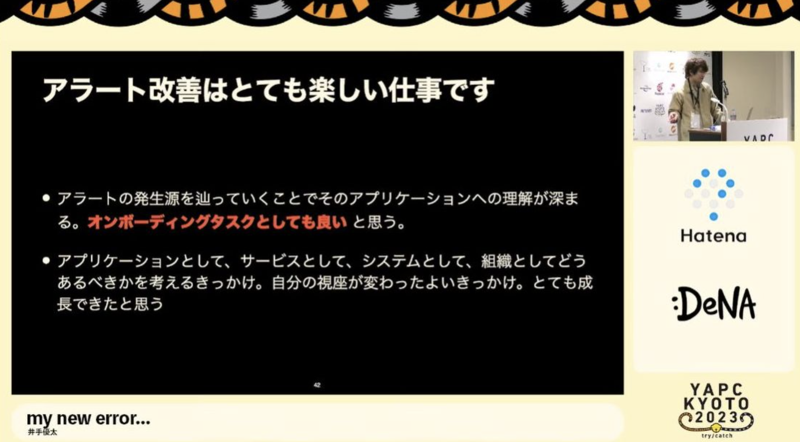
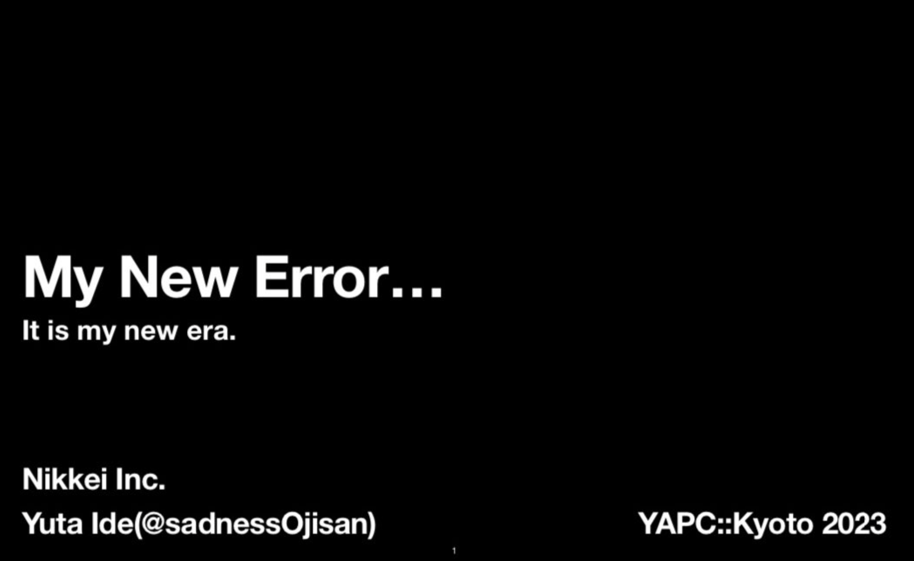

[YAPC::Kyoto 2023 にで話します！そしてチケットを今すぐに購入しましょう！！](https://blog.ojisan.io/yapc-deruyo-2023/) にある通り [YAPC](https://yapcjapan.org/2023kyoto/) に登壇しました。

デカデカと垂れ幕にあったりクロージングトークが言うには「ブログを書くまでが YAPC」らしく、まだ書いていないことを思い出したので書きます。やっと YAPC が終わる（？）

## なにを話したのか

そもそも Perl エンジニアでもない僕が YAPC に申し込んだのはサブタイトルが Try::Catch だったからです。というのもここ 3 ヶ月ほどエラーやアラートだけ見続けるという仕事をしていまして、エラーやアラートに一家言あったからです。

元々その取り組みについては

<iframe src="https://speakerdeck.com/sadnessojisan/jian-shi-senaakansi-wu-da-zhi-dakeniookamitutena" style="top: 0; left: 0; width: 100%; height: 100%; position: absolute; border: 0;" allowfullscreen scrolling="no" allow="encrypted-media;"></iframe>

で話したりしていました。

またそのときに理想のエラーハンドリングはどうあるべきかを考え、 [My new error...](https://blog.ojisan.io/my-new-error/) や [Sentry SDK 完全理解](https://blog.ojisan.io/sentry-sdk-kanzen-rikai/) を書いていました。

しかしエラーハンドリングの改善で理想論を進めるのは難しく、具体的にどうやって改善していったかについて発表しました。

といっても画期的な何かはあったわけでなく、「ないよりもあった方がマシ」の精神でできるところから Result 型の導入や Node.js のアップデートやカスタムエラーへの置き換えをしました。今回は会社としての発表なので広報レビューなどを受けるためにまだ公開していませんが、そのうち公開する予定です。

## 面白かった発表

### CloudWatch エージェントと CloudWatch で行うアプリケーション監視

自分もエラーハンドリング系の話をする予定だったので同じ部屋だったこともあり聞きに行きました。どうやら僕の発表に対して頷くところが多かったとコメントされていたようなのですが、反対に僕も頷きながらお話を伺っていました。やはりエラーハンドリングやアラートに関する課題は皆もってるのだなと少し安心（？）しました。

FYI: https://yapcjapan.org/2023kyoto/timetable.html#talk-127

### Perl と全文検索エンジン Groonga で MySQL のデータを高速に全文検索する

全文検索そのものの自作にも興味があり、このトークを聞きに行きました。自分の全文検索は ES 頼みで、ES を採用したときのデータ更新や ES そのものが壊れたときのリカバリどうするか問題は頭を悩ましていました。（みなかったことにすれば解決できるんだけど！）解決のために全文検索エンジン以外に HTTP サーバーなど SDK など用意しているのを見て自作は大変そうだなという感想を持ちまして、何か便利なライブラリ使おうの気持ちになるのでした。

FYI: https://yapcjapan.org/2023kyoto/timetable.html#talk-111

### lls と cachectl から学ぶ、Go でシステムプログラミングをする方法

自分は最近システムプログラミングにハマっていることと、諸事情で Go そのものの仕組みを勉強しているので聞きに行きました。
自分はユーザー関数(1)とかライブラリ関数(3)をシステムコールだけで再発明してキャッキャッしているだけなのですが、lls のように実際の問題を解決するようなコマンドを作られているのを見て自分も頑張らんといかんなという気持ちにさせられてよかったです。

FYI: https://yapcjapan.org/2023kyoto/timetable.html#talk-107

### どこでも動く Web フレームワークをつくる

yusukebe さんとは Fastly の yamagoya で会って以来、VCL の話で盛り上がれる数少ない方という謎の注目の仕方をしているのですが、Hono の開発者の方です。Hono が広まっていった話は個人で OSS を作る時のジャパニーズドリームだと思っていて、いつか自分もそういうものを作りたいという憧れがあります。Hono についてはブログ記事などで何回か読んでいたのですが、やはり生で聞くとやる気にさせられてよかったです。

FYI: https://yapcjapan.org/2023kyoto/timetable.html#talk-120

## ノベルティ

正論パンチ手袋が良かった。

あとさくらサーバー無料券。

たくさんステッカーもらえたのも久々のオフライン勉強会という感じがして良かった。

## おわりに

久しぶりのオフライン勉強会でお祭り感があってすごく楽しかったです！そして受付や運営などもコロナ明けで久しぶりだとは思うのですがスムーズでとても楽でした。スタッフの皆様、ありがとうございました！！！また参加します！

## その他

### ホテルの高騰すごかった

アパホテルが 25000 円でした。

### じっくり観光したかった

２日前から入っていたけどスライド作りやら帰省やらで忙しかったのと翌日仕事だったので観光していないです。次行くときはゆっくりできるスケジュール組みたい。
