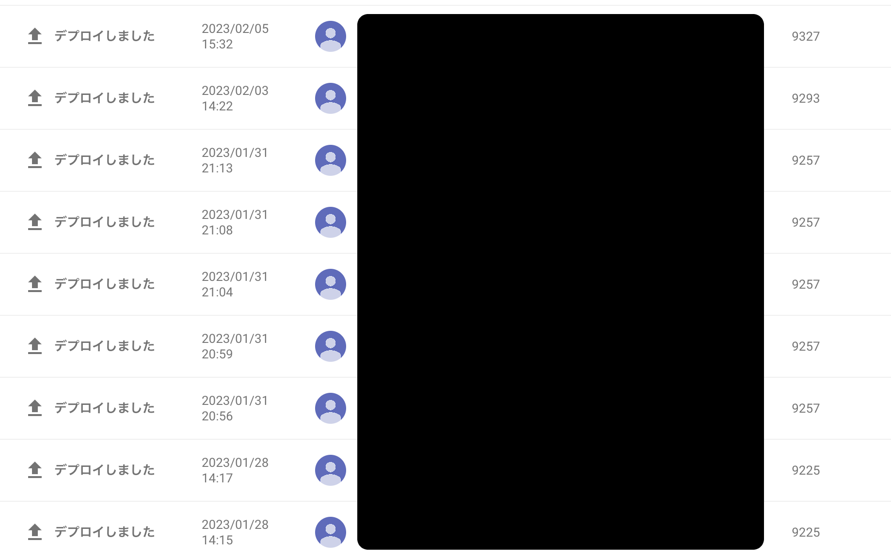
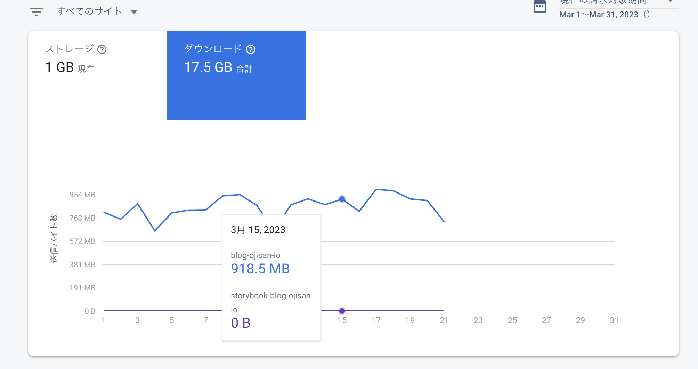
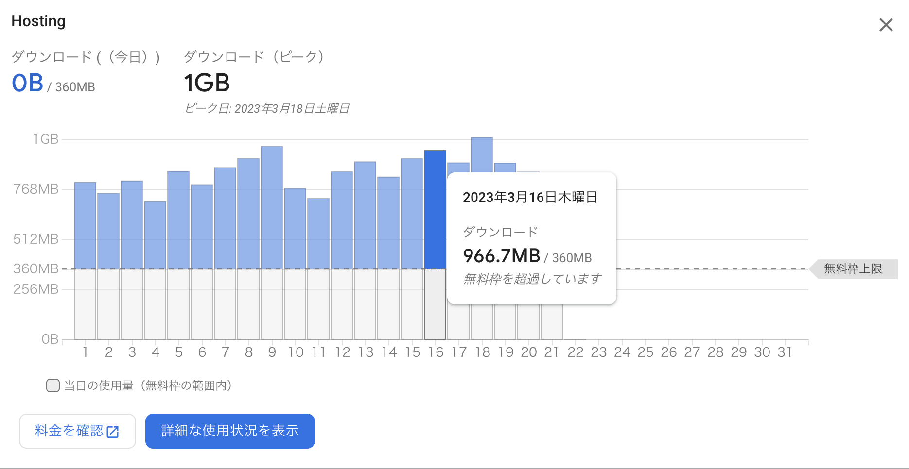
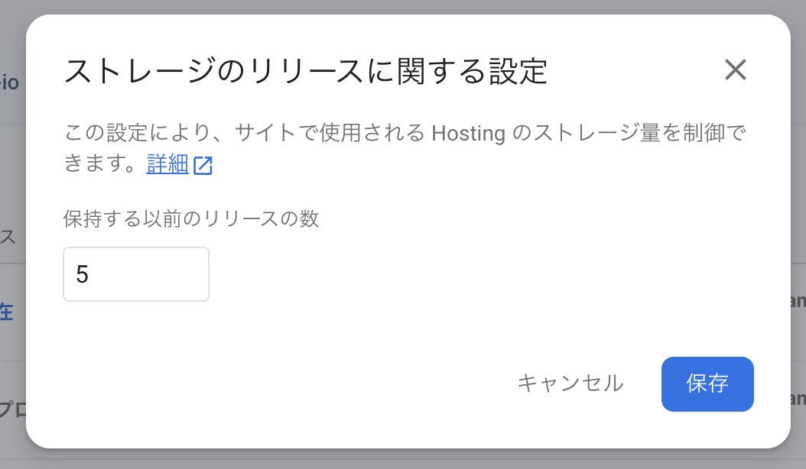
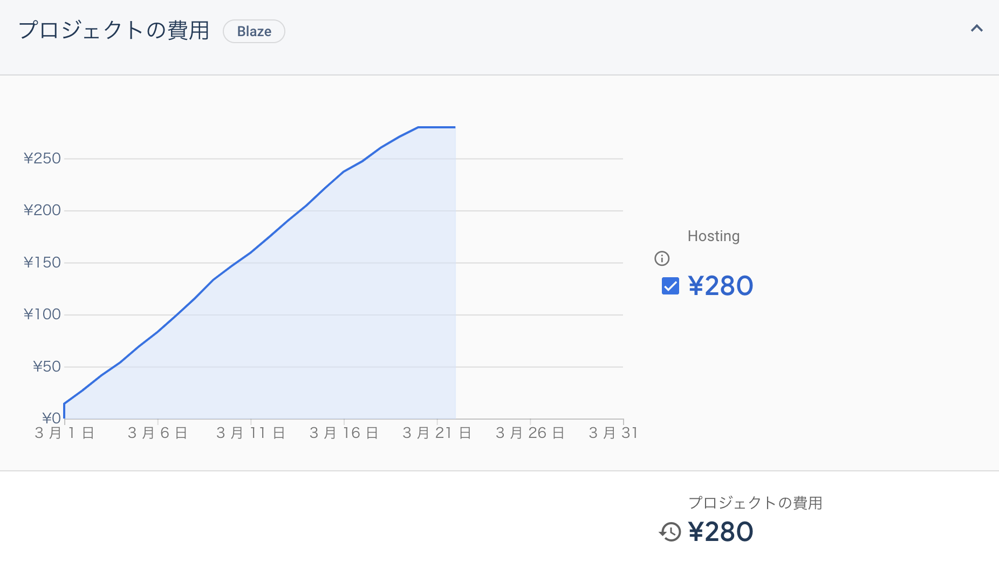

## きっかけ

毎月 Google から「今月の予算をオーバーしそうです」みたいなメールが毎月来ていたので、まあなんか [Syntax Highlight Battle
](https://syntax-highlight-battle.ojisan.dev/) とかが使われているんだろうなと思って放置していました。ただあまりにも毎月くるので怪しく思い調べてみると syntac highlight battle は全くコストが問題なかったです。で、エクスプローラーとかで辿っていくとどうも Firebase 側にコストがあることが分かりました。ただ何も思い当たるものがなかったのですが調べてみると blog.ojisan.io のホスティングが原因でした。

「いや、流石にないだろ」と思いました。大量のアクセスがあるわけでもないし、ただの静的ウェブサイトだからです。なのでそう思いつつもデバッグしてみると、どうも本当にホスティングに対して課金されているようでした。

## Firebase Hosting と Gatsby の相性の悪さ

まず Firebase Hosting はサイトのストレージと DL 量に対して課金されます。今回私が課金されていたのは主にストレージでした。

どうしてそんなに圧迫していたのか見ていたらロールバックできる候補が大量に保存されていました。

大体 50 個ありました。

そして画像の右端はファイル数なのですが、Gatsby でビルドすると大量に Chunk が作られるので容量を食っていました。
一般的に SSG 系の FW はビルド時に大量のランタイムコードやスタイルなどを書き出すので全体としてのサイズは大きくなります。
さらに Gatsyb の場合は画像の切り出しもあるのでさらに容量は増えていると思います。
それが 50 個分あったので結構な容量となり、コストになっていました。
大体全体で 56GB ありました。
ハイパフォーマンスを実現するがゆえのトレードオフ、辛い。

この辺りは Astro だとどうなるのだろうか。誰か実験してみてくれると嬉しいです。

ちなみに DL 量も微妙に課金されていそうです。
いつもブログ見てくれてありがとうございます。

## ロールバック対象の保存個数を減らす

とりあえずロールバック先は 50 個も要らないし、なんなら GitHub からビルドし直せばいいので 0 でも良いので、まずはこの数を大幅に減らします。一旦５にしました。

これはリリース履歴から編集できます。

この storage limit に関しては公式にも書かれています。

> https://firebase.google.com/docs/hosting/manage-hosting-resources#release-storage-settings

どうやらコンソールからしかでき無さそうです。preview の expire などはコマンドや CI/CD Action から設定できるので、これもコードで設定したいです。

このようにしてストレージ容量を減らした結果、

のようにコスト上昇を食い止められました、きっと来月は無料です。やはりただのブログにコストが掛かるほど人は来ていなかったのである。それはそれで悲しいけど、Firebase は安くて最高という気持ちでもあります。Firebase 最高！
