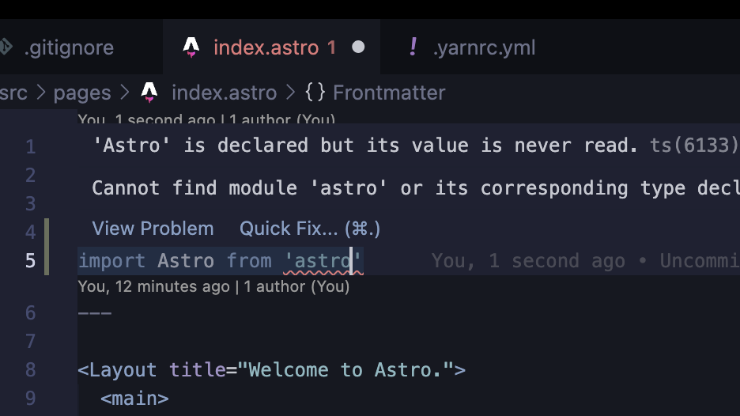

## astro で yarn v3 が動かない

yarn v3 環境下で astro を入れたときに astro を呼び出そうとすると、



となる。ちなみに別ライブラリの呼び出しも失敗する。

## 解決策

troubleshooting を読む。

FYI: https://docs.astro.build/en/guides/troubleshooting/#using-astro-with-yarn-2-berry

> Using Astro with Yarn 2+ (Berry)

> Yarn 2+, a.k.a. Berry, uses a technique called Plug’n’Play (PnP) to store and manage Node modules, which can cause problems while initializing a new Astro project using create astro or while working with Astro. A workaround is to set the nodeLinker property in .yarnrc.yml to node-modules:

```yaml
nodeLinker: "node-modules"
```

とあり、`.yarnrc.yml` に先のコードを追記する。

この設定項目は

> Defines what linker should be used for installing Node packages (useful to enable the node-modules plugin), one of: pnp, pnpm and node-modules.

FYI: <https://yarnpkg.com/configuration/yarnrc#nodeLinker>

とあり、 pnp, pnpm, node_modules を取り得る。

この node_modules の設定に関する説明・実装はここから確認できる。

FYI: <https://github.com/yarnpkg/berry/tree/master/packages/plugin-nm>

> This plugin adds support for installing packages through a node_modules folder.

とある通り install した package を node_modules に入れてくれる。

Astro ではどうしてこの問題が起きるかはドキュメントにも Issue にもなさそうで原因は分からない。
