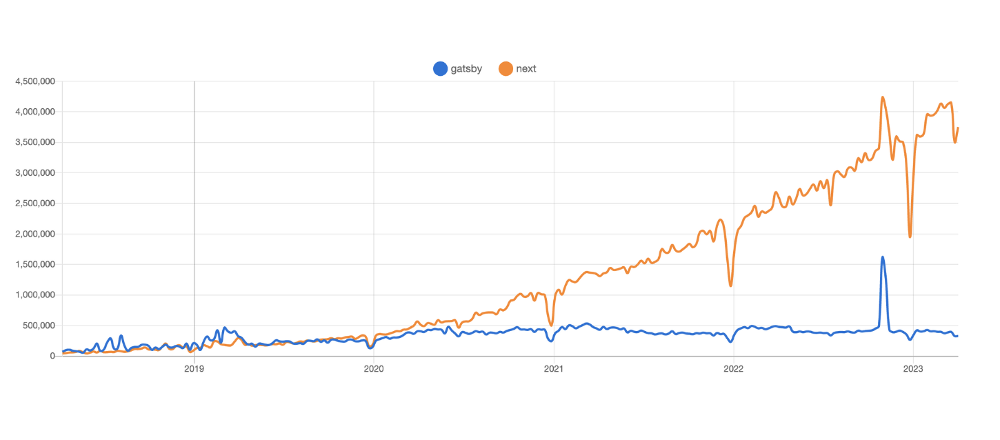

URL は 2023-no-gatsby だが、これは 「2023 の gatsby」であって「NO！」ではない。「YES！」だ。

定期的に 「Gatsby は良いぞ」なブログを書いていますが今日もそれを書いていく。

- [ブログが新しくなりました(2 ヶ月前に)ので、その報告と技術的な解説](https://blog.ojisan.io/renew-blog-2022/)
- [なぜ私は Gatsby でブログを作っているのか](https://blog.ojisan.io/why-i-will-use-gatsby/)
- [Gatsby3 はいいぞ](https://blog.ojisan.io/gatsby3-yokatta/)

Gatsby は React を使ったハイパフォーマンスな静的サイトジェネレータの先駆け的な存在だ。リリース当初から チャンク最適化、画像の最適化、CSS の最適化などが実装されており、後のさまざまな SSG FW に影響を与えた。

Next.js もその一例であり、v9 あたりで SSG がサポートされたときにはこれらの多くの機能が入り、定期的に Gatsby の機能を取り入れている。残念ながら Next.js で SSG ができるようになってからは「Next.js でいいじゃん」となり、Gatsby はあまり使われなくあるように思える。Gatsby の採用事例は最近はあまり聞かなくなった。実際のところ私は Gatsby, Next 双方のユーザーだが、大多数のユースケースにおいては Next.js で十分だと思う。



FYI: https://npmtrends.com/gatsby-vs-next

(Next が人気なのは SSR FW としてという側面があることには注意、Gatsby も Next 同等の SSR サポートがあるが前面に押し出されていない)

Gatsby は元々、「型がつかない」「プラグインの出来が良くない」「TypeScript と相性が悪い」「GraphQL は不要」などなど言われていた記憶がある。 Next が台頭してからはそちらに引っ越しが活発になった理由はそれらだと思う。大体 v2 が出たあたりで人々が離れていったような記憶がある。

しかし、Gatsby はその後も進化を続け、今では [v5](https://www.gatsbyjs.com/docs/reference/release-notes/v5.0/) が出るところまできた。みんな大好き Partial Hydration もできる。そんな中で Gatsby がどれだけ便利になって、さまざまなデメリットを克服したかを今日は紹介する。

2021 年の JSConf で Gatsby を少し深ぼった発表もしたことがあるので興味がある方は是非こちらも見て欲しい。

<div style="left: 0; width: 100%; height: 0; position: relative; padding-bottom: 56.1972%;"><iframe src="https://speakerdeck.com/player/a098fcd04ea94eaca743cd1779b60087" style="top: 0; left: 0; width: 100%; height: 100%; position: absolute; border: 0;" allowfullscreen scrolling="no" allow="encrypted-media;"></iframe></div>

（これを書いた当時は Partial Hydration できないから FW 使わずに自作する手もあるぞという話をしていたのに・・・今や FW を使うことのメリットになってしまいましたね。時代が俺らに追いついたということか・・・（絶対違う））

## 型付け

昔は Gatsby の TypeScript 対応はかなり辛かった。設定した項目に型がついてこなかったり、GraphQL で取ってきたデータへの型付けを別途自分でする必要があったり、型推論という点で非常に弱かった。それが現在は Next.js と同じ土俵に並べられるくらいにはかなり改善されている。

### 設定を TS で書ける

Gatsby の設定といえば gatsby-config.js と gatsby-node.js だが、これらが gatsby-config.ts と gatsby-node.ts として型付けられる。GatsbyConfig, GatsbyNode として型が存在する。これらをどのように使えるかは実際のコードを見てもらった方が早いと思う。このブログの設定はこのようになっている。

```ts
import path from "path";
import { GatsbyNode } from "gatsby";

export const createPages: GatsbyNode["createPages"] = async ({
  actions,
  graphql,
}) => {
  const { createPage } = actions;
  await pagination(createPage, graphql);
  await detailPage(createPage, graphql);
  await tagsPage(createPage, graphql);
};

type NextEdge =
  Queries.NextPrevQueryQuery["allMarkdownRemark"]["edges"][number]["next"];
type PrevEdge =
  Queries.NextPrevQueryQuery["allMarkdownRemark"]["edges"][number]["previous"];
export interface DetailPageContext {
  next: NextEdge;
  prev: PrevEdge;
  id: string;
  tags: string[];
}

const pagination = async (
  createPage: Parameters<
    NonNullable<GatsbyNode["createPages"]>
  >["0"]["actions"]["createPage"],
  graphql: Parameters<NonNullable<GatsbyNode["createPages"]>>["0"]["graphql"]
) => {

... 略

export interface TagPageContext {
  tag: string;
}
const tagsPage = async (
  createPage: Parameters<
    NonNullable<GatsbyNode["createPages"]>
  >["0"]["actions"]["createPage"],
  graphql: Parameters<NonNullable<GatsbyNode["createPages"]>>["0"]["graphql"]
) => {
  const getTagsResult = await graphql<Queries.AllTagsQuery>(`
    query AllTags {
      tags: allMarkdownRemark {
        group(field: { frontmatter: { tags: SELECT } }) {
          tag: fieldValue
          totalCount
        }
      }
    }
  `);

  if (!getTagsResult.data || getTagsResult.errors) {
    throw new Error("全tagのデータ取得に失敗しました。");
  }

  // create each page
  getTagsResult.data.tags.group.forEach((tag) => {
    if (tag.tag === null) {
      throw new Error("tag should be there");
    }
    const context: TagPageContext = {
      // This is needed for query by tag in tag page.
      tag: tag.tag,
    };
    createPage({
      path: `/tags/${tag.tag}`,
      component: path.resolve("./src/templates/tag-page.tsx"),
      context,
    });
  });
};
```

FYI: <https://github.com/sadnessOjisan/blog.ojisan.io/blob/eb47b0c563991e2e0137058778d5e34c06b7c11f/gatsby-node.ts>

```ts
import type { GatsbyConfig } from "gatsby";

const config: GatsbyConfig = {
  siteMetadata: {
    title: `blog.ojisan.io`,
    siteUrl: `https://blog.ojisan.io`,
    description: `おじさんのブログ。プログラミングとか料理とかゲームとか。`,
    twitterUsername: `@sadnessOjisan`,
    image: `/default-ogp.png`,
  },
  // More easily incorporate content into your pages through automatic TypeScript type generation and better GraphQL IntelliSense.
  // If you use VSCode you can also use the GraphQL plugin
  // Learn more at: https://gatsby.dev/graphql-typegen
  graphqlTypegen: true,
  plugins: [
    ...略
    "gatsby-plugin-sharp",
    "gatsby-transformer-sharp",
    {
      resolve: "gatsby-source-filesystem",
      options: {
        name: "images",
        path: "./src/images/",
      },
      __key: "images",
    },
    {
      resolve: "gatsby-source-filesystem",
      options: {
        name: "contents",
        path: "./src/contents/",
      },
      __key: "contents",
    },
  ],
};

export default config;
```

FYI: <https://github.com/sadnessOjisan/blog.ojisan.io/blob/eb47b0c563991e2e0137058778d5e34c06b7c11f/gatsby-config.ts>

### gatsby 独特のお作法に型が付く

#### page props

Gatsby では pages フォルダに入れたファイルや、gatsby-config から呼び出すテンプレートは特殊なファイル扱いで、props として Gatsby 特有のデータを受け渡されることが前提となる。その値に対する型付けが今はサポートされている。これも現物を見てもらうのが良いだろう。

<https://github.com/sadnessOjisan/blog.ojisan.io/blob/eb47b0c563991e2e0137058778d5e34c06b7c11f/src/templates/detail-page.tsx#L15>

`PageProps` は

```tsx
export type PageProps<
  DataType = object,
  PageContextType = object,
  LocationState = WindowLocation["state"],
  ServerDataType = object
> = {
  /** The path for this current page */
  path: string;
  /** The URI for the current page */
  uri: string;
  /** An extended version of window.document which comes from @react/router */
  location: WindowLocation<LocationState>;
  /** A way to handle programmatically controlling navigation */
  navigate: NavigateFn;
  /** You can't get passed children as this is the root user-land component */
  children: undefined;
  /** The URL parameters when the page has a `matchPath` */
  params: Record<string, string>;
  /** Holds information about the build process for this component */
  pageResources: {
    component: React.Component;
    json: {
      data: DataType;
      pageContext: PageContextType;
    };
    page: {
      componentChunkName: string;
      path: string;
      webpackCompilationHash: string;
      matchPath?: string;
    };
  };
  /**
   * Data passed into the page via an exported GraphQL query. To set up this type
   * you need to use [generics](https://www.typescriptlang.org/play/#example/generic-functions),
   * see below for an example
   *
   * @example
   *
   * import {PageProps} from "gatsby"
   *
   * type IndexQueryProps = { downloadCount: number }
   * type IndexPageProps = PageProps<IndexQueryProps>
   *
   * export default (props: IndexPageProps) => {
   *   ..
   *
   */
  data: DataType;
  /**
   * A context object which is passed in during the creation of the page. Can be extended if you are using
   * `createPage` yourself using generics:
   *
   * @example
   *
   * import {PageProps} from "gatsby"
   *
   * type IndexQueryProps = { downloadCount: number }
   * type LocaleLookUpInfo = { translationStrings: any } & { langKey: string, slug: string }
   * type IndexPageProps = PageProps<IndexQueryProps, LocaleLookUpInfo>
   *
   * export default (props: IndexPageProps) => {
   *   ..
   */
  pageContext: PageContextType;
  /** Data passed into the page via the [getServerData](https://www.gatsbyjs.com/docs/reference/rendering-options/server-side-rendering/) SSR function. */
  serverData: ServerDataType;
};
```

となっており、GraphQL から渡されるデータを data, gatsby-node から渡されるデータを pageContext に generics で入れてあげると型推論が効くようになる。

#### graphql

さきの章で data の型を考えた時、ではその GraphQL で取ってくるデータの型をどこから手に入れるのかという話になる。これは昔は graphql-codegen で無理やり気合いで頑張っていた。それが今ではプラグインで実現できる。

[https://github.com/sadnessOjisan/blog.ojisan.io/blob/eb47b0c563991e2e0137058778d5e34c06b7c11f/gatsby-config.ts#L14](https://github.com/sadnessOjisan/blog.ojisan.io/blob/eb47b0c563991e2e0137058778d5e34c06b7c11f/gatsby-config.ts#L14)

`graphqlTypegen: true` とするだけでコンパイル時に `gatsby-types.d.ts` が生えてきて型を利用できる。

[https://github.com/sadnessOjisan/blog.ojisan.io/blob/eb47b0c563991e2e0137058778d5e34c06b7c11f/src/gatsby-types.d.ts](https://github.com/sadnessOjisan/blog.ojisan.io/blob/eb47b0c563991e2e0137058778d5e34c06b7c11f/src/gatsby-types.d.ts)

```tsx
type MarkdownRemarkFrontmatter = {
  readonly created: Maybe<Scalars["Date"]>;
  readonly isFavorite: Maybe<Scalars["Boolean"]>;
  readonly isProtect: Maybe<Scalars["Boolean"]>;
  readonly path: Maybe<Scalars["String"]>;
  readonly tags: Maybe<ReadonlyArray<Maybe<Scalars["String"]>>>;
  readonly title: Maybe<Scalars["String"]>;
  readonly updated: Maybe<Scalars["Date"]>;
  readonly userId: Maybe<Scalars["String"]>;
  readonly visual: Maybe<File>;
};
```

## File System Route API

Gastby は 2 系か 3 系かどこかのタイミングで File System Route API という機能が導入された。

FYI: [https://www.gatsbyjs.com/docs/reference/routing/file-system-route-api/](https://www.gatsbyjs.com/docs/reference/routing/file-system-route-api/)

これはファイル名に `[]` `{}` `__` を入れることで、パターンに基づいた GraphQL を生成し、そのコンポーネントにデータとして渡せるようになる機能だ。つまり GraphQL を書く必要がなくなる。

公式の例を持ってくると

src/pages/products/{[Product.name](http://product.name/)}.js は

```tsx
allProduct {
  nodes {
    id # Gatsby always queries for id
    name
  }
}
```

のようなクエリを発行し、src/pages/products/{Product.fields\_\_sku}.js は

```tsx
allProduct {
  nodes {
    id # Gatsby always queries for id
    fields {
      sku
    }
  }
}
```

のようなクエリを発行する。

そしてそのデータを持つページを作ってくれる。

そのデータは params として使える上に GraphQL のフィルタでも使える。

```tsx
import React from "react";
import { graphql } from "gatsby";

export default function Component(props) {
  return props.data.fields.sku + props.params.name;
}

// This is the page query that connects the data to the actual component. Here you can query for any and all fields
// you need access to within your code. Again, since Gatsby always queries for `id` in the collection, you can use that
// to connect to this GraphQL query.

export const query = graphql`
  query ($id: String) {
    product(id: { eq: $id }) {
      fields {
        sku
      }
    }
  }
`;
```

こうすることで何が良いかというと動的なページを作るために gatsby-node.js を触る必要がなくなる。これまでは gatsby-node.js 内で GraphQL を発行し、取得したデータを context として template に埋め込んでいた。

FYI: [https://github.com/sadnessOjisan/blog.ojisan.io/blob/eb47b0c563991e2e0137058778d5e34c06b7c11f/gatsby-node.ts#L73](https://github.com/sadnessOjisan/blog.ojisan.io/blob/eb47b0c563991e2e0137058778d5e34c06b7c11f/gatsby-node.ts#L73)

そのようなことをしなくてよくなるのである。

ただ便利なのだが、取得したデータの加工やバリデーションをしたかったので筆者はこの機能を使わずにブログを作っている。小さい捨て置き規模であればこの機能に頼っても良いと思う。

## head タグ

Gatsby 4.19.0 から Head API が導入された。

FYI: [https://www.gatsbyjs.com/docs/reference/built-in-components/gatsby-head/](https://www.gatsbyjs.com/docs/reference/built-in-components/gatsby-head/)

これはこれまでの react-helmet での head 埋め込みの代わりになるもので、`export const Head` したものが head として使えるようになる API だ。

```tsx
export const Head = () => (
  <>
    <title>Hello World</title>
    <meta name="description" content="Hello World" />
  </>
);
```

export するだけで head を使えるのは便利だ。

さらに実は pages dir で実行した GraphQL の結果を受け取れるので動的な値埋め込みもできる。blog.ojisan.io の記事ページではこのようにして使っている。

```tsx
export const Head = ({ data }: HeadProps<Queries.DetailPageQueryQuery>) => {
  if (
    !data.markdownRemark?.frontmatter?.title ||
    !data.markdownRemark.frontmatter.created ||
    !data.markdownRemark.excerpt ||
    !data.markdownRemark.frontmatter.visual?.childImageSharp
  ) {
    throw new Error("there should be");
  }

  // getImage と違って null を引数に取れないので上で null チェックしている
  // OGP 生成に使われてる関数: https://www.gatsbyjs.com/docs/reference/built-in-components/gatsby-plugin-image/#getsrc
  const imageSrc = getSrc(
    data.markdownRemark.frontmatter.visual.childImageSharp
  );

  if (!imageSrc) {
    throw new Error("image path should be");
  }
  return (
    <HeadFactory
      title={data.markdownRemark?.frontmatter?.title}
      type="article"
      imagePath={imageSrc}
      created={data.markdownRemark.frontmatter?.created}
      shouldProtect={!!data.markdownRemark.frontmatter.isProtect}
      description={data.markdownRemark.excerpt}
    />
  );
};
```

FYI: <https://github.com/sadnessOjisan/blog.ojisan.io/blob/eb47b0c563991e2e0137058778d5e34c06b7c11f/src/templates/detail-page.tsx#L85>

```tsx
import { graphql, useStaticQuery } from "gatsby";
import { ComponentType } from "react";

interface Props {
  title?: string;
  imagePath?: string;
  description?: string;
  created?: string;
  type: "blog" | "article";
  shouldProtect?: boolean;
}

/**
 * head component として使われること想定
 * @see: https://www.gatsbyjs.com/docs/reference/built-in-components/gatsby-head/
 */
export const HeadFactory: ComponentType<Props> = ({
  title,
  description,
  imagePath,
  type,
  created,
  shouldProtect,
}) => {
  // 他の場所でも呼び出すなら custom hooks として切り出すべき
  const siteMetaDataQueryResult: Queries.SiteMetaDataQuery =
    useStaticQuery(graphql`
      query SiteMetaData {
        site {
          siteMetadata {
            title
            description
            twitterUsername
            image
            siteUrl
          }
        }
      }
    `);
  const baseData = siteMetaDataQueryResult.site?.siteMetadata;
  if (
    !baseData?.title ||
    !baseData?.description ||
    !baseData?.siteUrl ||
    !baseData.image ||
    !baseData.twitterUsername
  ) {
    throw new Error("data source is invalid");
  }
  const pageTitle = title ? `${title} | ${baseData.title}` : baseData.title;
  const pageDiscription = description ? description : baseData.description;
  const pageImage = imagePath ? imagePath : baseData.image;
  return (
    <>
      <title>{pageTitle}</title>
      <meta property="og:title" content={title} />
      <meta name="og:description" content={pageDiscription} />
      <meta property="og:url" content={baseData.siteUrl} />
      <meta property="og:type" content={type} />
      <meta property="og:site_name" content={baseData.title} />
      <meta property="og:image" content={`${baseData.siteUrl}${pageImage}`} />
      <meta name="twitter:card" content="summary_large_image" />
      <meta name="twitter:url" content={baseData.siteUrl} />
      <meta name="twitter:site" content={baseData.twitterUsername} />
      {shouldProtect && <meta name="Hatena::Bookmark" content="nocomment" />}
      {type === "article" && (
        <script type="application/ld+json">
          {`
        {
          "@context": "https://schema.org",
          "@type": "BlogPosting",
          "headline": "${title}",
          "image": [
            "${baseData.siteUrl}${pageImage}"
           ],
          "datePublished": "${created}",
          "author": [{
              "@type": "Person",
              "name": "sadnessOjisan",
              "url": "https://ojisan.io"
            }]
        }
        `}
        </script>
      )}
    </>
  );
};
```

FYI: [https://github.com/sadnessOjisan/blog.ojisan.io/blob/eb47b0c563991e2e0137058778d5e34c06b7c11f/src/components/common/head.tsx](https://github.com/sadnessOjisan/blog.ojisan.io/blob/eb47b0c563991e2e0137058778d5e34c06b7c11f/src/components/common/head.tsx)

## gatsby-image の制約が弱まっている

まず [gatsby-image](https://www.gatsbyjs.com/plugins/gatsby-image/) パッケージだけでなく [gatsby-image-plugin](https://www.gatsbyjs.com/plugins/gatsby-plugin-image/) というものが今生まれている。gatsby-image は今や deprecated になっている。

これまでは画像を使うために GraphQL Fragment を埋め込んでいたが、今はそのようなことはせずに使いたい画像のサイズやトリミング条件を引数で指定するだけで良い。

```tsx
visual {
  childImageSharp {
    gatsbyImageData(width: 1280, height: 600)
  }
}
```

そしてそのクエリは画像へのパスを返してくれるので、それを getImage という関数に埋め込むことで Image コンポーネントに必要なデータを取得できる。

```tsx
const image = getImage(markdownMeta.visual.childImageSharp);

<GatsbyImage image={image} alt="thumbnail" />;
```

昔は画像周りの型を合わせるのが大変で as 地獄になっていたのだが、getImage のおかげで型推論が効きやすくなって画像周りの TS サポートがとても楽になった。

## import react 対応

もう今や古い知識になってしまった感はあるが、React は `import *` なり `import {createElement}` しないと動かない。それは現在もそうだ。なのにいま動いているのは tsc や babel に魔法がかかっているからだ。下記を読むと何となくわかると思う。

- [どうして JSX を使ってもエラーにならないのか？](https://blog.ojisan.io/jsx-to-js/)
- [ありの〜ままの〜 React 見せるのよ〜](https://blog.ojisan.io/oreha-createElement-wo-mitai/)

昔は jsx 対応が FW に握られていたせいで開発者が明示的に import する必要があったが、今は babel や tsc に対する口が空いているので開発者側でコントロールできる。

```json
{
  "presets": [
    [
      "babel-preset-gatsby",
      {
        "reactRuntime": "automatic"
      }
    ]
  ]
}
```

詳しくは [Gatsby で React の import なしで利用する](https://blog.ojisan.io/gatsby-auto-react/) を見てください。
