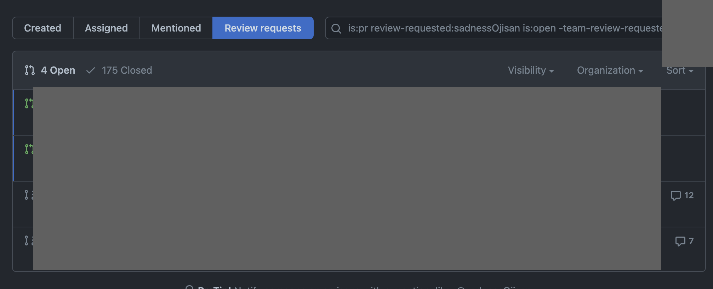

昨日 [GitHub を使うなら通知くらいまともに設定してくれ](https://zenn.dev/yumemi_inc/articles/you-are-not-using-github-correctly) という記事が流れてきて 「ぎゃああああ（爆発）」になったのでブログ書く。

## お前はどうしてるの？

通知、見てない。

典型的なオオカミ少年問題だと思う。フィルターの設定が上手い人はちゃんとできるのかもだけど、自分にはできなかった。

なので代わりに昔はメールのフィルターで頑張ったり、Slack の GitHub 連携の通知で頑張っていた。

が、メールはフィルターのメンテナンスが大変ですぐに挫折した。Slack の GitHub 連携はノイズが多くてやめた。

## 代わりに何かしてる？

あまりにもレビューを見ない僕に業を煮やした同僚が作ってくれた魔法のページを使っている。

GitHub の検索ビューで条件を

- is:pr
  - PR だけに絞り込む。検索では Issue とかもひっかかるので PR に絞る。
- review-requested:`<ここにあなたのIDが入るよ>`
  - 自分にレビュー依頼がついているものだけに絞る
- is:open
  - open している PR だけに絞る
- -team-review-requested:`<ここに除外したいteam名が入るよ>`
  - team-review-requested でチーム単位のレビュー依頼を見れる。それを `-` で除外している。ここで除外しているのはノイズになる系のもので、主に dependabot などの deps update 系のものを除外している。そういうものがなければこの設定は不要だ。
- user:`<ここにあなたの組織名が入るよ>`
  - org 名を入れて対象をその所属組織だけに絞っている

を指定したページだ。

そしてこの検索条件は URL に get query で現れるので、一度作った URL をブックマークしておけばいつでも溜まっている PR だけを見れる。

<https://github.com/pulls?q=is%3Apr+review-requested%3AあなたのGitHubIDが入るよ+is%3Aopen+-team-review-requested%3除外したいあなたのチーム名が入るよ+user%3Aあなたの組織名が入るよ+>

URL の GET Query なので、自分だけでなく他のチームメンバー用のページも簡単に作れる。なのでレビュー依頼に気づくのが苦手な知り合いがいたら URL を作ってあげて送ってあげると良いだろう。

自分はそのような URL を貰ってから、始業時・就業時に見るようにしたり常にタブで開いているして、レビュー放置をかなり改善できたと思う。

と思ったけどいまブログ書きながら通知来てたことに気づいたので、今日は見るのをサボっていたようです（完）
