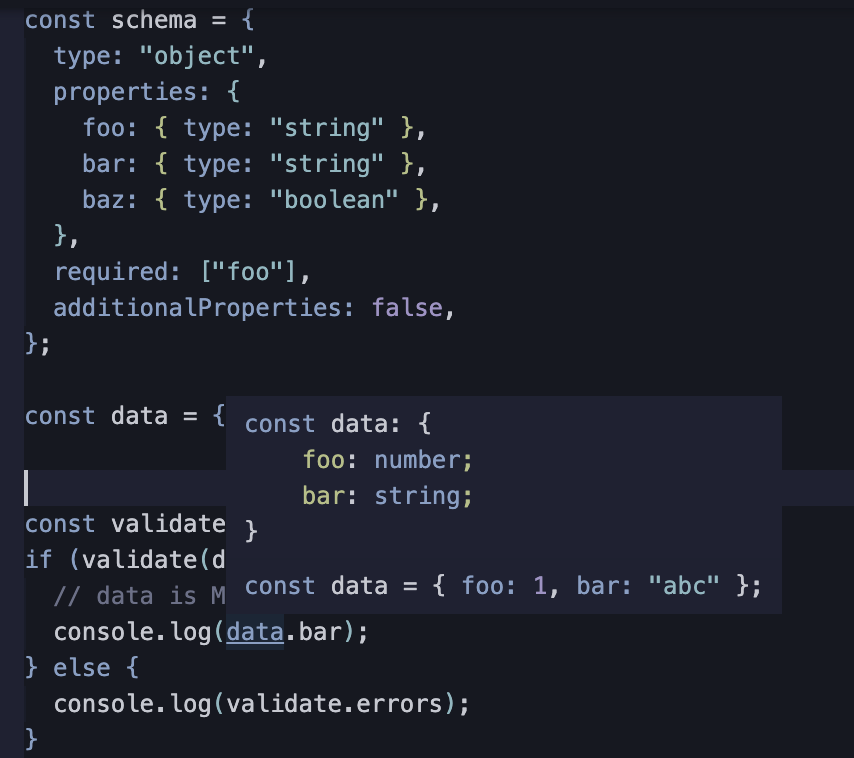
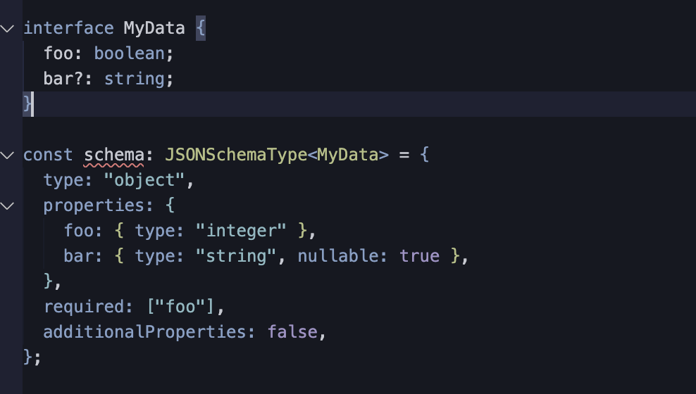

## 宣伝

4/25 に [Encraft #2 サーバーとクライアントを結ぶ技術](https://knowledgework.connpass.com/event/279962/) というイベントで JSON Schema について喋る。いま現在進行形で IDL として JSON Schema, GraphQL, Protocol Buffer, zod, joi を使っているのでそれらを食べ比べる発表をするつもりだ(明らかに JS 上でしか動かないものを IDL と呼んでいいか不安になってきた)。そしてスキーマ駆動開発(code first なアプローチをスキーマ駆動と呼んでいいのか不安になってきた)を推進する上で、その中では大人の事情に柔軟に一番対応できるのは JSON Schema だという悲しい話をする。だが、私はこの JSON Schema を書き過ぎたせいで話したいことが大量にあり、JSON Schema の話だけで 1 時間超えそうな勢いなことに気づいた（発表時間は 20 分）。なので時間の都合で当日話せないけど話したいことを先に全部まとめておこうと思ってブログを書く。だから登壇日まで JSON Schema や IDL の話ばかり書くようになると思う。

## はじめに

Ajv と TS については [TypeScript, JSON Schema, Ajv の組み合わせを考える](https://blog.ojisan.io/typescript-json-schema-ajv/) で１年以上前に書いた。

これの要点は

- validation 後のデータに型をつけるためにはその型を自前で定義してジェネリクスで渡さないといけない
- 既存開発物にスキーマを入れるなら型から JSON Schema を生成できて、元からあった型を `validate()` のジェネリクスに渡す。validator は生成した JSON Schema から作る。
- が、有名どころのライブラリから生成される JSON Schema がバグっているので気合い入れて臨め

という話だ。

これを改めて読み返すと、そもそも Ajv と TypeScript を組み合わせるときの考え方について解説していなかったと思い、今日はそれを書く。

## スキーマ駆動開発の定石: 型とスキーマとドキュメントを整合させろ

[API 仕様書をバリデーターと型と同期させて作る](https://blog.ojisan.io/swagger-validator-ts/) に書いたことだが、型とスキーマとドキュメントを整合させましょう。スキーマで検証したデータに正しい型が推論されるようにしないと型安全とは言えない。じゃあ型とスキーマをどう Ajv で整合させるのか見ていく。

色々方法はあるが、結局は「型とスキーマとドキュメントを整合させろ」を達成できていればやり方はなんでもいい。達成できているのは本当に極少数の職場だとは存じますが・・・😢

## Ajv をそのまま使うとスキーマと型が整合しない

説明するの難しいのでいきなり例を出すと、

```ts
import Ajv from "ajv";
const ajv = new Ajv();

const schema = {
  type: "object",
  properties: {
    foo: { type: "string" },
    bar: { type: "string" },
    baz: { type: "boolean" },
  },
  required: ["foo"],
  additionalProperties: false,
};

const data = { foo: 1, bar: "abc" };

const validate = ajv.compile(schema);
if (validate(data)) {
  // data is MyData here
  console.log(data.bar);
} else {
  console.log(validate.errors);
}
```

のようなコードを書いた時、`validate(data)` したら schema 通りの型がついて欲しい。

しかし現実には data の変数定義の型が利用される。



つまり validate した後にウソの型がついてしまう可能性があるのである。（現実には検証対象は any や unknown のはずなのでウソですらないのだけど）

## JSON Schema と型を揃える方法

有名どころは次の３つだろう。

### Ajv から型を導出する

Ajv には `JSONSchemaType<T>` というユーティリティがあるので紹介する。

#### JSONSchemaType で型とスキーマの整合性を検証できる

`JSONSchemaType<T>` を使ってついて欲しい型をジェネリクスに渡し、それを JSON Schema に渡す方法が公式が推奨している。こうすると validate した後に data に型 T が付く。

```ts
import Ajv, { JSONSchemaType } from "ajv";
const ajv = new Ajv();

interface MyData {
  foo: number;
  bar?: string;
}

const schema: JSONSchemaType<MyData> = {
  type: "object",
  properties: {
    foo: { type: "integer" },
    bar: { type: "string", nullable: true },
  },
  required: ["foo"],
  additionalProperties: false,
};

// validate is a type guard for MyData - type is inferred from schema type
const validate = ajv.compile(schema);

// or, if you did not use type annotation for the schema,
// type parameter can be used to make it type guard:
// const validate = ajv.compile<MyData>(schema)

const data = {
  foo: "1",
  bar: "abc",
};

if (validate(data)) {
  // data is MyData here
  console.log(data.foo);
} else {
  console.log(validate.errors);
}
```

FYI: <https://ajv.js.org/guide/typescript.html#utility-types-for-schemas>

ちなみに JSONSchemaType は JSON Schema と整合しない型をジェネリクスで渡すとエラーを出してくれて親切。



#### 型エラーの読解は大変

ただ型がズレた時のエラーメッセージを読むのは少し大変だ。

```
const schema: UncheckedJSONSchemaType<MyData, false>
Type '{ type: "object"; properties: { foo: { type: "integer"; }; bar: { type: "string"; nullable: true; }; }; required: "foo"[]; additionalProperties: false; }' is not assignable to type 'UncheckedJSONSchemaType<MyData, false>'.
  The types of 'properties.foo' are incompatible between these types.
    Type '{ type: "integer"; }' is not assignable to type '{ $ref: string; } | (UncheckedJSONSchemaType<boolean, false> & { nullable?: false | undefined; const?: boolean | undefined; enum?: readonly boolean[] | undefined; default?: boolean | undefined; })'.
      Type '{ type: "integer"; }' is not assignable to type '{ type: "boolean"; } & { allOf?: readonly UncheckedPartialSchema<boolean>[] | undefined; anyOf?: readonly UncheckedPartialSchema<boolean>[] | undefined; ... 4 more ...; not?: UncheckedPartialSchema<...> | undefined; } & { ...; } & { ...; }'.
        Type '{ type: "integer"; }' is not assignable to type '{ type: "boolean"; }'.
          Types of property 'type' are incompatible.
            Type '"integer"' is not assignable to type '"boolean"'.ts(2322)
```

number を boolean に変えただけでこれなので、[TypeScript, JSON Schema, Ajv の組み合わせを考える](https://blog.ojisan.io/typescript-json-schema-ajv/) でしたような実アプリから作った JSON Schema と型が変換ツールのバグが原因で合わなかったときのデバッグは本当に消耗した。

### JSONSchema に変換できる IDL を使う

これは [typebox](https://github.com/sinclairzx81/typebox) という IDL がオススメだ。

公式には

> JSON Schema Type Builder with Static Type Resolution for TypeScript

とあり、使い方は

```ts
import { Static, Type } from "@sinclair/typebox";

const T = Type.Object({
  // const T = {
  x: Type.Number(), //   type: 'object',
  y: Type.Number(), //   required: ['x', 'y', 'z'],
  z: Type.Number(), //   properties: {
});
//     x: { type: 'number' },
//     y: { type: 'number' },
//     z: { type: 'number' }
//   }
// }

type T = Static<typeof T>;
// type T = {
//   x: number,
//   y: number,
//   z: number
// }
```

といった感じだ。

`Type.xxx()` で JSON Schema を作れ、これをそのまま Ajv に渡せる。型は `Static<typeof schema>` で導出できるので、これもそのまま Ajv の `JSONSchemaType<T>` に渡すことで validate の型推論を使えるようにできる。

ただデメリットもあって、それは Typebox 自体が IDL になっており、あまり汎用性がないことだ。一応 JSON Schema そのものを生成できるのでライブラリが deprecated になっても生き残る道はあるが、メンテナンス性に少し難は残る。

これと同じ理由で自分はあまり zod も使わないのだが、それについてはまた今度書く。（人気があるものをみると逆張りしたくなる気持ちもちょっとある。）(一応 zod にも json schema 変換くんみたいなのはある。)

FYI: <https://www.npmjs.com/package/zod-to-json-schema>

ただ、独自 IDL を使いたくないとはいえ、JSON Schema を生で書きたいかと言われるとそれはちょっと辛いのも分かるので良い感じの落とし所はあって欲しい。あまり表現力が求められないのであれば、Protobuf を JSON Schema 生成のための IDL にしようかなと考えたこともあるし、結構良い選択肢だと思う。自分は表現力が欲しくなって挫折しましたが・・・

### JSON Schema を型に変換できるツールを使う

先の２つの例は Ajv に渡す型を（IDL の経由も含め）ユーザーが定義した。最後に紹介する方法は JSON Schema だけを書いて型を導出する方法だ。そのような型ユーティリティライブラリが[json-schema-to-ts](https://www.npmjs.com/package/json-schema-to-ts)だ。

使い方は FromSchema<T> に JSON Schema の typeof を渡す。

```ts
import { FromSchema } from "json-schema-to-ts";

const dogSchema = {
  type: "object",
  properties: {
    name: { type: "string" },
    age: { type: "integer" },
    hobbies: { type: "array", items: { type: "string" } },
    favoriteFood: { enum: ["pizza", "taco", "fries"] },
  },
  required: ["name", "age"],
} as const;

type Dog = FromSchema<typeof dogSchema>;
```

このアプローチは正となるソースが JSON Schema だけになることだ。typebox などの IDL もいらなければ、ジェネリクス用の型自作も不要になる。JSON Schema 手書きに抵抗がなければオススメな方法だ。

ただ ref でスキーマを分割しすぎると踏み抜く罠とかもあるらしい。普段僕は json ではなく TS ファイルにスキーマを書いていて、ECMAScript の世界での import でスキーマをつなぎ合わせるので考えたことがなかった。

FYI: <https://speakerdeck.com/okunokentaro/tokyo-study>

## 結局どのやり方がいいか

分からない。

型とスキーマが紐づいていたら何使っても良い。

### おわりに

"JSON Schema や Ajv と TypeScript の型を紐づけるときの考え方や技術" と書いたからには JSON Schema から型を導出できる仕組みやテクニックについても言及したかったが疲れたのでまた今度。
