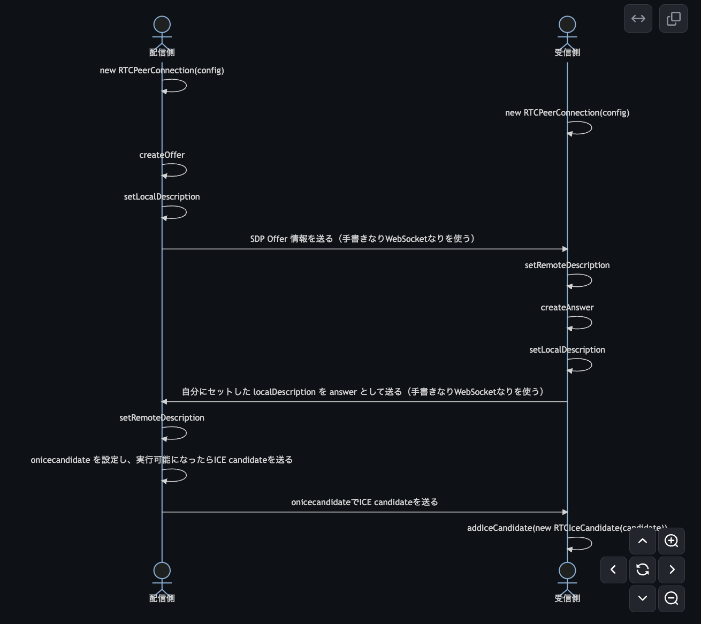

GW なんも予定がなくてブログ書くかソシャゲやるか昼から酒飲むしかやることがないです。だから予定があったら使っていたであろうお金でソシャゲに課金したらめちゃくちゃ強くなりました。やったー。友達にはドン引きされましたが、GW に予定がある人よりかは節約できていると思います。そんなソシャゲもやることなくなって暇なので酒飲みながらブログを書きます。今日は WebRTC です。

## 免責

筆者は RFC を読んでいません。これは「そもそも WebRTC それ自体 の RFC なんてものは存在しないもんね〜」という意味でなく、ICE や SDP の RFC すら読んでいないという意味です。そのため WebRTC そのものの解説として読むと良くない表現が含まれるかもしれません。ただし自分が WebRTC でカメラ映像を送る実装を動作させ、そのコードの解説という点では間違ったことは書いていないはずです。動作するコードがあるためです。なので「とりあえず動くものを作りたいけど、どういう仕組みなのか分からない」という方向けの記事です。厳密な理解をしたい方は代わりに RFC はじめ [IETF](https://www.rfc-editor.org/) や [W3C](https://www.w3.org/TR/webrtc/) のドキュメントを読んでください。

あとさらに免責事項(a.k.a 言い訳)を書くと、私は WebRTC 周りのコードはまだ書き始めて 3 週間目くらいです。専門家ではないのを承知して読んでいただけると助かります。ネットワークスペシャリスト試験にも落ちています。でも勉強は頑張ったのでちょっとだけネットワークのこと分かります。嘘です。分かりません。あといまお酒が入っています。

## ソースコード

実装したコードは <https://github.com/ojisan-toybox/webrtc-minimal-impl> です。

別ページ間で通信できるようになっています。

- https://ojisan-toybox.github.io/webrtc-minimal-impl/sender
- https://ojisan-toybox.github.io/webrtc-minimal-impl/receiver

ピアリングに使う情報は console.log に出しています。ピアリングの具体的な手順について詳しくはこのブログを読み進めてください。

## WebRTC でビデオ配信するときの最小構成を考える

WebRTC な要件が発生したので最近勉強を始めました。そのとき適当にググったりしていると WebSocket, それも socket.io を使っている例をよく見かけました。実際のところ実務で使うならそうなるのは納得できたましたが、 "WebRTC でカメラ映像を送るだけの最小実装" を作るにあたっては余計なものがたくさんあって参考にしにくいなと思いました。ピアリングするに当たって Web Socket を使うと便利なものの、ピアリングは手動でもできますし、それが最小実装だと思います。しかし学び始めのころはそのようなことが理解できなかったです。そこで WebRTC の最小実装を作りながら WebRTC がどういう仕組みで繋がるか理解できるものを書きたいと思い、筆を取りました。

ちなみに WebSocket については WebSocket そのものを自作して学べるブログを 2 年くらい前に書いたのでぜひ読んでみてください。

FYI: <https://blog.ojisan.io/rust-websocket/>

今だからいうのですがこの OGP は うぇ〜ぶソケットという意味です。いかがでしたか。

## 類似の取り組みについて

この執筆のアイデアを実現するために色々調べていると、すでにこのようなことはされていました。ガーン 😨

- https://html5experts.jp/mganeko/19814/
- https://www.cyberowl.co.jp/blog/technology/331

しかし当時はブラウザの実装がまだ不十分でワークアラウンドをしていたり 2023 年向けのコードではないことや、手元で動かせるソースコードそのものを提供することや自分にはもっと簡潔に書けるアイデアがあるという点で自分にも書けるところがあると判断したので書きます。

ここでいう簡潔に書けるアイデアとは window.prompt を使って SDP, ICE を交換することで、手動ピアリングを実現するための余計な UI やフォーム実装を消すことでより WebRTC の部分だけに注目できるように書くことです。

それでは実装していきましょう。

## 最小実装の要件

Sender と Receiver がいて Sender が Receiver に、PC のカメラ映像を送る実装を作ります。

## シーケンス図

ブラウザ間で P2P するためには

- rfc8124 [SDP](https://datatracker.ietf.org/doc/html/rfc8124) でセッションを確立するための IP アドレスやポート番号を交換する
- rfc8445 [ICE](https://www.rfc-editor.org/rfc/rfc8445) でどのような通信経路が使えるかをお互いに確認しあって、通信経路を決める

という手順が必要です。このような交換を経て peer to peer 通信ができるようになるので、これらの手順はピアリングと呼ばれます。（と呼ばれているのをよく目にします）

そのためには JS の世界でこのようなことをします。

```
sequenceDiagram
    actor 配信側
    actor 受信側
    配信側->>配信側: new RTCPeerConnection(config)
    受信側->>受信側: new RTCPeerConnection(config)
    配信側->>配信側: createOffer
    配信側->>配信側: setLocalDescription
    配信側->>受信側: SDP Offer 情報を送る（手書きなりWebSocketなりを使う）
    受信側->>受信側: setRemoteDescription
    受信側->>受信側: createAnswer
    受信側->>受信側: setLocalDescription
    受信側->>配信側: 自分にセットした localDescription を answer として送る（手書きなりWebSocketなりを使う）
    配信側->>配信側: setRemoteDescription
    配信側->>配信側: onicecandidate を設定し、実行可能になったらICE candidateを送る
    受信側->>受信側: onicecandidate を設定、実行可能になったらICE candidateを送る
    配信側->>受信側: onicecandidateでICE candidateを送る
    受信側->>受信側: addIceCandidate(new RTCIceCandidate(candidate))
```

(onicecandidate はイベント駆動だったり、ところどころ非同期な処理があるので上から順に実行されているわけではないことに注意。)

このブログは Mermaid 記法対応なんてものがないので、これを GitHub Issue や Notion に貼り付けて見てみよう。



## connection を作る

WebRTC の中心となるオブジェクトは RTCPeerConnection インスタンスです。これは sender/receiver 双方に作られます。

```js
const senderConnection = new RTCPeerConnection();
```

## 最小実装には不要な RTCConfiguration

今回はいらないのですがおそらく実務だと

```js
const senderConnection = new RTCPeerConnection({
  iceServers: [
    {
      urls: "stun:stun.l.google.com:19302",
    },
  ],
});
```

のような設定をするはずです。

FYI: https://developer.mozilla.org/ja/docs/Web/API/RTCPeerConnection/RTCPeerConnection

ここで ICE や STUN といったものが出てきます。同一マシンで p2p する今回の例では要らないのですが、普通は別マシンで p2p するはずなので少しだけ言及します。最小実装だけに興味がある方は読み飛ばしてください。

### RTCConfiguration がなくても ICE で経路情報を交換する

WebRTC は peer to peer の通信です。そのため通信者それぞれが持つ RTCPeerConnection はクラサバに依存せずに相手と通信するための情報を知る必要があります。早い話が相手側の IP アドレス を知る必要があります。その経路情報交換のプロトコルが ICE です。

### 相手側の IP アドレスが分からないのなら STUN サーバーを介す

さて、大抵の場合はネットワーク上では public IP を持ったルーターのようなものがあり、各デバイスはそのルーターの向こう側にいて public IP ではなく private IP しか持っていません。つまり p2p しようにも相手側の IP アドレスが分からないということが起きます。それを解決するのが STUN サーバーで、NAT と呼ばれる技術を用いて private IP アドレスと public IP アドレスを変換できるようにします。これはよく NAT 超えとも呼ばれます。

### STUN でも分からないなら TURN を使う

ただ企業などにあるような強いファイワーウォールの向こう側に相手がいる場合は STUN で超えれない場合があります。そのときのフォールバックで使える対処法が TURN サーバーを使う方法です。

Wikipedia に詳しく書いてあるのでこちらを読んでください。

FYI: https://ja.wikipedia.org/wiki/TURN

(唐突な丸投げかと思われそうだけど、明らかに最小実装には不要なので・・・)

### ローカルホストで動かしているので RTCConfiguration も STUN も要らない

いま送受信共に同一ローカルホストで行っており、お互いの IP アドレスはわかっているので RTCConfiguration はいらないです。ただしデプロイするならば設定が必要となるでしょう。

そのときは Google の STUN サーバーを使えるのでそれを使うと良いです。

```js
const senderConnection = new RTCPeerConnection({
  iceServers: [
    {
      urls: "stun:stun.l.google.com:19302",
    },
  ],
});
```

他にも無料で使える STUN サーバー一覧を公開している人もいるのでこちらも読んでみてください。iceServers と複数形であることからフォールバックができます。

FYI: https://gist.github.com/mondain/b0ec1cf5f60ae726202e

(安全なのか安定しているかは知らないので自己責任で)

## まずカメラ映像を Sender 側のページに映してみる

最小要件は WebRTC での通信ではなくカメラ映像の配信なのでまずは先にカメラだけ作ってしまおう。

```html
<video id="video" autoplay></video>
```

```js
const videoEl = document.getElementById("video");

if (videoEl === null || !(videoEl instanceof HTMLVideoElement))
  throw new Error("要素作りミス");

navigator.mediaDevices
  .getUserMedia({ video: true, audio: false })
  .then((stream) => {
    videoEl.srcObject = stream;
  });
```

音声も送る時は audio は true にしてください。これを true にすると今書きながら流してる Youtube の音声が止まってしまうので false にしています。。。

## 送信側の SDP を出力する

さて、SDP の交換をしましょう。rfc4566 [SDP](https://www.rfc-editor.org/rfc/rfc4566) は Session Description Protocol の略で、平たく言うと WebRTC で送るものに関する情報を伝えるためのプロトコルです。例えば、

```json
{
  "type": "offer",
  "sdp": "v=0\r\no=- 5343459361861847940 2 IN IP4 127.0.0.1\r\ns=-\r\nt=0 0\r\na=group:BUNDLE 0\r\na=extmap-allow-mixed\r\na=msid-semantic: WMS dc1e8ea1-2293-4f6a-9169-0ef159f5ccef\r\nm=video 9 UDP/TLS/RTP/SAVPF 96 97 102 103 104 105 106 107 108 109 127 125 39 40 45 46 98 99 100 101 112 113 114 115 116\r\nc=IN IP4 0.0.0.0\r\na=rtcp:9 IN IP4 0.0.0.0\r\na=ice-ufrag:yBfi\r\na=ice-pwd:LvaRupdgvp8V2RlGxE3EgfNY\r\na=ice-options:trickle\r\na=fingerprint:sha-256 BD:FC:0C:FC:2E:04:B4:57:F4:C1:06:AA:91:79:22:18:F8:E1:D3:C2:28:CF:39:B6:59:F0:13:D0:9D:C7:84:EF\r\na=setup:actpass\r\na=mid:0\r\na=extmap:1 urn:ietf:params:rtp-hdrext:toffset\r\na=extmap:2 http://www.webrtc.org/experiments/rtp-hdrext/abs-send-time\r\na=extmap:3 urn:3gpp:video-orientation\r\na=extmap:4 http://www.ietf.org/id/draft-holmer-rmcat-transport-wide-cc-extensions-01\r\na=extmap:5 http://www.webrtc.org/experiments/rtp-hdrext/playout-delay\r\na=extmap:6 http://www.webrtc.org/experiments/rtp-hdrext/video-content-type\r\na=extmap:7 http://www.webrtc.org/experiments/rtp-hdrext/video-timing\r\na=extmap:8 http://www.webrtc.org/experiments/rtp-hdrext/color-space\r\na=extmap:9 urn:ietf:params:rtp-hdrext:sdes:mid\r\na=extmap:10 urn:ietf:params:rtp-hdrext:sdes:rtp-stream-id\r\na=extmap:11 urn:ietf:params:rtp-hdrext:sdes:repaired-rtp-stream-id\r\na=sendrecv\r\na=msid:dc1e8ea1-2293-4f6a-9169-0ef159f5ccef 9d00e02d-9071-4465-8d92-2410b3803758\r\na=rtcp-mux\r\na=rtcp-rsize\r\na=rtpmap:96 VP8/90000\r\na=rtcp-fb:96 goog-remb\r\na=rtcp-fb:96 transport-cc\r\na=rtcp-fb:96 ccm fir\r\na=rtcp-fb:96 nack\r\na=rtcp-fb:96 nack pli\r\na=rtpmap:97 rtx/90000\r\na=fmtp:97 apt=96\r\na=rtpmap:102 H264/90000\r\na=rtcp-fb:102 goog-remb\r\na=rtcp-fb:102 transport-cc\r\na=rtcp-fb:102 ccm fir\r\na=rtcp-fb:102 nack\r\na=rtcp-fb:102 nack pli\r\na=fmtp:102 level-asymmetry-allowed=1;packetization-mode=1;profile-level-id=42001f\r\na=rtpmap:103 rtx/90000\r\na=fmtp:103 apt=102\r\na=rtpmap:104 H264/90000\r\na=rtcp-fb:104 goog-remb\r\na=rtcp-fb:104 transport-cc\r\na=rtcp-fb:104 ccm fir\r\na=rtcp-fb:104 nack\r\na=rtcp-fb:104 nack pli\r\na=fmtp:104 level-asymmetry-allowed=1;packetization-mode=0;profile-level-id=42001f\r\na=rtpmap:105 rtx/90000\r\na=fmtp:105 apt=104\r\na=rtpmap:106 H264/90000\r\na=rtcp-fb:106 goog-remb\r\na=rtcp-fb:106 transport-cc\r\na=rtcp-fb:106 ccm fir\r\na=rtcp-fb:106 nack\r\na=rtcp-fb:106 nack pli\r\na=fmtp:106 level-asymmetry-allowed=1;packetization-mode=1;profile-level-id=42e01f\r\na=rtpmap:107 rtx/90000\r\na=fmtp:107 apt=106\r\na=rtpmap:108 H264/90000\r\na=rtcp-fb:108 goog-remb\r\na=rtcp-fb:108 transport-cc\r\na=rtcp-fb:108 ccm fir\r\na=rtcp-fb:108 nack\r\na=rtcp-fb:108 nack pli\r\na=fmtp:108 level-asymmetry-allowed=1;packetization-mode=0;profile-level-id=42e01f\r\na=rtpmap:109 rtx/90000\r\na=fmtp:109 apt=108\r\na=rtpmap:127 H264/90000\r\na=rtcp-fb:127 goog-remb\r\na=rtcp-fb:127 transport-cc\r\na=rtcp-fb:127 ccm fir\r\na=rtcp-fb:127 nack\r\na=rtcp-fb:127 nack pli\r\na=fmtp:127 level-asymmetry-allowed=1;packetization-mode=1;profile-level-id=4d001f\r\na=rtpmap:125 rtx/90000\r\na=fmtp:125 apt=127\r\na=rtpmap:39 H264/90000\r\na=rtcp-fb:39 goog-remb\r\na=rtcp-fb:39 transport-cc\r\na=rtcp-fb:39 ccm fir\r\na=rtcp-fb:39 nack\r\na=rtcp-fb:39 nack pli\r\na=fmtp:39 level-asymmetry-allowed=1;packetization-mode=0;profile-level-id=4d001f\r\na=rtpmap:40 rtx/90000\r\na=fmtp:40 apt=39\r\na=rtpmap:45 AV1/90000\r\na=rtcp-fb:45 goog-remb\r\na=rtcp-fb:45 transport-cc\r\na=rtcp-fb:45 ccm fir\r\na=rtcp-fb:45 nack\r\na=rtcp-fb:45 nack pli\r\na=rtpmap:46 rtx/90000\r\na=fmtp:46 apt=45\r\na=rtpmap:98 VP9/90000\r\na=rtcp-fb:98 goog-remb\r\na=rtcp-fb:98 transport-cc\r\na=rtcp-fb:98 ccm fir\r\na=rtcp-fb:98 nack\r\na=rtcp-fb:98 nack pli\r\na=fmtp:98 profile-id=0\r\na=rtpmap:99 rtx/90000\r\na=fmtp:99 apt=98\r\na=rtpmap:100 VP9/90000\r\na=rtcp-fb:100 goog-remb\r\na=rtcp-fb:100 transport-cc\r\na=rtcp-fb:100 ccm fir\r\na=rtcp-fb:100 nack\r\na=rtcp-fb:100 nack pli\r\na=fmtp:100 profile-id=2\r\na=rtpmap:101 rtx/90000\r\na=fmtp:101 apt=100\r\na=rtpmap:112 H264/90000\r\na=rtcp-fb:112 goog-remb\r\na=rtcp-fb:112 transport-cc\r\na=rtcp-fb:112 ccm fir\r\na=rtcp-fb:112 nack\r\na=rtcp-fb:112 nack pli\r\na=fmtp:112 level-asymmetry-allowed=1;packetization-mode=1;profile-level-id=64001f\r\na=rtpmap:113 rtx/90000\r\na=fmtp:113 apt=112\r\na=rtpmap:114 red/90000\r\na=rtpmap:115 rtx/90000\r\na=fmtp:115 apt=114\r\na=rtpmap:116 ulpfec/90000\r\na=ssrc-group:FID 3641398228 4263953922\r\na=ssrc:3641398228 cname:sZuOCrGdAnZbu8Du\r\na=ssrc:3641398228 msid:dc1e8ea1-2293-4f6a-9169-0ef159f5ccef 9d00e02d-9071-4465-8d92-2410b3803758\r\na=ssrc:4263953922 cname:sZuOCrGdAnZbu8Du\r\na=ssrc:4263953922 msid:dc1e8ea1-2293-4f6a-9169-0ef159f5ccef 9d00e02d-9071-4465-8d92-2410b3803758\r\n"
}
```

のようなものを送ります。では実装します。まず送信側から私の SDP はこれですというオファーを出したいので自分の description を作り、それを自分自身に `setLocalDescription` でセットします。これを 受信側に入力して登録するためにログに出します。

```js
senderConnection
  .createOffer()
  .then((desc) => {
    return senderConnection.setLocalDescription(desc).then(() => desc);
  })
  .then((desc) => {
    console.log(JSON.stringify(senderConnection.localDescription));
    alert(
      `sender の sdp offer を log に出力したので sender に入力してください。`
    );
    return desc;
  });
```

その結果が

```json
{
  "type": "offer",
  "sdp": "v=0\r\no=- 8643184976411262458 2 IN IP4 127.0.0.1\r\ns=-\r\nt=0 0\r\na=extmap-allow-mixed\r\na=msid-semantic: WMS\r\n"
}
```

なのですが、最初に挙げた例と比べて全然情報が少ないです。（最初の例は見切れているかもなのでコードブロックで横スクロールしてみてください）

これはカメラを使うと言う情報が含まれていないためです。つまりカメラを使うことを senderConnection に伝えた後で createOffer すべきで

```js
navigator.mediaDevices
  .getUserMedia({ video: true, audio: false })
  .then((stream) => {
    videoEl.srcObject = stream;
    stream.getTracks().forEach((track) => {
      senderConnection.addTrack(track, stream);
    });
    return senderConnection.createOffer();
  })
  .then((desc) => {
    return senderConnection.setLocalDescription(desc).then(() => desc);
  })
  .then((desc) => {
    console.log(JSON.stringify(senderConnection.localDescription));
    alert(
      `sender の sdp offer を log に出力したので receiver に入力してください。`
    );
    return desc;
  });
```

とします。このコードで自分自身の SDP を RTCPeerConnection に登録し、ログに出しました。では SDP 交換のためにその値を 受信側に登録し、受信側の SDP Description を出力してそれを送信側に出しましょう。

## (余談 1) window.prompt

ここでは入力フォームを使わずに window.prompt を使います。これは

```js
const offer = window.prompt(
  "sender 側から送られてくる SDP offer を入力してください"
);
```

のようにして使え、入力値を変数に入れられます。


この仕組みを使って SDP / ICE 交換をし、ピアリングを行います。

## 送信側の SDP を受信側に登録し、受信側の SDP を送信側に登録して SDP 交換を完了させる

受信側では

```js
const viewerConnection = new RTCPeerConnection();

// SDP の設定
const offer = window.prompt(
  "sender 側から送られてくる SDP offer を入力してください"
);

if (!offer) {
  throw new Error("offerがないのは不正です");
}

viewerConnection
  .setRemoteDescription(JSON.parse(offer))
  .then(() => {
    return viewerConnection.createAnswer();
  })
  .then((answer) => {
    return viewerConnection.setLocalDescription(answer);
  })
  .then(() => {
    console.log(JSON.stringify(viewerConnection.localDescription));
    alert(
      "viewer の SDP answer を log に出力しました。これを viewer の SDP description として sender 側に入力してください。"
    );
    console.log("success sdp, peer:", viewerConnection);
  });
```

とします。

sender の offer description を受け取ったら、あとは sender でやったように相手の description を setRemoteDescription で登録して、自分の description を setLocalDescription して相手側に送り返します（ログに出力して手書きさせます）。このときの相違点は `createOffer` ではなく `createAnswer` しているところです。offer に対する answer を作るためです。この answer は

```json
{
  "type": "answer",
  "sdp": "v=0\r\no=- 7902023734838559078 2 IN IP4 127.0.0.1\r\ns=-\r\nt=0 0\r\na=group:BUNDLE 0\r\na=extmap-allow-mixed\r\na=msid-semantic: WMS\r\nm=video 9 UDP/TLS/RTP/SAVPF 96 97 102 103 104 105 106 107 108 109 127 125 39 40 45 46 98 99 100 101 112 113 114 115 116\r\nc=IN IP4 0.0.0.0\r\na=rtcp:9 IN IP4 0.0.0.0\r\na=ice-ufrag:evqg\r\na=ice-pwd:GQoUZ+bjCHtwHGhVP3Rla7Ng\r\na=ice-options:trickle\r\na=fingerprint:sha-256 4C:0C:0F:3B:ED:7C:D2:F1:96:2A:4D:20:43:5C:58:64:13:30:02:4F:5A:DC:05:DE:6C:84:D3:8D:79:21:77:F3\r\na=setup:active\r\na=mid:0\r\na=extmap:1 urn:ietf:params:rtp-hdrext:toffset\r\na=extmap:2 http://www.webrtc.org/experiments/rtp-hdrext/abs-send-time\r\na=extmap:3 urn:3gpp:video-orientation\r\na=extmap:4 http://www.ietf.org/id/draft-holmer-rmcat-transport-wide-cc-extensions-01\r\na=extmap:5 http://www.webrtc.org/experiments/rtp-hdrext/playout-delay\r\na=extmap:6 http://www.webrtc.org/experiments/rtp-hdrext/video-content-type\r\na=extmap:7 http://www.webrtc.org/experiments/rtp-hdrext/video-timing\r\na=extmap:8 http://www.webrtc.org/experiments/rtp-hdrext/color-space\r\na=extmap:9 urn:ietf:params:rtp-hdrext:sdes:mid\r\na=extmap:10 urn:ietf:params:rtp-hdrext:sdes:rtp-stream-id\r\na=extmap:11 urn:ietf:params:rtp-hdrext:sdes:repaired-rtp-stream-id\r\na=recvonly\r\na=rtcp-mux\r\na=rtcp-rsize\r\na=rtpmap:96 VP8/90000\r\na=rtcp-fb:96 goog-remb\r\na=rtcp-fb:96 transport-cc\r\na=rtcp-fb:96 ccm fir\r\na=rtcp-fb:96 nack\r\na=rtcp-fb:96 nack pli\r\na=rtpmap:97 rtx/90000\r\na=fmtp:97 apt=96\r\na=rtpmap:102 H264/90000\r\na=rtcp-fb:102 goog-remb\r\na=rtcp-fb:102 transport-cc\r\na=rtcp-fb:102 ccm fir\r\na=rtcp-fb:102 nack\r\na=rtcp-fb:102 nack pli\r\na=fmtp:102 level-asymmetry-allowed=1;packetization-mode=1;profile-level-id=42001f\r\na=rtpmap:103 rtx/90000\r\na=fmtp:103 apt=102\r\na=rtpmap:104 H264/90000\r\na=rtcp-fb:104 goog-remb\r\na=rtcp-fb:104 transport-cc\r\na=rtcp-fb:104 ccm fir\r\na=rtcp-fb:104 nack\r\na=rtcp-fb:104 nack pli\r\na=fmtp:104 level-asymmetry-allowed=1;packetization-mode=0;profile-level-id=42001f\r\na=rtpmap:105 rtx/90000\r\na=fmtp:105 apt=104\r\na=rtpmap:106 H264/90000\r\na=rtcp-fb:106 goog-remb\r\na=rtcp-fb:106 transport-cc\r\na=rtcp-fb:106 ccm fir\r\na=rtcp-fb:106 nack\r\na=rtcp-fb:106 nack pli\r\na=fmtp:106 level-asymmetry-allowed=1;packetization-mode=1;profile-level-id=42e01f\r\na=rtpmap:107 rtx/90000\r\na=fmtp:107 apt=106\r\na=rtpmap:108 H264/90000\r\na=rtcp-fb:108 goog-remb\r\na=rtcp-fb:108 transport-cc\r\na=rtcp-fb:108 ccm fir\r\na=rtcp-fb:108 nack\r\na=rtcp-fb:108 nack pli\r\na=fmtp:108 level-asymmetry-allowed=1;packetization-mode=0;profile-level-id=42e01f\r\na=rtpmap:109 rtx/90000\r\na=fmtp:109 apt=108\r\na=rtpmap:127 H264/90000\r\na=rtcp-fb:127 goog-remb\r\na=rtcp-fb:127 transport-cc\r\na=rtcp-fb:127 ccm fir\r\na=rtcp-fb:127 nack\r\na=rtcp-fb:127 nack pli\r\na=fmtp:127 level-asymmetry-allowed=1;packetization-mode=1;profile-level-id=4d001f\r\na=rtpmap:125 rtx/90000\r\na=fmtp:125 apt=127\r\na=rtpmap:39 H264/90000\r\na=rtcp-fb:39 goog-remb\r\na=rtcp-fb:39 transport-cc\r\na=rtcp-fb:39 ccm fir\r\na=rtcp-fb:39 nack\r\na=rtcp-fb:39 nack pli\r\na=fmtp:39 level-asymmetry-allowed=1;packetization-mode=0;profile-level-id=4d001f\r\na=rtpmap:40 rtx/90000\r\na=fmtp:40 apt=39\r\na=rtpmap:45 AV1/90000\r\na=rtcp-fb:45 goog-remb\r\na=rtcp-fb:45 transport-cc\r\na=rtcp-fb:45 ccm fir\r\na=rtcp-fb:45 nack\r\na=rtcp-fb:45 nack pli\r\na=rtpmap:46 rtx/90000\r\na=fmtp:46 apt=45\r\na=rtpmap:98 VP9/90000\r\na=rtcp-fb:98 goog-remb\r\na=rtcp-fb:98 transport-cc\r\na=rtcp-fb:98 ccm fir\r\na=rtcp-fb:98 nack\r\na=rtcp-fb:98 nack pli\r\na=fmtp:98 profile-id=0\r\na=rtpmap:99 rtx/90000\r\na=fmtp:99 apt=98\r\na=rtpmap:100 VP9/90000\r\na=rtcp-fb:100 goog-remb\r\na=rtcp-fb:100 transport-cc\r\na=rtcp-fb:100 ccm fir\r\na=rtcp-fb:100 nack\r\na=rtcp-fb:100 nack pli\r\na=fmtp:100 profile-id=2\r\na=rtpmap:101 rtx/90000\r\na=fmtp:101 apt=100\r\na=rtpmap:112 H264/90000\r\na=rtcp-fb:112 goog-remb\r\na=rtcp-fb:112 transport-cc\r\na=rtcp-fb:112 ccm fir\r\na=rtcp-fb:112 nack\r\na=rtcp-fb:112 nack pli\r\na=fmtp:112 level-asymmetry-allowed=1;packetization-mode=1;profile-level-id=64001f\r\na=rtpmap:113 rtx/90000\r\na=fmtp:113 apt=112\r\na=rtpmap:114 red/90000\r\na=rtpmap:115 rtx/90000\r\na=fmtp:115 apt=114\r\na=rtpmap:116 ulpfec/90000\r\n"
}
```

となっています。type が offer ではなく answer となっています。

そして sender では receiver の answer SDP description を受け取ります。

```js
navigator.mediaDevices
  .getUserMedia({ video: true, audio: false })
  .then((stream) => {
    videoEl.srcObject = stream;
    stream.getTracks().forEach((track) => {
      senderConnection.addTrack(track, stream);
    });
    return senderConnection.createOffer();
  })
  .then((desc) => {
    return senderConnection.setLocalDescription(desc).then(() => desc);
  })
  .then((desc) => {
    console.log(JSON.stringify(senderConnection.localDescription));
    alert(
      `sender の sdp offer を log に出力したので receiver に入力してください。`
    );
    return desc;
  })
  .then(() => {
    const receiverAnswer = window.prompt(
      "receiver の SDP answer description を入力してください。"
    );
    return senderConnection.setRemoteDescription(JSON.parse(receiverAnswer));
    console.log("success sdp, peer:", senderConnection);
  });
```

イベントドリブンに書くとコードが複雑になるので setLocalDescription の続きで window.prompt を使ってコードの進行を止めておき、answer を作ってからコードを進めるようにします。

## ICE を交換する

### onicecandidate から 経路を出力する

さて上のコードで SDP を使ったメディア情報の交換が完了しました。次は経路情報に関する交換です。実は送信側で setLocalDescription をすると RTCPeerConnection オブジェクトの `onicecandidate` が発火するので、その関数を利用します。

```js
senderConnection.onicecandidate = (e) => {
  if (!e.candidate) {
    // 自分(Sender) の ICE を出力する
    console.log(JSON.stringify(candidates));
    alert(
      `sender の ice candidate はこちらです。receiver 側に入力してください。}`
    );
    return;
  }
  candidates.push(e.candidate);
};
```

経路情報の candidate は複数取りうります。そのため onicecandidate は何度も発火します。なので上記のコードの意図は発火が止まるまで保持し、発火が止まったら出力するようにしています。発火が止まると e.candidate には falsy な値が入ります。（型情報上は null なんだけど undefined が入ってきてよく分からん）

そしてこの値を receiver 側に入力します。これもイベントドリブンにするのはコードが複雑になるので createAnswer したときのコードを window.prompt で止めておき、そこから入力して再生させる形で進めます。receiver 側では sender 側から送られてきた candidate を addIceCandidate を使って RTCPeerConnection に全部登録します。

```js
viewerConnection
  .setRemoteDescription(JSON.parse(offer))
  .then(() => {
    return viewerConnection.createAnswer();
  })
  .then((answer) => {
    return viewerConnection.setLocalDescription(answer);
  })
  .then(() => {
    console.log(JSON.stringify(viewerConnection.localDescription));
    alert(
      "viewer の SDP answer を log に出力しました。これを viewer の SDP description として sender 側に入力してください。"
    );
  })
  .then(() => {
    const senderIceStr = window.prompt(
      "sender が提示するICEを入力してください"
    );
    if (!senderIceStr) {
      throw new Error("sdpAnswer がないのは不正です");
    }

    /**
     * ICE Candidatesを受け取る
     * @type {RTCIceCandidateInit[]}
     */
    const senderCandidates = JSON.parse(senderIceStr);
    senderCandidates.forEach((candidate) => {
      if (candidate === null) return;
      viewerConnection.addIceCandidate(candidate).catch((e) => {
        console.error("Sender addIceCandidate error", e);
      });
    });
  });
```

### ICE が終わると RTCPeerConnection の onTrack でメディアストリームを取得できる

ICE が完了すると RTCPeerConnection の onTrack が発火するので、そのタイミングで映像を video 要素に送るようにしましょう。

sender 側ではすでに

```js
navigator.mediaDevices
  .getUserMedia({ video: true, audio: false })
  .then((stream) => {
    videoEl.srcObject = stream;
    stream.getTracks().forEach((track) => {
      senderConnection.addTrack(track, stream);
    });
    return senderConnection.createOffer();
  });
```

として埋め込んでいます。SDP にメディア情報を入れたかったからです。

これを receiver で

```js
const videoEl = document.getElementById("video-el");

if (videoEl === null || !(videoEl instanceof HTMLVideoElement))
  throw new Error("あるはず");

viewerConnection.ontrack = (e) => {
  const stream = event.streams[0];
  if (stream === undefined) {
    console.error("stream not found");
    throw new Error("");
  }

  videoEl.srcObject = stream;
};
```

として受け取ります。

## (余談 2) addTrack しないと onicecandidate が発火しないが、無理やりに発火させられる

さて、onicecandidate は MDN 上は

> An icecandidate event is sent to an RTCPeerConnection when an RTCIceCandidate has been identified and added to the local peer by a call to RTCPeerConnection.setLocalDescription().

とあり、setLocalDescription すれば発火してくれそうですが、僕の手元では addTrack しないと発火しませんでした。

実はそれが原因ですごい時間を溶かしていたのですが WebRTC の専門家、というより Web の専門家な人に聞いてみたところ

> SDP って、どういうメディアをやりとりするか、の description だから、 addStream/Track しないと中身がないはず。

とのことでした。つまり setLocalDescription しても必要な情報が入っていないから onicecandidate が発火しないようでした。苦戦した挙句に使っていた work around が余計な data channel を作ると言うものがあり、

FYI: https://stackoverflow.com/questions/56311461/webrtc-onicecandidate-never-fires-in-chrome

これが動いていたのもそういう理由のようです。

## 完成〜！

そうすると Sender からの映像が映りました。


リーナベルかわいい！！！

## おわりに

[崩壊スターレイル](https://hsr.hoyoverse.com/ja-jp/home) 面白いよ
