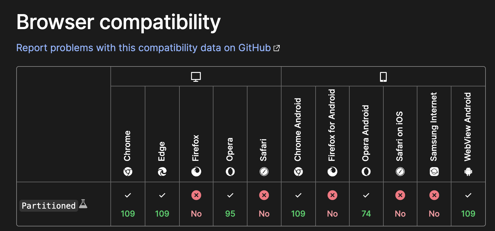

簡単な開発をしたいときにちょっとだけ Cookie を使いたいときがあると思う。私は日頃から Web 標準な何かをするときはライブラリを使うことに抵抗があり、Cookie 周りの操作もライブラリを使わずにやりたい。が、そんなちょっとカッコ良い発言をしている裏で、私はこっそり「Cookie 付けるのってどうするんだっけ？」「Cookie のフォーマットってどんなんだっけ？」といつも Google で調べている。もちろん Set-Cookie くらいは覚えているが、「順番は？どういうデリミタで？どういうパーサーが必要で？」というのは結構忘れているし、意外と皆さんもすっとは出てこないのではないだろうか。あ、私だけですか、すみません。。。と、私は毎回調べているが、毎回調べるのはめんどくさいのでメモを書いておこうと思う。

OGP は クッキーに見せかけた空気だ。「こいつ最近 OGP でふざけてるし、どうせクッキーの画像を OGP にしてるんでしょ」という予想を裏切れたと思う。

## Cookie とは

Cookie は RFC 6265 [HTTP State Management Mechanism](https://datatracker.ietf.org/doc/html/rfc6265) で定義されている。

冒頭に

> This document defines the HTTP Cookie and Set-Cookie header fields. These header fields can be used by HTTP servers to store state (called cookies) at HTTP user agents, letting the servers maintain a stateful session over the mostly stateless HTTP protocol.

とある通り、HTTP は stateless だがそれを Cookie は stateful に扱えるような仕組みを提供する。簡単にいうとあるリクエストで認証したけど次のリクエストではその認証した事実をサーバーもブラウザも覚えていないから、それを覚えられるようにできるものだ。きっとなんらかの JWT を埋め込んだり取り出した経験はあると思う。これはだいたいサーバーのフレームワークで res.setCookie のようなメソッドが生えているのでそれを使って何かを埋め込むのも見覚えがあるだろう。

## サーバーがブラウザに Cookie をセットする

そしてその Cookie のセットは、FW に頼らずとも Web 標準な機能としてある。それも先ほどの [HTTP State Management Mechanism](https://datatracker.ietf.org/doc/html/rfc6265) で定義されており、

> The Set-Cookie HTTP response header is used to send cookies from the server to the user agent.

とあるように、Response Header に Set-Cookie 付けることで実現できる。

### 文法

RFC では ABNF が

```
 set-cookie-header = "Set-Cookie:" SP set-cookie-string
 set-cookie-string = cookie-pair *( ";" SP cookie-av )
 cookie-pair       = cookie-name "=" cookie-value
 cookie-name       = token
 cookie-value      = *cookie-octet / ( DQUOTE *cookie-octet DQUOTE )
 cookie-octet      = %x21 / %x23-2B / %x2D-3A / %x3C-5B / %x5D-7E
                       ; US-ASCII characters excluding CTLs,
                       ; whitespace DQUOTE, comma, semicolon,
                       ; and backslash
 token             = <token, defined in [RFC2616], Section 2.2>

 cookie-av         = expires-av / max-age-av / domain-av /
                     path-av / secure-av / httponly-av /
                     extension-av
 expires-av        = "Expires=" sane-cookie-date
 sane-cookie-date  = <rfc1123-date, defined in [RFC2616], Section 3.3.1>
 max-age-av        = "Max-Age=" non-zero-digit *DIGIT
                       ; In practice, both expires-av and max-age-av
                       ; are limited to dates representable by the
                       ; user agent.
 non-zero-digit    = %x31-39
                       ; digits 1 through 9
 domain-av         = "Domain=" domain-value
 domain-value      = <subdomain>
                       ; defined in [RFC1034], Section 3.5, as
                       ; enhanced by [RFC1123], Section 2.1
 path-av           = "Path=" path-value
 path-value        = <any CHAR except CTLs or ";">
 secure-av         = "Secure"
 httponly-av       = "HttpOnly"
 extension-av      = <any CHAR except CTLs or ";">
```

で与えられている。MDN を見るともう少し人間にわかりやすく書かれているのでそれを確認すると、

```
Set-Cookie: <cookie-name>=<cookie-value>
Set-Cookie: <cookie-name>=<cookie-value>; Domain=<domain-value>
Set-Cookie: <cookie-name>=<cookie-value>; Expires=<date>
Set-Cookie: <cookie-name>=<cookie-value>; HttpOnly
Set-Cookie: <cookie-name>=<cookie-value>; Max-Age=<number>
Set-Cookie: <cookie-name>=<cookie-value>; Partitioned
Set-Cookie: <cookie-name>=<cookie-value>; Path=<path-value>
Set-Cookie: <cookie-name>=<cookie-value>; Secure

Set-Cookie: <cookie-name>=<cookie-value>; SameSite=Strict
Set-Cookie: <cookie-name>=<cookie-value>; SameSite=Lax
Set-Cookie: <cookie-name>=<cookie-value>; SameSite=None; Secure

// Multiple attributes are also possible, for example:
Set-Cookie: <cookie-name>=<cookie-value>; Domain=<domain-value>; Secure; HttpOnly
```

とある。 `key=value; attributes` というのが一般的なようだ。だが色々な種類がある。ただ、とはいってもこの全パターンを覚える必要がないというか、使うことは滅多にないだろうということで、自分用メモに使う表現を書いておく。

- `Set-Cookie: hoge` というレスポンスヘッダーでクッキーを付けられる
- cookie は name と value のペア以外にも Path や Domain や HttpOnly のような属性がある
- 属性は name=value を書いた後に `; `(スペース有)を入れて 属性名=属性値 か値のみを書く
- 属性は複数つけれるのでそれは属性間に `; `(スペース有)を入れて書く

といった感じだろう。

で、どういう属性がつけられるかを RFC を確認したいが、実はこれは [rfc6265bis](https://datatracker.ietf.org/doc/html/draft-ietf-httpbis-rfc6265bis) という改訂版があるのでこちらで確認してみる。そうすると、

- The Expires Attribute
- The Max-Age Attribute
- The Domain Attribute
- The Path Attribute
- The Secure Attribute
- The HttpOnly Attribute
- The SameSite Attribute

が使えるようだ。いまは内容については触れない。RFC もしくは [MDN](https://developer.mozilla.org/en-US/docs/Web/HTTP/Headers/Set-Cookie)を見て欲しい。

あと Chrome では Partitioned Cookie というのも使えるらしい。（これは何も知らないし、使ったこともない）

FYI: <https://developer.chrome.com/ja/docs/privacy-sandbox/chips/>



FYI: <https://developer.mozilla.org/en-US/docs/Web/Privacy/Partitioned_cookies>

### コピペ用の具体例

つまりは、

```
Set-Cookie: ore_no_cookie=ore_no_value; Max-Age=99999 Secure; HttpOnly
```

のようなレスポンスヘッダを付ければいい。

### 複数のクッキーを付けたい

１つの set-cookie でつけれるクッキーは、

```
set-cookie-header = "Set-Cookie:" SP set-cookie-string
set-cookie-string = cookie-pair *( ";" SP cookie-av )
cookie-pair       = cookie-name "=" cookie-value
```

という ABNF を見る限りは１つだ。

では複数の Cookie を付けるにはどうすればいいかというと、複数回 Set-Cookie するのである。

つまりレスポンスヘッダに

```
Set-Cookie: cookie1=value1;
Set-Cookie: cookie2=value2; HttpOnly
Set-Cookie: cookie3=value3; Secure
```

とすればいい。RFC にも

> As shown in the next example, the server can store multiple cookies at the user agent. For example, the server can store a session identifier as well as the user's preferred language by returning two Set-Cookie header fields.

とある。

## ブラウザからの Cookie をサーバーで受け取る

Cookie は何に使うかというとサーバーが別のリクエストでの state を引き継ぐためだ。つまりサーバーは Cookie 文字列から目的となるデータを取り出す必要がある。サーバーが受け取るクッキーはリクエストヘッダに

```
Cookie: cookie1=value1; cookie2=value2
```

という形で含まれる。

RFC 上では [section-4.2](https://datatracker.ietf.org/doc/html/rfc6265#section-4.2) にある。そこでは

> 4.2.1. Syntax
> The user agent sends stored cookies to the origin server in the Cookie header. If the server conforms to the requirements in Section 4.1 (and the user agent conforms to the requirements in Section 5), the user agent will send a Cookie header that conforms to the following grammar

とある。4.1 というのは最初に示した ABNF だ。つまりその ABNF の定義を踏まえて(cookie-pair)ここでされている ABNF

```
cookie-header = "Cookie:" OWS cookie-string OWS
cookie-string = cookie-pair *( ";" SP cookie-pair )
```

を見ると、`Cookie: cookie1=value1; cookie2=value2` という説明であっている。

ここではサーバーが受け取るときは HttpOnly などの Attributes がないことに注意しよう。RFC にも

> Notice that the cookie attributes are not returned.

とある。パースが楽で嬉しい。

なので cookie1=value1; cookie2=value2 のような文字列を受け取ったら、

```js
const keyValuePairs = cookieString.split("; ");

keyValuePairs.forEach((pair) => {
  const [key, value] = pair.split("=");
  console.log(key, value);
});
```

のようにして parse できる。こんな感じで parse できるだろう。

```
❯ node
Welcome to Node.js v18.14.0.
Type ".help" for more information.

> const cookieString = "cookie1=value1; cookie2=value2"
undefined

> const keyValuePairs = cookieString.split("; ");
undefined
>
> keyValuePairs.forEach((pair) => {
...   const [key, value] = pair.split("=");
...   console.log(key, value);
... });

cookie1 value1
cookie2 value2
```

## おわりに

くどくど書いたが、Cookie の使い方は、RFC の [Examples](https://datatracker.ietf.org/doc/html/rfc6265#section-3.1)にある

```
== Server -> User Agent ==

Set-Cookie: SID=31d4d96e407aad42; Path=/; Secure; HttpOnly
Set-Cookie: lang=en-US; Path=/; Domain=example.com

== User Agent -> Server ==

Cookie: SID=31d4d96e407aad42; lang=en-US
```

例が全てを物語っていると思う。迷ったらこれを見るようにすると良さそうだ。
