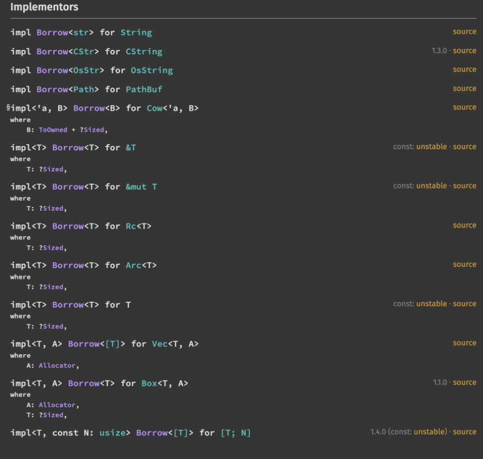

自分のブログを辿ってみたところ [Rust を 2020 年には書いている](https://blog.ojisan.io/rust-buffer-from/)ようだが、初心者を名乗らせていただく。なぜならブログのネタにする以外で Rust 書いたことないし、これも調べながら書いているからだ。もっと練習したい、どこかに Rust を書ける機会ないかな〜ﾁﾗｯﾁﾗｯ 👀

## なぜありふれていそうな題材で書くか

題材はありふれているし解説もたくさんあるが、それらを読んで理解できるのか？という疑問がある。というのも、所有権、借用、ライフタイム自体についての説明は至る所で見るが、これらが無いと何が大変なのか、導入することで何が解決されるかがよく分からないと思うからだ。勿論、そのような点まで解説してくれているものもたくさんあるが、正直なところ Not for Me だった。何が Not for Me だったかというと、C++ の知識やコンピュータサイエンスの知識があることが前提になっている点だ。[世にある Rust の素晴らしい書籍](https://nostarch.com/rust-rustaceans)や記事は、僕のような JavaScript からプログラミングに入って、JavaScript の中で生きている開発者（そしておそらくこのブログの読者の属性は僕と同じそれだと思う）にとっては全く分からない説明だと思う。「参照」なんてものを使ったことはこれまでのキャリアでない。なのでそんな自分の目線で、そんな自分が納得するような説明をしてみようと思う。もちろんこれは自分の理解のためである。ついでに誰かの役に立つと嬉しい。知らんけど。

あと世にある説明が分からなかったと書いたが、TRPL の[所有権の節](https://doc.rust-jp.rs/book-ja/ch04-01-what-is-ownership.html)には結構わかりやすく書かれているし、[language reference](https://doc.rust-lang.org/reference/)もかなり読みやすいので(かくいう自分は全然読めてないが)これは読むべきだ。 これらは僕は最初全く分からなかったが、ただ一通り勉強してから読み直すと、「よく書けているなぁ」という感想になった。なので一周目は難しい気がする（僕の頭が悪いだけだったらすみません…）。

## 免責・謝辞

[Web サーバーアーキテクチャ進化論 2023](https://blog.ojisan.io/server-architecture-2023/) を書いた時と同じく、一応 [@mitama_rs](https://twitter.com/mitama_rs) に見てもらっているので、変なことは書いていないはずだが、変なこと書いていたらすみません。深夜にレビューを押し付けた自分の責任です。

サンプルコードは自分で書いたもの以外は出典を明記しているが、良い例が思いつかなかった箇所は ChatGPT に生成させている。一応出典があるのかは確認したが、もし無断で引用しているものがありそうだったら教えて欲しい。

## なぜ所有権・借用・ライフタイムが必要か

### 逆になぜ JavaScript に 所有権・借用・ライフタイムがなくても俺は困っていなかったのか

JavaScript に 所有権・借用・ライフタイムがない理由は簡単で、「必要ないから」だ。それは GC があるためだ(※所有権に関しては一部 GC とは関係ない部分もあるが、所有権の概念があると GC を不要にできるので混ぜている）。GC は ガベージコレクションの略で、プログラムが利用したメモリ領域を解放する。

GC は馴染みがない人は馴染みがないはずなので、GC がどうして欲しくなるのかをコンピュータの仕組みから超簡単にいい加減な説明をすると、コンピュータの中には CPU とメモリがあり、CPU がメモリに状態を保存しながらプログラムを実行していく。メモリにはスタックとヒープがあり、CPU がプログラムを実行するときはスタックに利用するデータを積み上げていく（レジスタのことは一旦忘れてください）。ここでいうデータとは変数や関数の位置などである。ただスタックは外部から受け取るデータのように、サイズが読みにくいデータは積みにくい。そのためそういったデータを使いたいときはヒープと呼ばれる領域を使って保存し、そのヒープ領域に対するポインタを CPU やスタックで利用することでプログラムから読み書きしている。つまりヒープは動的に確保できる領域だ。使う時は malloc のような（ライブラリ）関数で確保、free で解放できる。ただ毎回人力でこの作業をするのは面倒なので、JavaScript のような言語では GC という仕組みが使われる。GC について後で別の資料に説明を丸投げして一言だけで説明するが、一般的には GC があれば GC によってメモリが管理されるので所有権・借用・ライフタイムはなくても良いのである。

このあたりは [プログラムはなぜ動くのか 第 3 版 知っておきたいプログラミングの基礎知識](https://amzn.asia/d/h3UOqRW) が分かりやすかった記憶がある。

### そもそも参照なんてものがなければ所有権なんていらない

ここで参照について考えるが、参照とは何かの説明は具体例を先に見せた方が早いので説明を後回しにする。
例えば Python で、

```python
a = []
b = a
a.append(1)
```

と書いて実行すると、

```
>>> a
[1]
>>> b
[1]
```

となる。a に append したら b も変わってしまった。

これは a と b が同じ参照を持っているためだ。ここでいう参照とはメモリのアドレス（いい加減に説明すると住所）と見て良い。つまり a も b もメモリ領域の同じ箇所を指しているのである。もし別体として複製したければ、新しくメモリ領域を確保して、そこを使って a と b を区別（異なるアドレスを与える）する必要があった。このような区別を作る方法はクローンやコピーと呼ばれる。

なのでプログラミングをするにあたってはクローンした方が良いように思えるが、参照にもメリットはある。クローンをせずに参照を使うと、メモリ確保が不要になるのでオーバーヘッドやメモリの使用率が減少し、プログラムは効率的になる。たとえばデータを全部クローンして使っているとそれはメモリの無駄使いだ。

### メモリ管理を GC に任せたくない

ただし参照を使うと mutation が波及して困るケースというのはあり、みなさんも経験したこともあるだろう。そのためにクローンを使いたいが、クローンはメモリ領域を確保していくので、クローンしすぎるといつかコンピュータのハードウェア的な限界に行き当たる。そのため使わないメモリ領域は定期的に解放していかないといけない。その解決法として GC がある。

GC の詳しい説明は MS Learn をみて欲しい。いま説明するとそれだけで別の記事になる。

FYI: https://learn.microsoft.com/ja-jp/dotnet/standard/garbage-collection/fundamentals

要するに、定期的にガベージコレクターが不要なメモリ領域を整理してくれる仕組みだ。

これはメモリリークの解消や、メモリの二重開放を防ぐ手になるのだが、GC は（ユーザーから見ると軽微だが、コンピュータから見ると）コストが重いので、可能なら避けたいと思っている人もいる。では、GC を使わずにメモリを管理するとどういう方法があるかを考えてみると、まず思いつくのは手で管理だろう。だがこれは辛い。（逆に GC は手で管理するのを避けるために使われている）

### 手でメモリ管理をすると何が辛いのか

例えば C 言語では人間が手でメモリを管理する。malloc でヒープを確保し、free で解放する。これは一見すると GC しないのでとても良い方法に思える。ただこれは大きな問題があり、使い終わっていないのに free すると無効なメモリ領域を指すポインタ（ダングリングポインタ）を作ってしまったり、解放忘れのメモリが積み重なってメモリリークに繋がったりする。人手でやるためミスがあるだろうし、そのミスもプログラムの停止につながりやすい。

### メモリ管理をコンパイラに任せる

これに対して Rust がとったアプローチがコンパイラにメモリを管理させる方法である。アイデアは RAII と所有権にある

#### RAII

RAII とは Resource Acquisition is Initialization の略で、リソース確保を初期化時に行う。反対にいうとデストラクトのタイミングでリソースの解放を行う。このような初期化と終了時にメモリの確保と解放をするコードをコンパイラが差し込むようにする。これはメモリの人手管理や GC とはまた異なったアプローチであり、コンパイラに頼る方法である。RAII によりメモリリークは防げるようになる。

このときにもライフタイムは生きてくる。RAII は変数が drop したときに free を呼ぶ仕組みとも言える。ライフタイムは変数の生存期間であり、ライフタイムはコンパイラが drop を差し込むための情報にもなっている。（つまりライフタイムは参照だけのものではない）

#### 所有権、参照、ライフタイム

（上でみたように現実にはそうならないような工夫がされているが、）RAII を「スコープの出入りに合わせてメモリの確保・解放を自動でコンパイラが差し込む機能」と解釈するのであれば、まだ利用しているのにその変数が使っているメモリ領域を解放し、ダングリングポインタを使うようなコードをかけてしまう。また RAII は結局メモリを確保するのでエコではない。メモリ負荷は高まる。なので安全に参照を使いたい。そのためにコンパイラで変数の生存範囲を検査し、ダングリングポインタが発生しないように検査する方法を考えたい。そのためのアイデアが所有権と参照とライフタイムにある。

### 安全に参照を使いたい

まず参照は危険という認識が必要である。参照先を書き換えると、そのデータを利用している他の参照にも影響がある。また似た問題にマルチスレッド環境でリソースを同時に複数人が触ると危険というのもある。例えば呼ばれた順序によって結果が変わったり、そのリソースが存在しない可能性がある。そのためあるデータ・リソースの触れる権利や生存範囲というのを気にする必要がある。

Rust はこの権利を管理するために所有権という考えを持ち込む。それはあるデータを触れる権利と思えばよく、その権利の移し替えや権利が正しく使えれてるかのチェックを含む。例えば Rust の = においてはムーブセマンティクスとコピーセマンティクスがある。

例えば文字列を変数に代入した場合、ヒープに保存された文字列の実体の先頭へのアドレスや長さのみが変数に代入されている。この変数に対する = をコピーセマンティクスとして使えば、データの実体ごとヒープに複製して動くがこれはエコではない。なので文字列の先頭への参照と長さだけをコピーするようにする。そのとき、元の変数と新しい変数とで文字列への参照を同時に触れると事故が起きるので、この参照を変数を経由して触れる権利として所有権があり、この所有権を移すための = がムーブセマンティクスだ。Rust の = はデフォルトではムーブセマンティクスだが、その対象が自動で clone する copy という機能を持っていれば、= の意味をコピーセマンティクスとして扱えるようになる。

Rust ではデフォルトでは効率を考慮してコピーを避けている。ヒープにあるデータ(それを指している変数) に対して = を使った場合、移されたものはデータの実態ではなく参照である。そして所有権システムによってその参照を触れる主体を一つだけに限っているのである。

```
let s1 = String::from("hello hello hello hello hello hello");
let s2 = s1;
```

（ちなみに hello hello hello hello hello hello としたのは、短い文字列だと直接アセンブリにリテラルとして埋め込まれてしまうためだ。長い文字列か、標準出力で受け取るか、Box で包むかをしないとヒープに載ってくれない。この挙動は https://godbolt.org/ で遊ぶと試せる。）

そのために = をムーブとして使うことで s1 が持っていたデータに対する 所有権を s2 に移し、s1 を無効化する。その結果

```
let s1 = String::from("hello hello hello hello hello hello"");
let s2 = s1;
println!("{}, world!", s1);
```

は、

```
error[E0382]: use of moved value: `s1`
              (ムーブされた値の使用: `s1`)
 --> src/main.rs:5:28
  |
3 |     let s2 = s1;
  |         -- value moved here
4 |
5 |     println!("{}, world!", s1);
  |                            ^^ value used here after move
  |                               (ムーブ後にここで使用されています)
  |
  = note: move occurs because `s1` has type `std::string::String`, which does
  not implement the `Copy` trait
    (注釈: ムーブが起きたのは、`s1`が`std::string::String`という
    `Copy`トレイトを実装していない型だからです)
```

としてエラーにできるようになる。これがエラーになることで、役目を終えた変数へのアクセスを防いでいる。

Rust の基本的なアイデアとは所有権システムでデータのアクセス権を管理しつつ、参照の生存範囲をみて、無効なアクセスをコンパイラで防ぐことである。その生存範囲のことはライフタイムと呼ばれている。

## ライフタイムとは何か

Rust におけるライフタイムとは変数の生存期間で、ユーザーの目には参照の生存期間として現れる。参照のライフタイムは、よく

```rust
fn main() {
    let x = 5;            // ----------+-- 'b
                          //           |
    let r = &x;           // --+-- 'a  |
                          //   |       |
    println!("r: {}", r); //   |       |
                          // --+       |
}                         // ----------+
```

のように表現される。

https://doc.rust-jp.rs/book-ja/ch10-03-lifetime-syntax.html

ライフタイムは `'a ` のような注釈で表現される。a など文字は、匿名ライフタイム `_` と `static` 以外であればなんでも良い。`' ` があれば良い。ライフタイムは型の一種であり、&i32 という参照にライフタイムを付けるには &'a i32, &'a mut i32 のように使う。これは構造体の定義や関数の引数で使える。
これは明示しなくても

```rust
fn hoge(fuga: &str) {}
```

のように使うことができる。しかし

```rust
struct Hoge {
    hoge: &str,
}
```

はできず、

```rust
struct Hoge<'a> {
    hoge: &'a str,
}
```

としないといけなかったり、

```rust
fn hoge(fuga: &str) {}
```

は可能でも

```rust
fn longest(x: &str, y: &str) -> &str {
    if x.len() > y.len() {
        x
    } else {
        y
    }
}
```

ができず、

```rust
fn longest<'a>(x: &'a str, y: &'a str) -> &'a str {
    if x.len() > y.len() {
        x
    } else {
        y
    }
}
```

としないといけないなどいくつかルールや規則がある。

まず前提として、省略できるのは関数の引数と戻り値のライフタイムだ。そしてそれらの引数と戻り値につくライフタイムを入力ライフタイム、出力ライフタイムと呼ぶのであれば

1. 各入力ライフタイムに対して、それぞれ異なるライフタイムパラメータが割り当てられる
2. 入力ライフタイムが 1 つなら、そのライフタイムがすべての省略された出力ライフタイムに割り当てられる
3. 入力ライフタイムが複数あり、`*self` もしくは `&self` が含まれているメソッドの場合、self\*のライフタイムがすべての省略された出力ライフタイムに割り当てられる

という規則が適用される。

詳しくは https://doc.rust-jp.rs/rust-nomicon-ja/lifetime-elision.html などを見ると良いだろう。

この規則に当てはまらないので

```rust
fn longest(x: &str, y: &str) -> &str {
    if x.len() > y.len() {
        x
    } else {
        y
    }
}
```

はコンパイルエラーとなり、

```rust
fn longest<'a>(x: &'a str, y: &'a str) -> &'a str {
    if x.len() > y.len() {
        x
    } else {
        y
    }
}
```

としないといけない。’a はライフタイムパラメータと呼ばれ、ジェネリクスでありジェネリックライフタイムとも呼ばれる。これが意味するところは、入力と同じ生存範囲のライフタイムを持った参照を戻してくれることだ。ライフタイムがないと if ブロックと else ブロックのどちらが実行されるか分からないので戻り値の型をどうしたらいいか判断できないのである。x と y で違うライフタイムを渡すこともできてしまうので、ライフタイム省略記法が使えないのも理にかなっている。というより無理矢理 ライフタイム適用規則を当てはめると x, y で異なるライフタイムが割当たってしまうので、if の結果がどっちで出力されるか分からなくてコンパイルできない。

ともあれ、ここではライフタイムは変数の有効範囲と思えば良い。

## ライフタイムの計算・検証をどのようにして行うか

ライフタイムは変数の生存期間を表すものだ。これのおかげで無効な参照を見つけることができる。具体的にどのように使われるのか見ていこう。

### ライフタイムの長さをリージョン推論で決める

Rust のライフタイムの決まり方は難しい。普通に考えるのであれば、ブロックのスコープをライフタイムと考えられる。これは Lexical Scope とも呼ばれ、Edition 2015 まではこの考え方だった。
しかし、いまはコードの意味を加味してそのライフタイムの長さが決まり、この仕組みはリージョン推論とも呼ばれる。non-lexical lifetimes（NLL）とも呼ばれ、長い RFC がある。もちろん僕は読んでいない。

<https://rust-lang.github.io/rfcs/2094-nll.html>

この辺りは

- https://blog.rust-lang.org/2018/12/06/Rust-1.31-and-rust-2018.html#non-lexical-lifetimes
- https://qiita.com/_EnumHack/items/8b6ecdeb52e69a4ff384

あたりで解説されているのでこちらを読んで欲しかったり、後者を執筆した [@mitama_rs](https://twitter.com/mitama_rs) に解説してもらいたい。自分でも解説を書こうとしたがところだが僕が Rust を書き始めた時にはすでに NLL だったので 当時の問題点がよく分からなかった。

ただ control-flow graph を使った解析になったとあるので、ソースコードをグラフで表現し後方解析でデータの変化を辿って live variable 解析ができるようになるはずで(って ChatGPT が言ってた)、変数の生存範囲は明確にでき、control-flow graph の導入でライフタイム判定の精度があがるのは直感にも合う。

正直ライフタイムがどのように決まるのか僕には分からないが、Rust はこのライフタイムを使ってプログラムが所有権システムに違反していないかをチェックするのである。そのチェックでは大まかに次のことをする。

### 鉄則１: 寿命の長いものが短いものを参照してはいけない

Rust における所有権の一番のルールは、「生存期間の長いものが、短いものを参照してはいけない」だろう。

```rust
{
        let r;                // ---------+-- 'a
                              //          |
        {                     //          |
            let x = 5;        // -+-- 'b  |
            r = &x;           //  |       |
        }                     // -+       |
                              //          |
        println!("r: {}", r); //          |
    }                         // ---------+
```

<https://doc.rust-jp.rs/book-ja/ch10-03-lifetime-syntax.html>

変数 r の方が長い間生き残っているが、これが x の参照を持っている。これは、コードの実行が x のライフタイム領域を出た時に r が参照してしまうと x が生き残っていなければ無効な参照となるので NG だ。

なので参照する側 r より x のライフタイムを長くする必要がある。

```rust
{
        let x = 5;            // ----------+-- 'b
                              //           |
        let r = &x;           // --+-- 'a  |
                              //   |       |
        println!("r: {}", r); //   |       |
                              // --+       |
    }                         // ----------+
```

### 鉄則２: そのタイミングで、借用が生き残っているものに対して可変参照は作れない

この原則はコードで書くと、

```rust
fn main() {
    let mut data = 42;
    let immutable_ref = &data;
    let mutable_ref = &mut data; // エラー: 借用が生きている間は可変参照を作れない
    dbg!(immutable_ref);
}
```

(ChatGPT で作成)

がエラーになることを指す。もしこれをエラーにしなければ、まさしくデータ競合を引き起こせてしまう。コードを実行するたびに、CPU の状態によって値が変わってしまうようなコードが出来上がる。なので他の主体がデータを参照している間は、そのデータは書き換えてはいけないのである。これが禁じられる嬉しさは DB のロックを想像するとイメージが出るだろう。
なのでこれを解決するためには

```rust
fn main() {
  let mut data = 42;
{
    let immutable_ref = &data;
    dbg!(immutable_ref);
}

let mutable_ref = &mut data;
*mutable_ref += 1;
dbg!(mutable_ref);
}
```

(ChatGPT で作成)

のようにして借用のライフタイムを切ってから可変参照を作ると良い。

### ライフタイムが嬉しくなるのはマルチスレッド環境

と、ここまでライフタイムについて書いたが、私は普通にプログラミングする上ではあまり気にしなくていいと思っている。経験上、ライフタイム周りで困る時は

- マルチスレッド環境
- クロージャー

だと思っている。多くの場合、変数の生存範囲は目視できてしまうので、コンパイルエラーが出てもすぐに修正できると思う。Rust で所有権が難しいという話はそこかしこで聞くが、自分はあまりそうは思っていない。確かに毎日絶対にコンパイルエラーを引き起こしているが、なんだかんだ直せる。コンパイルエラーは毎日出るけど。目視できないフローにだけ注意すればいいと思っている。その例としてマルチスレッドとクロージャーを使うコードを紹介して終わろう。

## 説明のために一旦 Rust の復習

次に所有権と RAII が嬉しくなる場面としてマルチスレッド環境でのプログラミングを紹介するが、その前に必要となる前提知識について書く。これらの概念は TRPL に書かれているので見覚えもあるだろう。知っていたらスルーして大丈夫だ。

### スマートポインタ

まず Arc や Box に代表されるスマートポインタについて説明する。Wikipedia の定義には

> In computer science, a smart pointer is an abstract data type that simulates a pointer while providing added features, such as automatic memory management or bounds checking. Such features are intended to reduce bugs caused by the misuse of pointers, while retaining efficiency. Smart pointers typically keep track of the memory they point to, and may also be used to manage other resources, such as network connections and file handles. Smart pointers were first popularized in the programming language C++ during the first half of the 1990s as rebuttal to criticisms of C++'s lack of automatic garbage collection.

とある。要するに便利な機能を持ったポインタのことで参照カウンタなどのメモリ管理を提供する。

#### deref

Rust ではスマートポインタは deref を実装するのが一般的だ。ポインタなのでその指し示す先に値はあり、その値を取り出すための機能だ。

```rust
pub trait Deref {
    type Target: ?Sized;

    // Required method
    fn deref(&self) -> &Self::Target;
}
```

FYI: https://doc.rust-lang.org/std/ops/trait.Deref.html

どれくらい一般的かというと、Deref はこれらに実装されている。



<https://doc.rust-lang.org/std/ops/trait.Deref.html#implementors>

#### 例: Box

スマートポインタの例として Box を紹介する。
公式には “A pointer type that uniquely owns a heap allocation of type T.” とある。

<https://doc.rust-lang.org/std/boxed/struct.Box.html>

普通ならスタックに置かれる値をヒープにおける機能と言える。Box に入れることで RAII を効かせられるともいえ、スマートポインタのメモリ管理を実現するという役割を全うしているスマートポインタとも言える。あとはクロージャなどを囲って、サイズ不定なものをコンパイルできるようにするためのおまじないとしてもよく使われる。ヒープに置くというのはそういう嬉しさもある。まあ Box を使わない解決策もあるのだが、それについては <https://blog.ojisan.io/rust-dispatch/#dyn-trait-と-impl-trait> を見て欲しい。

### マーカートレイト

Rust のトレイトにマーカートレイトというのがある。

<https://doc.rust-lang.org/core/marker/index.html>

“Primitive traits and types representing basic properties of types.” とあるが何のことかさっぱりだ。ChatGPT に問い合わせたら

> マーカートレイト（Marker Trait）とは、プログラミング言語（特に Rust などのトレイトシステムを持つ言語）において、メソッドや関数を持たない、型に特定の性質や振る舞いを示す目印として使用されるトレイトです。マーカートレイトは、コンパイラに型に関する追加情報を提供することで、コンパイル時に型の制約を強制したり、特定の機能を利用可能にすることができます。

らしい。これはのちに紹介する Send, Sync がこのマーカートレイトに当てはまるので頭の片隅に入れておいて欲しい。

### マルチスレッド

普通にプログラミングしてプログラムを実行すると、それは CPU で実行される。このとき無限ループなどを書くとコードはそこで止まる。しかし CPU は複数コアがあったり、限られたコア数で複数のスレッドを切り替えて実行させることでプログラムを同時に複数実行させるように見せかける仕組みがある。詳しくは [Web サーバーアーキテクチャ進化論 2023](https://blog.ojisan.io/server-architecture-2023/) に書き散らしているので見て欲しい。そういう仕組みがあれば、無限ループを書いても別の処理をさせることができる。それを Rust でするには thread::spawn を使う。別スレッドを立てるのである。

```rust
use std::thread;

fn main() {
    let mut handles = vec![];
    let h1 = thread::spawn(move || loop {
        print!("1")
    });
    handles.push(h1);

    let h2 = thread::spawn(move || loop {
        print!("2")
    });
    handles.push(h2);

    for handle in handles {
        handle.join().unwrap();
    }
}
```

```
> cargo run
1111111111111222222222222222222222222222222222222222222222222222222222222222222222222222222222222222222222222222222222222222222222222222222222222222222222222222222222222222222222222222222222222222222222222222222222222222222222222222222222222211111111111111111111111111111111111111111111111
```

マルチスレッドプログラミングは複数スレッドで処理を分散させられるので、スループットを向上できる。ただし同時に変数にアクセスをするとレースコンディションになるのでロックのような仕組みが必要にはなる。

### ロック

そのためのロックも Rust は提供している。これは並行処理においてレースコンディションを防ぐための仕組みだ。ロックの実現方法はいくつもあり Rust でも提供されているが、一番代表的なのは Mutex だろう。

<https://doc.rust-lang.org/std/sync/struct.Mutex.html>

Mutex については詳しく後で見るがざっとだけ説明すると、あるリソースにおいて、その Lock を持っている人しかリソースを触れないようにする仕組みだ。この Lock を取る・解放するという仕組みを、メモリ管理と同じく RAII に任せることが Rust の強みでもある。

## マルチスレッドプログラミングとライフタイム

さて、ライフタイムが特に生きるのはマルチスレッドプログラミングなのでその例を見ていこう。シングルスレッドで考える場合、ある種のスコープを意識してプログラミングすれば所有権周りで困ることがないはずだ。 (可変参照周りはややこしいけどね）

```rust
use std::thread;

struct Data(i32);

fn main() {
    let cache = Data(0);

    thread::spawn(move || {
        cache;
    });

    thread::spawn(move || {
        cache;
    });
}
```

そうすると、色々とエラーが出る

```rust
use of moved value: `cache`
value used here after moverustcClick for full compiler diagnostic
main.rs(9, 19): value moved into closure here
main.rs(10, 9): variable moved due to use in closure
main.rs(14, 9): use occurs due to use in closure
main.rs(7, 9): move occurs because `cache` has type `Data`, which does not implement the `Copy` trait
No quick fixes available
```

コピーしろと言われているのでコピーしたいが、キャッシュとして使いたいのでそんなことはできない。

### 参照カウンタを作る

実態のコピーはできないので参照カウンタを増やすようにする

```rust
use std::{sync::Arc, thread};

#[derive(Debug)]
struct Data(i32);

fn main() {
    let cache = Arc::new(Data(0));
    let mut handles = vec![];

    {
        let cache = Arc::clone(&cache);
        let handle = thread::spawn(|| {
            cache;
        });
        handles.push(handle)
    }

    {
        let cache = Arc::clone(&cache);

        let handle = thread::spawn(|| {
            cache;
        });
        handles.push(handle)
    }

    for handle in handles {
        handle.join().unwrap();
    }

    dbg!(cache);
}
```

```bash
> cargo run
[src/main.rs:31] cache = Data(
    0,
)
```

それを実現するのが Arc だ。

ただ、キャッシュは使うだけでなく更新するものなので、それを実現させたい。

```rust
use std::{sync::Arc, thread};

#[derive(Debug)]
struct Data(i32);

fn main() {
    let cache = Arc::new(Data(0));
    let mut handles = vec![];

    {
        let cache = Arc::clone(&cache);
        let handle = thread::spawn(|| {
            cache.0 = cache.0 + 1;
        });
        handles.push(handle)
    }

    for handle in handles {
        handle.join().unwrap();
    }

    dbg!(cache);
}
```

これは

```bash
rust_mutli_life::Data
0: i32 // size = 4, align = 4, offset = 0
cannot assign to data in an `Arc`
trait `DerefMut` is required to modify through a dereference, but it is not implemented for `Arc<Data>`rustcClick for full compiler diagnostic
```

といったエラーが出る。DerefMut というのはそのデータから可変参照をとれることを保証しないといけないことを表す。

### DerefMut

“Used for mutable dereferencing operations, like in `*v = 1;`.” とある。

[https://doc.rust-lang.org/std/ops/trait.DerefMut.html](https://doc.rust-lang.org/std/ops/trait.DerefMut.html)

DerefMut を実装するにあたっては deref_mut を実装すればいい。

```rust
pub trait DerefMut: Deref {
    // Required method
    fn deref_mut(&mut self) -> &mut Self::Target;
}
```

となるメソッドを定義する。可変参照を返す関数だ。Deref を継承しているので Deref も実装する必要があることに注意。

```rust
use std::{
    ops::{Deref, DerefMut},
    sync::{Arc, Mutex},
    thread,
};

#[derive(Debug)]
struct Data<T>(T);

impl<T> Deref for Data<T> {
    type Target = T;

    fn deref(&self) -> &Self::Target {
        &self.0
    }
}

impl<T> DerefMut for Data<T> {
    fn deref_mut(&mut self) -> &mut Self::Target {
        &mut self.0
    }
}

fn main() {
    let cache = Arc::new(Data(0));
    let mut handles = vec![];
    {
        let cache = Arc::clone(&cache);

        let handle = thread::spawn(move || {
            cache.0 += 1;
        });
        handles.push(handle);
    }

    for handle in handles {
        handle.join().unwrap();
    }

    dbg!(cache);
}
```

だがこれは

```rust
cannot assign to data in an `Arc`
trait `DerefMut` is required to modify through a dereference, but it is not implemented for `Arc<Data<i32>>`rustcClick for full compiler diagnostic
```

のようなエラーが出る。平たくというと Arc が DerefMut を持っていないので、type coersion が起こせないことを指している。これは当然で、Arc の A は Atomic な訳で、自由に中を書き換えられるようにはなっていないのである。というわけで、unsafe を使って可変参照を取り出すようなコードを書いてみる。

```rust
use std::{
    cell::UnsafeCell,
    ops::{Deref, DerefMut},
    sync::Arc,
    thread,
};

#[derive(Debug)]
struct Data<T>(UnsafeCell<T>);

impl<T> Deref for Data<T> {
    type Target = T;

    fn deref(&self) -> &Self::Target {
        unsafe { &*self.0.get() }
    }
}

impl<T> DerefMut for Data<T> {
    fn deref_mut(&mut self) -> &mut Self::Target {
        unsafe { &mut *self.0.get() }
    }
}

fn main() {
    let cache = Arc::new(Data(UnsafeCell::new(0)));
    let mut handles = vec![];
    {
        let cache = Arc::clone(&cache);
        let handle = thread::spawn(move || {
            unsafe { *cache.0.get().as_mut().unwrap() = *cache.0.get() + 1 };
        });
        handles.push(handle);
    }

    {
        let cache = Arc::clone(&cache);
        let handle = thread::spawn(move || {
            unsafe { *cache.0.get().as_mut().unwrap() = *cache.0.get() + 1 };
        });
        handles.push(handle);
    }

    for handle in handles {
        handle.join().unwrap();
    }

    unsafe {
        let value = &*cache.0.get();
        println!("Value: {}", value);
    };
}
```

と無理矢理実装する。だが、今度はこれは

```rust
`UnsafeCell<i32>` cannot be shared between threads safely
within `Data<i32>`, the trait `Sync` is not implemented for `UnsafeCell<i32>`
required for `Arc<Data<i32>>` to implement `Send`
```

というエラーが出る。thread::spawn は

```rust
pub fn spawn<F, T>(f: F) -> JoinHandle<T>
where
    F: FnOnce() -> T,
    F: Send + 'static,
    T: Send + 'static,
{
    Builder::new().spawn(f).expect("failed to spawn thread")
}
```

となっており、trait 境界に Send と Sync を取る。なので `unsafe impl<T> Send for Data<T> {}` と `unsafe impl<T> Sync for Data<T> {}` で無理矢理実装する。

```rust
use std::{
    cell::UnsafeCell,
    ops::{Deref, DerefMut},
    sync::Arc,
    thread,
};

#[derive(Debug)]
struct Data<T>(UnsafeCell<T>);

impl<T> Deref for Data<T> {
    type Target = T;

    fn deref(&self) -> &Self::Target {
        unsafe { &*self.0.get() }
    }
}

impl<T> DerefMut for Data<T> {
    fn deref_mut(&mut self) -> &mut Self::Target {
        unsafe { &mut *self.0.get() }
    }
}

unsafe impl<T> Send for Data<T> {}
unsafe impl<T> Sync for Data<T> {}

fn main() {
    let cache = Arc::new(Data(UnsafeCell::new(0)));
    let mut handles = vec![];
    {
        let cache = Arc::clone(&cache);
        let handle = thread::spawn(move || {
            unsafe { *cache.0.get().as_mut().unwrap() = *cache.0.get() + 1 };
        });
        handles.push(handle);
    }

    {
        let cache = Arc::clone(&cache);
        let handle = thread::spawn(move || {
            unsafe { *cache.0.get().as_mut().unwrap() = *cache.0.get() + 1 };
        });
        handles.push(handle);
    }

    for handle in handles {
        handle.join().unwrap();
    }

    unsafe {
        let value = &*cache.0.get();
        println!("Value: {}", value);
    };
}
```

```bash
❯ cargo run
    Finished dev [unoptimized + debuginfo] target(s) in 0.01s
     Running `target/debug/rust-mutli-life`
Value: 2
```

と、無理矢理コンパイルを通したが、普通はこんなことはしない方が良い。それにはいくつか理由があり、その理由のどれも 「unsafe を safe の確証なく使うな」に集約される。Rust には幸いにもこういった実装を safe な確証を持って作ってくれている標準機能があるのでそれを使おう。

### Mutex で Lock を取る

それが Mutex だ。

[https://doc.rust-lang.org/std/sync/struct.Mutex.html](https://doc.rust-lang.org/std/sync/struct.Mutex.html)

Mutex で lock をとると MutexGuard が帰ってくる。これが DerefuMut を持つ。

```rust
#[stable(feature = "rust1", since = "1.0.0")]
impl<T: ?Sized> Deref for MutexGuard<'_, T> {
    type Target = T;

    fn deref(&self) -> &T {
        unsafe { &*self.lock.data.get() }
    }
}

#[stable(feature = "rust1", since = "1.0.0")]
impl<T: ?Sized> DerefMut for MutexGuard<'_, T> {
    fn deref_mut(&mut self) -> &mut T {
        unsafe { &mut *self.lock.data.get() }
    }
}
```

これをもっと深掘ると MutexGuard は

```rust
pub struct MutexGuard<'a, T: ?Sized + 'a> {
    lock: &'a Mutex<T>,
    poison: poison::Guard,
}

pub struct Mutex<T: ?Sized> {
    inner: sys::MovableMutex,
    poison: poison::Flag,
    data: UnsafeCell<T>,
}

#[stable(feature = "rust1", since = "1.0.0")]
unsafe impl<T: ?Sized + Send> Send for Mutex<T> {}
#[stable(feature = "rust1", since = "1.0.0")]
unsafe impl<T: ?Sized + Send> Sync for Mutex<T> {}

#[stable(feature = "rust1", since = "1.0.0")]
    pub fn lock(&self) -> LockResult<MutexGuard<'_, T>> {
        unsafe {
            self.inner.raw_lock();
            MutexGuard::new(self)
        }
    }
```

となっている。内部可変性を許すために UnsafeCell も使っている。先ほど自分が実装したものに近い。だが、data フィールドが pub になっていないので lock を通さないとアクセスできない安全装置が付いており、unsafe ながらも safe に使えるようになっている。ちなみに raw_lock は OS の排他制御周りの機能を呼び出していた。

UnsafeCell はこの場合、必ず必要となる。なぜならマルチスレッドで使う以上、コンパイル時点ではある値の所有者が同時に複数存在することを許容したいからだ。代わりに Mutex が実行時に同時書き込みなどのレースコンディションを防いでくれることを期待する。

```rust
use std::{
    sync::{Arc, Mutex},
    thread,
};

#[derive(Debug)]
struct Data(i32);

fn main() {
    let cache = Arc::new(Mutex::new(Data(0)));
    let mut handles = vec![];
    {
        let cache = Arc::clone(&cache);

        let handle = thread::spawn(move || {
            let mut guard = cache.lock().unwrap();
            guard.0 = guard.0 + 1;
        });
        handles.push(handle);
    }

    {
        let cache = Arc::clone(&cache);

        let handle = thread::spawn(move || {
            let mut guard = cache.lock().unwrap();
            guard.0 = guard.0 + 1;
        });
        handles.push(handle);
    }

    for handle in handles {
        handle.join().unwrap();
    }

    dbg!(cache);
}
```

### thread::spawn には変数をそのまま move できない

ここでは Mutex を使った以外にもクロージャに move を付けている。

```rust
use std::{
    sync::{Arc, Mutex},
    thread,
};

#[derive(Debug)]
struct Data(i32);

fn main() {
    let cache = Arc::new(Mutex::new(Data(0)));
    let mut handles = vec![];
    {
        let cache = Arc::clone(&cache);

        let handle = thread::spawn(move || {
            let mut guard = cache.lock().unwrap();
            guard.0 = guard.0 + 1;
        });
        handles.push(handle);
    }

    {
        let cache = Arc::clone(&cache);

        let handle = thread::spawn(move || {
            let mut guard = cache.lock().unwrap();
            guard.0 = guard.0 + 1;
        });
        handles.push(handle);
    }

    for handle in handles {
        handle.join().unwrap();
    }

    dbg!(cache);
}
```

これをサボって

```rust
    {
        let cache = Arc::clone(&cache);

        let handle = thread::spawn(|| {
            let mut guard = cache.lock().unwrap();
            guard.0 = guard.0 + 1;
        });
        handles.push(handle);
    }
```

のようなコードを書くと、

```bash
{closure#6} // size = 8, align = 8
impl Fn()
Captures
cache by immutable borrow
to force the closure to take ownership of `cache` (and any other referenced variables), use the `move` keyword: `move `rustcE0373
main.rs(15, 36): original diagnostic
closure may outlive the current function, but it borrows `cache`, which is owned by the current function
may outlive borrowed value `cache`rustcClick for full compiler diagnostic
```

のようなエラーが出る。一言で言うと、スレッドで実行する処理が呼び出し元より早く終わる保証がないために、無効な参照が生まれる可能性を潰したいから move をつけろと言うことなのだが、詳しく見ていこう。

まず spawn は

```rust
pub fn spawn<F, T>(f: F) -> JoinHandle<T>
where
    F: FnOnce() -> T,
    F: Send + 'static,
    T: Send + 'static,
{
    Builder::new().spawn(f).expect("failed to spawn thread")
}
```

を要求したのであった。この FnOnce がキモとなり、これは move を要求する。

FYI: [https://qiita.com/hiratasa/items/c1735dc4c7c78b0b55e9](https://qiita.com/hiratasa/items/c1735dc4c7c78b0b55e9)

クロージャには FnOnce 以外にも Fn, FnMut があるが、move を要求するかどうかはそれら trait のシグネチャを見るとわかるかもしれない。

```rust

pub trait Fn<Args>: FnMut<Args> {
    /// Performs the call operation.
    #[unstable(feature = "fn_traits", issue = "29625")]
    extern "rust-call" fn call(&self, args: Args) -> Self::Output;
}

pub trait FnMut<Args>: FnOnce<Args> {
    /// Performs the call operation.
    #[unstable(feature = "fn_traits", issue = "29625")]
    extern "rust-call" fn call_mut(&mut self, args: Args) -> Self::Output;
}

pub trait FnOnce<Args> {
    /// The returned type after the call operator is used.
    #[lang = "fn_once_output"]
    #[stable(feature = "fn_once_output", since = "1.12.0")]
    type Output;

    /// Performs the call operation.
    #[unstable(feature = "fn_traits", issue = "29625")]
    extern "rust-call" fn call_once(self, args: Args) -> Self::Output;
}
```

Fn は &self, FnMut は &mut self を取るに対し、FnOnce は self そのものを引数に取り、所有権を奪うことを想定している。クロージャはキャプチャした変数は匿名の構造体のフィールドで持つと考えられ、どの変数をどうキャプチャしたかによって、クロージャの構造体がどの trait を実装するかが決まる。

例えば Fn を実装したクロージャの中で data という変数を使っているのならば、

```rust
struct Closure {
  data: &T
}
```

という型になるし、 FnOnce を実装したクロージャであれば

```rust
struct Closure {
  data: T
}
```

が作られる。今回 spawn は FnOnce を実装したクロージャを要求しているので、借用ではなく、所有権ごと渡す必要が生まれている。そのために move が必要となる。

ここで move キーワードについて見てみよう。

FYI: [https://doc.rust-lang.org/std/keyword.move.html](https://doc.rust-lang.org/std/keyword.move.html)

> Capture a [closure](https://doc.rust-lang.org/book/ch13-01-closures.html)’s environment by value.
>
> `move` converts any variables captured by reference or mutable reference to variables captured by value.

```rust
let data = vec![1, 2, 3];
let closure = move || println!("captured {data:?} by value");

// data is no longer available, it is owned by the closure
```

とある。

所有権を移すためのキーワードであることがわかる。

### Rc vs Arc

いま Arc というのを使ったが似たものに Rc というのがある。

FYI: [https://doc.rust-lang.org/std/rc/struct.Rc.html](https://doc.rust-lang.org/std/rc/struct.Rc.html)

> A single-threaded reference-counting pointer. ‘Rc’ stands for ‘Reference Counted’.

とある。

普通は一つの値に対して所有権を持つのは一つの変数だが、Rc を使うことでこの制約を取っ払える。例えばグラフ構造は、ノードに対して複数のエッジが紐づくので、こういった複数の所有権を持てる仕組みが必要となる。

ただし Rc は スレッドセーフではないので thread::spawn の中で使うことができない。

```rust
use std::{rc::Rc, sync::Mutex, thread};

#[derive(Debug)]
struct Data(i32);

fn main() {
    let cache = Rc::new(Mutex::new(Data(0)));
    let mut handles = vec![];
    {
        let cache = Rc::clone(&cache);

        let handle = thread::spawn(move || {
            let mut guard = cache.lock().unwrap();
            guard.0 = guard.0 + 1;
        });
        handles.push(handle);
    }

    for handle in handles {
        handle.join().unwrap();
    }

    dbg!(cache);
}
```

```bash
`Rc<Mutex<Data>>` cannot be sent between threads safely
within `[closure@src/main.rs:12:36: 12:43]`, the trait `Send` is not implemented for `Rc<Mutex<Data>>`rustcClick for full compiler diagnostic
main.rs(12, 36): within this `[closure@src/main.rs:12:36: 12:43]`
main.rs(12, 22): required by a bound introduced by this call
main.rs(12, 36): required because it's used within this closure
mod.rs(662, 8): required by a bound in `spawn`
No quick fixes available
```

では Arc が上位互換にも思えるが、Rc はシングルスレッドでの利用を考えるので、Arc と比較して同期やロックを考える必要ない。そのため Rc の方がコストが低い。

さて、スレッドセーフでないことの判定についても解説が必要だろう。これは端的にいうと Rc<Mutex<Data>> に Send が実装されていなくて、スレッドセーフでないと言われている。

コンパイラ的には、spawn のトレイト境界が

```rust
#[stable(feature = "rust1", since = "1.0.0")]
pub fn spawn<F, T>(f: F) -> JoinHandle<T>
where
    F: FnOnce() -> T,
    F: Send + 'static,
    T: Send + 'static,
{
    Builder::new().spawn(f).expect("failed to spawn thread")
}
```

Send を要求しているため、Send がないとコンパイルが通らないといっている。

## マーカートレイト Send + Sync

Send は [https://doc.rust-lang.org/std/marker/trait.Send.html](https://doc.rust-lang.org/std/marker/trait.Send.html) で、

Types that can be transferred across thread boundaries.

である。つまり thread を跨いで使えることを保証する。

Sync は [https://doc.rust-lang.org/std/sync/](https://doc.rust-lang.org/std/sync/) で、複数のスレッドからのアクセスを許可できる。

これらはよく「`&T`(`T`への参照)が`Send`なら、型`T`は`Sync` 」と表現される。

[https://doc.rust-jp.rs/book-ja/ch16-04-extensible-concurrency-sync-and-send.html](https://doc.rust-jp.rs/book-ja/ch16-04-extensible-concurrency-sync-and-send.html)

Mutex を使わずにマルチスレッドを実行した際、

```rust
unsafe impl<T> Send for Data<T> {}
unsafe impl<T> Sync for Data<T> {}
```

というコードを書いた。

これは unsafe をつけなければ

```rust
the trait `Send` requires an `unsafe impl` declarationrustcClick for full compiler diagnostic
No quick fixes available
```

と言われる。

```rust
pub unsafe auto trait Send {
    // empty.
}
```

となっているためだ。Send はスレッドセーフであることを保証するが、Send 自体がスレッドセーフかどうかは、開発者がロックなりの仕組みで保証するしかなく、コンパイラは分からない。ただそんなことは開発者が毎回しなくてもいいようにそういったチェックは Rust の言語機能がすでに組み込んでくれているし、Mutex のような普段使うようなものに対しては Send の unsafe impl が標準ライブラリ側ですでにされている。Send 自体を実装しようとするのは unsafe だが、僕たち利用者は気にせずに使えるので気にしなくて良い。

## 辛い時はコピーしたりクローンしたりしたら解決するよ

で、ここまでくどくど書いたが、ライフタイムや所有権を適切に使うのは難しくて、扱いもめんどくさいと思う。なのでよく自分はどうにも解決できなかったらクローンしたりコピーしている。もちろんキャッシュを扱うなど参照が本質である場合はライフタイムつけて頑張るが、別にパフォーマンス以外が気にならない場面だとクローンしている。別に自分の問題対象はそんなシビアな世界ではないのでこれで問題ない。IO のコストに比べたら大抵のコストは安いし、クローンしまくっても RAII がいい感じにしてくれると思っている。

とか書いていると Rust 書ける職場から声がかからなさそうなので、ライフタイムの勉強を頑張りたい。

ﾁﾗｯﾁﾗｯ 👀
