6/13 に [アウトプットからはじまるエンジニアのキャリア論 〜IDE さんと katei さんの場合〜](https://findy.connpass.com/event/285652/) というイベントに出ます。自分のブログを紹介する回なのですが、最近色々雑多に描きすぎたせいでまとまりがなくなってしまい、紹介しにくいです。[はてなブックマークの検索結果](https://b.hatena.ne.jp/site/blog.ojisan.io/?sort=count) が気合を入れて書いたものリストとしては機能もしているのですが、完全ではないのとふざけた記事も多いので、せめて自分が読んで欲しいなと思うものをまとめて置くページを作りました。このイベントだけに限らず最近自己紹介としてブログを出すことがあるので、自分のアイデンティティにしたいようなものはここにまとめていきます。定期的に更新していきます。

2023/06/13 更新

ちなみにブログにお気に入り記事だけをまとめる仕組みはあったりもする。（昔あった）

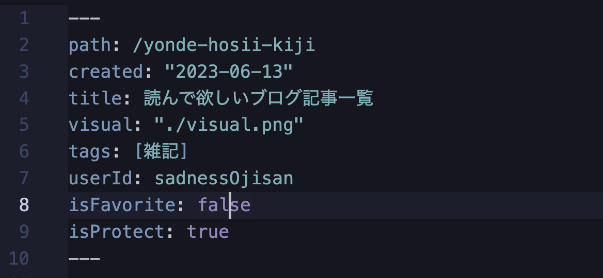

## 選出基準

- 自分はこういうことに関心がありますとアピールしたいもの
- 頑張って書いたもの

## ESLint の Plugin と Extend の違い

https://blog.ojisan.io/eslint-plugin-and-extend/

eslint

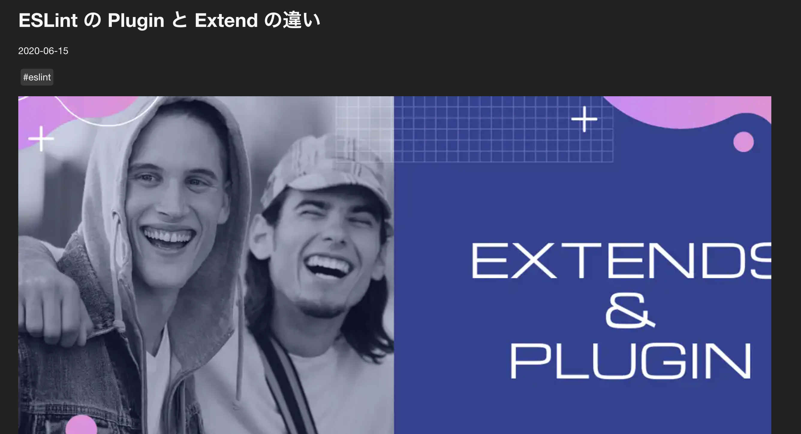

## React のパフォーマンスチューニングの歴史をまとめてみた

https://blog.ojisan.io/react-re-render-history/

react

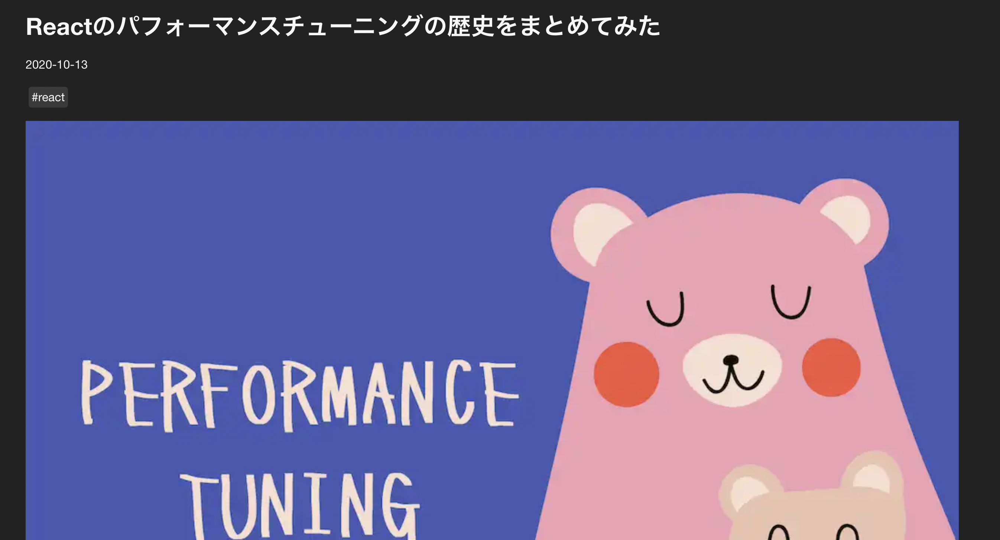

## preact コードリーディング

https://blog.ojisan.io/preact-reading/

(p)react

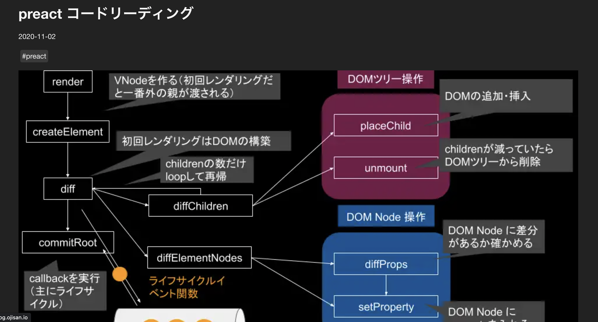

## Rust で WebSocket サーバーそのものを作ってみた！

https://blog.ojisan.io/rust-websocket/

Web 標準, Rust

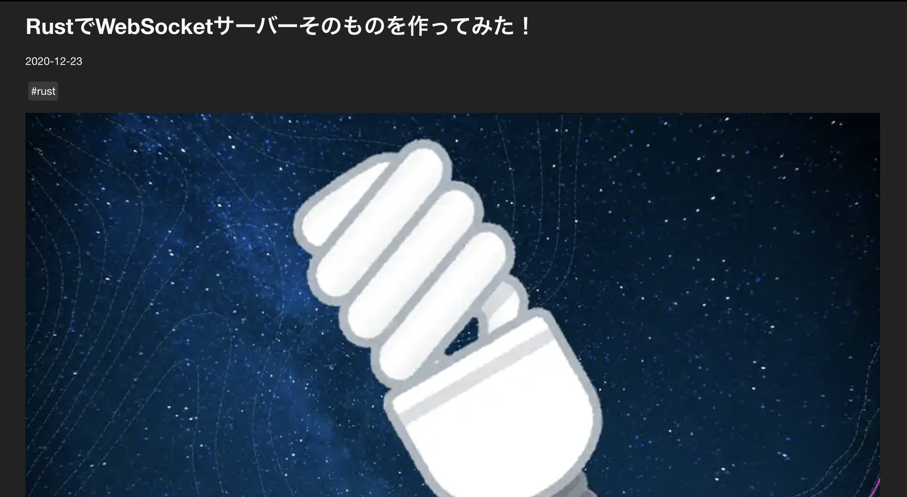

## React ユーザー向けの NextJS ガイド

https://blog.ojisan.io/next-tutorial-for-react-user/

Next.js

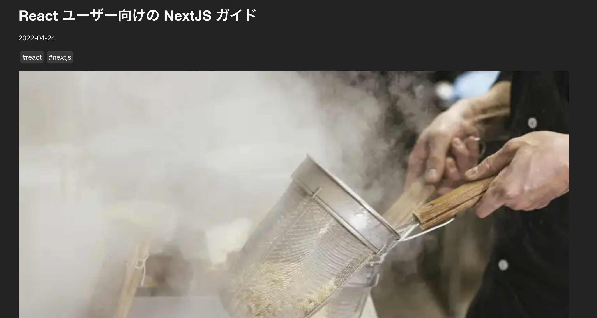

## API 仕様書をバリデーターと型と同期させて作る

https://blog.ojisan.io/swagger-validator-ts/

Schema 駆動開発

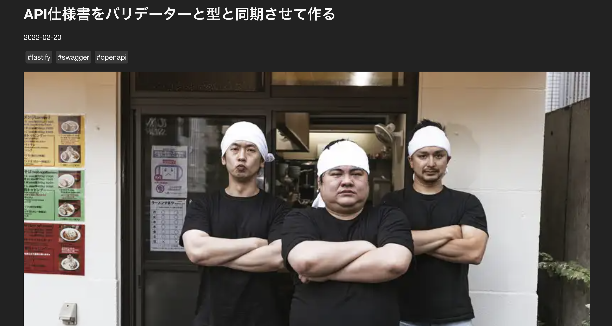

## 無限スクロールは考慮することが多い

https://blog.ojisan.io/i-hate-infinite-scroll/

## React + Rust + Wasm でオンラインモザイクツールを作る

https://blog.ojisan.io/pwa-night/

Rust, Wasm

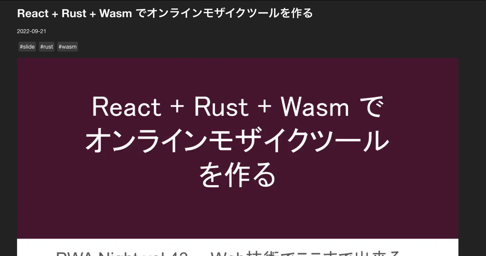

## ご報告ブログの裏側をお見せします

https://blog.ojisan.io/gohoukoku-backyard-tour/

Web 標準, HTTP Caching, Rust, Monadic Parser, Edge Computing

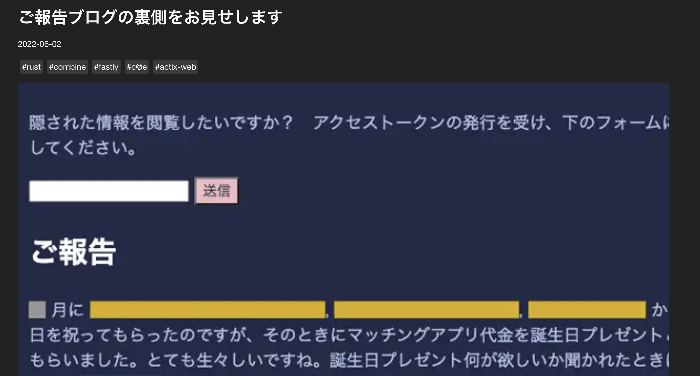

## Monad は継続、Applicative は並列

https://blog.ojisan.io/monad-applicative/

Scala, FP

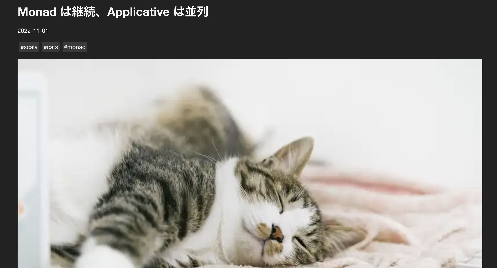

## Free モナドは何が嬉しいか

https://blog.ojisan.io/how-to-use-free-monad/

Scala, FP

## ライブラリを使わない非同期処理（前編）

https://blog.ojisan.io/think-rust-async-part1/

Rust, 非同期ランタイム

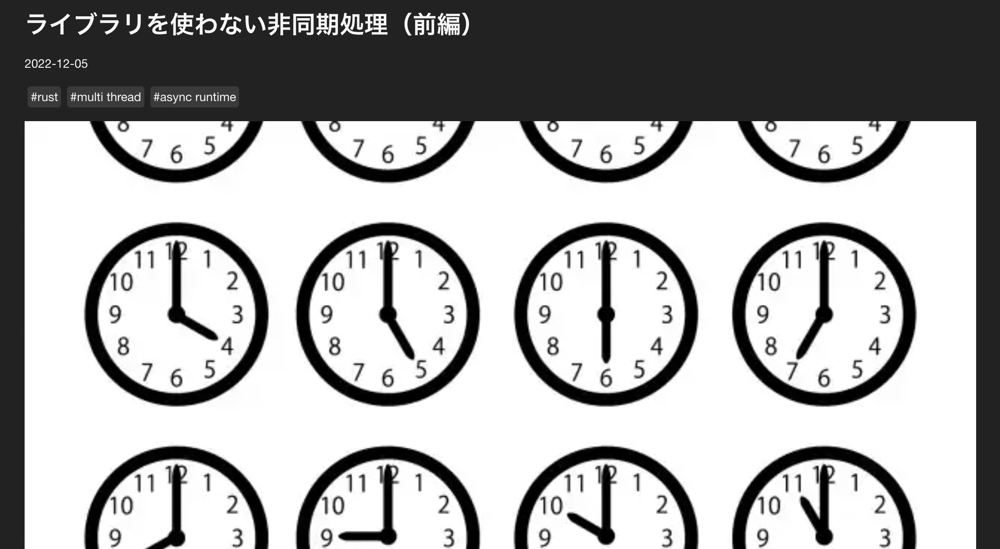

## ブログが新しくなりました(2 ヶ月前に)ので、その報告と技術的な解説

https://blog.ojisan.io/renew-blog-2022/

Gatsby, JAMStack

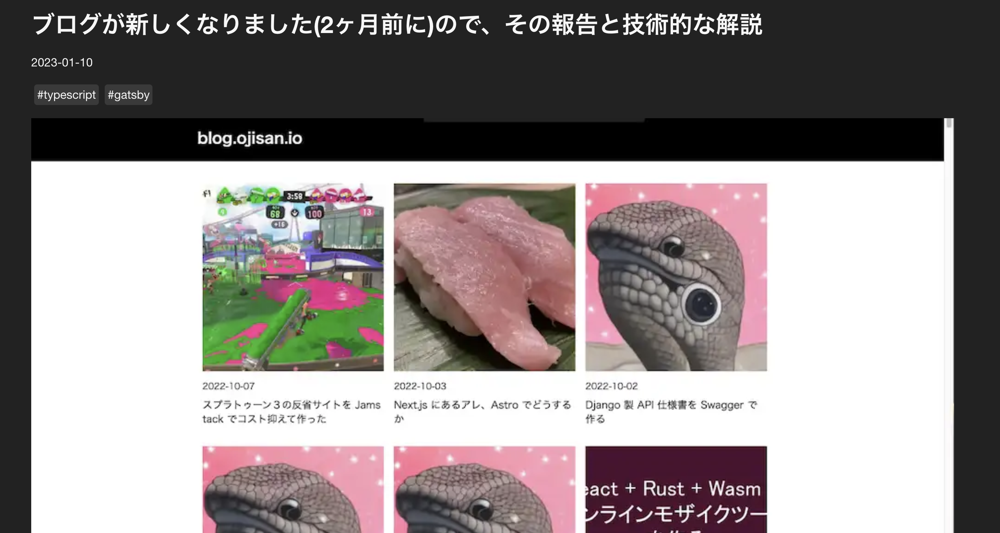

## My new error...

https://blog.ojisan.io/my-new-error/

監視

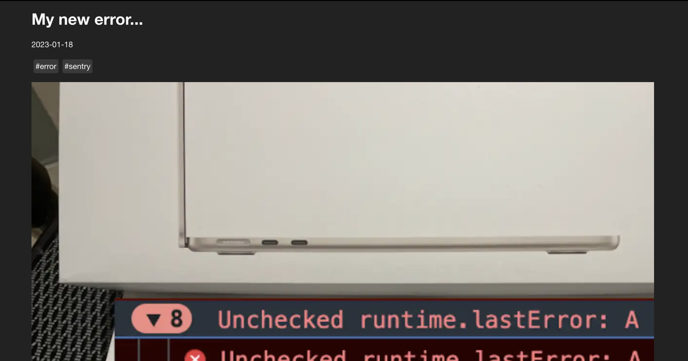

## グリーンスレッドの自作に必要なものは何か

https://blog.ojisan.io/multi-green-thread/

非同期ランタイム

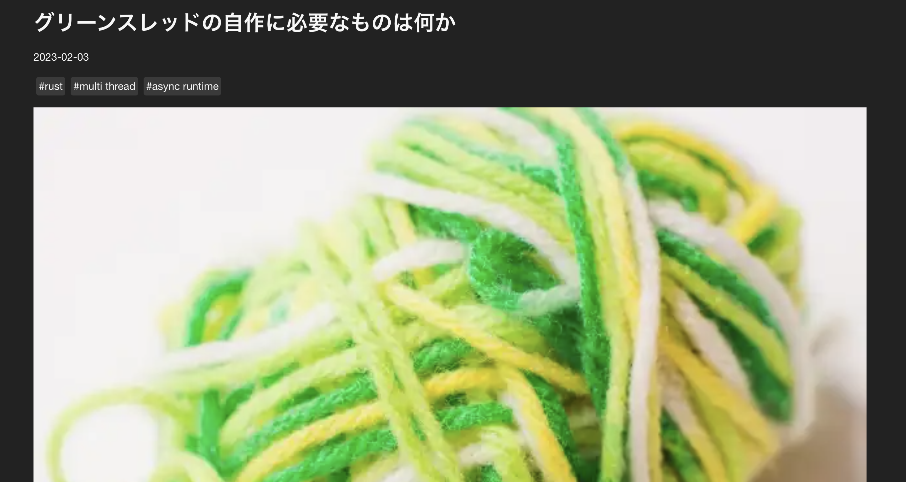

## Web サーバーアーキテクチャ進化論 2023

https://blog.ojisan.io/server-architecture-2023/

非同期ランタイム

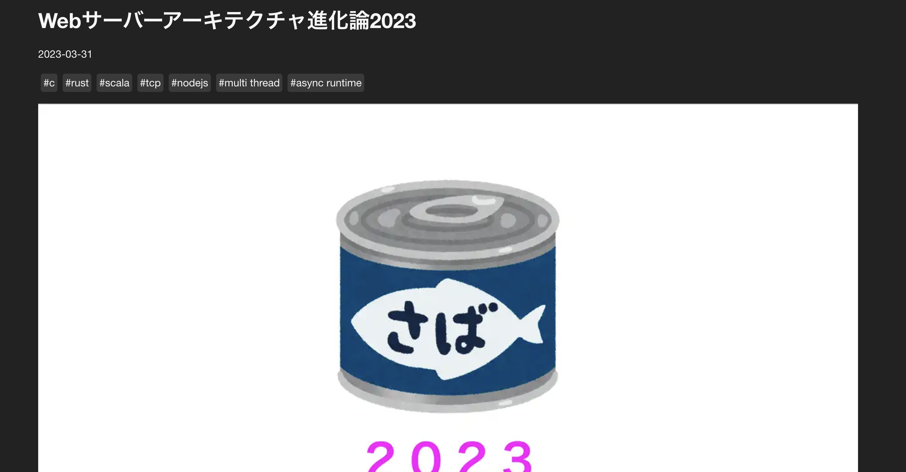

## WebRTC を理解するためにカメラ映像を送るだけの最小実装を探る

https://blog.ojisan.io/webrtc-video-minimal-impl/

WebRTC

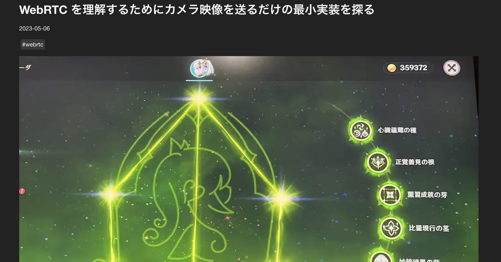

## Rust の 所有権、借用、ライフタイムについて初心者目線で説明と整理を試みる

https://blog.ojisan.io/rust-ownership-wakaran/

Rust

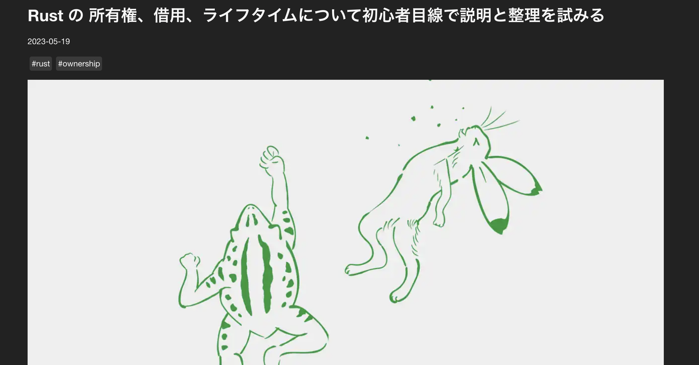

## まとめ

React、Rust、非同期ランタイム、Web 標準が好きっぽい。
