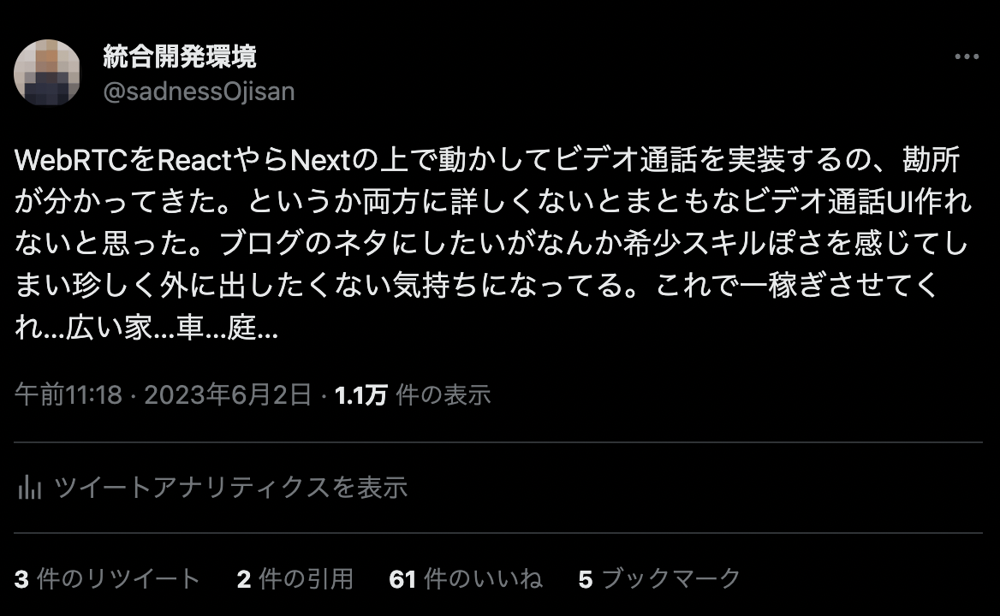
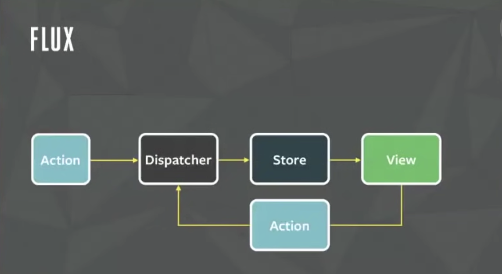

この前ポジショントークしたらそれなりに反響があったので書いてみる。



これまでの人生を振り返ると毎年ラジオや電話や配信サービスを作っている気がするし、なんかそういう仕事が回ってくることが多い気がする。
最近自分なりに答えが出たかなと思ったことがあるので言語化してみようと思う。

OGP は Flux ぽい画像だ。

## 注意・免責事項

ここにあるソースコードは不完全です。これは私が元々手元で実験していたボイラープレートであるとはいえ、いろんな仕事で培ったノウハウ的なものも含まれているので、念には念を入れて意図的に要件が透けそうな箇所は削除しています。

その結果元々のボイラープレートと乖離してしまい、動作しないコードになっています。ただ概念を伝えるには十分なコードになっているはずなので、脳内補完してください。質問は Twitter のメンション、もしくは Issue でのみ受け付けます。

(完全版を書くとしたら技術書典かなぁ。WebRTC でマンション買えたら本望だけど、ドラム式洗濯機代くらいになったらうれしいなぁ...)

あと前に書いた https://blog.ojisan.io/webrtc-video-minimal-impl/ で、「WebRTC は３週間しかやってない」と書いたが、実は [SkyWay](https://skyway.ntt.com/ja/) とかを使った実装はなんだかんだ４年くらい経験がある。なのでそれなりに実装パターンは知っているつもりだ。（WebRTC のことは本当に何も知らなかった。だって [SkyWay](https://skyway.ntt.com/ja/) すごいんだもん・・・もし SkyWay 使っていて WebRTC を知らないのであれば一度勉強してみることをオススメします。全ての答え合わせで楽しかったです。）

## WebRTC と組み合わせる時の実装テクニック

WebRTC を使う場合は React を使える環境なら使った方が良いと思っている。一択ではないと思うが、いわゆる Flux 設計がしやすい技術選定をオススメしたい。

### WebRTC で繋ぐためには何をすべきか

WebRTC は P2P を実現する技術だ。そのためまずは Peer と Peer をマッチングさせてお互いの情報を交換しないといけない。それは SDP で扱う description というメディアストリーム "など" に関する情報だったり、ICE で扱う candidate という経路情報だったりする。そうした交換はピアリングとも呼ばれている。WebRTC ではこのピアリング中に色々なイベントが発生し、そのイベントをキャプチャしてピアに適宜送信したりすることで negotiation を行い、接続が確立される。

WebRTC をアプリケーションで使うためにすべきことは [WebRTC を理解するためにカメラ映像を送るだけの最小実装を探る](https://blog.ojisan.io/webrtc-video-minimal-impl/) にまとめたので詳しくはこちらを読んで欲しい。

かっちり学びたい人は MDN の [Signaling and video calling](https://developer.mozilla.org/en-US/docs/Web/API/WebRTC_API/Signaling_and_video_calling) の方が良いと思う。

とはいえブラウザ差異もあったりするので、正確に学びたい人はブラウザの実装を読んでください。私は読んでいません。

### どうして React を薦めるか

P2P が要件に入るということは必ず状態管理とその UI コントロールも要件に含まれるはずだから、React のような宣言的 UI のライブラリを使った方が良いと思う。
接続準備中はそれとわかるような UI にしたいし、自分が送受信のどちらになるか選択できるようにしたいし、通話への参加要求は accept/deny したいし、通話しながらチャットしたりファイル送信もしたりしたいだろう。
P2P が要件に入るからにはどう足掻いても複雑な UI を作ることが必須になると思っているし、そうでないとしても後々から対応できるようにして置くべきだと思っている。
そういった理由で僕は React が選択肢に上がると思う。

### React と WebSocket

色々やり方はあるが、ピアリングには WebSocket を使うのが良いと思っている。そして自分は生の WebSocket ではなく socket.io を使うようにしている。いくら WebSocket が Web 標準になってポーリングをしなくてよくなったとはいえ、socket.io にしかない利点というのはまだまだあり例えば

- クライアント・サーバーの実装がセットである
- room 機能
- callback 関数の実行

という利点がある。特に callback の実行については dispatcher の実行に使えるのでありがたい。

React で socket.io を使うとなると state を useEffect で初期化することになるだろう。

```ts
"use client";

import { io } from "socket.io-client";
export const Hoge = () => {
  const [state, setState] = useState();
  useEffect(() => {setState(io("url");)}, []);

  return <div>hello</div>;
};
```

もちろん useEffect の外でしても問題はないかもしれないが、2023 年においては React / Next は相互に行き来しやすくしておいた方が良いと思うし、browser、Node 双方で動くコードを書いておくことは推奨されるはずだ。そのため useEffect の中に押し込んでおく。

イベントハンドラの登録もこの時に行う。

```tsx
"use client";

import { io } from "socket.io-client";

export const Hoge = () => {
  const [state, setState] = useState();
  useEffect(() => {
    const socket = io(ENDPOINT);
    socket.on("ping", () => {
      socket.emit("pong!");
    });
    useState(socket);
  }, []);

  return <div>hello</div>;
};
```

このようにピアリングに使う socket.io は状態として持たせてしまうのが良い。

## Flux 設計に寄せる

さて、その状態管理はどうすべきだろうか。自分は Flux を採用している。

### Flux とは

流石に 6 年以上も前の話で、すでに浸透しきった概念だと思うので当時のモチベーションなどには深入りせずに触れるが、Flux は単一方向のデータフローを利用した状態管理手法だ。この図が全てを物語っている。



元画像の出典はよくわからないのだが、Facebook の F8 というカンファレンスのトークで広まった概念だった気がする。

<div style="left: 0; width: 100%; height: 0; position: relative; padding-bottom: 56.25%;"><iframe src="https://www.youtube.com/embed/nYkdrAPrdcw" style="top: 0; left: 0; width: 100%; height: 100%; position: absolute; border: 0;" allowfullscreen scrolling="no" allow="accelerometer; clipboard-write; encrypted-media; gyroscope; picture-in-picture;"></iframe>
</div>

Flux では action というメッセージを dispatch してそれをもとに store を更新し、その store の値から UI を作る。

代表的な実装は redux だ。これは reducer という関数が action を受け取って、store を更新する。そして react-redux というライブラリで redux の store を VDOM に反映させる。その仕組みは当時はまだ Internal API だった Context API によって実現されていた。この作者である Dan Abramov は後に Facebook の React コアチームのリーダーとなっており、そのためか React は後に redux のような機能を備えることとなり、それが useReduce フックだ。

### ピアリングで発生するイベントとは

Flux をピアリングで使いたいモチベーションを語るためにピアリングの進み方を復習しよう。

問題を簡単にするために、配信側と受信側がはっきりしているというシステムで考える。

WebRTC でピアリングを行うには、SDP と ICE を実施してお互いの情報を交換する必要がある。まず SDP を送るときには

```ts
pc.addEventListener(
  "negotiationneeded",
  (ev) => {
    pc.createOffer()
      .then((offer) => pc.setLocalDescription(offer))
      .then(() =>
        sendSignalingMessage({
          type: "video-offer",
          sdp: pc.localDescription,
        })
      )
      .catch((err) => {
        // handle error
      });
  },
  false
);
```

として送る。addEventlinster しなくても onnegotiationneeded に直接代入してもいい。

要するに negotiationneeded を待ち受けて、それを起点に local sdp をセットし、SDP のシグナリングを行う。

この negotiationneeded は

> The negotiationneeded event is first dispatched to the RTCPeerConnection when media is first added to the connection. This starts the process of ICE negotiation by instructing your code to begin exchanging ICE candidates through the signaling server. See Signaling transaction flow for a description of the signaling process that begins with a negotiationneeded event.

とある通り、RTCPeerConnection に media stream を接続する必要がある。

FYI: https://developer.mozilla.org/en-US/docs/Web/API/RTCPeerConnection/negotiationneeded_event

ということは、

```ts
navigator.mediaDevices.getUserMedia({
  audio: false,
  video: true,
});
```

して、

```ts
const track = stream.getTracks()[0];
const senders = pc.getSenders();

const isTrackAlreadyAdded = senders.some((sender) => sender.track === track);

if (!isTrackAlreadyAdded) {
  track && state.pc.addTrack(track, stream);
}
```

のようなコードを先に実行して置く。

その結果として negotiationneeded を実行させられ、その中で SDP の交換を開始させられる。

もちろん [WebRTC を理解するためにカメラ映像を送るだけの最小実装を探る](https://blog.ojisan.io/webrtc-video-minimal-impl/) でしたように negotiationneeded を使わずに

```ts
navigator.mediaDevices
  .getUserMedia({ video: true, audio: false })
  .then((stream) => {
    videoEl.srcObject = stream;
    stream.getTracks().forEach((track) => {
      senderConnection.addTrack(track, stream);
    });
    return senderConnection.createOffer();
  })
  .then((desc) => {
    return senderConnection.setLocalDescription(desc).then(() => desc);
  });
```

のようにしてもいいが、そうすると SDP にはメディア情報が載るから getUserMedia の Promise Chain でしか createOffer できなくなり開発体験が悪くなるので実務ではオススメしない。

さて、createOffer したらそれをリモートのピアに送る。そのために WebSocket を使う。

```ts
socket.emit("sdp_from_sender", sdp);
```

これを受信側は受け取る。

```ts
socket.on("sdp_from_sender", (sdp: RTCSessionDescriptionInit) => {});
```

そして answer を作って送信側に送り返す。

```ts
socket.on("sdp_from_sender", (sdp: RTCSessionDescriptionInit) => {
  pc.setRemoteDescription(state.peerSdp)
    .then(() => {
      return pc.createAnswer();
    })
    .then((sdp) => {
      return pc.setLocalDescription(sdp).then(() => {
        state.socket.emit("sdp_from_receiver", sdp);
      });
    });
});
```

そして送信側ではその情報を受け取ってセットする。

```ts
socket.on("sdp_from_receiver", (sdp: RTCSessionDescriptionInit) => {
  pc.setRemoteDescription(sdp);
});
```

これで SDP の交換は済んだので次に ICE の交換をする。ICE 交換の開始は、onicecandidate というイベントで待ち受ける。

```ts
pc.onicecandidate = (e) => {
  const ice = e.candidate;
};
```

これは

> An icecandidate event is sent to an RTCPeerConnection when an RTCIceCandidate has been identified and added to the local peer by a call to RTCPeerConnection.setLocalDescription(). The event handler should transmit the candidate to the remote peer over the signaling channel so the remote peer can add it to its set of remote candidates.

とある通り setLocalDescription されると発火する。

FYI: https://developer.mozilla.org/en-US/docs/Web/API/RTCPeerConnection/icecandidate_event

そしてこれもピアと交換したいので WebSocket で送る。

```ts
pc.onicecandidate = (e) => {
  const ice = e.candidate;
  socket.emit("ice_from_peer", ice);
};
```

そして受信側で受け取って登録する。

```ts
socket.on("ice_from_peer", (ice: RTCIceCandidateInit) => {
  pc.addIceCandidate(ice);
});
```

ここで終わっても一応繋がるには繋がるのだが運任せなところもあるので、受信側からも ICE を送信側に送り返そう。

```ts
pc.onicecandidate = (e) => {
  const ice = e.candidate;
  socket.emit("ice_from_peer", ice);
};
```

```ts
socket.on("ice_from_peer", (ice: RTCIceCandidateInit) => {
  pc.addIceCandidate(ice);
});
```

受信側では answer sdp を setLocalDescription しているのでそのときに onicecandidate が発生する。

ここまで終えると RTCPeerConnection の connectionState が connected になって映像が届くようになる。

それは

```ts
pc.onconnectionstatechange = () => {
  console.log(pc.connectionState);
};
```

として検知できる。

受信側では

```ts
pc.ontrack = async (event) => {};
```

が発火し、media stream を受け取れるようになる。

受け取ったら

```ts
pc.ontrack = async (event) => {
  const stream = event.streams[0];
  videoElRef.current.srcObject = stream;
};
```

のようにして video 要素に流し込むことができる。

### イベント駆動開発と state 管理と TypeScript との相性が非常に悪い

さて、ここで登場したイベントを書き出そう。

- onnegotiationneeded
- socket.on("sdp_from_sender")
- socket.on("sdp_from_receiver")
- onicecandidate
- socket.on("ice_from_peer")
- ontrack
- onconnectionstatechange

結構ある。

そして厄介なのはこれらのイベントハンドラを登録した時に、

- その登録時点に存在した変数がイベント発生時に存在するかわからない
- 非同期処理の戻り値が返ってきた時にその変数が存在するかわからない

という問題が起きる点だ。

特に WebRTC を使う時には

- ある画面でピアを選択（ルーム選択、通話相手の選択）して
- ある画面でカメラ許諾を取って(ストリームを作って)
- ピアリングを必要なだけ進めていき
- ピアと接続できたら映像を流す

という仕組みがどうせ必要になる。そしてこれらには依存関係がある。SDP を開始するには MediaStream が必要とか、ICE を開始するには local sdp が必要だとかだ。そのため"この STEP ではこの STEP が完了している時にしか呼ばれて欲しくない"というモチベーションが生まれる。そのときにイベント駆動開発や非同期処理が厄介になる。いつ開始されるのか予測不能だからだ。そして TypeScript を使っていても定義時点で存在確認しても実行時に無いみたいなことが起きて腹も立つ。

これは具体例を見た方が早いだろう。

#### その登録時点に存在した変数がイベント発生時に存在するかわからない

たとえば

```ts
socket.on("sdp_from_sender", (sdp) => {
  pc.setLocalDescription();
});
```

としたときにこの pc が null でない保証はどこにあるのだろうか？

ということで

```ts
if (pc) {
  socket.on("sdp_from_sender", (sdp) => {
    pc.setLocalDescription();
  });
}
```

としたら型検査は通るが sdp_from_sender を受け取った時に pc が null かどうかはケアされない。

であれば

```ts
socket.on("sdp_from_sender", (sdp) => {
  pc && pc.setLocalDescription();
});
```

とすればいいと思うかもしれないが、初期化のタイミングがわからないので pc がないときに "sdp_from_sender" が送られてきたらケアできない。

#### 非同期処理の戻り値が返ってきた時にその変数が存在するかわからない

例えば

```ts
socket.on("sdp_from_sender", (sdp: RTCSessionDescriptionInit) => {
  pc.setRemoteDescription(sdp)
    .then(() => {
      return pc.createAnswer();
    })
    .then((sdp) => {
      return pc.setLocalDescription(sdp).then(() => {
        // ここに socket が存在する保証はない
      });
    });
});
```

のようなコードを書いたとして、上記のようなことも起きうる。プロミスを返している以上、イベントループの間に別のタスクが挟まる可能性はあり、そこで socket を破壊される可能性というのも存在している。socket や pc を close する処理は簡単に task queue に積めてしまう。

### 解決策

ということで tag ベースで型を分類できる TypeScript と、いろんなところから飛んでくるイベントを集約してフローとして流せる Flux 思想、そしてそのイベントによる状態変化を監視して必要なイベントやピアリングステップを遂行できる useEffect の仕組みが嬉しくなってくる。

つまり React + TypeScript + Flux という仕組みが嬉しくなってくるのである。

もうこれは具体例を見せる方が早いと思うので実装をしよう。

## 実装

まず

```ts
export type State =
  | StartPeeringState
  | WaitForPeerPeeringActionState
  | CompletePeerConfigureState;
```

のような状態を定義する。

`WaitForPeerPeeringActionState` には

```ts
{
  step: "wait_for_peer_peering_action";
  pc: RTCPeerConnection;
  socket: Socket<DefaultEventsMap, DefaultEventsMap>;
  mediaStream: MediaStream | null;
  shouldConfigureSdp: boolean;
  shouldConfigureIce: boolean;
  peerSdp: RTCSessionDescriptionInit | null;
  ice: RTCIceCandidateInit | null;
}
```

のような定義を持たせる。

まあ boolean と null の部分はもっとユニオン型で強く縛れるがめんどくさくなったので一旦これで勘弁。

そしてピアリングのステップが進むにつれてこれを更新する Action を発行させる。

```ts
export type Action =
  | InitializeAction
  | DetectSdpOfferAction
  | DetectPeeringIsCompletedAction
  | IceCandidatesAction
  | DetectPeeringIsCompletedAction
  | DetectAcceptMediaStreamAction
  | FinishSettingSdpAction
  | FinishSettingIceAction
  | CompletePeeringAction;
```

このアクションは UI から発行されるのでそれを捌く reducer を用意する.

```ts
const reducer = (state: State, action: Action): State => {
  switch (action.type) {
    case "initialize": {
      return {
        ...state,
        step: "wait_for_peer_peering_action",
        socket: action.payload.socket,
        pc: action.payload.pc,
      };
    }
    case "detect_sender_sdp_offer": {
      if (state.step !== "wait_for_peer_peering_action") {
        // SDP待受は wait_for_peer_peering_action以外のステップで呼ばれるわけがないという制約
        throw new Error("invalid step");
      }
      return {
        ...state,
        step: "wait_for_peer_peering_action",
        peerSdp: action.payload.peerSdp,
        shouldConfigureSdp: true,
      };
    }
    case "detect_sender_send_ice_candidates": {
      if (state.step !== "wait_for_peer_peering_action") {
        if (state.step === "complete_peer_configure") {
          return { ...state };
        }
        throw new Error("invalid step");
      }

      return {
        ...state,
        step: "wait_for_peer_peering_action",
        ice: action.payload.iceCandidate,
        shouldConfigureIce: true,
      };
    }
    case "detect_accept_media_stream": {
      if (state.step !== "wait_for_peer_peering_action") {
        throw new Error("invalid step");
      }
      return {
        ...state,
        step: "wait_for_peer_peering_action",
        mediaStream: action.payload.stream,
      };
    }
    case "finish_setting_sdp": {
      if (state.step !== "wait_for_peer_peering_action") {
        throw new Error("invalid step");
      }
      return { ...state, peerSdp: null, shouldConfigureSdp: false };
    }
    case "finish_setting_ice": {
      if (state.step !== "wait_for_peer_peering_action") {
        throw new Error("invalid step");
      }
      return { ...state, ice: null, shouldConfigureIce: false };
    }
    case "complete_peering": {
      if (state.step !== "wait_for_peer_peering_action") {
        throw new Error("invalid step");
      }
      const mediaStream = state.mediaStream;
      if (mediaStream === null)
        throw new Error("media is none. invalid dispatch");
      return {
        ...state,
        step: "complete_peer_configure",
        mediaStream,
      };
    }
    default: {
      assertNever(action);
      throw new Error("unreachable");
    }
  }
};
```

これで次に進む状態を定義できる。これの良いところは「この状態からはこのメッセージが来ない」ということを宣言できるところだ。つまりピアリングの進め方をコントロールできる。

あとはこれらの状態に応じてトリガーするものを useEffect で定義する。

```ts
const [state, dispatch] = useReducer(reducer, initialState);

useEffect(() => {
  if (state.step === "initial") {
    const socket = io("url");
    const pc = new RTCPeerConnection(config);
    dispatch({
      type: "init_something_for_peering",
      payload: {
        pc: pc,
        socket,
      },
    });
  }

  if (state.step === "configure_wait_for_connect") {
    state.pc.onnegotiationneeded = async () => {
      dispatch({ type: "start_negotiation" });
    };

    state.socket.on("answer", (answer: RTCSessionDescription) => {
      dispatch({
        type: "handle_remote_sdp_arrival",
        payload: { sdp: answer },
      });
    });

    state.socket.on("ice", (ice: RTCIceCandidate) => {
      dispatch({
        type: "detect_receiver_send_ice_candidates",
        payload: { iceCandidate: ice },
      });
    });

    state.pc.onicecandidate = (e) => {
      const ice = e.candidate;
      if (ice === null) {
        console.info("ice complete");
        return;
      }

      dispatch({
        type: "handle_detection_of_ice",
        payload: {
          candidate: ice,
        },
      });
    };

    state.pc.onconnectionstatechange = () => {
      if (
        state.pc.connectionState === "connected" &&
        state.pc.signalingState === "stable"
      ) {
        dispatch({ type: "handle_detection_of_complete_connect" });
      }
    };
  }

  if (state.step === "wait_for_peer_peering_action") {
    if (state.shouldAddTrack) {
      const track = state.stream.getTracks()[0];
      const senders = state.pc.getSenders();

      const isTrackAlreadyAdded = senders.some(
        (sender) => sender.track === track
      );

      if (!isTrackAlreadyAdded) {
        track && state.pc.addTrack(track, state.stream);
      }
      dispatch({ type: "finish_add_track" });
    }

    if (state.shouldStartNegotiation) {
      state.pc
        .createOffer({
          offerToReceiveAudio: false,
          offerToReceiveVideo: true,
        })
        .then((offer) => {
          return state.pc.setLocalDescription(offer).then(() => {
            state.socket.emit("sdp_from_sender", offer);
            dispatch({ type: "finish_sending_sdp" });
          });
        });
    }

    if (state.remoteSdp && state.shouldAddRemoteSdp) {
      state.pc.setRemoteDescription(state.remoteSdp).then(() => {
        dispatch({ type: "finish_set_remote_sdp" });
      });
    }

    if (state.shouldRegisterRemoteIce && state.remotePeerIce) {
      state.pc.addIceCandidate(state.remotePeerIce).then(() => {
        dispatch({ type: "finish_register_remote_ice" });
      });
    }

    if (state.shouldSendIce && state.ice) {
      state.socket.emit("ice_from_sender", state.ice);
      dispatch({ type: "finish_send_ice" });
    }
  }
}, [state]);
```

ここで徹底していることは WebSocket の受け取り、非同期処理のコールバック（というより継続）では dispatch に徹底していることだ。dispatch して状態遷移をして、次のイベントループで別のスコープでそのイベントに紐づく処理を実行させている。その時に型の絞り込みもしているのでぬるぽも（ある程度は）防げている。

ここでのコツは、非同期処理は全部 useEffect 側に寄せることだ。reducer 側ですると reducer が Promise を返すことになってしまう。もし redux を使って thunk や saga を使うのであれば良いかもしれないが useReducer だけの方がシンプルなので自分はそうしている。（redux-saga は良い選択肢だとは思う）

dispatch に専念しているからこそ非同期処理でいつイベントが飛んでくるかわからず、connection 確立後に detect_sender_send_ice_candidates が飛んできても無視するような実装も簡単にかける。

```ts
case "detect_sender_send_ice_candidates": {
      if (state.step !== "wait_for_peer_peering_action") {
        if (state.step === "complete_peer_configure") {
          return { ...state };
        }
        throw new Error("invalid step");
      }

      return {
        ...state,
        step: "wait_for_peer_peering_action",
        ice: action.payload.iceCandidate,
        shouldConfigureIce: true,
      };
    }
```

受信側もここでしたことと似たことをすれば良い。onTrack トリガーの Action を追加して、MediaStream を受け取れば再生画面ができるだろう。

## まとめ

flux, redux は最近出てきた新しいものに取って代わられているようにも思えるが、色々なチャネルからイベントやタスクが飛んでくるようなシステム開発においては、キューの一元化と Executor の明確化という点で Flux 設計は有効だし、TypeScript と useEffect が賢くて理想のフローを宣言するだけでシステムが組み上がっていくのはとても開発体験が良い。自分が WebRTC を組み合わせて複雑な UI を組まないといけないのであれば間違いなく Flux に寄せると思う。

とはいえこういうのこそ Rust で書きたいよなぁ(RAII と ライフタイムあるとどれだけ便利か！)の気持ちがあるので Wasm でどうにかならんかなぁみたいな妄想はしている。
