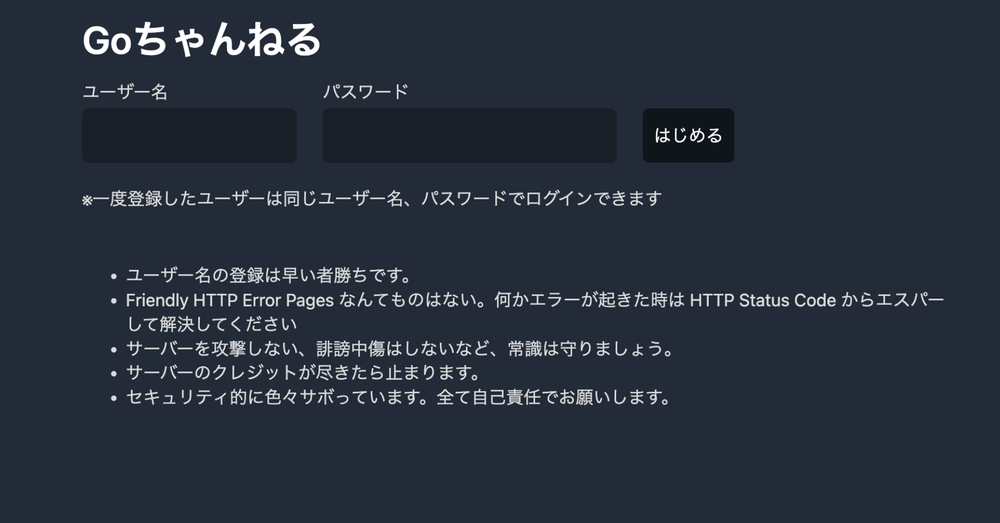
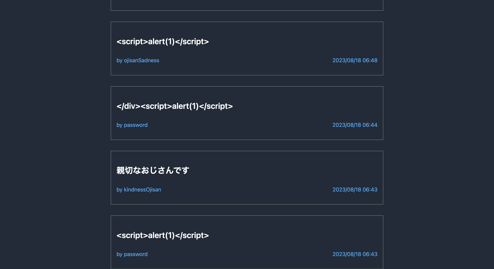
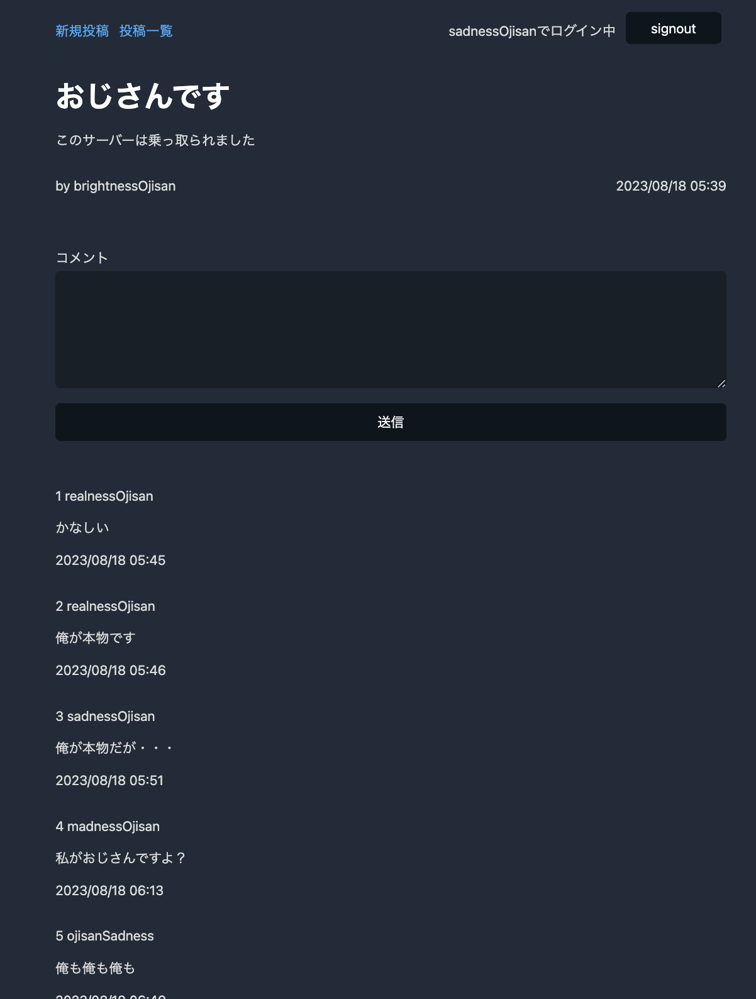
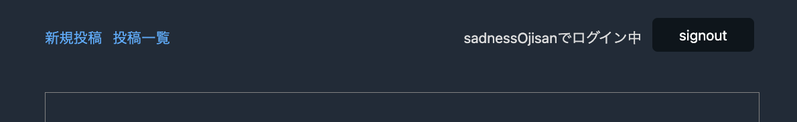

先週、[A Tour of Go やってみた TIL](https://blog.ojisan.io/a-tour-of-go-yattemita/) というブログを書いてみた通り、Go言語を始めた。
で、ちまちま勉強をしていたのだが、つい最近たまたま ISUCON の過去問をやる機会があって Go のスコアを見たら初期値ですら、チューニング済みの他の言語のスコアを超えていて、絶対に習得するぞの気持ちにさせられた。
ちなみに私はどう言うわけかフロントエンドのソースコードをビルドしたら vite が走ってファイルハッシュが全部変わって、ベンチマークからアクセスできなくなって０点でした。対戦ありがとうございました。

なにはともあれ、本番は絶対にGoでやるぞの気持ちを新たに Go の習得に励んでいた。前のブログでは、文法が分かったから

- HTTPサーバー
- DB Connection / Migration
- 境界値チェックや型推論
- テスト
- スキーマ駆動開発
- コンテナデプロイ

あたりをやってみたいと言うことで、簡単な掲示板アプリケーションを作ってみた。

そう、「Goちゃん」である。



ただの Post has many Comments な掲示板だ。Railsチュートリアルで作るようなやつだ。

app: https://gochannel.ojisan.dev/

repository: https://github.com/sadnessOjisan/gochann

## 感想戦

てなわけで、とりあえず動くようになって、いい感じに荒らされたので感想戦をしようと思う。



知識不足による間違いがたくさん滲み出ている感想だと思うので、適宜指摘してもらえると嬉しい。

### 標準ライブラリ縛りは厳しい

自分が Go に関心を持ったのは標準ライブラリの豊富さだ。最近仕事で Go か Rust かを選ばないといけない場面があってそのときは Rust を選んだのだが、依存やエコシステムの面で不安を覚えていた。そのときにGoであれば欲しかった機能のほとんどが標準ライブラリでサポートされているこということを知って興味が湧いた。HTTPサーバー・クライアント、非同期ランタイムが最初からサポートされているのはずるい。なのでこの実装は本当に標準ライブラリだけでできるかも試したくなって、標準ライブラリ縛りで行った。

結果、実際に書いてみて思ったのは標準で事足りると言うのは割と幻想だった。例えば `/posts/:id/comments` への POST は標準ライブラリだけだと難しかったり、SQL 周りも安全なマッピングを考えると、外部ライブラリやエコシステムに乗るのが良さそうに思えた。なので結局 Go を選択しても外部依存パッケージのアップデートバトルは発生すると分かり、それを回避するだけを目的にGoを選定するのは違うのかもなという感想になった。もちろん軽減できるというのはあると思う。

### ルーティング

#### 標準ライブラリで頑張る

`net/http` だけを使った。`/posts/:id` や `/posts/:id/comments` のようなものがサポートされていなくて辛かったのと、POST, GET ごとに関数分けれないのも辛かった。

```go
func PostsDetailHandler(w http.ResponseWriter, r *http.Request) {
	// GET /posts/:id
	if r.Method == http.MethodGet {
		...
	}

	// POST /posts/:id/comments
	if r.Method == http.MethodPost {
		...
	}
}
```

(method, route) の組に対して一つのハンドラを登録できるようなIFが好みだ。実務ならルーターライブラリかFWを入れると思った。薄いのが好きなので https://echo.labstack.com/ が好みに合いそうだ。

#### コネクションプールをどうするか

main では

```go
package main

import (
	"learn-go-server/router"
	"log"
	"net/http"

	_ "github.com/go-sql-driver/mysql"
)

func main() {
	http.HandleFunc("/", router.HomeHandler)
	// for /users/:id
	http.HandleFunc("/users", router.UsersHandler)
	http.HandleFunc("/users/", router.UsersDetailHandler)

	http.HandleFunc("/posts", router.PostsHandler)
	http.HandleFunc("/posts/", router.PostsDetailHandler)
	http.HandleFunc("/posts/new", router.PostsNewHandler)

	http.HandleFunc("/signout", router.SignoutHandler)

	log.Fatal(http.ListenAndServe(":8080", nil))
}
```

のようなコードを書いているのだが、それぞれのハンドラの中では

```go
dsn := os.Getenv("dbdsn")
db, err := sql.Open("mysql", dsn)
defer db.Close()
if err != nil {
  log.Printf("ERROR: db open err: %v", err)
  w.WriteHeader(http.StatusInternalServerError)
  return
}

row := db.QueryRow("select user_id from session where token = ? limit 1", token.Value)
var user_id int
if err := row.Scan(&user_id); err != nil {
  ...
}
```

としている。毎回 `sql.Open("mysql", dsn)` しているのはお行儀が良くないことはこれまでの経験から知っている。

なのでコネクションプール的なのをしたいのだがいいやり方が分からなかった。Node.js だったらエントリポイントで設定をしてそれをglobalな位置からexportしておいてrepository layer はそれを読み込む、Rust だったら設定した db を axum の layer から内側の layer へと流し込んでいくとかDIなどで実現できる。

が、Goの場合それをする方法がわからなかった。エントリポイントでdbを設定するとしてそれをどうやってHTTPハンドラからDBを実際に触る箇所まで伝播させたらいいのだろうか。

DB以外にも仮にレイヤー度アーキテクチャのような設計をとるならどうやってDIしていくのかが分からなかった。

### DB

#### ライブラリ選定

"database/sql" と "github.com/go-sql-driver/mysql" を使った。標準ライブラリ縛りでしたかったが、RDBが外部製品な以上はドライバを依存としていれるのは仕方ないので、仕方なく入れた。

クエリとオブジェクトへのマッピングが難しかった。

クエリを投げたらオブジェクトが返ってきて欲しかったのだが、ポインタを渡してそこに書き込ませるような形だった。なので境界におけるバリデーションが難しかった。スキーマ違反によるエラーなのか、もっと違う次元のエラーなのか判断ができないからだ。

#### SQL が難しかった

たとえばある投稿を取得する時に、それに紐づくコメントも全部取得し、それらをユーザー情報と紐づけて取得するといったクエリも

```sql
query := `
  select
    p.id, p.title, p.text, p.created_at, p.updated_at,
	post_user.id, post_user.name,
	c.id as comment_id, c.text as comment_text, c.created_at as comment_created_at, c.updated_at as comment_updated_at,
	comment_user.id, comment_user.name
  from
    posts p
  join
    users post_user
  on
    p.user_id = post_user.id
  left join
    comments c
  on
    p.id = c.post_id
  left join
    users comment_user
  on
    c.user_id = comment_user.id
  where
    p.id = ?
`
```

のようなクエリだ。

このページを実現するためのクエリだ。



Prisma だったら

```ts
const getAuthor = await prisma.user.findUnique({
  where: {
    id: "20",
  },
  include: {
    posts: true, // All posts where authorId == 20
  },
});
```

のように型補完ありで書けそうなところを長く書くことになって大変だった。

FYI: https://www.prisma.io/docs/concepts/components/prisma-schema/relations

まあ慣れなんだろうけど、left join を使うと null をカラムに含むレコードがあるわけで、そうなるとモデルがnullを想定しない場合にScanでマッピングができなくて困った。
これは Scan する前に null かどうか識別して分岐したいということなのだが、そのデータを読み取るための Scan なのでできない。

なのでモデルを使ってマッピングするのではなく、DBの境界ではDTOを定義しておくべきと言うのは学んだ。匿名の構造体を作れたので、ここでは

```go
post := &model.Post{}
for rows.Next() {
	post_user := &model.User{}
	comment_dto := &struct {
		ID        sql.NullInt16
		Text      sql.NullString
		CreatedAt sql.NullTime
		UpdatedAt sql.NullTime
	}{}
	user_dto := &struct {
		ID   sql.NullInt16
		Name sql.NullString
	}{}
	err = rows.Scan(
		&post.ID, &post.Title, &post.Text, &post.CreatedAt, &post.UpdatedAt,
		&post_user.ID, &post_user.Name,
		&comment_dto.ID, &comment_dto.Text, &comment_dto.CreatedAt, &comment_dto.UpdatedAt,
		&user_dto.ID, &user_dto.Name,
	)
	if err != nil {
		log.Printf("ERROR: posts db scan err: %v", err)
		w.WriteHeader(http.StatusInternalServerError)
		return
	}
	post.User = *post_user
	if comment_dto.ID.Int16 != 0 {
		post.Comments = append(post.Comments, model.Comment{
			ID:        int(comment_dto.ID.Int16),
			Text:      comment_dto.Text.String,
			CreatedAt: comment_dto.CreatedAt.Time,
			UpdatedAt: comment_dto.UpdatedAt.Time,
			User: model.User{
				ID:   int(user_dto.ID.Int16),
				Name: user_dto.Name.String,
			},
		})
	}
}
```

のようにして誤魔化した。

個人的には `comment_dto.ID.Int16 != 0` などのゼロ値かを見て分岐させるのが、本当に 0 が入ってきた場合と区別できなくて困った。
今は auto increment なのでならないのはわかっているが、実務ではやりたくないなという気持ちなので何か回避策を探したい。

一方でゼロ値という考えは楽できるところもあって、構造体へのマッピングで完全に全カラムをマッピングしなくてもゼロ値でパディングされてくれるので、用途ごとの構造体を作らなくてもサボれるのは良かった。
しかしそのようなサボりはバグの元なので、こうした作り捨てプロジェクト限定なやり方な気はする。

### モジュール化したい

現状、クッキーにつけた token を見て、ログイン済みか判定する処理なんかは

```go
token, err := r.Cookie("token")
if err != nil {
	log.Printf("ERROR: %v", err)
	w.WriteHeader(http.StatusUnauthorized)
	return
}
dsn := os.Getenv("dbdsn")
db, err := sql.Open("mysql", dsn)
if err != nil {
	log.Printf("ERROR: db open err: %v", err)
	w.WriteHeader(http.StatusInternalServerError)
	return
}
defer db.Close()
signin_user_query := `
	  select
	    users.id, users.name
	  from
	    session
	  inner join
	    users
	  on
	    users.id = session.user_id
	  where
	    token = ?
	`
row := db.QueryRow(signin_user_query, token.Value)
u := &model.User{}
if err := row.Scan(&u.ID, &u.Name); err != nil {
	// token に紐づくユーザーがないので認証エラー。token リセットしてホームに戻す。
	cookie := &http.Cookie{
		Name:    "token",
		Expires: time.Now(),
	}
	http.SetCookie(w, cookie)
	http.Redirect(w, r, "/", http.StatusSeeOther)
	return
}
```

という処理を呼び出しているのだが、していることは単純なもののエラーハンドリングのコードが入り乱れて、コードが長くなっている。
auth_service のような単位で切り出して共通化してしまいたい。
そのためにはやはりGoにおけるレイヤーに分ける設計手法について知る必要があって、宿題になっている。

### 認証

書いている時に salt がバズったおかげで、コードを公開する以上は salt 入れておかないと何か言われそうだったので急遽入れた。

https://github.com/sadnessOjisan/learn-go-server/blob/main/router/user.go#L92

めんどくさかったのだけど、いざ自分で実装しようとすると大変だったのでいい経験になった。
bcrypt も調べ直すきっかけになって良かった。（使ってないけど）

このあたり、Railsだと device が勝手に生やしてくれて楽なんだよなの気持ちにさせられた。

### インフラ

#### 一発でコンテナビルドが通った

最新版のGoをビルド環境にして、distroless で multi staged build している。

distroless使うと何かとトラブルがありそうなものだが、標準ライブラリしか使っていないおかげかインターネットで拾ってきたDockerfileそのまま動いてくれた。

Thaks, https://zenn.dev/kaito2/articles/e8576b43ff522a

おや、どこかで見たことあるアイコンですね・・・

#### テンプレートファイルは別で分ける必要がある

「インターーネットで拾ってきたDockerfileそのまま動いてくれた。」と書きはしたが、一箇所だけ手を入れた箇所がある。

```
COPY --from=builder /build/template /template
```

これは今日まで知らなかったのだが（というかテンプレートエンジン使った開発でマルチステージドビルドしたことがなかった。）、テンプレートエンジンを使うとそのテンプレートファイルまでコンテナに含める必要があった。
てっきりコンパイル時に全部含めているのだと思っていた。
なのでここだけはコンパイルが通ってもランタイムエラーを起こしうるということだ。
注意しなきゃだった。

#### CloudSQL が難しかった

成果物は CloudRun にあげるつもりで作っていたので、DBのDSNは localhost 以外を使わないといけない場面がきた。

ローカルでは

```yaml
version: "3"

services:
  # MySQL
  db:
    image: mysql:8
    container_name: mysql_host
    environment:
      MYSQL_ROOT_PASSWORD: root
      MYSQL_DATABASE: micro_post
      MYSQL_USER: ojisan
      MYSQL_PASSWORD: ojisan
      TZ: "Asia/Tokyo"
    command: mysqld --character-set-server=utf8mb4 --collation-server=utf8mb4_unicode_ci
    volumes:
      - ./db/data:/var/lib/mysql
      - ./db/my.cnf:/etc/mysql/conf.d/my.cnf
      - ./db/sql:/docker-entrypoint-initdb.d
    ports:
      - 3306:3306
```

で動かしていた。

これを CloudRun でも動くように、

```go
dsn := os.Getenv("dbdsn")
db, err := sql.Open("mysql", dsn)
```

として差し替えられるようにして、CloudSQL の接続情報を入れた。

けどつながらず、手元の MySQL Workbench からも繋がらなかった。

なんか色々調べていると Cloud SQL Auth Proxy というのを立てる必要があった。

https://cloud.google.com/sql/docs/postgres/connect-auth-proxy?hl=ja

しかしこれはめんどくさいので回避策を考えていた。例えばマイグレーションをCI/CDパイプラインからするとなったら、この設定をGHAにもするのかと考えたらとてもめんどくさかった。

調べていると、どうも public IP を使ったアクセスの穴を開けれることがわかった。なのでそこに`0.0.0.0/0` を指定して全通にした。
もちろん良くない操作なので、パスワードはとても複雑なものにしている。実務だとこんなことはしないのでご安心を。

このトラブル、https://blog.ojisan.io/splatoon3-hansei-site/ を実装したときも踏んだような気がする。

#### Migration

migration の方法は悩んだけど、結局 MySQL Workbench で本番に繋いで直接

```sql
CREATE DATABASE IF NOT EXISTS micro_post;

CREATE TABLE IF NOT EXISTS micro_post.users(
  `id` int(11) AUTO_INCREMENT,
  `name` varchar(32) NOT NULL UNIQUE,
  `password` text NOT NULL,
  `salt` text NOT NULL,
  `created_at` datetime DEFAULT CURRENT_TIMESTAMP,
  `updated_at` datetime DEFAULT CURRENT_TIMESTAMP ON UPDATE CURRENT_TIMESTAMP,
  PRIMARY KEY (id)
) ENGINE=InnoDB DEFAULT CHARSET=utf8;

...
```

を実行した。自動化したかった。

### HTML / HTTP

デプロイの楽さを考えて、テンプレートエンジンを使ってUIを作った。そのおかげで普段はJSで隠れていたHTMLとHTTPそのものの力を実感できた。

投稿のフォームの送信後の処理は See Other で投稿詳細ページに飛ばしたりしたのだが、久しぶりに See Other を使った気がする。（JSの世界でプログラミングしていると fetch 後の then でクライアントサイドでリダイレクトかけるので 300 番のHTTPステータスは知らなくても実は困らない）

JSを使わないせいでサインアウトも

```html
<form action="/signout" method="POST">
  <button>signout</button>
</form>
```

と言う実装だ。



action 属性も久々に書いた気がする。（まあ server action で毎日書いてるんだけど...)

素直に異常系のステータスコードを返しているのだが、そのときにUIにどうフィードバックさせるかということについては悩んだ。
いわゆる Friendly Error Pages をどうするかだ。
たとえば送信失敗のフィードバックなどだ。
失敗の種類にはタイトルに対する不正なリクエスト、テキストに対する不正なリクエスト、コメントに対する不正なリクエストなどなどあるのでそれぞれに対応したステータスコードを作ることはできない。

これに関しては `_error.html` のような template fragment を作るのがいいんだなという学びになった。

## リベンジマッチの計画

色々やらかしもしてるし、当初の試したかった仕様も実装できていないのでリベンジマッチを企画している。そこでは次のようなことを意識して進めたい。

### router をライブラリに頼る

echo か chi が気になっている。

### DB 周りをライブラリに頼る

構造体とのマッピングはまず自動化したい。もしORMを使うのなら OR部分のDSLで migration までできると嬉しい。migration は https://github.com/rubenv/sql-migrate のような CLI でやってもよいとは思っている。この辺は色々組み合わせが考えられそうなので識者に相談したい。

### JSON API を作る

テストやスキーマ周りの検証は、HTMLがレスポンスだとやりにくかった。ましてやレイヤー分けのテクニックもなかったのでUTすら書けていない。
なのでレイヤー分けの勉強をしながら、JSON API を作ってハンドラに対するIntegration Testを書いていこうと思う。

### 座学

読む。


