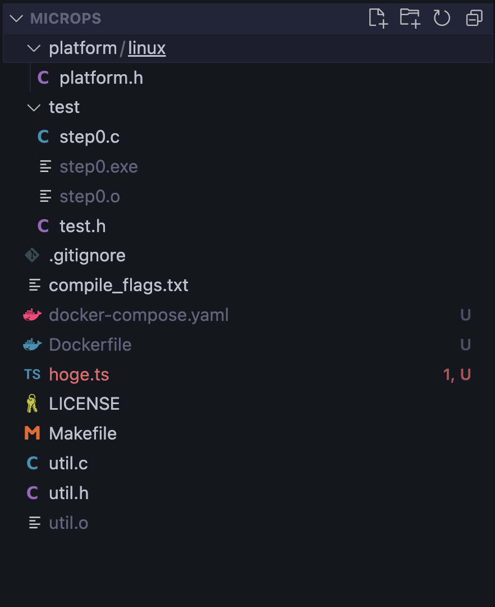

KLab という会社のインターン課題を夏休み中にやると「詳解TCP/IP Vol.2」を貰えるらしい。

https://twitter.com/pandax381/status/1688414447466139649

この本は [Encraft #2 サーバーとクライアントを結ぶ技術](https://knowledgework.connpass.com/event/279962/) に登壇したときに同じく登壇者の [@sonatard](https://twitter.com/sonatard) さんから紹介してもらって気になっていた。というのも、私は [Webサーバーアーキテクチャ進化論2023](https://blog.ojisan.io/server-architecture-2023/)を書いた時に 「SYN Queue と Accept Queue に積まれる実体って何？ Linux カーネル読むしかねぇ！うぉ〜挫折〜〜〜〜〜〜！」となっており、sonatardさんは自作プロトコルスタック経験者ということで勉強法を教えてもらった時にその本を薦めてもらったからだ。が、同時にもう絶版になっているとも聞いていて悲しんでいた。

そんなときである。その本をたくさん所持している人がいて、自作に挑戦するとプレゼントしてくれるとのことだった。こりゃやるしかねぇということでさっき始めた。が、MacOS だと進められないことに気づいて MacOS で Linux 向けのビルドする方法を調べたメモしておく。いや、一応 WSL 環境も持っているのだが、それはゲーミングPCの中に入っているのでなるべく起動したくない。僕は意志が弱いから・・・

## ホストマシンでDockerを起動して、volume でコンテナとホストを紐づける

Dockerfile

```
FROM ubuntu:latest

RUN apt-get update && apt-get install make && apt-get install -y build-essential

CMD ["tail", "-f", "/dev/null"]
```

docker-compose.yaml

```yaml
version: "3"

services:
  microps-builder:
    build: .
    volumes:
      - ./:/workspace
```

を作って、

```
docker compose up

docker ps

docker exec -it ${ps番号} bash
```

でコンテナの中に入る。そうすると

```
root@d88c935b13e7:/workspace# make clean
rm -rf   util.o   test/step0.exe  test/step0.o

root@d88c935b13e7:/workspace# make
cc  -g -W -Wall -Wno-unused-parameter -iquote . -pthread -iquote platform/linux -c test/step0.c -o test/step0.o
cc  -g -W -Wall -Wno-unused-parameter -iquote . -pthread -iquote platform/linux -c util.c -o util.o
cc  -g -W -Wall -Wno-unused-parameter -iquote . -pthread -iquote platform/linux -o test/step0.exe test/step0.o util.o test/test.h
```

としてファイルが生成される。ホスト側にも反映されている。



コンテナに入れたのは `tail -f /dev/null` のおかげだ。これがあるとコンテナが終了しない。「何もしないで永遠に実行し続ける」を達成する常套手段だ。

ファイルがホストとコンテナで同期できているのは docker-compose.yaml の volumes のおかげだ。

https://docs.docker.jp/storage/volumes.html

これは docker の機能なので本来は docker compose は不要で docker のコマンドオプションで利用できるものなのだが、この辺の設定を宣言的にファイルに落とし込めるので docker compose を使っている。

あと

```
RUN apt-get update && apt-get install make && apt-get install -y build-essential
```

は gcc と make が ubuntu のイメージに入っていなかったので入れた。入っていると思っていた。

## 分からないこと

```
docker ps

docker exec -it ${ps番号} bash
```

しなくてもいきなり bash の中に入る方法もあった様な気がするんだけど思い出せない。
docker-compose.yaml の command をいじって bash とすれば行けた気もするけど、そうすると `tail -f /dev/null` が効かなくなるしで困っている。
いい方法あったら教えてください。
