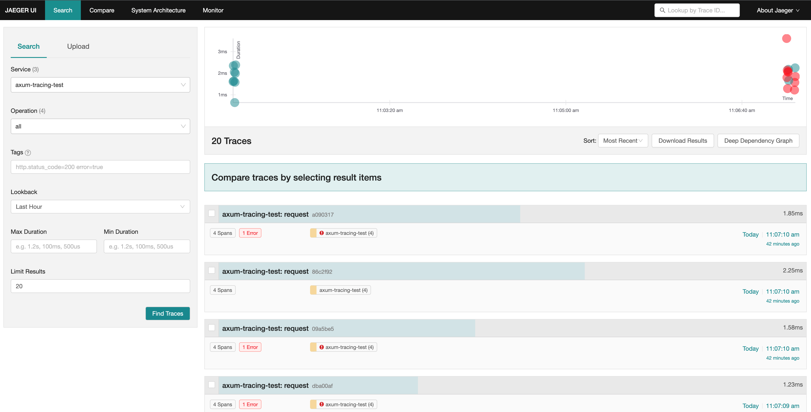
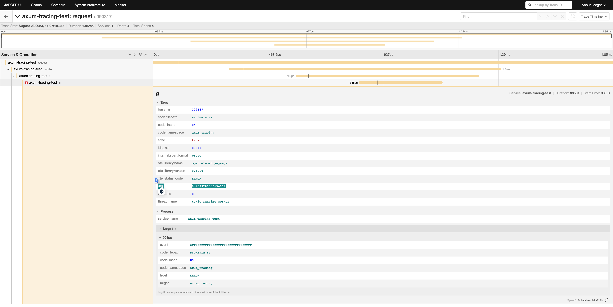

[axum](https://github.com/tokio-rs/axum) を始め、tower 系列（なんかタワレコみたい）でサーバーを作っているといくらでも例が出てきそうな話ではあるが、「君ぃ、明日からRust でトレーシングしたまえ」って言われた時に欲しいまとまった情報は意外とない気がしたので書く。

基本的に tower 系列や、tower に準ずる様な Service トレイトを持つ様なFWであれば同じ様な話であり、[tracing](https://docs.rs/tracing/latest/tracing/) crate 自体は Agnostic なものなので、ここでは axum を例にあげて書く。

## axum と tracing subscriber

まず、簡単に HTML を返すサーバーを作る。

```rs
use axum::{response::Html, Router};
use std::net::SocketAddr;

#[tokio::main]
async fn main() {
    let app = Router::new().route("/", axum::routing::get(handler));

    let addr = SocketAddr::from(([0, 0, 0, 0], 3000));
    tracing::debug!("listening on {}", addr);

    axum::Server::bind(&addr)
        .serve(app.into_make_service())
        .await
        .unwrap();
}

async fn handler() -> Html<&'static str> {
    Html("<h1>Hello, World!</h1>")
}
```


これにアクセスが来たらログを出す様にしたい。一番簡単なのは、

```
println();
```

だが、これはログレベルを設定できないので、ログを検索したり活用する場面で不安だ。

次点でくるのは [log crate](https://crates.io/crates/log) とその実装である [env_logger](https://docs.rs/env_logger/latest/env_logger/) などだろう。これならログレベルもつけれるしフィルタリングもできる。

しかし axum は公式が紹介しているレベルで、もっと便利なものが使える。それが tracing だ。

実は README にもしれっと登場している。

```rs
#[tokio::main]
async fn main() {
    // initialize tracing
    tracing_subscriber::fmt::init();

    // build our application with a route
    let app = Router::new()
        // `GET /` goes to `root`
        .route("/", get(root))
        // `POST /users` goes to `create_user`
        .route("/users", post(create_user));

    // run our app with hyper, listening globally on port 3000
    let listener = tokio::net::TcpListener::bind("0.0.0.0:3000").await.unwrap();
    axum::serve(listener, app).await.unwrap();
}
```

README のコードは subscriber の設定をしているのにロガーを呼び出していないから動作せず、初見だとこの行は一体なんなんだと思うかもしれない。今日はこの設定についてみていく。

## tracing は log と違って何が嬉しいのか

標準のloggerでなく、tracingを使う一番のメリットは trace を作れるところにある。
trace は opentelemetry で説明されている言葉で、

> Traces give us the big picture of what happens when a request is made to an application. Whether your application is a monolith with a single database or a sophisticated mesh of services, traces are essential to understanding the full “path” a request takes in your application.

つまり複数ログを出したときに、そのログのつながりを可視化してくれる。例えば関数 f の中で g を呼び出して、それぞれにログがあった場合、ログの可視化ツール側でそのログの繋がりを可視化できる。つまりどの順序で関数が呼ばれたかを追跡できる様になる。これはとても強力で、例えばエラーが起きたときに、そのエラーのリクエストはどこを経由して送られてきたのかが分かったり、設定をすれば複数アプリケーション間でのトレーシングも可能になったりもする。

そしてそのログの繋がりを構成する単位が Span だ。

> A span represents a unit of work or operation. Spans are the building blocks of Traces. In OpenTelemetry, they include the following information:Name,Parent span ID (empty for root spans),Start and End Timestamps,Span Context,Attributes,Span Events,Span Links,Span Status

Rustのトレーシング系のライブラリは tracing, tracing-subscriber があるが、[tracing](https://docs.rs/tracing/latest/tracing/) が span を作成し、[tracing-subscriber](https://docs.rs/tracing-subscriber/latest/tracing_subscriber/) は span 間の関係を保持してくれる。そのようにしてログの紐付けを実現する。

## trace できるようにする

まず、subsciber の設定をmainに追加する。

```rs
tracing_subscriber::registry()
.with(
  tracing_subscriber::EnvFilter::try_from_default_env()
  .unwrap_or_else(|_| "debug".into()),
)
.with(tracing_subscriber::fmt::layer())
.init();
```

これでdebugレベル以上のものが表示されるのと、ログを標準形式で出力することを指定できる。ログのフィルターは`RUST_LOG` という環境変数でも可能だ。これは env_logger の慣習に従っている。

そしてログを出す。

```rs
#[tracing::instrument]
async fn handler() -> Html<&'static str> {
    info!("aaaaaaaaaaaaaaaaaaaaaaaaaaaaaaaaaaaaaaaaaaaaaaaaaaaaaaaaaaaa");
    f();
    Html("<h1>Hello, World!</h1>")
}

#[tracing::instrument]
fn f() -> () {
    info!("fffffffffffffffffffffffffffffffffffffffffffffffffffffffffffffff");
    let rng = rand::thread_rng().gen();
    g(rng);
}

#[tracing::instrument]
fn g(rng: f32) -> () {
    if rng < 0.5 {
        info!("ggggggggggggggggggggggggggggggggggggggg");
    } else {
        error!("errrrrrrrrrrrrrrrrrrrrrrrrrrrr")
    }
}
```

これを実行すると、

```
2023-08-23T02:30:54.775070Z DEBUG request{method=GET uri=/ version=HTTP/1.1}: tower_http::trace::on_request: started processing request
2023-08-23T02:30:54.775183Z  INFO request{method=GET uri=/ version=HTTP/1.1}:handler: axum_tracing: aaaaaaaaaaaaaaaaaaaaaaaaaaaaaaaaaaaaaaaaaaaaaaaaaaaaaaaaaaaa
2023-08-23T02:30:54.775226Z  INFO request{method=GET uri=/ version=HTTP/1.1}:handler:f: axum_tracing: fffffffffffffffffffffffffffffffffffffffffffffffffffffffffffffff
2023-08-23T02:30:54.775447Z  INFO request{method=GET uri=/ version=HTTP/1.1}:handler:f:g{rng=0.317996084690094}: axum_tracing: ggggggggggggggggggggggggggggggggggggggg
2023-08-23T02:30:54.775606Z DEBUG request{method=GET uri=/ version=HTTP/1.1}:
```

となる。

### span の関係を見たい

しかし、これだと span の関係が見えてこないが、実は内部的には記録されていて JSON 出力すると見れる。

```rs
.with(tracing_subscriber::fmt::layer().json())
```

```json
{"timestamp":"2023-08-23T02:36:25.859852Z","level":"INFO","fields":{"message":"aaaaaaaaaaaaaaaaaaaaaaaaaaaaaaaaaaaaaaaaaaaaaaaaaaaaaaaaaaaa"},"target":"axum_tracing","span":{"name":"handler"},"spans":[{"method":"GET","uri":"/","version":"HTTP/1.1","name":"request"},{"name":"handler"}]}
{"timestamp":"2023-08-23T02:36:25.859904Z","level":"INFO","fields":{"message":"fffffffffffffffffffffffffffffffffffffffffffffffffffffffffffffff"},"target":"axum_tracing","span":{"name":"f"},"spans":[{"method":"GET","uri":"/","version":"HTTP/1.1","name":"request"},{"name":"handler"},{"name":"f"}]}
{"timestamp":"2023-08-23T02:36:25.860100Z","level":"INFO","fields":{"message":"ggggggggggggggggggggggggggggggggggggggg"},"target":"axum_tracing","span":{"rng":0.47366613149642944,"name":"g"},"spans":[{"method":"GET","uri":"/","version":"HTTP/1.1","name":"request"},{"name":"handler"},{"name":"f"},{"rng":0.47366613149642944,"name":"g"}]}
```

最後に呼ばれるロガーには前のログの名前が入っている。

```
"spans":[{"method":"GET","uri":"/","version":"HTTP/1.1","name":"request"},{"name":"handler"},{"name":"f"},{"rng":0.47366613149642944,"name":"g"}]
```

rng 引数も入っているので、エラーが起きた時はここの値を見ることでエラーの原因も特定しやすくなる。

### 可視化したい

せっかく関数の呼び出しの関係が表現されているので可視化してみよう。それをするツールはある。先ほどの形式はいわゆる opentelemetry という規格に(完全には則っていないが)則っているもので、その形式のログを可視化するツールやサービスがある。例えば sentry や datadog も提供しているし、jaeger というツールをホスティングして自前で見ることもできる。ここでは jaeger を使ってみる。

あらかじめ jaeger を起動していれば、

```
docker run -d -p6831:6831/udp -p6832:6832/udp -p16686:16686 -p14268:14268 jaegertracing/all-in-one:latest
```

```rs
global::set_text_map_propagator(opentelemetry_jaeger::Propagator::new());

let tracer = opentelemetry_jaeger::new_agent_pipeline()
    .with_service_name("axum-tracing-test")
    .install_simple()
    .unwrap();

let telemetry = tracing_opentelemetry::layer().with_tracer(tracer);
tracing_subscriber::registry()
    .with(
        tracing_subscriber::EnvFilter::try_from_default_env()
            .unwrap_or_else(|_| "debug".into()),
    )
    .with(telemetry)
    .with(tracing_subscriber::fmt::layer().json())
    .init();
```

を実行すれば、ログが送られているはずである。



そこから辿ると、



と言ったふうに詳細を見れて、0.5以上の値が渡ったからエラーログが出たということまで分かる。

### exporter の指定

opentelemetry には exporter という概念があって、それでログの出力先を決めれる。jaegerに送れたのは jaeger の exporter を利用した体。なので標準出力に出すこともできる。

```rs
let provider = TracerProvider::builder()
    .with_simple_exporter(opentelemetry_stdout::SpanExporter::default())
    .build();
let tracer = provider.tracer("readme_example");
let telemetry = tracing_opentelemetry::layer().with_tracer(tracer);
```

しかしこれだと

```json
{
  "resourceSpans": [
    {
      "resource": {
        "attributes": [
          {
            "key": "service.name",
            "value": { "stringValue": "unknown_service" }
          }
        ]
      },
      "scopeSpans": [
        {
          "scope": { "name": "readme_example" },
          "spans": [
            {
              "traceId": "b4303c719d91c1e7214adbba5485f13d",
              "spanId": "cbd2f2ceeb968f57",
              "parentSpanId": "e30151a99bcd12f4",
              "name": "g",
              "kind": 1,
              "startTimeUnixNano": 1692758796863709000,
              "endTimeUnixNano": 1692758796865160000,
              "attributes": [
                { "key": "code.lineno", "value": { "intValue": 75 } },
                {
                  "key": "code.namespace",
                  "value": { "stringValue": "axum_tracing" }
                },
                { "key": "busy_ns", "value": { "intValue": 1335000 } },
                {
                  "key": "thread.name",
                  "value": { "stringValue": "tokio-runtime-worker" }
                },
                { "key": "thread.id", "value": { "intValue": 9 } },
                {
                  "key": "rng",
                  "value": { "doubleValue": 0.5247877240180969 }
                },
                {
                  "key": "code.filepath",
                  "value": { "stringValue": "src/main.rs" }
                },
                { "key": "idle_ns", "value": { "intValue": 91959 } }
              ],
              "droppedAttributesCount": 0,
              "events": [
                {
                  "name": "errrrrrrrrrrrrrrrrrrrrrrrrrrrr",
                  "attributes": [
                    { "key": "level", "value": { "stringValue": "ERROR" } },
                    {
                      "key": "target",
                      "value": { "stringValue": "axum_tracing" }
                    },
                    {
                      "key": "code.filepath",
                      "value": { "stringValue": "src/main.rs" }
                    },
                    {
                      "key": "code.namespace",
                      "value": { "stringValue": "axum_tracing" }
                    },
                    { "key": "code.lineno", "value": { "intValue": 80 } }
                  ],
                  "droppedAttributesCount": 0
                }
              ],
              "droppedEventsCount": 0,
              "droppedLinksCount": 0,
              "status": { "message": "", "code": 1 }
            }
          ]
        }
      ]
    }
  ]
}
```

というログが出てspanの関係情報が見えない。しかし

```json
"traceId": "b4303c719d91c1e7214adbba5485f13d",
"spanId": "cbd2f2ceeb968f57",
"parentSpanId": "e30151a99bcd12f4"
```

によって別のログと突合して追える様な形にはなっているので、可視化ツールを使って見るべきである。

### 最終形

ここまでのコードをまとめるとこの様になる。

```rs
use axum::{response::Html, Router};
use opentelemetry::global;
use rand::Rng;
use std::net::SocketAddr;
use tower_http::trace::TraceLayer;
use tracing::{error, info};
use tracing_subscriber::prelude::__tracing_subscriber_SubscriberExt;
use tracing_subscriber::util::SubscriberInitExt;

#[tokio::main]
async fn main() {
    global::set_text_map_propagator(opentelemetry_jaeger::Propagator::new());
    let tracer = opentelemetry_jaeger::new_agent_pipeline()
        .with_service_name("axum-tracing-test")
        .install_simple()
        .unwrap();

    let telemetry = tracing_opentelemetry::layer().with_tracer(tracer);
    tracing_subscriber::registry()
        .with(
            tracing_subscriber::EnvFilter::try_from_default_env().unwrap_or_else(|_| {
                "debug".into()
            }),
        )
        .with(telemetry)
        .with(tracing_subscriber::fmt::layer().json())
        .init();

    let app = Router::new()
        .route("/", axum::routing::get(handler))
        .layer(TraceLayer::new_for_http());

    // run it

    let addr = SocketAddr::from(([0, 0, 0, 0], 3000));
    tracing::debug!("listening on {}", addr);

    axum::Server::bind(&addr)
        .serve(app.into_make_service())
        .await
        .unwrap();
}

#[tracing::instrument]
async fn handler() -> Html<&'static str> {
    info!("aaaaaaaaaaaaaaaaaaaaaaaaaaaaaaaaaaaaaaaaaaaaaaaaaaaaaaaaaaaa");
    f();
    Html("<h1>Hello, World!</h1>")
}

#[tracing::instrument]
fn f() -> () {
    info!("fffffffffffffffffffffffffffffffffffffffffffffffffffffffffffffff");
    let rng = rand::thread_rng().gen();
    g(rng);
}

#[tracing::instrument]
fn g(rng: f32) -> () {
    if (rng < 0.5) {
        info!("ggggggggggggggggggggggggggggggggggggggg");
    } else {
        error!("errrrrrrrrrrrrrrrrrrrrrrrrrrrr")
    }
}
```

## オーバーキル

### otel までする必要があるのか

しかしここまでやっておいてなんだが、自分はこれはやりすぎだと思っている。昨日、[オブザーバビリティにはお金がかかる](https://dev.henry.jp/entry/observability-and-cost) というブログがバズっていたが、コストがかかる。jaeger を使うならそれの管理コストはかかるし、SaaSに切り出しても otel 周りの機能はアドオンが必要でコストがかかる。

なので、otel 系のツールを使わずに tracing-subscriber のログをそのまま出すだけでいいと思っている。例えば JSON 形式で出せばそれは構造化ログとして datadog 上で検索可能となり、span を見ればどういう順序で関数を辿ってきたかも記録されている。なので可視化できなくても読み取ることができる。

構造化ログでいうと少し落とし穴はあって、GCPが求めるフォーマットとは若干違っていて（ログレベルのキーがSeverityじゃない）、もしGCPに完全準拠させるなら formatter を書く必要があってこれがめんどくさい。一応 [tracing_stackdriver](https://docs.rs/tracing-stackdriver/latest/tracing_stackdriver/) というクレートで対応できるがこれは 3rd party だ。

### ステータスコードを見る必要があるか

上で説明はしていないのだが実は

```
.layer(TraceLayer::new_for_http());
```

という設定を足していた。これは tower-http の機能で、リクエスト自体を status code と共に tracing してくれる。しかしこれは不要だと思っていて、そのロギングはデプロイ先のツールがしてくれているはずである。なのでそれを見ればいいと思っている。またログの対象は info や error と言ったものに絞った方がコスト面でも良いと思っているので、すでに別のところでログが取られているのであれば、アプリケーション側で正常系も含めてなんでもかんでもロギングする必要はないと思っている。ここではシステムを跨いだ分散トレーシングというよりは１アプリ内でのトレーシングに注目しているのでいらないという結論だが、世の中的には分散トレーシングに興味がありそうな雰囲気を感じるのと、実際に使われていそうな気がしたので紹介した。
