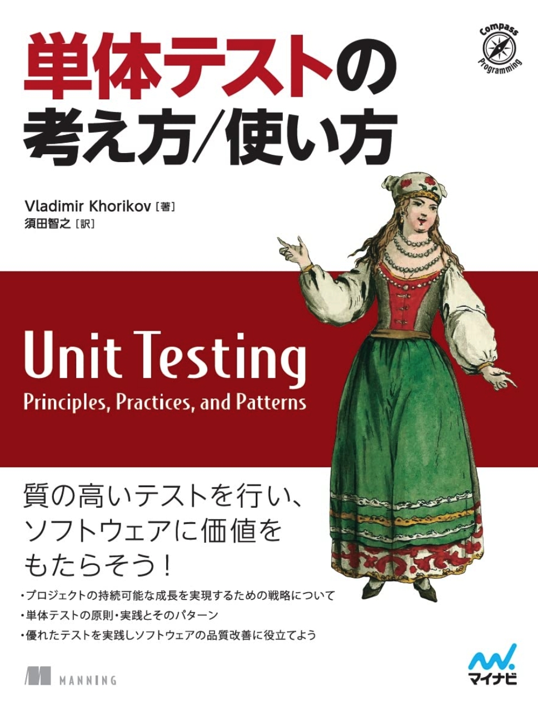

「private 関数にはテストを書かない」というのが多数派だと思う。だが昨日、仕事で In-source testing を書いていたらふと private 関数にテストを書きたくなった。そこで、In-source testingができる環境下でもprivate 関数にテストを書くべきかを X で聞いてみたら何か盛り上がっていた。

(In-source Testing: <https://vitest.dev/guide/in-source.html>)

反応を見る限り、やはり「private 関数にはテストを書かない」の方が主流だった。Kent Beck先生の <http://shoulditestprivatemethods.com> を紹介するツイートにもそういった反応が寄せられていた。（[ぶんぶんさん、教えてくれてありがとうございます。](https://twitter.com/adoring_onion/status/1694625381217890665?s=20)）

（このサイト面白すぎますよね・・・）

自分の立場をはっきりさせておくと、「テストをしたくて private 関数を public にするのは避けるべきだが、In-source testing できるのであればテストしても良いし、した方が良い場合もある。むやみやたら書くのは反対」である。そして結局は「ホワイトボックステストが有効な場面か」「多数の呼び出し元から再利用されるモジュールなのか」という点でケースバイケースではあるのだがケースバイケースで片付けると多数派が正しいものとして意思決定されがちだと思うので、自分は「書いても良い」という語尾で主張したい。

## private 関数のテストをしなくてもいい理由

さて、private 関数にテストをしなくていい理由をまず考えてみよう。昨日のツイートへの反応だったり、自分がこれまで言われたり調べたり、[単体テストの考え方/使い方](https://amzn.asia/d/dZahYWL) に書かれていたことだ。

### private 関数をテスト可能にするために export することはおかしいから

いまは In-source testing を忘れて考えると、private 関数をテストするには多くの場合は public にする必要がある。リフレクションや魔法のアノテーションがないのであればpublicにすることとなる。これはテストのためだけに設計が歪んでしまっているので避けるべきものである。

private 関数をラップして public にしたバージョンを `ForTestIfYouUseInAppYouWillBeFired` みたいな suffix 付けてテストすればいいのではとも思わなくもないが、本来不要なものが外に見えてしまっているのはインターフェースの設計者からは反対意見も出るようだ。

### 最小限のコストで最大限の効果を出したいから

[単体テストの考え方/使い方](https://amzn.asia/d/dZahYWL)は、良いテストケースの構成要素に「最小限のコストで最大限の効果を出すこと」を挙げている。テストを書く目的はテストを書くことではなくて別のところにあって、その恩恵を受けるための考え方として至極真っ当だ。その恩恵はビルド時間やケースの修正時間などにあり、それを総合的に良いものにしていけるようにしたい。

### 実装の詳細を知りすぎるのはリファクタリングへの耐性が落ちる

この意見が一番多い気がする。[単体テストの考え方/使い方](https://amzn.asia/d/dZahYWL)にも末尾にアンチパターン集というのがあって、アンチパターンとしてこの理由で述べられている。

そこでは実装の詳細が漏れ出したテストはすぐに落ちる偽陽性を生みやすく、その結果テストに対する不信感を醸成してしまうので避けようという主張だ。観察可能な振る舞いにのみテストせよと言われている。

他にも昨日もらった意見としては、公開関数だけをテストしていれば内部リファクタリングしたときにその In と Out さえあっていれば中を簡単に変えられるが、private 関数をテストしていたらその変更の都度テストが落ちることとなり、その修正がコストになってくるというのもある。

### private 関数にテストを書きたくなったらそもそも設計がおかしいから、そちらを直す

昨日のツイートについた意見としては 「private 関数にテストを書きたくなったらそもそも設計がおかしい」というのもあった。テストが書きたくなるほどのロジックが詰め込まれているのは、もっと疎結合に作れる余地がありそうというのは感覚的には分かる。

## private 関数をテストしたいことはおかしくないと思う

一方で 「実装の詳細を知りすぎるのはリファクタリングへの耐性が落ちる」「private 関数にテストを書きたくなったらそもそも設計がおかしいから、そちらを直す」には反論できる余地があるとも思う。

### 実装の詳細を知りすぎるのはリファクタリングへの耐性が落ちる

これは程度の問題と工夫の問題でもあると思う。

#### 耐性が落ちることは悪いことなのか

まず、リファクタリングの耐性が落ちることで頻繁にコードが落ちて不信感を産むことや、リファクタリングをしにくくなってリファクタリングに対するモチベーションが下がってしまうというのは分かる。悪いことだ。

けど、「外部的振る舞いを保ちつつ、内部構造を改善する」という意味でのリファクタリングがされる場面は、新規開発やバグ修正に比べたらする機会は多くないと思っているので、そのコストは頻繁に発生しないと思っている。またprivate関数は In と Out がはっきりしていることがほとんどだと思うし、副作用があったとしてもスコープがちぎられている関数であるので修正も容易のはずだ。数は多くなるのかもしれないが、直していける範囲だと思う。

頻繁に落ちると言っても自分の変更をレポジトリにPUSHするときにCI回していれば気付けるし、自分起因でのfailだとコードやテストに対して不信感も抱かないと思う。

ただそのコストが生まれるからリファクタリングしにくくなるという問題は残り続ける。なのでprivate 関数のテストはリファクタリング時は消して、再構築してもいいのではと思った。

#### private 関数のテストの priority を下げてはどうか

リファクタリングへの耐性が落ちることを問題視するのであれば、public関数のテストが通っていて、private 関数のテストが落ちた場合は最悪消しても良いのを最初に合意しておくのも手だと思う。おそらく「落ちるテストによって行動が制限されたくない」という願望も含んでの主張だとは思うのだが、元々足される必要のないテスト（自分は必要あると思っているけど）がされていたと考えたら簡単に消せるのではないのだろうか。

そして消して作り直せばいいのである。private関数を作り直すときに、しっかりと IN/OUT を意識していればケースは簡単に作れると思う。private関数を作れた時点でテストコードはprivate関数そのものを作るに比べると簡単に作れると思う。

#### 網羅するテストを公開関数から流すのはケース作りが大変ではないか

またテストの網羅性を重視するのであれば公開関数だけをテストする方がリファクタリングへの耐性が落ちると思う。分岐に入るためのテストケースを作ったり、どうにかして実現させるためのモックを用意するのが大変だと思う。テストデータを共通化させるとその変更で他のテストが落ちるようになったり、ソースコード本体に手を入れたときにテストケースのどの部分を直せばテストが通るのかは内包するprivate関数のソースコード全体を読んで考えなければいけないので手間だと思う。これはそもそもホワイトボックステストをすべきかという話にも飛び火するのでこれ以上はあまりしないが、ホワイトボックステストした方が良い場合はあるのでその場合は主張として弱くなると思った。

### 「private 関数にテストを書きたくなったらそもそも設計がおかしいから、そちらを直す」への反論

これに関しては、要件そのものが複雑で一つの手続きが長いという場面はザラにあると思うので、「設計がおかしいから」とは一蹴できないと思っているし、そのような要件でテストをどう書くかを自分は議論したい。また、例え[SRP](https://xtech.nikkei.com/atcl/nxt/column/18/02319/010500002)を徹底して分割したとしても、その関数が再利用されるものであるならば良いがそうでないならテストのためだけにpublicにしたとも言える様な状況なので、それはそれでどうなのかとも言いたくなる。もちろん設計がおかしいことへのシグナルとして捉えるのは大いに賛成だ。

## private 関数にテストをしたい理由

さて、「private 関数のテストをしなくてもいい」への反論を書いてはきたが、今度はしたい理由について語ろうと思う。

### お守りとしてのテスト

ここでお守りと書いたのは効果が確約されているわけではないというニュアンスを含めたかったからだ。private関数にテストが不要という意見の裏には、小さい関数をテストしても効果は限定的でコスパが悪いというのが含まれているのだろうが、それは納得している。「最小限の労力で最大の成果を」だ。

だが開発者が自分の書いたコードの正しさを示し、それをテストコードの実行をソースレポジトリとCIの起動ログに残せるのは、自分達が安心感を得るという点ではとても効果的だと思う。自分はこの安心感というのは馬鹿にならないと思っていて、安心感があることで他の問題が起きた時の原因の切り分けがしやすくなる。それがソースと記録に残るのはとてもありがたい。

### ドキュメントとしてのテスト

テストは一番信用できる仕様だ。

その関数がどういう挙動をしているかを知りたい時、実装を読むかドキュメントやコメントを読むかになると思うが、実装を読むのは自分が書いたコードじゃなければ読解フェーズと作者の気持ちを考えるフェーズが発生するし、ドキュメントやコメントは実装を反映しているとは限らない（齟齬や乖離があるのは珍しくない）ので、本当に正しくその挙動を human readable に表現してくれているのはテストだと思う。なのでテストはドキュメントだと思う。特に In と Out がはっきりしている関数の場合、どのような入力と出力になるのかが実際に実行しなくても分かるのはとてもありがたい。実際に実行してその値をキャプチャするのはとても大変だ。なのでその例示があるだけで、既存コードの改修や読解をしないといけないときはとても助かる。これは private 関数においても言えることだ。

もちろん example を JSDoc か何かで書けばいいのかもしれないが、先に述べた様にコメントは機械的には信用できないのでやはりテストがあるのが嬉しい。

その点素晴らしいのは Rust で、[コメントに書いた example をテストできてしまう](https://doc.rust-jp.rs/rust-by-example-ja/testing/doc_testing.html)。もはや private 関数へのテストをドキュメントで行えてしまうのである。（宣伝終わり）

## 現状は妥協してしていたが、In Source Testing できるのであれば積極的にしていきたくなっている

private関数へのテストにメリットを感じつつも、そのために prviate を public にするのは正直これまでは気が引けていた。それが In-Source Testingによって public にしなくてよくなるので、自分にとってはこの機能が private 関数にもテストを書くようになるきっかけになるように思っている。

で、皆さんの温度感はどうなんだろうと思って聞いたのが冒頭のツイートである。

## 程度問題にはしたくない

さて、ここまで書いたがおそらく皆さんの頭の中は「いや、それでもprivate 関数にテストを書くな」か「ケースバイケースな議論だ」となっていると思う。ケースバイケースな議論なのは自分も分かった上で書いているので、どうしてわざわざ話に出したかを最後に書こうと思う。

ケースバイケースとは言っても、その下地には「private 関数にテストを書くべきではない」があると思う。なぜならテストの教科書や偉い人はそう言っているからだ。「べき」を下地においてケースバイケースという言葉で片付けていると、実務上の意思決定は「教科書」「元々のコーディング規約や慣習」「偉い人」「多数派」によって決まってしまうこともあると思う。なので「ケースバイケース」としてではなく「private 関数にテストを書いても良いよ」という風に優しく言われたいと思って書いた。

個人開発ならケースバイケースとして好きにすればいいと思う。

## 自分はどうするか

private 関数にもテストを書いていいという条件のもと、要件に合わせて次のどれかを取るか複合的に組み合わせる

- public な関数に網羅的にテストを書き、private 関数にもドキュメントの役割として簡単な正常系のテストだけ書く
- 公開関数に対して網羅的なテストケースを作るのが難しければ、private 関数に網羅的なテストを書き、public な関数には最もシンプルな正常系のテストを書く
- 言語特性上仕方なく分岐が生まれているが、要件的に絶対にそのパスに入らない時など、コスパ観点で網羅的にテストしなくて良いような場面であれば、publicな関数にだけありえる入力値だけでテストする

ただ、色々書いたが自分が取るであろう選択肢は、「基本的にprivateメソッドにテストは書かないが、ドキュメントの役割としてin-source testingでexampleを書く」だと思う。
