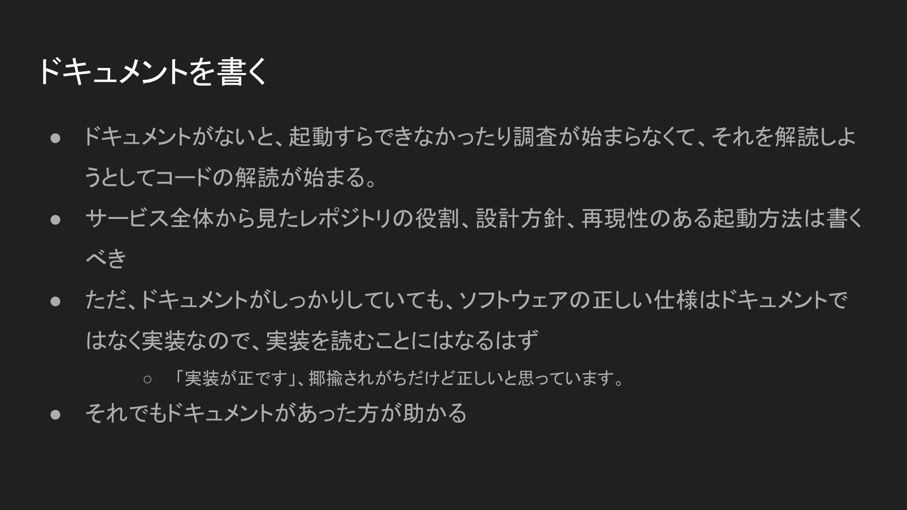
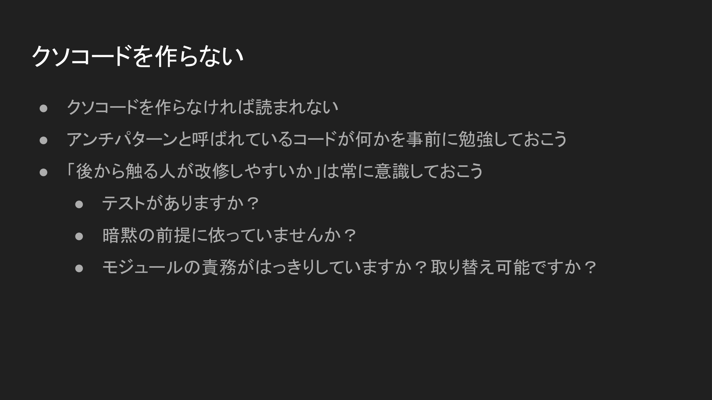

## クソコードを読ませない💩

<https://uit.connpass.com/event/291443/>

## 免責事項

「クソコードという言葉を使うな」と思った人、いると思います。

攻撃的で、解像度も荒くて、建設的でない言葉だと私は思っています。

一方で、目にすることも多い言葉であり、具体例に関してはふわりとした共通認識が持たれているのと、そういったコードに対するダメージコントロールの話なので、便宜上クソコードという言葉を使います。とあるソースコードに対してクソコードと呼ぶのはよくないですが、クソコードという概念そのものについて話すことに対しては有益だと思います。

## 自己紹介

sadnessOjisan

JS/TS, Rust, 最近 Go, PHP

マイブーム: 優光というラーメン屋

## クソコードとは何か

クソコードとは何でしょうか？

知りません。

インターネットミーム？

https://togetter.com/li/544905

## どういうコードがクソコードと呼ばれている？

どういうコードがクソコードと言われているか。

いわゆるアンチパターンと呼ばれているコード

無駄に広いスコープの変数の定義、不要に mutable、情報量のない変数名・関数名などなど

※これらが本当にアンチパターンかの議論はいまはしません

どこか触ると全体がすぐ壊れてしまうようなコード

もしくは認知負荷の高いコード

過剰な抽象化、解読や考古学が必要なコード、難しい(not 悪い)コード
俺の常識の中では読みやすいコード neq あなたの常識の常識の中で読みやすいコード

自分の気に入らないコード全て

悪意なく、すぐに「クソがーーーーーーーーーーーーーーー」と叫ぶ人もいる

## そもそもクソコード = 悪？

そもそもクソコード = 悪？

「どうあれ、動いているコードが一番えらい」という考え方もある

実は自分はこの立場

自分はクソコードを許容したい

ではクソコードを問題にしたいときはどういう時なのか？
=> 向き合う必要がある時

## クソコードと向き合う必要があるシナリオ

クソコードと向き合う必要があるシナリオ

バグの原因調査

仕様の書き起こし

式年遷宮

レビュー

## クソコードと向き合う時の付き合い方

クソコードと向き合う時の付き合い方

実装を読まなければいい。どんなにクソであっても、挙動を把握し、正しく動くのなら、その箇所は読む必要はない。

自分はクソコードを生産しがちという自覚の上（指摘実績多数）、
コードを読ませないように気をつけていることについて話したい

## クソコードを読ませない技術

## ドキュメントを書く

ドキュメントがないと、起動すらできなかったり調査が始まらなくて、それを解読しようとしてコードの解読が始まる。

サービス全体から見たレポジトリの役割、設計方針、再現性のある起動方法は書くべき

ただ、ドキュメントがしっかりしていても、ソフトウェアの正しい仕様はドキュメントではなく実装なので、実装を読むことにはなるはず

「実装が正です」、揶揄されがちだけど正しいと思っている。

それでもドキュメントがあった方が助かる

## API仕様書を書く

エンドポイントが何を IN / OUT するか分からないと、エンドポイントの実装から解読される

サーバーの IN / OUT を明記しよう

IN / OUT の情報がしっかり充実していれば、挙動を知るために利用者は実装を読みに行く必要はない。

<https://swagger.io/tools/swagger-ui/>

## 正しいAPI仕様書を書く

正しいAPI仕様書を書く

仕様書と実値が異なると、調査のためにコードを解読される。そしてそれをする人は「なんで値ずれてるねん」と怒っているかもしれない。

人間の手で書かれたAPI仕様書は嘘をつきがち

なるべく実装と仕様が一致するような機械的な仕組みを導入する

スキーマファースト、スキーマファイルからバリデーターを生成して、バリデーションする

コードファースト、コードに埋め込まれた特殊なコメント、アノテーション、IDLから仕様を生成する。バリデーションはFW側でできる

## コメントにwhyを書く

作者の気持ちが分からないと、類推しようと前後を解読される。類推できなければ意味不明なコードとして扱われる。

認知負荷のコードがクソと呼ばれてしまうのは、そのコードの意図を想像しないといけないから。

後から読む人の「なんで！？」に先回りしてコメントを書くようにすると良い

## 情報を全てURLから辿れるようにする

口約束したものをコードに落とすと、後任者にその箇所は意味不明なコードとしてクソコード扱いされる。

「歴史的経緯でこうなった」「別チームとの会話でやむを得なくこうなった」という事情が反映されたことによる生成されるひどいコード、見たことあると思う

後から辿れるように、会話の議事録やメモを残す、後から辿れる場所で会話するようにして、そのリンクをコメントに残す

GitHub Issue, Slack, Discord などなど

Notion, Google Docs はオススメしない。コメントに対してリンクを作れない。

## 型を書く

変数・引数に何を取りうるか分からないと、部分的に実行されたり周辺コードを読まれる。

型があると、関数のINとOUTが分かる

ドキュメントに example でも良いが、その情報と実装が一致していることの機械的な表明にはならないので、型で書かれていた方が読み手は嬉しい

その上で実例があった方がイメージがつきやすくて読み手は嬉しい

## 型を分ける

型からの情報が少ないと、取りうる値を網羅しようと周辺を読まれる

型はなるべく細かい方が良い。その関数が何をとりうるかがはっきりするからだ

とりうる状態はユニオンで表記する

あり得ないケースが省かれる

エラーが起きたときは、１回目成功したデータがあればそれを表示させるということも型から読み取れる（コメントに欲しいけど）

## テストを書く

その関数・処理が実際にどう動くのかが分からないと、実際に動かして挙動を確かめられたり、デバッガを仕込まれてしまう。その結果、そのコードが読まれてしまう。

テストは、そのコードがどう実際に動くのかという仕様でもある

実際に取りうる値でのテストが充実していると、そのソースコードが何をしているのかを把握できる

## E2Eテストを書く

ソフトウェアの仕様を後から調査したくなると、エンドポイントからコードを追われてしまう。

定期的に式年遷宮したくなる

ソフトウェアのユーザーからの使われ方を機械的に説明するために、E2E テストが有効

テストだけ別workspace で定義してコンテナ同士でテストするのがマイブーム

<https://blog.ojisan.io/container-test-on-gha/>

## ログを出す

障害報告があったとき、その調査としてエンドポイントからコードが読まれていく。その過程でクソコード書いたことがバレる。

どの地点で、どんな現象が起きたかはちゃんとログに出そう。読まれる場所を減らすことができる。

検索・可視化しやすいように構造化ロギングがオススメ

## tracing する

それでも障害調査のためにはどのようなリクエストがどこをどう通って障害が引き起こされたかは調査される。

「ここに入ってくる引数はなんだよ！」と読み手に言わせないために、tracing しよう。

opentelemetry 系のツールがオススメ <https://opentelemetry.io/docs/concepts/signals/traces/>

Rust だとマクロ書くだけで実現できたりする

<https://blog.ojisan.io/rust-tracing/>

## アラートを出す

バグが起きることが事前に分かるのなら、アラートに出しておくと、アラート起点で原因調査するのでエンドポイントから解読されない

ログレベルをつけた標準出力、SentryなどのSDKを利用する

ログレベルさえあれば Datadog のようなツールでアラートとして扱える

## エラーに名前をつける

ただし、アラートを出してもそのエラーの中身の情報量がないと周辺コードを全部読まれてしまうので、ちゃんとエラーの名前やメッセージを充実させる。

JSだと throw new Error() とするだけでなく、カスタムエラーを定義して、throw new MyCustomError() として呼び出そう。

<https://blog.ojisan.io/my-new-error/>

## エラーにトレースを含める

`try { yabaiKansu() } catch (e) { captureError(new MyError())};` とするとエラーを引き起こした原因が追えなくなる。

エラーに trace を積む仕組みが Node v18 から使えるようになっているのでそれを使おう。

<https://blog.ojisan.io/my-new-error/>

## サービス間通信の呼び出し元は明記させる

誰がどの目的でAPIを使っているか分からないと、APIの呼び出しの入力が想像できず、結果としてエンドポイントから全部コードが読まれてしまう。

呼び出し元がログから分かるようにする

認証必須にする

Basic 認証でも ID/PASS を各サービスごとに払い出す

最悪 user-agent にサービス名を書かせるようにする。書かないと 400 エラーにしても良い

## クソコードを作らない

クソコードを作らなければ読まれない

アンチパターンと呼ばれているコードが何かを事前に勉強しておこう

「後から触る人が改修しやすいか」は常に意識しておこう

テストがありますか？

暗黙の前提に依っていませんか？

モジュールの責務がはっきりしていますか？取り替え可能ですか？

## まとめ

クソコードの定義は知らないが、読み手の疑問を解消できなければどんなコードでもクソコード扱いされうると思っている。

明瞭なコードを書く技量がないのであれば、いかに読ませないかがクソコード判定されないコツ

今日あげたこと意外にも何個もプラクティスはあるが、一貫して言えるのは、「後から読む人は何があると嬉しいか」を意識すると良い。
