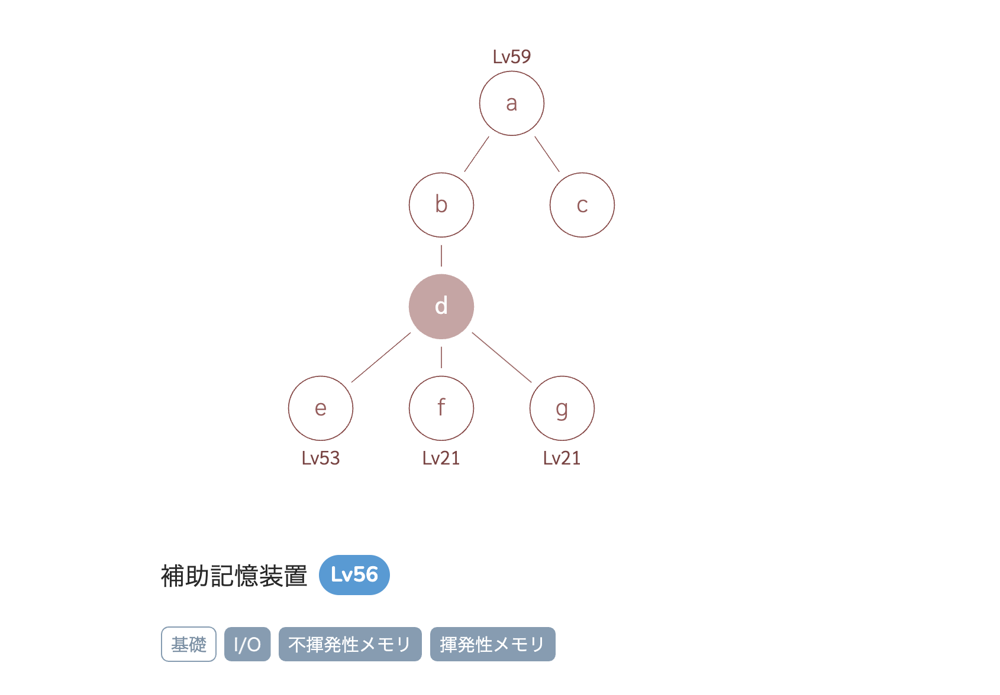
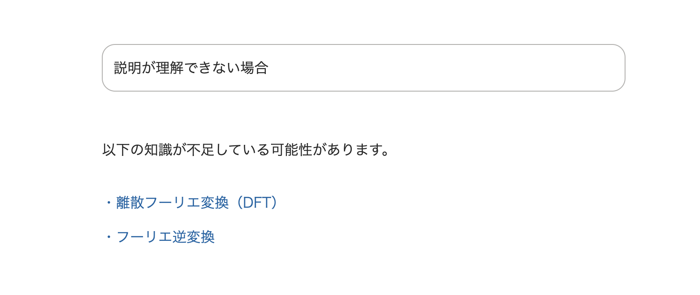

## はじめに

とても前になるが、[コグニカル](https://cognicull.com/ja) というサイトが盛り上がっていた。

これは知識を体系的に記述されていて、分からない概念があればその概念の理解に必要な概念を逆引けるサイトだ。コンピュータ以外にも数学や理工学全般を学べる。

コメントを見ると、インターネットを使った学習で、自分の分からなかったことを辿れる学習や体系だっていることに対して価値を感じているようだ。「誰が何のためにどうやって作ったのか情報がぜんぜんなくて怖い」というコメントがあるが、同感だ。怖い。そして教育工学を専攻していた身としては地に足ついたアウトプットが人の役に立っていて羨ましくも思うし、尊敬する。

実はこのような教授手法は古くから研究されている。それは知識をネットワークで表現するだけでなく、個々人の学習履歴や成績を元に次に学ぶものを提案する方法も提案されている。コグニカルを知った時にその技術についてのブログを書こうと思ったがすっかり忘れていた。先日たまたま日本教育工学会のサイトを見る機会があって思い出したのと、いま「俺、本当はこういう仕事やりたいんすよ〜」と言わないといけない場面が今度あるのでその資料作りがてらブログを書く。

## 書いている自分の背景

僕のことを知っている人は、Web周りの技術者だと思っているはずだ。だが学生時代はWeb開発とは無縁で研究テーマは認知心理学と教育工学だった。なので教育工学の基本的なトピックは一応は抑えているつもりだ。

自分自身の問題意識として、全く興味がない大学の全く興味のない学部に進学して勉強したいことが何もできなかったという原体験を元に、学校に頼らず学べるような仕組みを作りたいと思っていた。自分の興味は今もずっと教育工学にあるし、教育周りの仕事をいつかやりたいと思っている。

## アダプティブラーニング

提示する学習内容を個々人の学習履歴から最適化する技術としてアダプティブラーニングというのがある。

AI技術と教育工学・認知心理学の歴史はとても長く、理論としては1960年代からあったらしいがアダプティブラーニング（適応学習）という手法は 2015, 6年あたりから産業として急に流行り始めた。実産業として実装されたことで急に知名度が広がった。その先駆けは [Knewton](https://japan.knewton.com/) だったと思う。日本でも [2015 年に z会が採用](https://www.zkai.co.jp/news-press-20150709_knewton/)していた。

### 概念

アダプティブラーニングは学習内容を個々人の学習履歴から最適化する技術だ。その前提として、知識はネットワークで表現されると仮定する。そして「ある概念Aを理解するためには概念Bと概念Cの理解が必要」といった依存関係を有向グラフで表現する。このときに概念Aを理解していないことがテストなどで明らかになった場合、その原因が概念Bもしくは概念Cのどちらかにあるかを学習履歴から推論できる。そのようにして学習者に次に学ぶ項目をナビゲートするシステムを作ることができる。

このようなシステムがあれば究極的には教師にナビゲータの役割は不要となり、学習者が自分の目的に沿って自習ができるようになる。はず。

### 基礎的な要素技術

そういったシステムをアダプティブラーニングエンジンと言ったりするが、伝統的には次の要素技術で構成される。

#### ベイジアンネットワーク

先の例をあげると、概念A、B、Cの理解を問うテストがあるとする。この回答データがあれば、Aを理解している人がBを理解している確率、Aを理解している人がCを理解している確率と言ったふうに、とある概念を理解しているかどうかについての条件付き確率を求めることができ、それを全パターンを集めると条件付き確率のテーブルを作ることができる。その結果、たくさんデータがあると言う前提の元、どれを理解していればどれを理解していないかと言う構造を見つけることができるようになる（そういうアルゴリズムがある、もしくは専門家が所与のものとして構造を定義する（これが現実））。そして構造を作ってしまえば、今度はテストの結果を入力に、どの単元の理解不足による誤答かという推論をすることができるようになる。

ただの条件付き確率ではなく、ベイジアンネットワークを用いる良いところは構造ありきで考えられるところだ。もし専門家が事前に構造を与えられるのであれば専門家の知識を活かした推論ができることになるし、構造ごと推論すれば未知の知識構造を発見することにもつなげられる。

#### 項目反応理論

ある設問が、学習者の能力の測っているかを判定する理論で、設問の質を図る手法だ。データサイエンス畑の人に一言で説明するならば、回答者の能力（θ）と設問の識別力(a)と設問の難易度（b）をパラメータにとったロジスティック関数で、aの値によって傾きが大きくなるテストは良いテストだとする理論だ。言い換えると、悪いテストとはどのような能力を持った受験者でも正解不正解が50パーセントの確率で決まってしまうテストだ。当てずっぽうで正答できると、そのテストは能力を判定するテストとして良くない。代わりに能力が少し違うだけで正解不正解が綺麗に分かれるテストは、その能力を図る上では良いテストだと言える。

項目反応理論を使うと嬉しいのは、能力と問題の難易度を分離して考えられることだ。そして回答データをもとにロジスティック関数のパラメータを推定することができれば、設問Aと設問Bはどちらが難しいかということがわかったり(パラメータbの値を比較)、とある能力項目を測るときに同じ問題を使いまわさずに同じような難易度の問題で試験をすることができるようになる。

この理論は適応型テストと呼ばれる形式のテストで使われており、テストセンターに行って受けに行くいわゆるCBTベースのテストが採用しているやり方だ。伝統的な就活をしたことがある人は身に覚えがあると思う。

### 実装されたケース

このベイジアンネットワークと項目反応理論を組み合わせると、条件付き確率テーブルを更新するときに、学習者の成長によって正答したのかどうかという軸で組み合わせられるようになり、正答・不正答というテーブルではなく理解・未理解といったテーブルで条件付き確率を考えられるようになる。

この組み合わせは実プロダクトでも使われていた。Knewton が出しているホワイトペーパーには項目応答理論で学習者の能力を測って更新し、推論エンジンを使うと記述がある。https://www.profijt.nu/wp-content/uploads/2015/09/20150902-White-paper-The-Knewton-Platform.pdf

knewton 自体はアダプティブラーニングエンジンと呼ばれていて、塾や学校のような教育会社が自分達の教材にアダプティブラーニングを組み込む SaaS だ。データサイエンス的なアプローチだけでなく、学習者の成長モデルを時系列で定義したり、教材にアダプティブラーニングエンジンを組み込むためのワークフローをオントロジー（語彙）として提供していたり、伝統的な教育工学のアプローチを活かしていて、研究者が監修したとても誠実な製品という印象がある。

### あまり流行らなかった

ただ夢のような技術ではあるものの、そういった教育はあまり普及していないことは肌感覚としてあると思う。つまりそこまで普及はしなかった。その理由を述べる。

#### なんだかんだで使わなくても弱点は分かる

まず学習者自身に向上心があれば、自分の弱点はどこかというのは探そうとするし、その弱点とAIチューターが教える結果は大きく違いがない。自分が何が苦手かはシステムに頼らずとも分かる。もしくはコグニカルのように教授マップと教材さえあればそれで良いのである。

ちなみにいまも「AIの力で学習者をナビゲートします」的な製品はあるが、結構インチキしていたりもする。なぜなら人間の尺度や認知は絶対的なものではないからだ。要するに多少いい加減でもバレない。でもいい加減だからといって役に立たないわけではなく、ある程度いい加減であっても結果としては正しい提案だったりもするのである。そういった緩さが許されている。

#### 教師は必要

いくら弱点がわかったところで、それを勉強した結果として誤答しているなら、その部分を理解するための教材が必要となる。その教材の提示までシステムをカバーしていなければ、結局は教員のような教えてくれる存在が必要となってしまう。そして自分の理解に合わせたピッタリな教材は大体用意されていない。

#### 肝心の教材とテストがない

そもそもテストが存在するドメインでしかこの手法は使えない。高校までの学校教育では成立するかもしれないが大学生や社会人の勉強で使えるかというと難しいだろう。資格試験とは相性がいいかもしれない。

#### 従来型の学力ではなく、生きる力を育みたい

生きる力云々は[高大接続](https://www.mext.go.jp/b_menu/shingi/chukyo/chukyo3/gijiroku/__icsFiles/afieldfile/2014/12/18/1354117_12.pdf)の際に言われた話ではあるが、テストに対する教育は以前に比べると少し熱が引いている。今は生きる力と呼ばれているものを育むことにも注目が寄っていて、教育現場におけるICT利活用研究では協調学習や思考学習の支援といった方向の方が注目されていると思う（昔から盛んだとは思うけど）。教育工学のトピックにおいてアダプティブラーニングはごく一部でしかなく、研究としても一大トピックというわけではない。ただ、受験産業自体はあるので、産業界には需要が強いのと、そこがお金になるから産業としては目立っている。

### いまのアダプティブラーニングの使い所

だからアダプティブラーニングを万能ツールとは扱えないのだが、それでもアダプティブラーニングが活きる場面はあるし、ハマる場面ではとても良いものだ。

#### 教員不足への対応

教育とICTの組み合わせの目的には教員不足への対応という側面がある。映像学習などもそうだ。アダプティブラーニングも例に漏れず、教員の仕事を代行できる技術であり、需要はあり続ける。

#### カリキュラムが存在する分野

対象領域の地図とテストが存在することが前提の技術なので、何を学ぶのかがきっちり決まっている領域で力を発揮する。そのため学校や塾での教育に使える。

特に最近は教育現場にタブレットの導入されたこともあり、教育のデータが取りやすくなり、兼ねてからあまり実態がともなっていなかった [eポートフォリオ](https://resemom.jp/article/2018/04/19/44151.html) や LMS([Learning Management System](https://e-words.jp/w/LMS.html))開発が産業として盛り上がっている。そしてそこにチューターシステムとしてアダプティブラーニングが取り入れられている。国内でもそういう事業は既にいくつかある。

#### ゆるいコンテンツ推薦

テストをする必要がなく評価が厳格でなくても許される分野での推薦システムとしても使える。例えば記事に「理解しましたかボタン」みたいなのを用意しておき、それへの反応から理解度を推定し推薦するといったような使い方もできる。読者が向上心を持っていて、自分に正直に理解・未理解を申告してくれるようなサービスであれば実現できる。

ただこれは知識のネットワークを所与として与えることはできないので、自分達でマイニングする必要がある。

そして自分はメディアサイトでこの機能を作ってみたい、今の会社か次の会社でやりたい。

## 参考文献

- [人工知能と教育工学―知識創産指向の新しい教育システム](https://amzn.asia/d/cbDJkxE)
- [The KnewtonPlatform A General-Purpose Adaptive Learning Infrastructure](https://www.profijt.nu/wp-content/uploads/2015/09/20150902-White-paper-The-Knewton-Platform.pdf)
