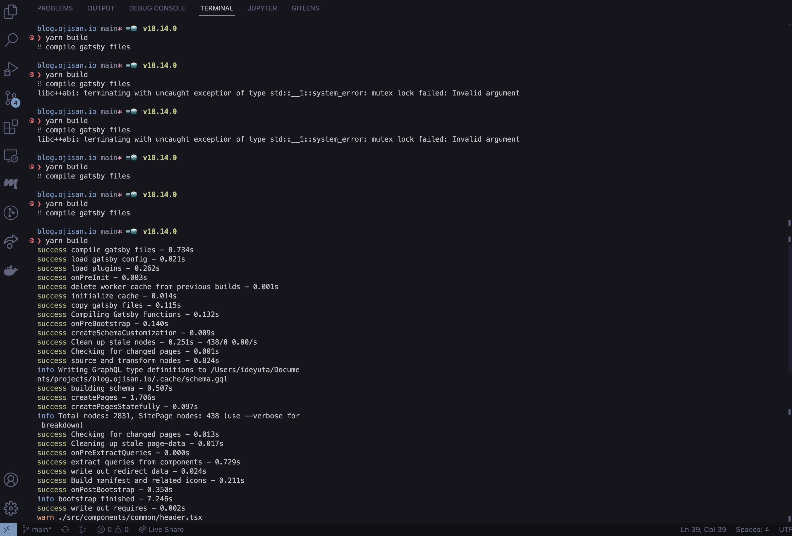

## 最近ブログのビルドで色々なトラブルがある

これまでブログを Markdown で書いて GitHub に Push したら 2分くらいで本番環境に反映されていた。フルビルドでも10分くらいだった気がする。しかし最近は20分以上ビルドに時間がかかったり、そもそもビルドに失敗したりビルドの調子が悪い。

### フルビルドに25分かかる

たとえば https://github.com/sadnessOjisan/blog.ojisan.io/actions/runs/6105281276 は 24分かかっている。これはlockfile を更新したのでキャッシュを使わずにビルドしている。つまりフルビルドを走らせると 24分かかる。

Gatsby なので日頃は incremental build すればいいと思うかもしれないが、[いまビルドキャッシュは 1週間しか残らない](https://docs.github.com/en/actions/using-workflows/caching-dependencies-to-speed-up-workflows#usage-limits-and-eviction-policy)。そのため1週間ブログを書くのをサボってキャッシュが消えると、24分ビルドにかかることとなる。

### ビルドが固まる

25分でビルドできるのならまだ良い。https://github.com/sadnessOjisan/blog.ojisan.io/actions/runs/6104927168 は1時間待ってビルドが終わらなかったのでキャンセルしたビルドだ。

ちなみにこのときの差分は https://github.com/sadnessOjisan/blog.ojisan.io/commit/f021dc723018f809cf22e9b7c29c3e78864648e5 で、大した変更はしていない。

これはキャッシュを使った incremental build でも起きている。

### 手元でビルドするとLockにひっかかる

CI/CDからのデプロイができないので手元からデプロイしようとビルドすると、すご〜〜〜〜〜〜〜〜〜〜く嫌なエラーが出る。

```
❯ yarn build
⠋ compile gatsby files
libc++abi: terminating with uncaught exception of type std::__1::system_error: mutex lock failed: Invalid argument
```

libc のエラーが出るだなんて、Node.js 開発者にとってのユーザーランドでできることなんて何もなさそうだ。

ちなみにこれは適当に何回か同じコマンドを打つと直る。



逆に気持ち悪い。

## どうしてビルドにこれだけ時間がかかるのか

ビルドの調子が悪いことの予想はついていて 静的ビルドをしていることと、画像の最適化だろう。

いまブログは 290 件ある。それの JSX + MDを HTML に変換かけていたらそりゃ時間がかかるだろう。SPA/Prefetch用のChunk JSの生成も内部でwebpackしているのでそれらの数だけファイルIOも発生している。そのため単純に記事の数が多くなってStatic Generationに向かなくなってきていると思う。

そしておそらく一番の理由は画像の最適化だろう。Gatsbyの画像最適化はさまざまなデバイス向けにサイズを調節し、png, webp, avif などでエンコードするなどの最適化を行い、それを picture タグでそれぞれのターゲット向けに HTML に埋め込む。1枚の画像から様々なターゲットに向けた画像を生成し、それを画像の数だけおこなっており、それをビルド時に一度にやっているので時間はかかって当然だ。

## 解決策を考えた結果、Gatsbyやめようかなの気持ちになっている

実は Gatsby によるファイル増大によるトラブルには [ブログのホスティングで毎月 Firebase Hosting に 500 円払っていた話](https://blog.ojisan.io/firebase-hosting-500-yen/) でも起きていた。静的ビルドによるビルド成果物の巨大化がコスト面でも問題になっている。

じゃあ Gatsby を SSR mode で起動すればいいではないかと思うかもしれない。実は[検証もした](https://blog.ojisan.io/gatsby-dsg-fastly/)こともある。もしくは画像の最適化をやめるという手もある。

しかし [ブログが新しくなりました(2ヶ月前に)ので、その報告と技術的な解説](https://blog.ojisan.io/renew-blog-2022/) や [なぜ私はGatsbyでブログを作っているのか](https://blog.ojisan.io/why-i-will-use-gatsby/) で述べたように Gatsby を使っているのは SSG で画像の最適化ができるからだ。画像の最適化があることでいちいちブログ書く時にサイズを入稿サイズを気にしなくてよくなり、執筆負荷が下がっている。なので画像の最適化は機能として絶対に欲しいし、もし画像の最適化をしないのならば Next でいいと思っている。Nextなら SSG時には画像最適化はできなくてもSSR時に可能だ。もしSSG 的な挙動が欲しければ Next の前段に Cache-Control を読んでくれるレイヤーを何か置けばいい。毎月 Fastly に 5000 円払っている身ではあるが、自前で Varnish を立てて運用してみたい気持ちもある。なのでどこかの休みで Next + CDN のような構成に置き換えようかなって思っている。

Gatsbyは自分がプログラミングを始めた時に v1 が出てきて注目されていたFWでもあって、「これを使えるようになれば自分もフロントエンドエンジニアとしてキャリアを築けるかも」って考えながら必死に勉強したFWでもあってかなり愛着があるのだが、ついにお別れの時が来てしまったのかもしれない。
