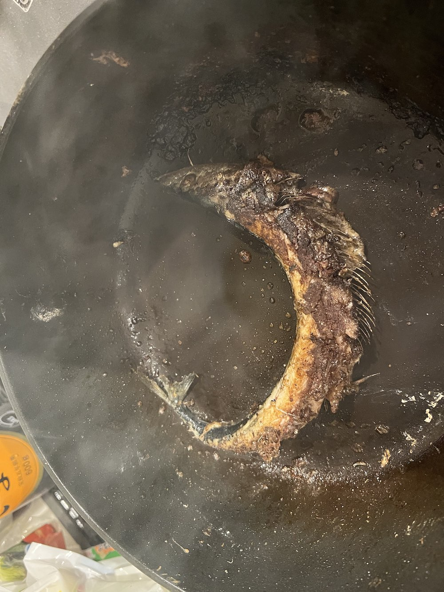
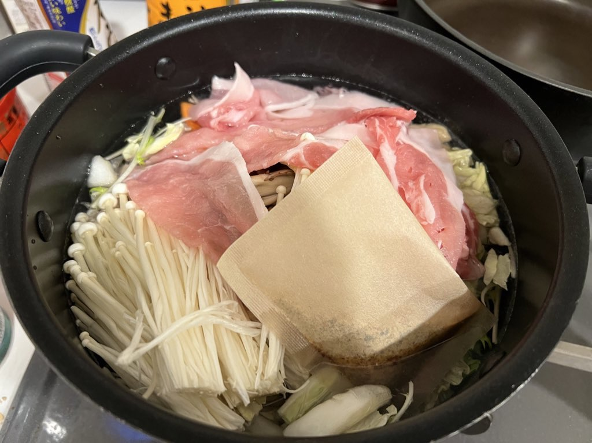

実は今月から、本気で料理を頑張ろうと決心して、料理のパーソナルトレーニングを受けている。僕は自炊するたびにTwitterにあげては、あまりの出来の悪さに突っ込まれ続けるというお家芸をしていた。料理が上手くなることは良いことではあるが、料理が上手くなってしまうと、もうそういったツイートができなくなるのかと悲しい気持ちになっている。多分ツイッターに料理の写真をあげると、「前までのヤバさはないけど、そんなに良いものでもなく、コメントしづらい」という状況になると考えられる。なので最後にヤバい自炊の思い出をまとめようと思う。

## 焼き魚

### さんま

しんぱち食堂行った帰りに、自分でも作れそうと思い購入。作れなかった。

### ししゃも

帝愛の地下に出てきそう。

## 肉

### 豚肉 + パスタ

あまりものを組み合わせた。bloodborne の敵にいそう。

### 豚肉 + パン

サンドイッチ的なものを期待したけど失敗だった

### 豚肉 + ソーセージ

「こういうものでいいんだよこういうもので」のツイートに影響された。簡単に作れて良いのだが、健康的に良くないのでもうやらないかな。

## ハンバーグ

パン粉を使うという概念がなく、形がまとまらない。

丸めるという概念を知らない。

当然こうなる。

丸めるのを覚える。

結局はフライパンの上でこねる。

一応zipとか手袋は揃えた。

健康志向で鶏肉ハンバーグを作ろうとした結果...なにこれ

## ひき肉

ハンバーグが苦手すぎてひき肉を使った別の料理を考案した時期もあった

## 麺類

茹でただけで終わり...???

めんどくさい時は具なしで塩だけで食べる

卵を入れた

生卵だと思ったら温泉卵買ってた時

## 鍋

具材を切って入れるだけ。なので流石に失敗はなかったけど、塩分を控えたいので封印中。

## リゾット

鍋に入れる系は失敗しなさそう

## おまけ: インスタント食品

焼きそばすら満足に作れない。（調味料を袋ごと茹でていた時の画像）

