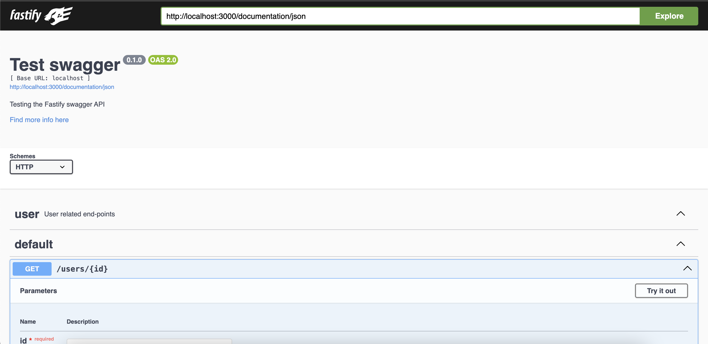

fastify で 0 -> 1 することが年に何回かあるのだけど、その都度やり方を忘れて調べているのでメモしておく。

OGPはFastifyをコントロールしている人のイラスト by DALLEだ。

## Routing をプラグインで表現する

root ファイルで

```ts
fastify.get("/users/:id", (req, res) => {
  res.status(200).send("");
});
```

のようにしてもいいけど、機能毎にモジュール化しておいた方があとでスケーリング効くので、ルーティングはモジュールとして定義したい。

そのためには FastifyPluginAsync を定義すればよく、

```ts
export const userFindRouter: FastifyPluginAsync = async (f, opts) => {
  f.get("/:id", {}, async (request, reply) => {});
};
```

を register でセットしてあげれば良い。

```ts
fastify.register(userFindRouter, {
  prefix: "/users",
});
```

## プラグインの引数でDIする

さて、別ファイルに分けたことで例えば Service クラスのようなものを呼び出す方法を考えないといけない。

例えばファイル内で呼び出すと、ルーティングごとに毎回同じようなインスタンスが作られてしまいメモリを消費して良くない。かといって、呼び出し側のファイルからServiceクラスのインスタンスを受け渡すと、プラグインを読み込んだ側が呼び出し側に定義されているService定義をimportすることになるので、循環参照になり、あまりよくない。最近はモジュール解決が賢いから多分動くんだけど、toolingの都合で壊れる可能性があると思うので個人的にはやりたくない。なのでプラグインの仕組みで乗ってインスタンスを渡す。

```ts
fastify.register(userFindRouter, {
  prefix: "/users",
  service: (id: string) => new User(id),
});
```

```ts
export const userFindRouter: FastifyPluginAsync<{
  service: (id: string) => User;
}> = async (f, opts) => {
  f.get<{ Params: FindParamsSchema }>("/:id", {}, async (request, reply) => {
    const res = await opts.service(id);
  });
};
```

というわけで引数で opts として渡す。引数で渡す opts は FastifyPluginAsync のジェネリクスで型をつけられる。

この方法の良いところはプラグインの呼び出し側からも型がつくことだ。例えば

```ts
FastifyPluginAsync<{
  service: (id: string) => User;
}>;
```

を適当に

```ts
FastifyPluginAsync<number>;
```

とかとしたら、呼び出し側の

```ts
fastify.register(userFindRouter, {
  prefix: "/users",
  service: (id: string) => new User(id),
});
```

の型が壊れる。つまりプラグイン定義と呼び出しが、たとえファイルを跨いでいても型安全に保証される。これは本当に嬉しい。

## リクエストのバリデーション

fastify はルーターの第二引数でバリデーションに使うJSON SChemaを指定できる。

```ts
export const userFindRouter: FastifyPluginAsync<{
  service: (id: string) => User;
}> = async (f, opts) => {
  f.get(
    "/:id",
    {
      schema: {
        params: {
          type: "object",
          properties: {
            id: {
              type: "string",
            },
          },
          required: ["id"],
        },
      },
    },
    async (request, reply) => {},
  );
};
```

これは `/:id` のパスパラメータ id に対するバリデーションだ。こうしておけば、例えば id の値が無いなどバリデーション違反があると自動でエラーを返す。

> When schema validation fails for a request, Fastify will automatically return a status 400 response including the result from the validator in the payload. As an example, if you have the following schema for your route

バリデーション違反があると

```
{
  "statusCode": 400,
  "error": "Bad Request",
  "message": "body should have required property 'name'"
}
```

を即座にレスポンスを返す。これも attachValidation を設定すれば独自のロジックでなエラーレスポンスも返せる。

see: https://fastify.dev/docs/latest/Reference/Validation-and-Serialization/#error-handling

そしてこの JSON Schema から json-schema-to-ts で型を作って、ルーターにその型を渡せば型推論を効かせられる。

```
npm i json-schema-to-ts
```

```ts
import { RouteShorthandOptions } from "fastify";
import { FromSchema } from "json-schema-to-ts";

const findParamsSchema = {
  type: "object",
  properties: {
    id: {
      type: "string",
    },
  },
  required: ["id"],
} as const;

type FindParamsSchema = FromSchema<typeof findParamsSchema>;

export const userFindRouter: FastifyPluginAsync<{
  service: (id: string) => User;
}> = async (f, opts) => {
  f.get<{ Params: FindParamsSchema }>(
    "/:id",
    {
      schema: {
        params: findRouteParamsSchema?.params,
      },
    },
    async (request, reply) => {},
  );
};
```

routing 定義からこれらの JSON Schema を request フォルダに移せば、スケーリングしたときに整理されて良い。

```ts
// route.ts

import { FastifyPluginAsync } from "fastify";
import {
  FindParamsSchema,
  findRouteParamsSchema,
} from "./request/get-by-id.js";
import { User } from "./entity.js";

export const userFindRouter: FastifyPluginAsync<{
  service: (id: string) => User;
}> = async (f, opts) => {
  f.get<{ Params: FindParamsSchema }>(
    "/:id",
    {
      schema: {
        params: findRouteParamsSchema?.params,
      },
    },
    async (request, reply) => {},
  );
};
```

```ts
import { RouteShorthandOptions } from "fastify";
import { FromSchema } from "json-schema-to-ts";

const findParamsSchema = {
  type: "object",
  properties: {
    id: {
      type: "string",
    },
  },
  required: ["id"],
} as const;

export const findRouteParamsSchema: RouteShorthandOptions["schema"] = {
  params: findParamsSchema,
} as const;

export type FindParamsSchema = FromSchema<typeof findParamsSchema>;
```

## レスポンスのシリアライゼーション

fastify では JSON Schema を使って validation だけでなく serialization もできる。

これは response フォルダを作ってそこに定義を集約させよう。

```ts
export type HttpResponseContent<T> = {
  status: number;
  content: T | string;
};

// response.ts

import { RouteShorthandOptions } from "fastify";
import { User } from "../entity.js";
import { HttpResponseContent } from "./http-response-content.js";
import { FromSchema } from "json-schema-to-ts";

const okSchema = {
  type: "object",
  properties: {
    id: { type: "string" },
  },
  required: ["id"],
  additionalProperties: false,
} as const;

const okStatus = 200;

export const findResponseSchema: RouteShorthandOptions["schema"] = {
  response: {
    [okStatus]: okSchema,
    500: { type: "string" },
  },
};

export const findSerializer = (
  input: User,
): HttpResponseContent<FromSchema<typeof okSchema>> => {
  return {
    status: okStatus,
    content: input,
  };
};
```

こうすることで、`reply.status(200).send(res)` したときに okSchema の形式でシリアライズされる。ただそのシリアライズは [fast-json-stringify](https://www.npmjs.com/package/fast-json-stringify) という JSONStringify のラッパーを使う。そのためいわゆる entity 的なのを教条的なクラスで定義していると

```ts
export class User {
  constructor(private _id: string) {}

  get id() {
    return this._id;
  }
}
```

```json
{ "_id": "xxx" }
```

のようにシリアライズされてしまう。なのでクラス定義は

```ts
export class User {
  constructor(private _id: string) {}

  get id() {
    return this._id;
  }

  toJSON() {
    return { id: this.id };
  }
}
```

のような toJSON 定義をしておく必要がある。

response 層では、データを受け取って、正常系・異常系と振り分けたレスポンスを作るようにして、その呼び出し元でHTTPレスポンスを返すようにしている。これは受け取るデータがResult型である場合に有効だ。

作ったレスポンス定義はルーターから読み込んで、schemaにその設定を読み込ませる。

```ts
import { FastifyPluginAsync } from "fastify";
import { findResponseSchema, findSerializer } from "./response/get-by-id.js";
import {
  FindParamsSchema,
  findRouteParamsSchema,
} from "./request/get-by-id.js";
import { User } from "./entity.js";

export const userFindRouter: FastifyPluginAsync<{
  service: (id: string) => User;
}> = async (f, opts) => {
  f.get<{ Params: FindParamsSchema }>(
    "/:id",
    {
      schema: {
        params: findRouteParamsSchema?.params,
        response: findResponseSchema?.response,
      },
    },
    async (request, reply) => {
      const id = request.params.id;
      const res = await opts.service(id);
      const response = findSerializer(res);
      return reply.status(response.status).send(response.content);
    },
  );
};
```

## swagger を定義

リクエスト、レスポンスの JSONSchema は Swagger によるAPI Spec生成に使える。そのためのプラグインが用意されている。

```ts
import swagger from "@fastify/swagger";
import swaggerui from "@fastify/swagger-ui";

await fastify.register(swagger, {
  swagger: {
    info: {
      title: "Test swagger",
      description: "Testing the Fastify swagger API",
      version: "0.1.0",
    },
    externalDocs: {
      url: "https://swagger.io",
      description: "Find more info here",
    },
    host: "localhost",
    schemes: ["http"],
    consumes: ["application/json"],
    produces: ["application/json"],
    tags: [{ name: "user", description: "User related end-points" }],
  },
});

await fastify.register(swaggerui, {
  routePrefix: "/documentation",
  uiConfig: {
    docExpansion: "full",
    deepLinking: false,
  },
  uiHooks: {
    onRequest: function (request, reply, next) {
      next();
    },
    preHandler: function (request, reply, next) {
      next();
    },
  },
  staticCSP: true,
  transformStaticCSP: (header) => header,
  transformSpecification: (swaggerObject, request, reply) => {
    return swaggerObject;
  },
  transformSpecificationClone: true,
});
```

これらの設定は公式のREADMEそのものを持ってきた。

ちなみにUIが不要でAPI Specのjsonが欲しいだけでも fastify-swagger-ui が必要となる。fastify-swaggerが v8 になったときに色々破壊的な変更が入って双方のライブラリが必要となった。

see: https://github.com/fastify/fastify-swagger/blob/master/MIGRATION.md

上記設定で http://localhost:3000/documentation/static/index.html でUIを確認、http://localhost:3000/documentation/json でスペックのJSONを手に入れられる。



## まとめ

と言うわけで、こういう成果物になる。

https://github.com/ojisan-toybox/fastify-controller
