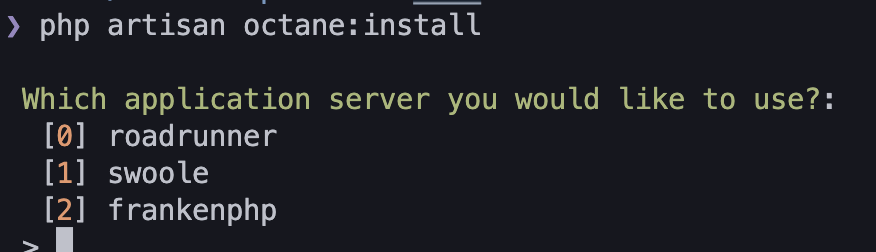
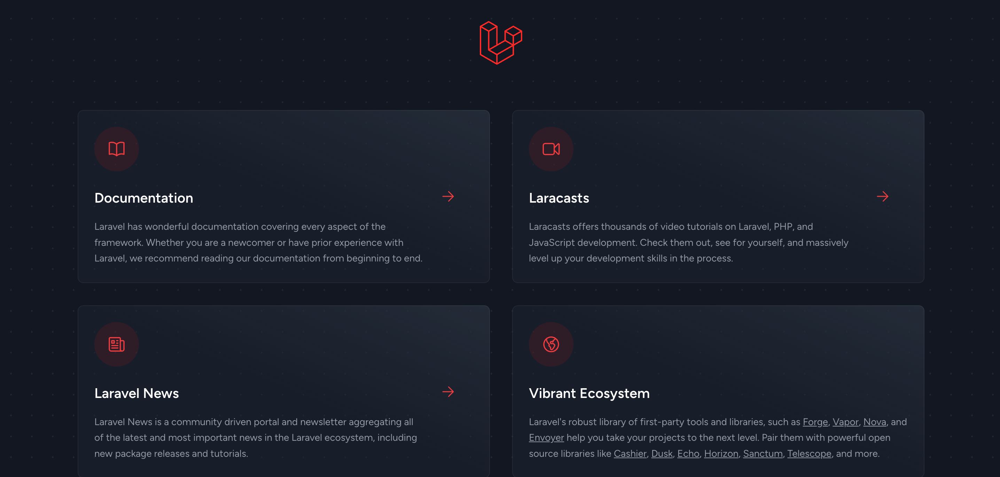

## 隙あらば自分語り１

3/8 14:40-15:20 に [PHPerKaigi](https://phperkaigi.jp/2024/) で話します。
PHP を Docker に固めてデプロイするときに ApacheやらNginxが求められることに対して、そもそも Webサーバーとは何かという話をします。
FrankenPHPも、Dockerに固めてデプロイするときの解決策の一つとして紹介します。

see: https://fortee.jp/phperkaigi-2024/proposal/42d9e721-b3e8-4a7d-ae88-1727ccfabf9b

## 隙あらば自分語り２

年パスを持っていたので小さい頃ユニバによく行っていました。
ユニバにモンスター・メーキャップ っていうフランケンシュタインが出てくるアトラクションがあって、これは客が手を上げてスタッフに当てられたらステージに上げられてショーの実験台にされるというやつがあって、当てられたことがあります。
自分が体験したのは、腕を包丁で切られて血まみれになるというショーだったのですが、包丁の裏側にチューブとポンプが付いていて、それを押すことで血糊を腕に広げるという仕組みで、幼いながらに感動しました。
でも本当は牢屋に閉じ込められて脱出する方のショーに当てられたかったです。

## はじめに

Laravel をコンテナでデプロイする苦悩については昔 [Laravel を Docker で動かしてホスティングするまで](../20231004-laravel-docker-wakaran/index.md) で書いたことがあり、このときの結論はもう Apache 使おうというものでした。
Nginx + fpm はイメージが２つ必要なのでデプロイがめんどくさいですし、Nginx じゃないと捌けないということは現代にはないでしょと思っていたからでした。
（あと、もし NginxじゃないとというならそもそもそういうIO BoundなサービスはGoとかでっ書けってのがある。ちなみにそういう根拠についても phperkaigi で話すから遊びにきてね。）
ただ、最近だと Laravel Octane によって Swoole, RoadRunner, FrankenPHP といった、現代的な非同期ランタイムが埋め込まれたPHP実行環境を簡単に使えるようになっており、今日はFrankenPHPを実際に動かしてみる。

## FrankenPHP とは

キャラがすごいやつ。


公式には

> The Modern PHP App Server, written in Go

とある。

see: https://frankenphp.dev/

公式が出しているスライドでは、

- コンテナ前提の設計
- 1コンテナでデプロイが可能
- 内部では Goroutine を使っている(つまりWebサーバー部分は M:N のグリーンスレッドだ！)

とある。

<div
  style="left: 0; width: 100%; height: 0; position: relative; padding-bottom: 56.25%;"
>
<iframe class="speakerdeck-iframe" frameborder="0" src="https://speakerdeck.com/player/212276367f8a4605a4b92ac36d518bb2" title="FrankenPHP: A modern app server for PHP, written in Go" allowfullscreen="true" style="border: 0px; background: padding-box padding-box rgba(0, 0, 0, 0.1); margin: 0px; padding: 0px; border-radius: 6px; box-shadow: rgba(0, 0, 0, 0.2) 0px 5px 40px; width: 100%; height: auto; aspect-ratio: 560 / 315;" data-ratio="1.7777777777777777"></iframe>
</div>

## Laravel Octane で入れられる

この夢のような FrankenPHP だが、導入は苦労し、特に Laravel と組み合わせるのは難しかった。
それが [Laravel Octane](https://laravel.com/docs/10.x/octane) というパッケージングによって簡単になった。

> Laravel Octane supercharges your application's performance by serving your application using high-powered application servers, including FrankenPHP, Open Swoole, Swoole, and RoadRunner. Octane boots your application once, keeps it in memory, and then feeds it requests at supersonic speeds.

今日は Laravel Octaneを使って FrankenPHP を CloudRun にデプロイするところまで持っていく。

## ビルドしてClouRunにデプロイするまでの手順

まずは Laravel プロジェクトをセットアップしよう。
composer と php は既に入っている想定です。

```
composer create-project laravel/laravel example-app
```

これでサンプルサーバーはできている。
試しに `php artisan serve` するとサーバーが立つだろう。
ここに octane を入れる。

```
composer require laravel/octane
```

次に ocntane の install コマンドでFrankenPHPの準備をする。

```
php artisan octane:install
```

選択肢が出てくるので Franken を選択しよう。



ここまででoctaneのコマンドで一度起動してみよう。

```
php artisan octane:start
```



無事に起動された。

では次はこれを Dockerfile に移していく。
octane の公式や FrankenPHP の公式にサンプルがあるのでそれを参考にしよう。

- https://laravel.com/docs/10.x/octane#frankenphp-via-docker
- https://frankenphp.dev/fr/docs/docker/

```
FROM dunglas/frankenphp

RUN install-php-extensions \
    pcntl
    # Add other PHP extensions here...

COPY . /app

ENTRYPOINT ["php", "artisan", "octane:frankenphp"]
```

これの起動と動作確認をしやすくするべく docker-compose.yaml も準備します。

```yaml
services:
  web:
    build: .
    ports:
      - "3000:3000"
```

そして起動と確認をしてみます。

```
$ docker compose build

# docker compose up

[+] Running 1/0
 ⠿ Container franken-practice-web-1  Created                                        0.0s
Attaching to franken-practice-web-1
franken-practice-web-1  |
franken-practice-web-1  |    INFO  Server running…
franken-practice-web-1  |
franken-practice-web-1  |   Local: http://127.0.0.1:3000
```

無事に表示されました。


では次にこれを ClourRun にデプロイします。
宗教上の理由で gcloud コマンドは使いたくないので GitHub Actions からのデプロイを考えます。
自分は次のような yaml を用意しました。
Workload Identity Federation の設定と、Cloudrun の設定は先に終えています。

```yaml
on: push

permissions:
  id-token: write
  contents: read

jobs:
  build:
    runs-on: ubuntu-latest
    defaults:
      run:
        working-directory: ./sample-codes
    steps:
      - uses: actions/checkout@v4
      - id: "auth"
        name: "Authenticate to Google Cloud"
        uses: "google-github-actions/auth@v2"
        with:
          token_format: access_token
          workload_identity_provider: "projects/${{ env.GCP_PROJECT_NUMBER }}/locations/global/workloadIdentityPools/${{ env.WORKLOAD_IDENTITY_POOL_ID }}/providers/${{ env.WORKLOAD_IDENTITY_PROVIDER_ID }}"
          service_account: "${{ env.SERVICE_ACCOUNT_EMAIL }}"
      - uses: docker/setup-buildx-action@v3
      - name: Login to GCR
        uses: docker/login-action@v2
        with:
          registry: asia.gcr.io
          username: oauth2accesstoken
          password: ${{ steps.auth.outputs.access_token }}
      - uses: docker/build-push-action@v5
        with:
          push: true
          tags: asia.gcr.io/${{ env.GCP_PROJECT_ID }}/phperkaigi/franken-practice:${{ github.sha }}
          context: franken-practice
          cache-from: type=gha
          cache-to: type=gha,mode=max
      - id: "deploy"
        uses: "google-github-actions/deploy-cloudrun@v2"
        with:
          service: "phper-kaigi-example-for-franken"
          image: asia.gcr.io/${{ env.GCP_PROJECT_ID }}/phperkaigi/franken-practice:${{ github.sha }}
          region: asia-northeast1
```

いわば普通に docker build, docker push して gcloud コマンドで認証とデプロイしているだけです。

ただし、Cloudrun特有の制約やGitHub上の制約があるので加工していきます。（琵琶湖くんぽい声）
local では簡単に動きますがCICDからのデプロイは.envやvendorがないので少しめんどくさいです。

まずGitHub上ではvendorはないので composer install する必要があります。

```dockerfile
COPY --from=composer /usr/bin/composer /usr/bin/composer
RUN composer install
```

composer install するときに Git を要求されるので Git も入れておきます。
zip, unzpi もあった方が良いのですが最小構成では不要なので無視します。

```dockerfile
RUN apt-get update && apt-get install -y git
```

そして frankenphp の実体(Goのバイナリ)も必要なので入れます。

```dockerfile
RUN php artisan octane:install --server frankenphp -n
```

そして Laravel では APP_KEY の設定が必要なのでこれも入れます。
localでは .envに入っていますがGitの管理外なので設定が必要です。
以下は無理やりベタに書いていますがきちんとシークレットマネージャなどを経由させてください。

```dockerfile
ENV APP_KEY=base64:5L/VjaStUDxxa9CoUaea9YaldmcB/3GijfewswWP+6s=
```

そして Cloudrun では 8080 ポートを開放かつ、グローバルなホストが必要なのでその設定で起動させます。

```dockerfile
EXPOSE 8080
ENTRYPOINT ["php", "artisan", "octane:frankenphp", "--port", "8080", "--host", "0.0.0.0"]
```

## 完成系

と言うわけでこれが完成系です。

```dockerfile
FROM dunglas/frankenphp

ENV APP_KEY=base64:5L/VjaSaeDxxa9CoUaea9YaldmcB/3GijTkdiej+6s=

RUN apt-get update && apt-get install -y git

# 本当は composer.json だけ先に COPY して install だけ先にした方が良いのだけど、最小構成ではないのでスルー
COPY . /app

ENV COMPOSER_ALLOW_SUPERUSER=1

COPY --from=composer /usr/bin/composer /usr/bin/composer
RUN composer install
RUN php artisan octane:install --server frankenphp -n

RUN install-php-extensions \
    pcntl

EXPOSE 8080
ENTRYPOINT ["php", "artisan", "octane:frankenphp", "--port", "8080", "--host", "0.0.0.0"]
```


