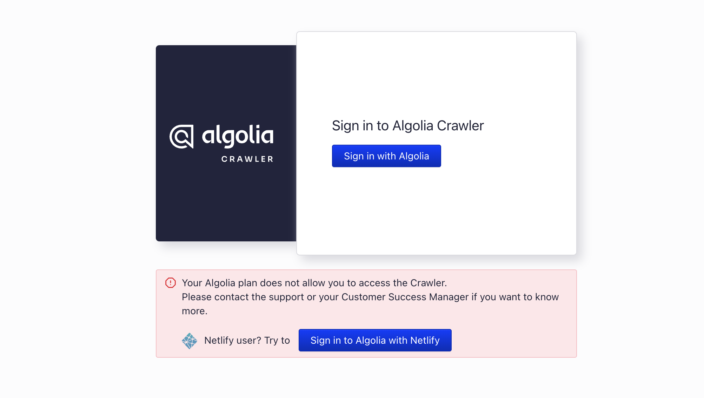
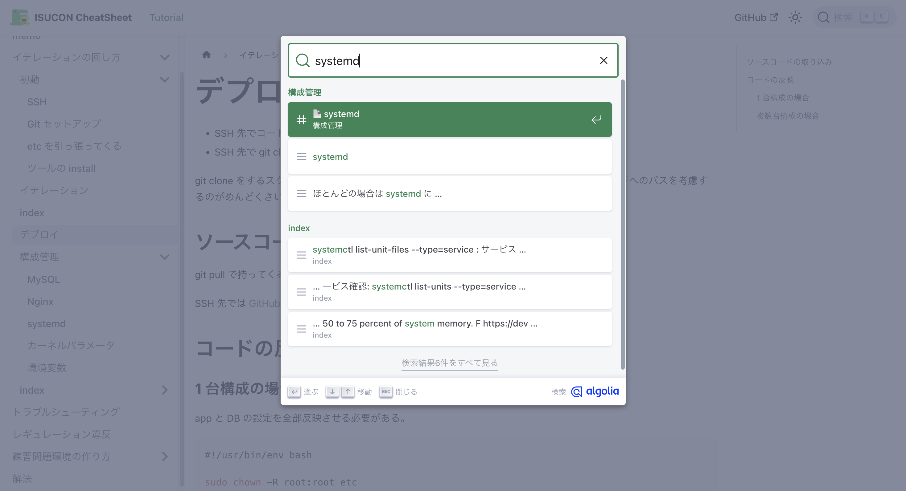

ISUCONのチートシートを作った時の話です。
なんで4月にISUCONの話をするのかと言うと、今日 [ISUNARABE LT#1](https://isunarabe.connpass.com/event/310556/) だからです。
スライドからはみ出た内容をブログにしました。

<div
  style="left: 0; width: 100%; height: 0; position: relative; padding-bottom: 56.25%;"
>
<iframe style="top: 0; left: 0; width: 100%; height: 100%; position: absolute; border: 0;" src="https://speakerdeck.com/player/298ef05ffaf84a20ac31da0bea2e3018" title="YouTube video player" frameborder="0" allow="accelerometer; autoplay; clipboard-write; encrypted-media; gyroscope; picture-in-picture; web-share" allowfullscreen></iframe>
</div>

タイトルは琵琶湖くんリスペクトです。

<div
  style="left: 0; width: 100%; height: 0; position: relative; padding-bottom: 56.25%;"
>
<iframe style="top: 0; left: 0; width: 100%; height: 100%; position: absolute; border: 0;" src="https://www.youtube.com/embed/lMBRK9vvMIE?si=HX5Kc_h4M_TzPS66" title="YouTube video player" frameborder="0" allow="accelerometer; autoplay; clipboard-write; encrypted-media; gyroscope; picture-in-picture; web-share" allowfullscreen></iframe>
</div>

## Algolia の便利機能は高い

Algoliaは全文検索のSaaSです。
全文検索エンジン以外にもクライアントサイドで使えるコンポーネントも提供していて、APIキーを発行してクライアントライブラリを埋め込めば簡単に全文検索を実装できます。
ただ、ドキュメントをAlgoliaに反映させるためのステップでおそらく課金したくなります。
課金せずにやろうとすると、こういうめんどくさそうなことをしないといけません。

Gatsby だとAPIキーを渡せばビルド時にテキストをトークン分割してインデックスしてくれるプラグインを使ったりもしていたのですが、今回使う Docusaurus はそういうエコシステムではなくクローラーをサイトマップ経由で呼び込むことが公式推奨のやり方になっています。

see: https://docusaurus.io/docs/search

Docusaurus のドキュメントにはサイトマップ経由でクローラーを呼び込むマネージコンソールの動線がありますが、おそらく認証もしくは認可が足りなくて使えないはずです。



https://www.algolia.com/doc/tools/crawler/getting-started/overview/ には

> The Algolia Crawler is available as an add-on to your pricing plan.

とある通り、課金すればクローラーを使ってインデックスさせられます。
つまり Sitemap さえ用意すればクローリングできます。
ただ、この課金は結構上のプランを使うので良いお値段がします。

そしてここで、「いや、でも世の中のドキュメントサイト、ほとんど全文検索が埋め込まれているやんけ、あれ金払っとんか？」と思うかもしれません。
実はOSSは申請を出せばタダで使えます。

see: https://www.algolia.com/for-open-source/

Algolia太っ腹すぎるね。

けど、OSSでないプロジェクトだと、このやり方が使えません。
具体的には、僕は ISUCON 当日用のチートシートを Docusaurus で管理していて、これを全文検索させたい時に困りました。



タダで検索する方法としては MeiliSearch や Elastic Search のセルフホスティングという手もあるのですが、管理がめんどくさいのと、どうせインスタンス代がかかるのでやめました。
そんなとき、クローラーを手元から動かす方法を知ったので紹介します。

## ローカルからクローラーを動かす

ここまで話すと、俺が今からAlgoriaの秘孔をついて無理やりタダで動かしそうな雰囲気がありますが、実は公式がクローラーのDockerイメージを用意していて、それを使った合法的な方法です。
これらの機能は DocSearch というソフトウェアの機能であり、 https://www.algolia.com/doc/ からは辿れないだけです。
Algoriaありがとう。
（とはいえ、この存在への動線を出さずに Pro Plan への引き上げを要求してくるあたり、やってるね〜〜〜〜〜）

IndexをAlgoria に作るためには

```
docker run -it --env-file=.env -e "CONFIG=$(cat ./config.json | jq -r tostring)" algolia/docsearch-scraper
```

とするだけで良いです。

config.jsonは

```json
{
  "index_name": "isucon-cheatsheat",
  "start_urls": ["https://example.com/"],
  "sitemap_urls": ["https://example.com/sitemap.xml"],
  "sitemap_alternate_links": true,
  "selectors": {
    "lvl0": {
      "selector": "(//ul[contains(@class,'menu__list')]//a[contains(@class, 'menu__link menu__link--sublist menu__link--active')]/text() | //nav[contains(@class, 'navbar')]//a[contains(@class, 'navbar__link--active')]/text())[last()]",
      "type": "xpath",
      "global": true,
      "default_value": "Documentation"
    },
    "lvl1": "header h1",
    "lvl2": "article h2",
    "lvl3": "article h3",
    "lvl4": "article h4",
    "lvl5": "article h5, article td:first-child",
    "lvl6": "article h6",
    "text": "article p, article li, article td:last-child"
  },
  "strip_chars": " .,;:#",
  "custom_settings": {
    "separatorsToIndex": "_",
    "attributesForFaceting": ["language", "version", "type", "docusaurus_tag"],
    "attributesToRetrieve": [
      "hierarchy",
      "content",
      "anchor",
      "url",
      "url_without_anchor",
      "type"
    ]
  },
  "nb_hits": 1110
}
```

のようにします。
つまりこの設定ファイルでサイトマップを与えているわけです。
そのためサイトマップは作っておく必要があります。
docusaurus なら設定で一発のはずです。
`selectors` は自分のドキュメントに合わせて気合いで書いてください。
UIコンポーネントで検索した時の見栄えが変わってきたり、インデックスの比重が変わってきます。
詳しくは https://docsearch.algolia.com/docs/legacy/config-file/ などを見てください。

.env にはAPIキーを書いてください。

```
APPLICATION_ID=xxx
API_KEY=xxx
```

これで動くはずです。

あとは Docusaurus に Alogolia のプラグインを設定すれば、検索ウィジェットが表示されて検索できるはずです。

see: https://docusaurus.io/docs/search#connecting-algolia

タイトルには「実質タダ」と書いてある通り、使いすぎると普通の課金はされるので気をつけましょう。
