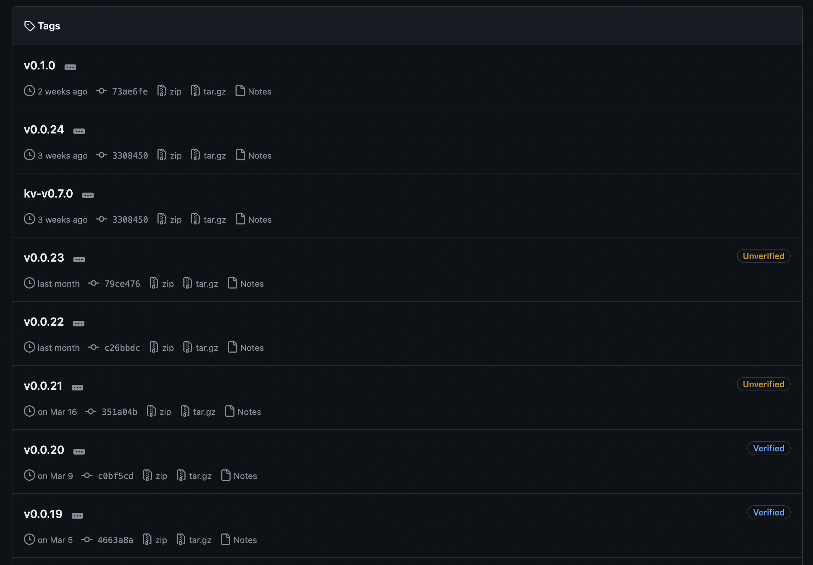

今月と来月、Software Design で Cloudflare Workers の連載を担当しています。
[Software Design 2024年5月号](https://gihyo.jp/magazine/SD/archive/2024/202405) では「エッジとHTTP Caching」というタイトルで書き、そのタイトル通りの内容を書きました。
そして6月号はCloudflare Workers を Rust で利用することについて書きます。
今日は5月号の原稿のうち、分量的に溢れてしまったことを書きます。
元々 Rust で HTTP Caching させる記事を書いており、その中に登場する Rust を使った Backend Request について書きます。

今日のOGPは、[その連載に誘ってくれた人](https://twitter.com/__syumai)のアイコンの一部です。 (アイコン作: [@\_tanakaworld](https://x.com/_tanakaworld))

## worker-rs での Backend Requestサポート

近いコンセプトは既に [Cloudflare Workers - サーバレス環境で Rust を動かす件](https://zenn.dev/tfutada/articles/f6be3049d5f7fe) に書かれていますが、最近はかなり事情が変わってきているので、2024年版を書いていこうと思います。
事情の変わり具合としては、これくらいのペースでリリースがされています。



see: https://github.com/cloudflare/workers-rs/tags

[v0.0.21 で axum が入った](https://blog.ojisan.io/cf-axum-muriyari/)など、パッチリリースで目立つ変更を入れてくるので、進化のスピードはとても速いです。
その結果、バックエンドリクエストのやり方も大きく変わっています。

### TCP 接続

去年、TCP接続が使えるようになりました。

see: https://blog.cloudflare.com/workers-tcp-socket-api-connect-databases/

つまりソケットを使ったプログラミングができるようになったわけです。
ということはこの上にHTTPを自分で乗せればバックエンドリクエストができます。

### Hyper を使う

しかし、TCPソケットを使ったシステムプログラミングなんて趣味以外ではやりたくはないです。
そこでソケットが使えることを利用して、hyper を使う方法が考えられました。
公式も [workers-rs supported Rust crates](https://developers.cloudflare.com/workers/languages/rust/crates/#hyper) で紹介しています。

```rust
async fn make_request(
    mut sender: hyper::client::conn::SendRequest<hyper::Body>,
    request: hyper::Request<hyper::Body>,
) -> Result<Response> {
    // Send and recieve HTTP request
    let hyper_response = sender
        .send_request(request)
        .await
        .map_err(map_hyper_error)?;

    // Convert back to worker::Response
    let buf = hyper::body::to_bytes(hyper_response)
        .await
        .map_err(map_hyper_error)?;
    let text = std::str::from_utf8(&buf).map_err(map_utf8_error)?;
    let mut response = Response::ok(text)?;
    response
        .headers_mut()
        .append("Content-Type", "text/html; charset=utf-8")?;
    Ok(response)
}
```

see: https://github.com/cloudflare/workers-rs/blob/v0.0.19/examples/hyper/src/lib.rs

これは [read(2)](https://nxmnpg.lemoda.net/ja/2/read) を使ってbuffer の詰め替えのようなシステムプログラミング風味がなく、良さそうに思えます。（[システムコール風味を醸し出す例としてはこういうのがある](https://blog.ojisan.io/why-hyper/#%E3%83%90%E3%83%83%E3%83%95%E3%82%A1%E6%93%8D%E4%BD%9C%E3%81%8B%E3%82%89%E3%81%AE%E8%A7%A3%E6%94%BE)）

なので hyper を使うと良いのですが、examples からは [v0.0.21 で消されてしまいました](https://github.com/cloudflare/workers-rs/pull/477/commits/52ad0a6336245bb237f50ffbac73b06a690bbc43)。
ちなみに [v0.0.21 は axum が使える](https://blog.ojisan.io/cf-axum-muriyari/)ようになるバージョンです。
そこで別の方法を考えてみます。

### Fetch を使う

そもそも Cloudflare Workers は V8 の上で Wasm で動く環境です。
ということは FFI さえしてしまえば JS の `fetch` が使えます。
https://docs.rs/worker を見ると `Fetcher` や `enum.Fetch` など便利そうなものが見つかります。
`Fetch enum` の定義は次の通りです。

```rust
pub enum Fetch {
    Url(Url)
    Request(Request)
}
```

see: https://docs.rs/worker/latest/worker/enum.Fetch.html

さらに `Fetch` は `send` というメソッドを実装しています。
"Execute a Fetch call and receive a Response." とあることから外部リクエストが可能なようです。

see: https://docs.rs/worker/latest/worker/enum.Fetch.html#method.send

`Fetch` は `Url` と `Request` の 2つのバリアントを持ちますが、ただ GET するだけであれば `Url` バリアントを使えばよく、HTTPメソッドなどのヘッダを付けたい場合は `Request` を使えば良いです。
`Request`を作る際には `new` ではなく `new_with_init` を使うとよいです。

see: https://docs.rs/worker/latest/worker/struct.Request.html#method.new_with_init

`new` はURLとメソッドしか指定できませんが、`new_with_ini`tは`RequestInit`を使ってヘッダーなども付けられます。
JavaScript では `fetch` の第二引数は `RequestInit` と呼ばれており、`fetch` のためのメタ情報を格納できます。

see: https://fetch.spec.whatwg.org/#fetch-method

なのでCloudflare Workers で `fetch` を使うにはこのようにします。

```rust
let mut headers = Headers::new();
headers.set("x-hoge", "fuga".to_string());
let req = Request::new_with_init(ENDPOINT, RequestInit::new().with_headers(headers)).unwrap();
let json = res.json::<HashMap<String, String>>().await.unwrap();
```

### reqwest を使う場合

最後に reqwest を紹介します。
実は公式は「これから reqwest を推していくぜ」と言っています。

see: https://github.com/cloudflare/workers-rs/pull/480

[workers-rs supported Rust crates](https://developers.cloudflare.com/workers/languages/rust/crates) でも紹介されていることから、有力 crate です。
[reqwest](https://docs.rs/reqwest/latest/reqwest/) は "An ergonomic, batteries-included HTTP Client for Rust." な HTTP クライアントライブラリです。
ergonomic であるため非同期ランタイムの制約を受けることなく、Wasm 上でも利用でき、Cloudflare Workers の上でも利用できます。
ユーザーからした使い心地は JavaScript の fetch に近く、Rustacean からも人気がありよく利用されています。

```rust
use std::collections::HashMap;

use serde_json::json;
use worker::*;

async fn access_backend(
    req: worker::Request,
    ctx: RouteContext<()>,
) -> worker::Result<worker::Response> {
    let res = reqwest::get("https://sd-writing-origin-server-5vaznax7ka-an.a.run.app")
        .await
        .unwrap();
    let json = res.json::<HashMap<String, String>>().await.unwrap();

    Response::from_json(&json!(json))
}

#[event(fetch)]
async fn main(req: Request, env: Env, ctx: Context) -> Result<Response> {
    let router = Router::new();
    router.get_async("/", access_backend).run(req, env).await
}
```

さて、そんな reqwest ですが一つ欠点があります。
それはレスポンスをキャッシュできないことです。
Cache の SDK の型は、Response を型に取ります。

- https://docs.rs/worker/latest/worker/struct.Cache.html#method.get
- https://docs.rs/worker/latest/worker/struct.Cache.html#method.put

```rust
pub async fn get<'a, K: Into<CacheKey<'a>>>(
    &self,
    key: K,
    ignore_method: bool
) -> Result<Option<Response>>
```

```rust
pub async fn get<'a, K: Into<CacheKey<'a>>>(
    &self,
    key: K,
    ignore_method: bool
) -> Result<Option<Response>>
```

この [Response](https://docs.rs/worker/latest/worker/struct.Response.html) は worker-rs の型です。
つまり reqwest と互換性がありません。
そのため、reqwest ではなく互換性がある fetch を使うべきのように思えます。

```rust
async fn access_backend(
    req: worker::Request,
    ctx: RouteContext<()>,
) -> worker::Result<worker::Response> {
    let cache = Cache::default();
    let cached_res = cache.get(ENDPOINT, true).await.unwrap();

    match cached_res {
        Some(mut res) => {
            let json = res.json::<HashMap<String, String>>().await.unwrap();
            let now = Utc::now().to_rfc3339();
            let html_string = format!(
                "<body><p>origin server time: {:?}</p><p>cloudflare worker time: {:?}</p></body>",
                json, now
            );

            Ok(Response::from_html(html_string).unwrap())
        }
        None => {
            let url = Url::parse(ENDPOINT)?;
            let mut res = Fetch::Url(url).send().await.unwrap();
            let _ = cache.put(ENDPOINT, res.cloned().unwrap()).await;
            let json = res.json::<HashMap<String, String>>().await.unwrap();
            let now = Utc::now().to_rfc3339();
            let html_string = format!(
                "<body><p>origin server time: {:?}</p><p>cloudflare worker time: {:?}</p></body>",
                json, now
            );

            Ok(Response::from_html(html_string).unwrap())
        }
    }
}
```

ただ公式はこれから reqwest でいくせと言っているのでなんとかして reqwest を使ってみましょう。
Cache に reqwest の型が合わない問題は、worker の Response は `worker::Response::from_json` で解決します。
`worker::Response::from_json` は [serde](https://serde.rs/) の `Serealize` を引数に取ります。

```rust
use serde::{de::DeserializeOwned, Serialize};

pub fn from_json<B: Serialize>(value: &B) -> Result<Self> {
    if let Ok(data) = serde_json::to_string(value) {
        let mut headers = Headers::new();
        headers.set(CONTENT_TYPE, "application/json")?;

        return Ok(Self {
            body: ResponseBody::Body(data.into_bytes()),
            headers,
            status_code: 200,
            websocket: None,
        });
    }

    Err(Error::Json(("Failed to encode data to json".into(), 500)))
}
```

なのでreqwestの戻り値に serde の `Serialize` を実装します。
そのためには `.json` でパースした結果にマクロで `Serialize` を実装すれば良いでしょう。
つまりこのようなコードになります。

```rust
#[derive(Serialize, Deserialize)]
struct MyRes {
    currentTime: String,
}

#[worker::send]
pub async fn root() -> impl IntoResponse {
    let endpoint = "https://sd-writing-origin-server-5vaznax7ka-an.a.run.app";
    let cache = Cache::default();
    // Cache に HIT しなかったとき、オリジンサーバーから取得した値をこの変数に代入したいので、mut にしている。
    let origin_server_res = cache.get(endpoint, true).await.unwrap();

    match origin_server_res {
        // キャッシュヒットした時
        Some(mut res) => {
            let json = res.json::<HashMap<String, String>>().await.unwrap();
            let origin_server_time = json.get("currentTime").unwrap();
            let now = Utc::now().to_rfc3339();
            let html_string = format!(
                "<body><p>origin server time: {:?}</p><p>cloudflare worker time: {:?}</p></body>",
                origin_server_time, now
            );

            Html(html_string)
        }
        // キャッシュヒットしなかった時
        None => {
            let url = Url::parse(endpoint).unwrap();
            let headers = res.headers().clone();
            let json = res.json::<MyRes>().await.unwrap();
            let mut worker_res = worker::Response::from_json(&json)
                .unwrap()
                .with_headers(worker::Headers::from(headers));
            let _ = cache.put(endpoint, worker_res.cloned().unwrap()).await;
            let origin_server_time = json.currentTime;
            let now = Utc::now().to_rfc3339();
            let html_string = format!(
                "<body><p>origin server time: {:?}</p><p>cloudflare worker time: {:?}</p></body>",
                origin_server_time, now
            );
            Html(html_string)
        }
    }
}
```

worker_res を作った時にオリジンサーバーからのヘッダーを忘れてしまい、Cache-Control が効かなくのなるので、headersを自分でセットし直していることに注意してください。

## まとめ

昔は `reqwest` の型を `worker::Response` に変換するのが困難だったので、Cloudflare Workers を使いこなすには `Fetch` を使う必要がありましたが、今は `reqwest` でも十分に対処できます。
`reqwest` 使うのが良いと思います。
