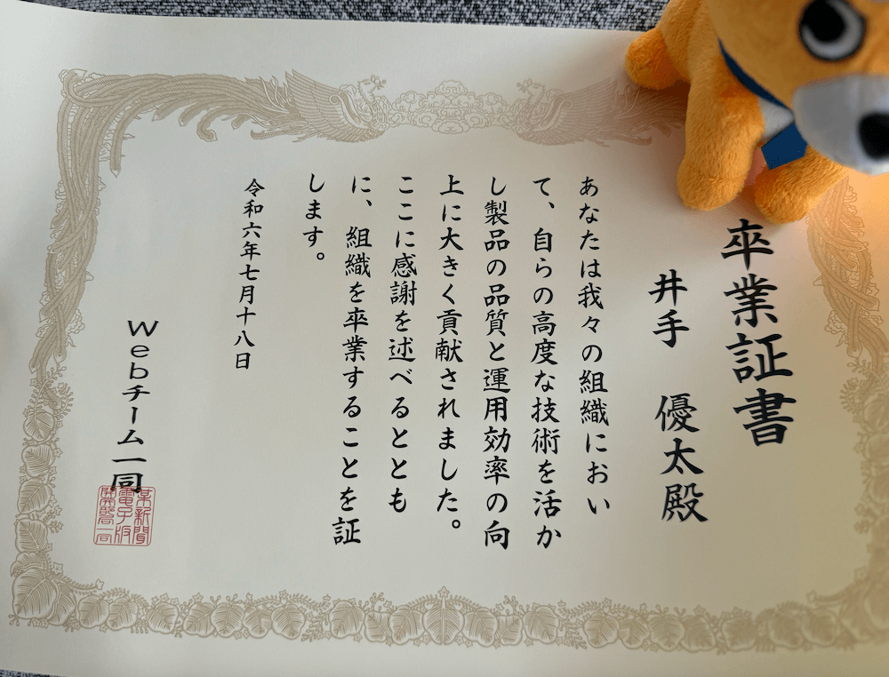

業務委託期間を含めて４年在籍した日本経済新聞社を退職しました。

## 日経に入るまで

自分が日経に入った理由は３つあり、

1. そろそろ健康保険が切れそうだったから
2. Web標準への理解が求められる仕事をしたかったから
3. 情報を編纂すること、発信すること自体に興味があり、興味と事業ドメインがマッチするから

です。なんと自己中な・・・

前の会社を辞めてフリーランス（と名乗ってはいたがどちらかというと無職の方が実態には近かった）になったときの話も書いておくと、元々は営業から入社した職場で活躍できず逃げるようにエンジニアになったものの、その道で進んでいこうにも未経験で基礎的な能力が無かったので勉強期間を作りたくなって辞めました。当時社会人を経験して思ったのは、社会では期待される人に成長できる仕事が任されていくので、ブートストラップに失敗した自分はこれから常に不利な戦いを強いられ続けそうだということです。なので勉強期間を作るために会社を辞めていました。辞める時はいろんな人に「それは危険すぎる」と止められもしましたが、結果的に日経に紛れ込むことができたので、当時の意思決定は正解にできたと思います。

日経に入ることは、フリーランス期間に勉強したことのアウトプット、人生をリブートするという目的も兼ねていました。特に日経はWebという分野では当時も現在もリーディングカンパニーだと思っており、腕試しという点でも勉強しに行くという点でもぴったりな会社でした。

## 日経での成長

元々、日経に入った時はWebフロントエンドしかできなかったのですが、いま会社を辞めてみてフロントエンドに限らずアーキテクトとしてやっていける力が身についたと思っています。

日経はかなり特異な仕事の割り振りをしていました。先に「結局社会は期待される人に成長される仕事が任されていくものだ」とは書いたものの、日経はいい意味でも悪い意味でも the JTC で、挑戦の機会が平等だったり、意図的に成長できる仕事を若手に割り振ってくれたり、社員の能力を伸ばそうと会社ぐるみであれやこれやとしてくれました。

また、これは私の所属したWebチームの思想なのかもしれませんが、明言はされてはいないものの「全員が全部のことをできるようになるべき」という価値観が浸透していました。これまでフロントエンドだけ分業してやっていればいいという職場でしか働いたことがなかったのですが、日経ではフロントエンド以外にもバックエンド、インフラ、認証認可、まで面倒を見る必要があり、全員がデプロイに責任を持つ仕組みになっていました。もちろんそれぞれに専用のチームもあるのですが、仕事はそれらのチームが提供するコンポーネントを自分たちで組み込んで開発するといった感じで、結局全部理解していないと開発を進められない状況でした。例えば自分たちのチームで使うインフラリソースのコンソールやTerraformは自分たちで管理する必要がありました。GKEやArgo CD自体の面倒はSREチームが面倒を見てくれていますが、k8s のマニフェストは自分達で書く必要があったり、デプロイは提供されたactionを自分たちで組み込んでパイプラインを組む必要があり、結局はGKEやGitOpsの全体感の知識がないと仕事ができない環境でした。そのためこれまで自分が触れたことないような領域に触れざるを得ず、必然的に全方面での能力を伸ばさざるを得ない環境でした。WebチームはWebに関係することは全部自分たちでやるチームであり、それをできるようにサポートしてくれるチームでした。

結果的に、入社当時はただWebフロントの限られたフレームワークしか使えなかった自分でしたが、少なくともアプリケーションのアーキテクトを名乗れるようにはなったと思います。ここで「アプリケーションの」とつけたのは、会社全体のシステムを管掌できる自信にはまだ至っていないからです。Kubernetesやデータパイプラインに対する意思決定にはまだ自信を持てないです。ただ、Webサービスを開発するにあたって、さまざまなトレードオフを評価し、さまざまな引き出しを駆使して正しく実装し、運用していけるという自信は身につきました。なので、アプリケーションのアーキテクトを名乗れるようにはなったと思います。

また、技術面だけではなく組織面に対しても考えることが増えました。一見技術的な課題に見えても組織面での解決策を講じないといけないことも経験しました。自分も若かった時は、先輩エンジニアたちが急に組織の話をし始めたりするのを見ると「技術から逃げたやつ」みたいなことを思っていましたが、今ならその先輩たちの気持ちがわかるような気がします。仕組みで解決したい問題がたくさんあります。自分はマネジメントとか全く興味なくてプログミングにしか興味がなかったのですが、最近は技術から離れてもっと抽象度の高い仕事をやってみたいと思うようになって、本当に変わったなぁと思います。そういった視点を得られたのも日経で仕事をしたおかげです。

## 日経でどういう仕事をしたのか

### NIKKEI LIVE の開発

フリーランスとしてお手伝いを始めた時は [NIKKEI LIVE](https://www.nikkei.com/live) の立ち上げの開発をしました。
日経は Next.js を使わない独自SSRの仕組みを持っており、その習得ができました。
SSRそのものを理解できたとてもタメになった仕事です。

see: [日経電子版での自作 SSR フレームワーク基盤について](https://hack.nikkei.com/blog/denshiban-ssr/)

### NIKKEI Prime の開発

NIKKEI Prime というバーティカルメディアの新規立ち上げを担当しました。
CDNや認証も含めて、ユーザーがアクセスして画面に新聞を表示させるまでの流れを理解でき、日経での開発を1人で完結できるようになった大きな転換点でした。

see: [日経の新媒体における、既存資産を活かすフロントエンド技術選定](https://hack.nikkei.com/blog/promedia-tech-stack/)

### APIスキーマ改善

日経におけるスキーマ駆動開発の導入をしました。
後入れでスキーマ駆動開発をすることの難しさ、それでも段階的に進める方法の模索、理想のCMSに思いを馳せる経験を積めました。自分でゼロから新聞入稿システムを作るならこうするといった設計を考えたり、この業界で仕事する上で今後の糧になった仕事でした。

<iframe class="speakerdeck-iframe" frameborder="0" src="https://speakerdeck.com/player/f42440425d0d428894e0bc14f4b7679b" title="現実世界におけるスキーマ設計の妥協" allowfullscreen="true" style="border: 0px; background: padding-box padding-box rgba(0, 0, 0, 0.1); margin: 0px; padding: 0px; border-radius: 6px; box-shadow: rgba(0, 0, 0, 0.2) 0px 5px 40px; width: 100%; height: auto; aspect-ratio: 560 / 315;" data-ratio="1.7777777777777777"></iframe>

### アラート・ログ・トレース改善

次にこれまでの事業開発の経験を踏まえ、あるときからプラットフォームチームに所属し、負債返済やプラットフォーム開発をしました。
最初はいわゆるアラートのオオカミ問題を解決していました。

<iframe class="speakerdeck-iframe" frameborder="0" src="https://speakerdeck.com/player/3db148ed5e0c43238196e00155488097" title="監視せなあかんし、五大紙だけにオオカミってな🐺🐺🐺🐺🐺" allowfullscreen="true" style="border: 0px; background: padding-box padding-box rgba(0, 0, 0, 0.1); margin: 0px; padding: 0px; border-radius: 6px; box-shadow: rgba(0, 0, 0, 0.2) 0px 5px 40px; width: 100%; height: auto; aspect-ratio: 560 / 315;" data-ratio="1.7777777777777777"></iframe>

ただログに必要な情報が全然書かれていないこともあり、途中からはそのログの中身の整備も始めました。最初は Sentry のSDKの仕様を理解して適切なErrorをセットするところから始めました。ただJSのバージョンが古すぎてError.prototype.cause が使えなかったり、そもそものところで躓くことが多かったです。

というのも日経の多くのサービスの設計はかなり年季の入ったモノだからです。

see: [Express と handlebars で動き続ける日経](https://hack.nikkei.com/blog/advent20231214/)

後述する通り、これらが Node.js v12 で動いていたりもしたので、それらを先に更新しないと進められない仕事でした。そこで Opentelemetry に着目し、otel 経由でトレースを出す仕組みを入れたりしました。
このときは SRE チームと協業し、いまのインフラ構成でも otel を始めるにはどういう進め方がいいかという議論をしながら導入しました。これはotelそのものの仕様やエコシステムにも詳しくなれたし、会社全体から見たトレースの管理はどうするかと勘がるきっかけにもなって良い経験でした。このときどういう選定になったかはそのうち中の人がブログを書いてくれるでしょう。

結果、これまで開発ばかりで運用のことを考えたことがなかったのですが、このプロジェクトからそういった視点も考えた全体最適を意識するようになりました。
組織について考えるようになったりかなり視座が上がったと思います。

### Node.js のバージョンアップ

実はつい最近までマイクロサービス群が Node.js v12 で動き続けており、そのアップデートをしました。
チーム全体を巻き込んで、メンテナビリティのある技術選定や設計はどうしていくかということを考える経験を積めました。
ポリレポかモノレポか、マイクロフロントエンドはどうあるべきかをこの時から深く考えるようになりました。
結果的に、将来的に大きく成長していくことを見越してサービスの初期設計はどうあるべきかを提案する引き出しがかなり増えた仕事でした。

<iframe class="speakerdeck-iframe" frameborder="0" src="https://speakerdeck.com/player/5b6fc1aa80654e889813dbad72aa880f" title="Node.js v12 を使い続けていたのはなぁぜなぁぜ？" allowfullscreen="true" style="border: 0px; background: padding-box padding-box rgba(0, 0, 0, 0.1); margin: 0px; padding: 0px; border-radius: 6px; box-shadow: rgba(0, 0, 0, 0.2) 0px 5px 40px; width: 100%; height: auto; aspect-ratio: 560 / 315;" data-ratio="1.7777777777777777"></iframe>

### 小さいサービスの Rust 移行

Node.js製のアプリを大量に抱え込むと、そのアップデートが大変でどうにかしてメンテナビリティを上げたいというニーズの元で、そのマイクロサービスのうち一つの小さなプロキシサーバーをRust移行しました。
仕事内容自体は大したことはなかったのですが、このとき技術選定はどうすべきかというのがチームのホットトピックであり、RustかGoかという話をずっと議論しており、とても難しかったです。
この時は tower ベースなら Axum がどうなろうが寿命を延命させられるだろうという点でRustを選んでいます。
Scalaのプロみたいな後輩がいるのですが、その思想がScalaでもあり、論文としても評価されているみたいな話を聞いて安心したのを覚えています。
ただ3rd partyライブラリの管理はGoがしやすくて、今回の要件でRustで良かったのは今でも正解は分からないです。
チームでメンテナンスするための技術選定について考える経験を得られました。

<iframe class="speakerdeck-iframe" frameborder="0" src="https://speakerdeck.com/player/35c527ff800f44c4a4603e72579f1959" title="かにさんタワーバトル" allowfullscreen="true" style="border: 0px; background: padding-box padding-box rgba(0, 0, 0, 0.1); margin: 0px; padding: 0px; border-radius: 6px; box-shadow: rgba(0, 0, 0, 0.2) 0px 5px 40px; width: 100%; height: auto; aspect-ratio: 560 / 315;" data-ratio="1.7777777777777777"></iframe>

本当に小さいサービスなのですが、それでも外部との通信や、シークレット管理、トレース、テスタブルな設計、デプロイなど一通り普通のWeb開発でやることのほとんどをRustで経験しており、Production Ready な技術であるという実感を持てました。

### 新卒研修やパートナー企業向けの講習

自分は日経で機会や学習リソースだけ与えられ続けているテイカー気質な自覚があり、一時期それに悩んでいました。
なので、少しでも恩返しをしようと新卒研修のような場は積極的に講師に立候補するようにしていました。

覚えている限りでは、Webに関する全体講習や、チーム内のオンボーディング（認証認可、CDN、環境変数管理、ロギングの章を担当）、Next.jsハンズオン、Lit html ハンズオンなどをしました。

<iframe class="speakerdeck-iframe" frameborder="0" src="https://docs.google.com/presentation/d/e/2PACX-1vSjF1cp8fAdMKwFkLmtFT66e-UCD6zanO5KLsuRFmWyZ-8c06YQmgWT750Aqai2JfqHRARYWlkDLfaB/embed" title="かにさんタワーバトル" allowfullscreen="true" style="border: 0px; background: padding-box padding-box rgba(0, 0, 0, 0.1); margin: 0px; padding: 0px; border-radius: 6px; box-shadow: rgba(0, 0, 0, 0.2) 0px 5px 40px; width: 100%; height: auto; aspect-ratio: 560 / 315;" data-ratio="1.7777777777777777"></iframe>

少しは返済できたと思います。

## なぜ辞めるのか

こんなエンジニアの楽園みたいな会社を辞める理由は正直なかったのですが、週５で働く必要がなくなったので辞めます。こう書くと株や宝くじや相続で一発当てたかのように見えますが、そういうことではなく新卒の頃からあまり生活水準を上げていないのと独身なこともあって、週５で働かなくても全然生活できるという確信を持てたからです。なのでわざわざ自分の自由を制限する必要がないなと思いました。

その上で自分のやりたいことだけをやろうと思っています。最近はテクニカルライティングに興味があるのですが、そういった仕事の割合をもっと増やしていきたいです。こればかりはどうしても to C 向けの事業をする会社だと仕事で満たすことができなくて、やめた方がチャンスが広がりそうと思っていました。

FYI: [ドキュメントを書く仕事を探している](https://blog.ojisan.io/for-doc-job/)

一方で SWE としてのキャリアも引き続き考えてはいます。今は働くつもりはあまりないですが、将来的にもし結婚するとなると働きに出ると思うので、そのときまでもしテクニカルライターとして働ける見込みが立っていなければこれまで通りSWEとして働こうと思います。ただ、諸々に飽きてしまっており、Webやプログラミングそのものをドメインにした仕事・全てを0から開発しないといけないシードベンチャーなどに行きたいなぁとはぼんやり考えています。特に前者は外資を目指すことになるので英語漬けになりたく、そういった点でも辞めた今はかなりチャンスだと思っています。後者は、プラットフォームチームで負債返済活動に従事して、どの意思決定が尾を引くのかみたいなのを学べており、その状態で強くてニューゲームしたいと考えています。

## 明日から何をするか

勉強したいこと、自作したいものがたくさん溜まっているのでまずはそれを消化していきます。
自作OS, 自作DB, 自作非同期ランタイム, Linux, JavaScript そのものの勉強に割り当てます。

並行して技術書典の準備をしようと思っています。
やはり、人に何かを教えるというのが好きなので、書く仕事をしたいです。
今回日経でさまざまなプロフェッショナルに囲まれて、Webの深い知識とさまざまな分野で自走できるだけの幅広い知識を得れましたが、これはたまたま日経に所属できたから得られたものであり、偶然自分が恵まれてしまっただけという自覚があります。
なのでせめて初心者で何もわからなかった頃の気持ちを覚えている今のうちに、どうやってそれらを学んでいけるかということを本にすると、価値あるものになるのではと思っています。
そこで次の技術書典はReactとTerraformとk8sについての本を書こうと思っています。
時間は無限にあるので新冊をいくらでも書けると思います。

あと、ゲームや漫画や小説を買うだけ買って全く手をつけていないので、そろそろ消化していきたいです。

## 何か仕事を依頼したい場合

しばらくは自由なので仕事を請けることはできます。
何か依頼がございましたら Twitter DM などに連絡をお願いします。
返事は確約できませんが、全部に目は通します。

ただ、あまり働く気がないのと、勉強したいことてんこ盛りなのでフルタイムで暇人という訳ではないです。
仕事を積極的に探しているわけではないのは最初に断っておきたいです。
そのため仕事はかなり選り好みしますので、労働力とお金を交換するだけの仕事はお断りすることになると思います（※大金を積まれると話は別です）。
御社の本当に本当に本当に本当に本当にとてもとてもとてもとてもとてもとてもとてもとても困っていることが、自分の得意分野な仕事だと前向きな返事を返すと思います。

## おまけ: 新聞社で働くということ

新聞社、もとい日経でしかできない経験がたくさんあったり、新聞そのものについて考えることが多くて面白かったです。
何をどこまで詳しく書いていいか分からないのでぼかしますが次のことが面白かったです。

- 労働組合のイベント
- 昭和スタイルの社員旅行
- 新聞社同士の協業
- WebエコシステムやWeb標準に対しての影響力
- 各社のWebエコシステムへの貢献（特に FT, NYT, Bloomberg)
- 新聞のレイアウトはすごい
- 世論を作るということ
- 民主主義の礎であろうとすること

入社前は新聞は金の無駄と思っていましたが、今ではそうは思わなくなりました。
新聞舐めていたのですが、すごく奥が深くて面白かったです。
飲み会とかで聞いてくれたらお話しします！

日経！楽しかった！！ありがとうございました！！！
