久しぶりの地方カンファレンス。

https://www.frontend-conf.jp/

## 前日にかなるんとおたるん

飛行機が遅れていて２時間遅れで移動開始。
初日は小樽で [canalun](https://x.com/i_am_canalun) と散策して寿司食べた。

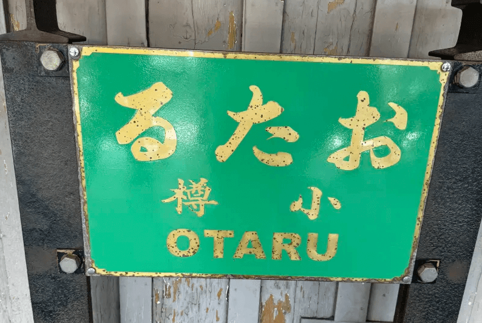

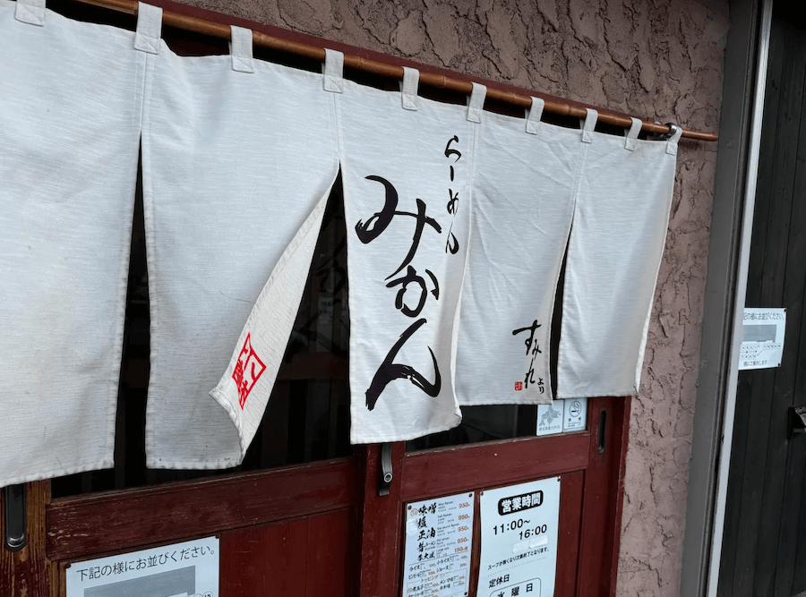

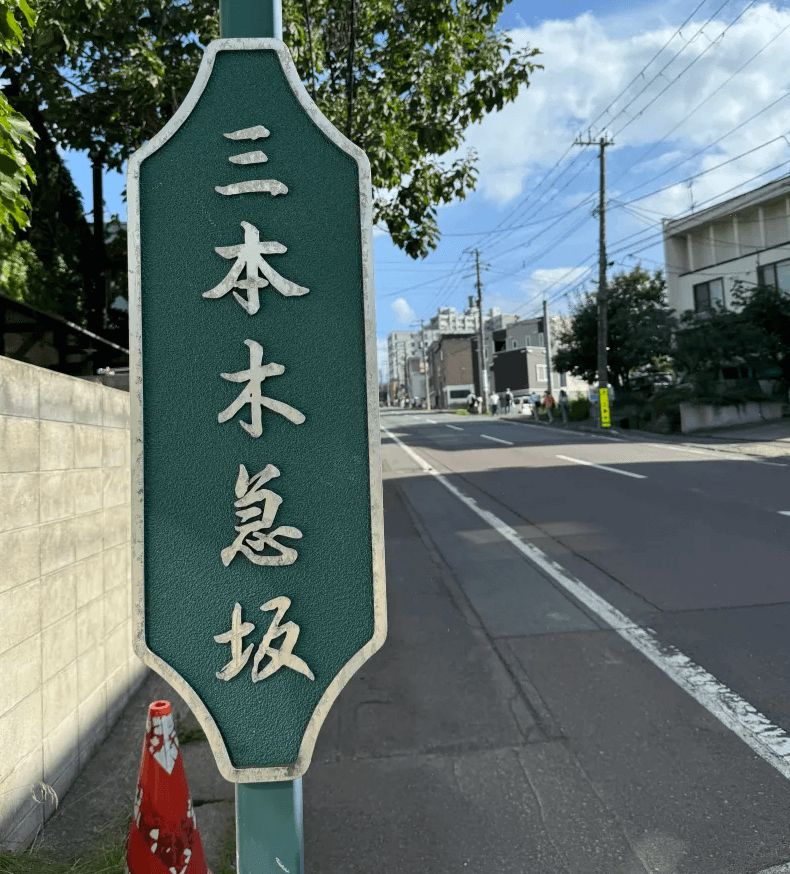

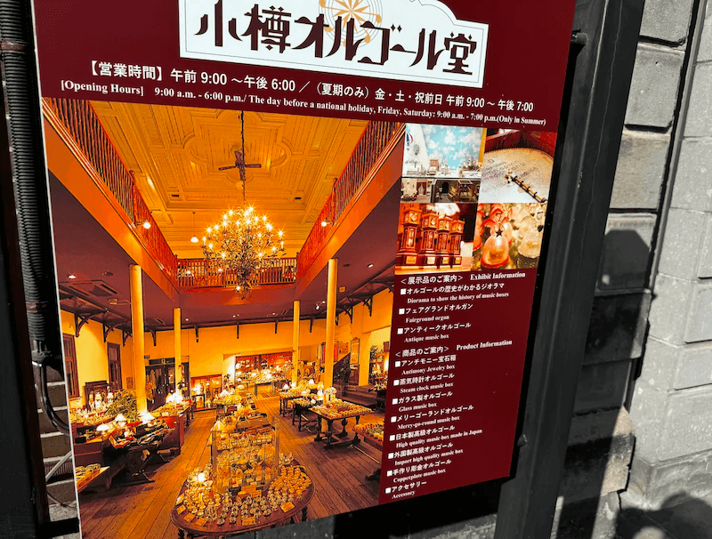

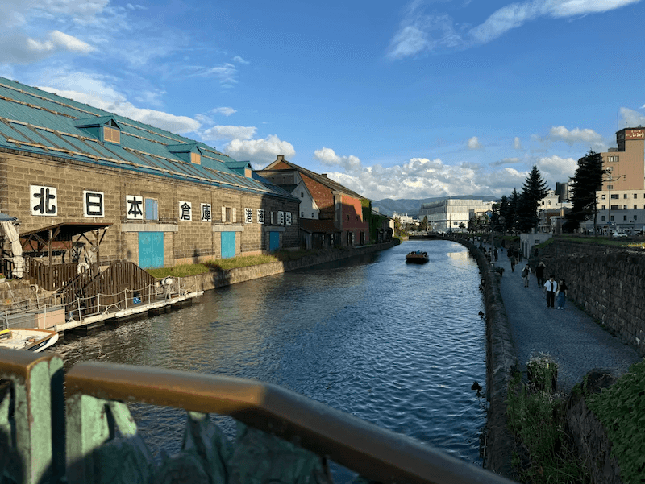

ちょうど札幌マラソンで札幌付近の宿が高騰していたので、自分は小樽に泊まった。
札幌まで１時間くらいの距離なので全然泊まれる位置。
札幌のビジネスホテルくらいの値段で、部屋に露天風呂付いている部屋に泊まれてとてもよかった。

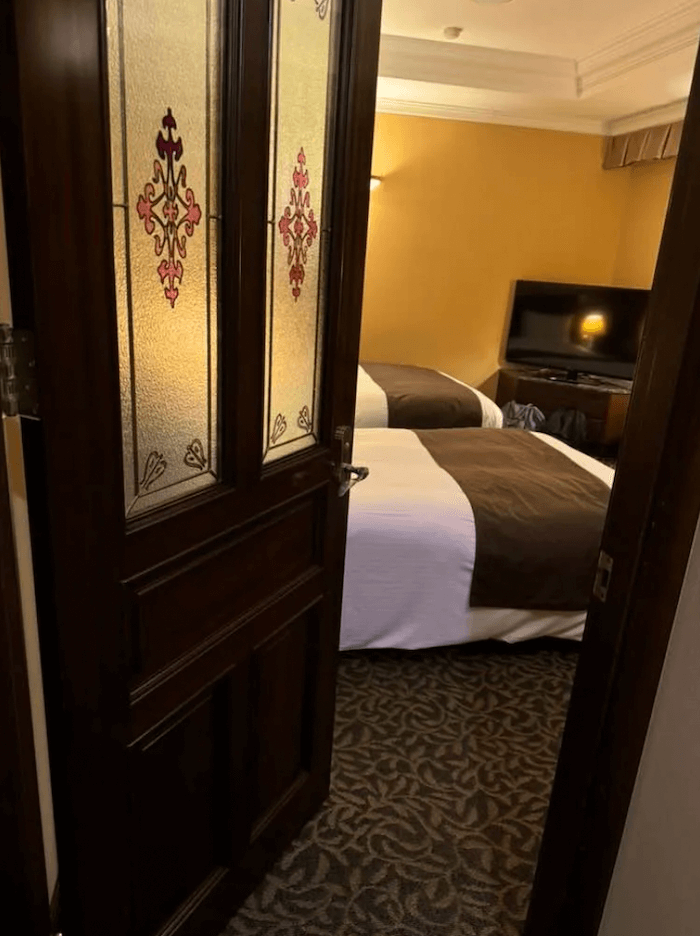

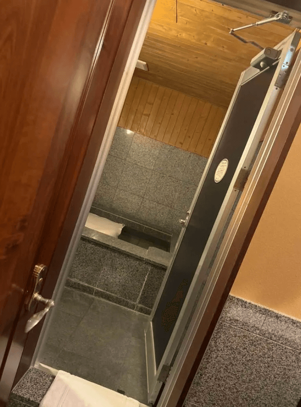

## 当日

LTだしと思って資料を何も作っていなかったので、行きの電車の中で作った。
昼休憩のときに知人らと合流して一緒にスープカレー食べた。

その後は発表を眺めていた。印象に残っているものをピックアップする。

[Web技術を駆使してユーザーの画面を「録画」する](https://fortee.jp/frontend-conf-hokkaido-2024/proposal/c238d6f7-82cc-411b-9e12-da6f01e7773c)。
APMの課金にやられた経験があったので、この辺りを自作したりOSSでやる方法を学べたのはよかった。
自分もさっそく試してみたい。

[ESLint Plugin により事業, 技術ドメインに沿った制約と誓約を敷衍させるアプローチのすゝめ](https://fortee.jp/frontend-conf-hokkaido-2024/proposal/20113974-2260-43c0-9a3a-9be997711296)。
元同僚で、何の仕事をしていたかしっているのでこの裏側が大変なのは知っている。
そして僕は辞める時に自分の抱えていたとんでもない仕事を彼に押し付けたのだが、やっぱり大変なことになってそうな雰囲気だった。
それを乗り越えると偉業発表できるから頑張ってほしい。

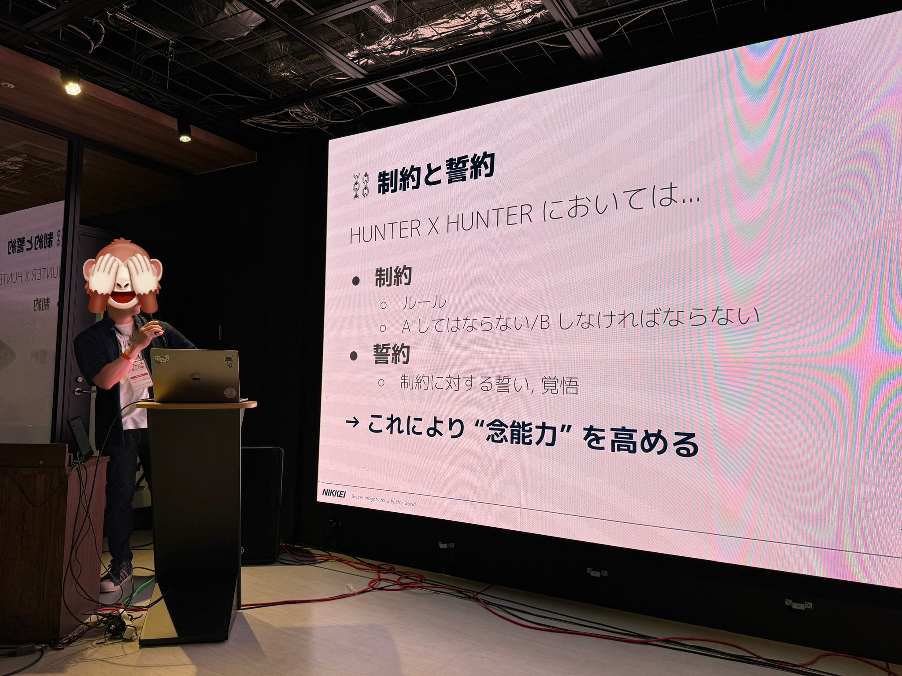

[非同期処理を活用しながらRust製wasmとJSを連携する方法（wasm-bindgenを使いたくない人向け）](https://fortee.jp/frontend-conf-hokkaido-2024/proposal/d6404b7b-e5e7-48f1-a95b-d8afe344ce36)。
自分は Cloudflare Workers の上で Axum を動かしたり、自作非同期ランタイムをしたことがあるので、 Wasm + 非同期ランタイムの話は好物だ。
JSPI は触っていなかったので今はこういうのがあるのかと勉強になった。

[ブラウザはどのようにしてテキストを描画しているのか？――Chromiumにみるテキスト描画の深淵](https://fortee.jp/frontend-conf-hokkaido-2024/proposal/a5735dc2-301b-497b-a354-d97639596365)。
いつも通りスライドから音が鳴ったり動き出したりして面白かった。
会場も爆笑の波に包まれていた。
こういう発表できるようになりたい。
実はフォントの仕組みって何も知らないので、学びばかりで新鮮だった。
自分は利用者でいいやと言う気持ちにさせられた。

## Basic 認証についての発表

自分はLT枠でこういう発表をした。

<iframe class="speakerdeck-iframe" frameborder="0" src="https://speakerdeck.com/player/7920fd7309304d449a1bd204d72631d6" title="BasicBasic認証" allowfullscreen="true" style="border: 0px; background: padding-box padding-box rgba(0, 0, 0, 0.1); margin: 0px; padding: 0px; border-radius: 6px; box-shadow: rgba(0, 0, 0, 0.2) 0px 5px 40px; width: 100%; height: auto; aspect-ratio: 560 / 315;" data-ratio="1.7777777777777777"></iframe>

Basic認証するAPIに何を送ればいいとかはみんな知っているし、ライブラリを使って機能をONにすることはみんなできるだろうけど、サーバーの機能としては何を実装しないといけないかは意外とみんな知らないだろうなと思って、その解説をする発表をした。
事実、仕様違反によってID/PASS入力画面が表示されない OSS である digdag を挙げ、その修正方法を紹介した。

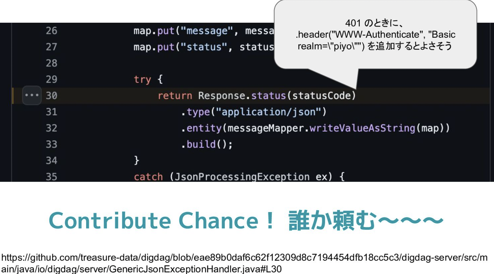

ちなみにこのスライドに対しては「どこを直せばいいか分かっていて、そのやり方まで紹介しておいて、なんで自分で直さないんだ。」というコメントを複数いただいたが、僕はOSS（特に企業発）コントリビューションの難しさは実装の難しさではなく、パッチを受け入れてもらうための人間関係の構築だと思っており、いわば仕事のようにしないといけないと思っていて、それが難しい（というかめんどくさい）からやりたくなかった。あと自分は Java エンジニアではないので動作確認をするための環境構築も困難だ。Contribution Chanse で良い実績にもなると思うので、誰か直しておいてくれると嬉しい。

## 翌日

前日の打ち上げのあと、自分は２次会で早退して実は苫小牧に行っていた。なぜなら翌日は陸路で帰るつもりだったからだ。１日で札幌 -> 東京は厳しいのでとりあえず苫小牧まで行った。深夜に着いたが、お腹空いたので山岡家にいった。北海道の山岡家は味噌専門って感じで新鮮だった。

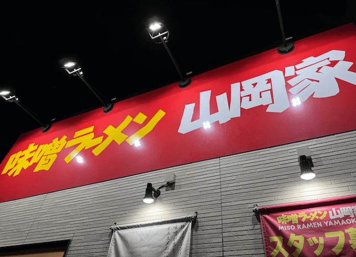

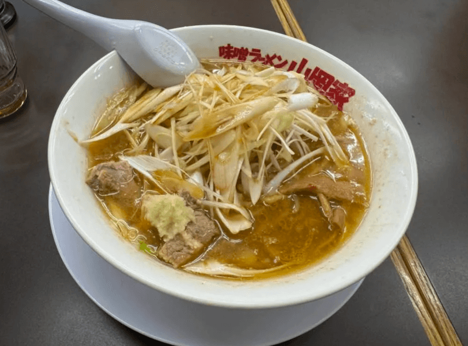

翌日はついに陸路で帰還。

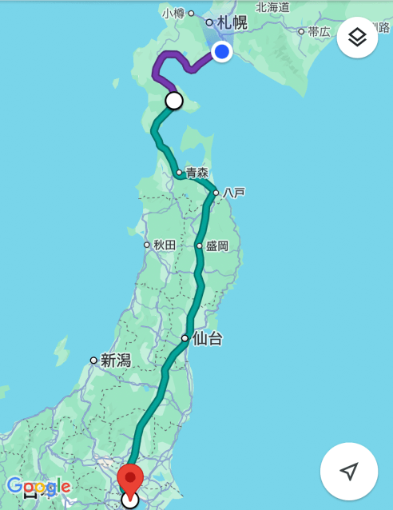

まず４時間かけて函館へ。新幹線の乗り換えとラッキーピエロが目当てだ。車がないといけない位置関係なのに観光客でごった返していてびっくりした。入店から２時間くらいかけて食べた。

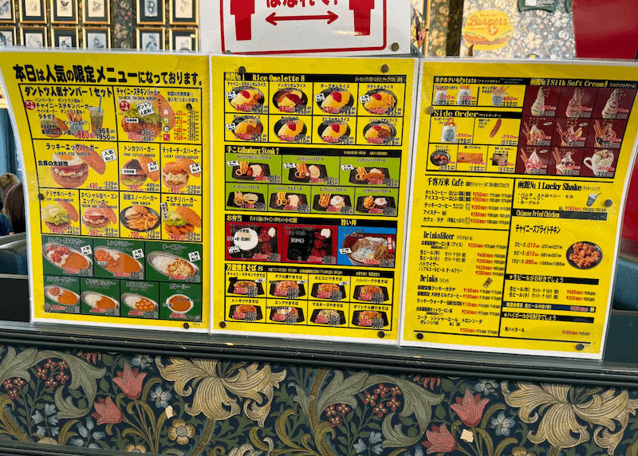

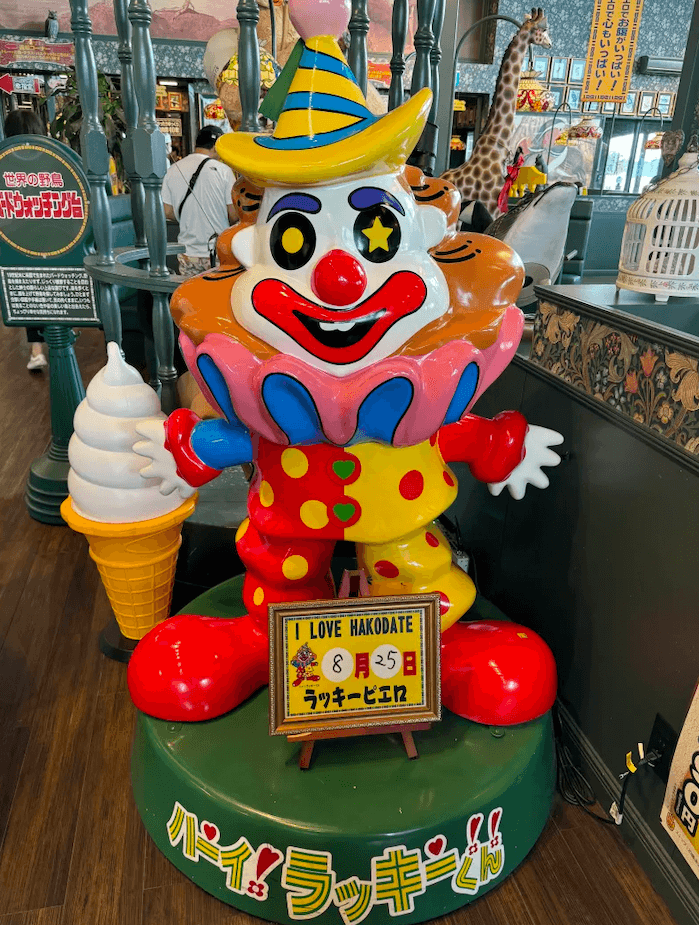

このあと新幹線で帰った。５時間くらい乗るのと、ちょうど良いプログラミング時間だと思い、作業に専念するために念願のグランクラスに乗った。就活の時、交通費精算で乗らせてくれなくてずっと乗りたかったのでこの機会に乗ってしまった。いうても飛行機とあまり変わらない値段ではあった。

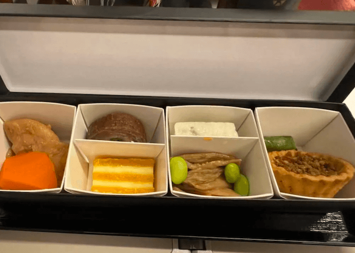

元を取るためにワインを注文しまくったせいで、全然コード書けなかった。

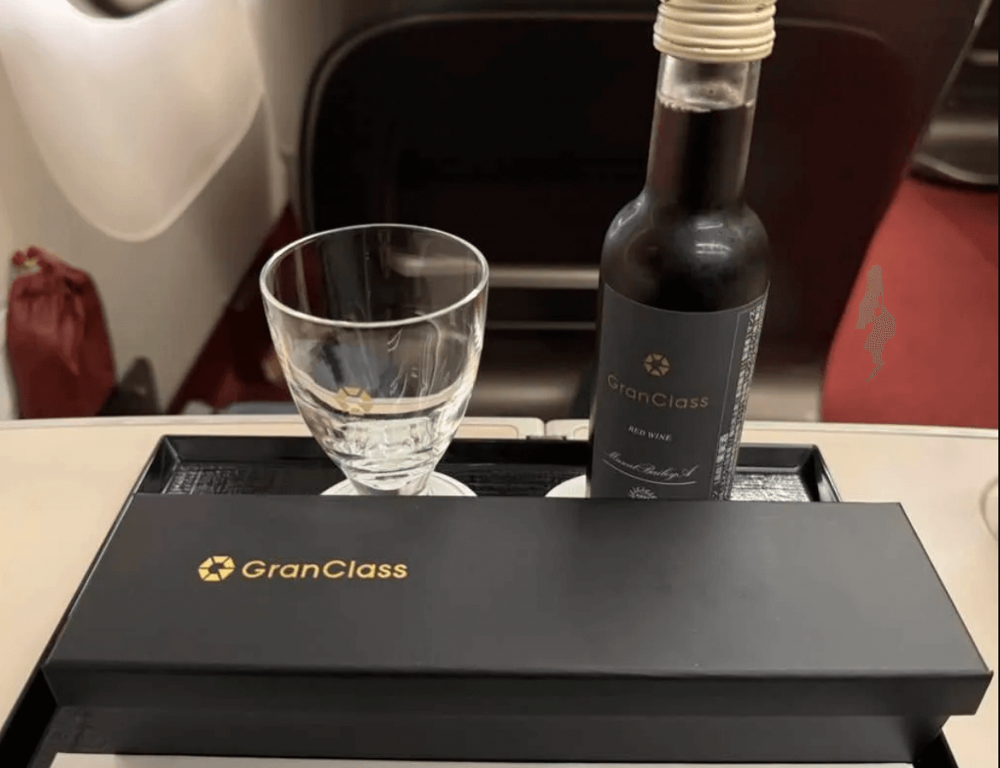

## 地方カンファレンス最高〜

普段まったく旅行しないので、地方カンファレンスは新鮮だった。次は TS Kaigi Kansai 行きたいな〜
