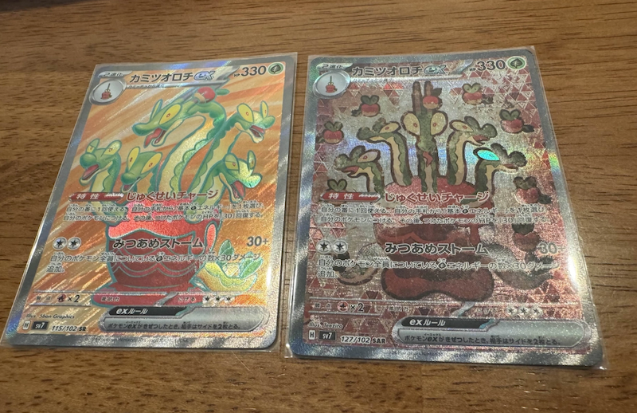
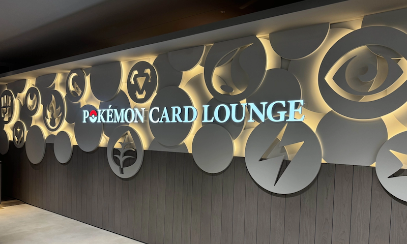
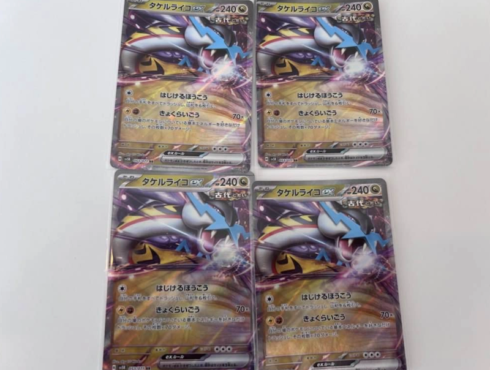
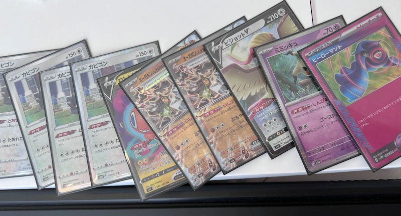

モルペコかわいい。

## tl;dr

先月ポケカ始めたばかりの初心者です。
来月のシティリーグ出ます。
実戦を積まないといけないので、対戦してくれる人探してます。
外出するときは基本的にデッキを持ち歩くようにするので、会う機会がある人はバトルしましょう。

## 始めたきっかけ

最近ポケカを始めた。
隅田川花火大会の会場真横に住んでるやべーやつの家で、例年花火が始まるまでボドゲとかして時間潰してたのを、今年は海外のポケカの大会で賞金貰ってるやべーやつも来るとのことで、レクチャーして貰いながらそのまま沼に沈められた。
このとき３戦くらいしかやっていないのに、その後シティリーグに申し込んだ。

## デッキ作った

シティリーグには当選して、俺も最強のデッキを作ろうと思い、カミツオロチex デッキを作った。
たまたま買ったパックからSARとSRが出たからだ。
これは作るしかない。

それで[渋谷のポケカラウンジ](https://shibuyatsutaya.tsite.jp/pokemoncardlounge/)に遊びにいって練習に付き合ってもらった。
ツタヤシェアラウンジの中に大量のデュエルスペースがあるところだった。
店員さんとも戦える。
給料もらってポケカできるの羨ましすぎる。

が、大会で勝てるわけないだろと言うことで速攻で解体されてしまい、オーガポンを抜き取られ立派なライコポンデッキになってしまった。
大型大会でも tier1 のデッキらしい。

## いざ大会へ

そのまま大会に誘われた参加した。
ライコポンを作ったのは通販の兼ね合いでは当日の朝だ。
一度も回していないし、カードの効果も知らない。
「ポケカの大会、マジで殺伐としてるし、小学生に論破されるよ」みたいな脅され方をしていたが、「初めてまだ３日目です〜」と言うと優しく教えてくれた。
で、カードの裁定を間違えたり長考したり初心者ぽい動きをしていたが、そこから繰り出されるのは tier1 のデッキであり、１位卓（成績がいいと良い机で戦える）でバトルしたり普通に勝ち進んでいた。
パオジアンとドラパルトとルギアに勝った。

が、カビゴンlo とかいうやばいデッキに負けた。やばすぎる。ひどい。人間の考えるデッキじゃない。
相手のカードが分からないので「そのカードの効果を確認していいですか？」と言ってロトムVの効果を確認したら爆笑された。
今なら分かるけど、ロトムの効果確認しているの本当に初心者ムーブだった。
初心者を騙る戦略として使えるかもしれない。

ちなみにカビゴンに負けた悔しさで自分も作った。友達無くしそう。

## 次はシティリーグ、練習付き合って欲しい

来月末にシティリーグという大きい大会に出る。
本気で勝ちに行くつもりでいている。
「そのデッキへの対策は自分が使うことだ」を信条に、tier1 どころのデッキもある程度も揃えた。
が、対戦する機会があまりなくて困っている。
家で二つのデッキを机に置いて1人で対戦してる。
悲しい。
次引っ越すときはカードショップの横にしたいくらいには対戦する機会が足りなくて困っている。
出るからには勝ち残りたいので練習に付き合ってくれる人探している。
こちらも色んなデッキを用意しているのでシティ前の調整用サンドバックくらいにはなると思う。
エンジニアはポケカやってる人も多いと聞いたので、勉強会とか飲み会の帰りとかにでもやれたら嬉しい。
常にデッキ持ち歩いていますし、歩くたびにダメカンのシャカシャカ音がなっていますので、機会があればやりましょう！
