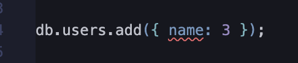
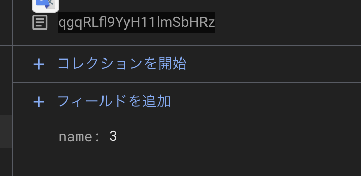

tl;dr: 救いではない。

[Firebase と添い遂げる Advent Calendar 2024](https://adventar.org/calendars/11050)、5日目です。
ついに１日遅れましたね。ガハハ（現在、12/6）

## 前回のあらすじ！

Firestore の Collection Field を表現した zod schema を使って、型推論とバリデーションができる Firestore クライアントを作るものの、Client & Admin でSDKの型やクラスが違うせいでClient & Admin 共有のスキーマを定義できなかった。

## typesaurus とは

公式の説明は、

> 🦕 Type-safe TypeScript-first ODM for Firestore

だ。

see: https://typesaurus.com/

クラサバ共通のスキーマが欲しい我々にとっては朗報ではなかろうか。

こんなふうに TypeScript の型定義を使ってスキーマを定義できる。

```ts
import { schema } from "typesaurus";

export const db = schema(($) => ({
  users: $.collection<User>(),
}));

interface User {
  name: string;
}
```

そしてスキーマから Firestore クライアントを生成でき、

```ts
db.users.get(userId);
```

```ts
db.users.add({ name: "piyo" });
```

といったコードで Firestore と通信ができる。
これが型推論の効く形で行えるようになる。

## typesaurus の良さそうなところ

### Date に対するケア

まず、自前 zod 定義では Timestamp 型の型のズレが問題になっていた。
typesaurus はライブラリがそのずれを吸収している。

さらにアプリケーション側で作成された `new Date` ではなく、Firestore が生成した Timestamp と区別できるようにもなっている。
それが `Typesaurus.ServerDate` だ。

see: https://typesaurus.com/type-safety/server-dates/

これによってタイムスタンプをアプリケーション側から挿入されるということを型レベルで防げるようになる。
（そんなの誤差だろは俺は思うが...）

### 抽象化された Reference

さて、型のズレで言うと Timestamp だけでなく、Reference も起きていた。
typesaurusはこれもライブラリが吸収している。
スキーマから document id, document reference などを抽出できる。

```ts
Schema["collection"]["Id"];
Schema["collection"]["Ref"];
```

これはクライアント・サーバーどちらでも動く。

### IDの区別

前述した `Schema["collection"]["Id"];` だが、これは BrandedType にもなっている。
つまり UserId と BookId を区別できる。
なので、Repository 層の引数で、特定のCollectionのIDを引数にとるような関数をかけるようになる。
IDの生成は `db.users.id()` で自動生成、`db.users.id("hoge")` で任意のIDを作れるようになっている。

see: https://typesaurus.com/type-safety/typed-ids/

## けど、足りない機能が一つある

さて、ここまで見て良いと思ったかもしれないが、一つ欠点がある。
例えば次のようなスキーマがあるとする。

```ts
interface User {
  name: string;
}

export const db = schema(($) => ({
  users: $.collection<User>(),
}));
```

これを使って users にデータを書き込んでみよう。
その時、あえて型を違反してみる。

```ts
db.users.add({ name: 3 });
```

このように違反したとしてもそれを無視して実行すると、なんと書き込めてしまうのである。





これは大きな問題だ。
「型検査を無視して書き込む方が悪い」「そもそも typesaurus を使わずに書き込む方が悪い」と思うかもしれないが、それを封じる手段は基本的にはレビューしかないのでチーム開発ではかなり致命的だ。
それに１つのFirestoreを複数アプリから触っている場合は、開発者はチームごとに分かれているだろうし、typesaurusを全社で強要しないとこのようなミスは防げなくなってしまう。
特にデータの取得が一番危険で、誰かが誤ったデータを入れたとしてもデータ取得側は間違った値に正しい型をつけて返してしまうので、実行時のランタイムエラーを引き起こしやすくなる。
つまりこれは、typesaurusがバリデーションをしていないことによるエラーだ。
せめてtypesaurusがバリデーションをしていれば、typesaurusを使っているチームはデータ取得時にそのバグに気づけ、即座に異常系へと遷移させられる。
なのでバリデーションが欲しい。

で、どうしてバリデーションがないかと考えると、やはり Reference や Timestamp の型のズレが原因だろう。
これは型がずれているのではなく、Classの定義がずれていて、バリデーションレイヤーでは `instanceof` (もしくは`z.instance()`) を使うので、どうしようもないのである。

恐竜は滅亡するのである。がおー
